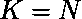

# 证明旅行商问题是 NP Hard

> 原文： [https://www.geeksforgeeks.org/proof-that-traveling-salesman-problem-is-np-hard/](https://www.geeksforgeeks.org/proof-that-traveling-salesman-problem-is-np-hard/)

**先决条件**：[旅行商问题](https://www.geeksforgeeks.org/travelling-salesman-problem-set-1/)， [NP Hard](https://www.geeksforgeeks.org/difference-between-np-hard-and-np-complete-problem/)

给定一组城市以及每对城市之间的距离，[旅行推销员问题](https://www.geeksforgeeks.org/travelling-salesman-problem-set-1/)找到这些城市之间的路径，使它是最短的路径，并且遍历每个城市一次，返回起点。

**问题–** 给定一个图 **G（V，E）**，问题是要确定该图是否具有包含最多`K`个成本的 TSP。
**解释–**
为了证明旅行商问题是 NP-Hard，我们必须将已知的 NP-Hard 问题简化为该问题。 我们将从汉密尔顿周期问题简化为旅行商问题。
汉密尔顿周期问题的每个实例都由图 G =（V，E）组成，因为输入可以转换为包含图 G'=（V'，E'）和最大成本的旅行推销员问题， K.我们将通过以下方式构造图 G'：
对于属于 E 的所有边 e，加上边 c（e）= 1 的代价。 连接原始图`G`中不存在的，属于 E'的其余边，每个边的成本为 c（e'）= 2。
只需将 G 转换为完整的图 G'并添加相应的成本，就可以在多项式时间内构造新的图 G'。 可以通过以下两个权利要求证明这种减少：

*   让我们假设图`G`包含哈密顿循环，遍历图的所有顶点 V。 现在，这些顶点与形成一个 TSP，因为它使用成本为 c（e）= 1 的原始图的所有边。 并且，由于这是一个循环，因此它返回到原始顶点。
*   我们假设图形 G’包含成本为的 TSP。 TSP 遍历图的所有顶点，返回到原始顶点。 现在，由于没有一个顶点从图中排除，并且成本总和为 n，因此，必然要使用成本为 1 的`E`中存在的图形的所有边，从而形成[汉密尔顿 图`G`循环](https://www.geeksforgeeks.org/hamiltonian-cycle-backtracking-6/)。

因此，如果图`G`包含哈密顿循环，则可以说图 **G'**包含 TSP。 因此，旅行商问题的任何情况都可以简化为汉密尔顿周期问题的情况。 因此，TSP 是 NP-Hard。

* * *

* * *

如果您喜欢 GeeksforGeeks 并希望做出贡献，则还可以使用 [tribution.geeksforgeeks.org](https://contribute.geeksforgeeks.org/) 撰写文章，或将您的文章邮寄至 tribution@geeksforgeeks.org。 查看您的文章出现在 GeeksforGeeks 主页上，并帮助其他 Geeks。

如果您发现任何不正确的地方，请单击下面的“改进文章”按钮，以改进本文。