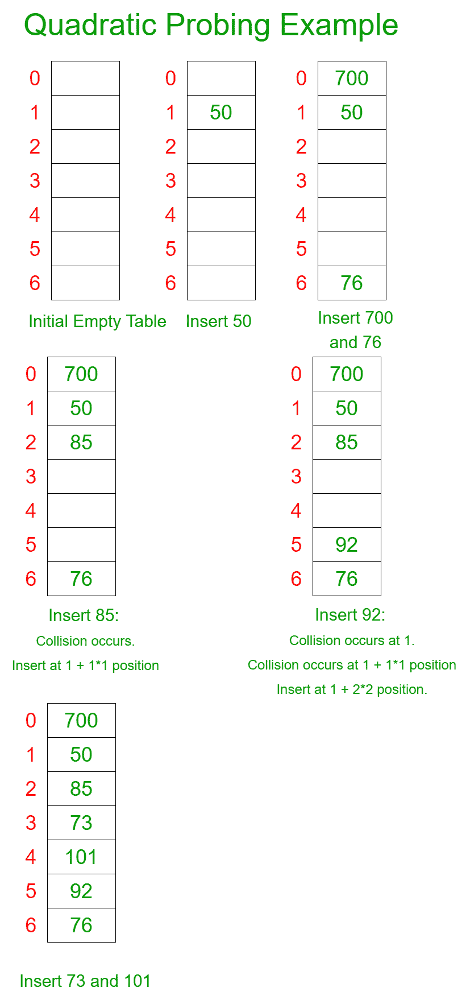

# 哈希中的二次探查

> 原文：[https://www.geeksforgeeks.org/quadratic-probing-in-hashing/](https://www.geeksforgeeks.org/quadratic-probing-in-hashing/)

[哈希](https://www.geeksforgeeks.org/hashing-set-1-introduction/)是对[直接访问表](https://www.geeksforgeeks.org/direct-address-table/)的改进。 该想法是使用[哈希函数](https://www.geeksforgeeks.org/what-are-hash-functions-and-how-to-choose-a-good-hash-function/)，该函数将给定的电话号码或任何其他键转换为较小的数字，并将该较小的数字用作称为[哈希表](https://www.geeksforgeeks.org/implementing-our-own-hash-table-with-separate-chaining-in-java/)的表中的索引。

[**哈希函数**](https://www.geeksforgeeks.org/what-are-hash-functions-and-how-to-choose-a-good-hash-function/) ****：一个将给定的大数字转换为小的实际整数值的函数。 映射的整数值用作哈希表中的索引。 简而言之，哈希函数将一个较大的数字或字符串映射为一个较小的整数，可用作哈希表中的索引。

本文讨论了[碰撞技术](https://www.geeksforgeeks.org/hashing-set-2-separate-chaining/)，**二次探测**。

**二次探测**：二次探测是一种[开放寻址](https://www.geeksforgeeks.org/hashing-set-3-open-addressing/)方案，如果给定的哈希值`x`与哈希表冲突，在第`i`次迭代中，我们在其中寻找第`i ^ 2`个插槽。

**如何进行二次探测？**

令`hash(x)`为使用哈希函数计算的插槽索引。

*   如果插槽`hash(x) ^ S`已满，则尝试`(hash(x) + 1 * 1) ^ S`。

*   如果`(hash(x) + 1 * 1) ^ S`也已满，那么我们尝试`(hash(x) + 2 * 2) ^ S`。

*   如果`(hash(x) + 2 * 2) ^ S`也已满，那么我们尝试`(hash(x) + 3 * 3) ^ S`。

*   对`i`的所有值重复此过程，直到找到空插槽。

**例如**：让我们考虑一个简单的哈希函数为`key mod 7`，并将密钥序列作为 50、700、76、85、92、73、101。



下面是上述方法的实现：

## C++

```cpp

// C++ implementation of 
// the Quadratic Probing 
#include <bits/stdc++.h> 
using namespace std; 

// Function to print an array 
void printArray(int arr[], int n) 
{ 
    // Iterating and printing the array 
    for (int i = 0; i < n; i++)  
    { 
        cout << arr[i] << " "; 
    } 
} 

// Function to implement the 
// quadratic probing 
void hashing(int table[], int tsize,  
             int arr[], int N) 
{ 
    // Iterating through the array 
    for (int i = 0; i < N; i++)  
    { 
        // Computing the hash value 
        int hv = arr[i] % tsize; 

        // Insert in the table if there 
        // is no collision 
        if (table[hv] == -1) 
            table[hv] = arr[i]; 
        else 
        { 
            // If there is a collision 
            // iterating through all 
            // possible quadratic values 
            for (int j = 0; j < tsize; j++)  
            { 
                // Computing the new hash value 
                int t = (hv + j * j) % tsize; 
                if (table[t] == -1)  
                { 
                    // Break the loop after 
                    // inserting the value 
                    // in the table 
                    table[t] = arr[i]; 
                    break; 
                } 
            } 
        } 
    } 
    printArray(table, N); 
} 

// Driver code 
int main() 
{ 
    int arr[] = {50, 700, 76,  
                 85, 92, 73, 101}; 
    int N = 7; 

    // Size of the hash table 
    int L = 7; 
    int hash_table[7]; 

    // Initializing the hash table 
    for (int i = 0; i < L; i++)  
    { 
        hash_table[i] = -1; 
    } 

    // Quadratic probing 
    hashing(hash_table, L, arr, N); 
    return 0; 
} 

// This code is contributed by gauravrajput1

```

## Java

```java

// Java implementation of the Quadratic Probing 

class GFG { 

    // Function to print an array 
    static void printArray(int arr[]) 
    { 

        // Iterating and printing the array 
        for (int i = 0; i < arr.length; i++) { 
            System.out.print(arr[i] + " "); 
        } 
    } 

    // Function to implement the 
    // quadratic probing 
    static void hashing(int table[], int tsize, 
                        int arr[], int N) 
    { 

        // Iterating through the array 
        for (int i = 0; i < N; i++) { 

            // Computing the hash value 
            int hv = arr[i] % tsize; 

            // Insert in the table if there 
            // is no collision 
            if (table[hv] == -1) 
                table[hv] = arr[i]; 
            else { 

                // If there is a collision 
                // iterating through all 
                // possible quadratic values 
                for (int j = 0; j < tsize; j++) { 

                    // Computing the new hash value 
                    int t = (hv + j * j) % tsize; 
                    if (table[t] == -1) { 

                        // Break the loop after 
                        // inserting the value 
                        // in the table 
                        table[t] = arr[i]; 
                        break; 
                    } 
                } 
            } 
        } 

        printArray(table); 
    } 

    // Driver code 
    public static void main(String args[]) 
    { 
        int arr[] = { 50, 700, 76, 85, 
                      92, 73, 101 }; 
        int N = 7; 

        // Size of the hash table 
        int L = 7; 
        int hash_table[] = new int[L]; 

        // Initializing the hash table 
        for (int i = 0; i < L; i++) { 
            hash_table[i] = -1; 
        } 

        // Quadratic probing 
        hashing(hash_table, L, arr, N); 
    } 
} 

```

## Python3

```py

# Python3 implementation of 
# the Quadratic Probing 

# Function to pran array 
def printArray(arr, n): 

    # Iterating and printing the array 
    for i in range(n): 
        print(arr[i], end = " ") 

# Function to implement the 
# quadratic probing 
def hashing(table, tsize, arr, N): 

    # Iterating through the array 
    for i in range(N): 

        # Computing the hash value 
        hv = arr[i] % tsize 

        # Insert in the table if there 
        # is no collision 
        if (table[hv] == -1): 
            table[hv] = arr[i] 

        else: 

            # If there is a collision 
            # iterating through all 
            # possible quadratic values 
            for j in range(tsize): 

                # Computing the new hash value 
                t = (hv + j * j) % tsize 

                if (table[t] == -1): 

                    # Break the loop after 
                    # inserting the value 
                    # in the table 
                    table[t] = arr[i] 
                    break

    printArray(table, N) 

# Driver code 
arr = [ 50, 700, 76,  
        85, 92, 73, 101 ] 
N = 7

# Size of the hash table 
L = 7

hash_table = [0] * 7

# Initializing the hash table 
for i in range(L): 
    hash_table[i] = -1

# Quadratic probing 
hashing(hash_table, L, arr, N) 

# This code is contributed by code_hunt 

```

## C#

```cs

// C# implementation of the Quadratic Probing 
using System; 

class GFG{ 

// Function to print an array 
static void printArray(int []arr) 
{ 

    // Iterating and printing the array 
    for(int i = 0; i < arr.Length; i++) 
    { 
       Console.Write(arr[i] + " "); 
    } 
} 

// Function to implement the 
// quadratic probing 
static void hashing(int []table, int tsize, 
                    int []arr, int N) 
{ 

    // Iterating through the array 
    for(int i = 0; i < N; i++)  
    { 

       // Computing the hash value 
       int hv = arr[i] % tsize; 

       // Insert in the table if there 
       // is no collision 
       if (table[hv] == -1) 
           table[hv] = arr[i]; 
       else
       { 

           // If there is a collision 
           // iterating through all 
           // possible quadratic values 
           for(int j = 0; j < tsize; j++) 
           { 

              // Computing the new hash value 
              int t = (hv + j * j) % tsize; 
              if (table[t] == -1)  
              { 

                  // Break the loop after 
                  // inserting the value 
                  // in the table 
                  table[t] = arr[i]; 
                  break; 
              } 
           } 
       } 
    } 
    printArray(table); 
} 

// Driver code 
public static void Main(String []args) 
{ 
    int []arr = { 50, 700, 76, 85, 
                  92, 73, 101 }; 
    int N = 7; 

    // Size of the hash table 
    int L = 7; 
    int []hash_table = new int[L]; 

    // Initializing the hash table 
    for(int i = 0; i < L; i++) 
    { 
       hash_table[i] = -1; 
    } 

    // Quadratic probing 
    hashing(hash_table, L, arr, N); 
} 
} 

// This code is contributed by Rajput-Ji 

```

**Output:** 

```
700 50 85 73 101 92 76

```


* * *

* * *


