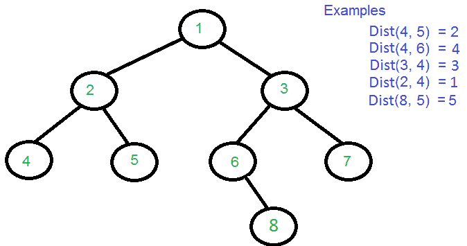
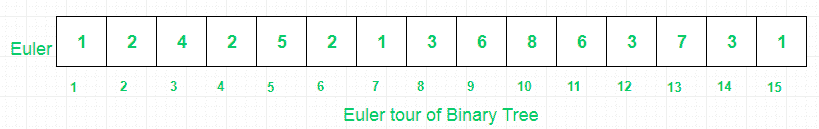
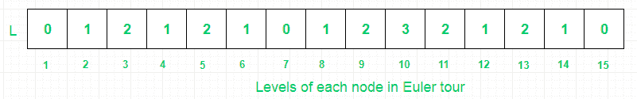

# 查询以查找二叉树

> 原文：[https://www.geeksforgeeks.org/queries-find-distance-two-nodes-binary-tree/](https://www.geeksforgeeks.org/queries-find-distance-two-nodes-binary-tree/)

的两个节点之间的距离

给定一个二叉树，任务是找到一棵二叉树中两个键之间的距离，没有给出父指针。 两个节点之间的距离是要遍历以到达另一个节点的最小边数。

我们已经讨论了[方法](https://www.geeksforgeeks.org/queries-find-distance-two-nodes-binary-tree-ologn-method/)，该方法使用段树将查询时间减少到 O（logn），这里的任务是通过将空间复杂度降低到`O(NlogN)`来减少查询时间到`O(1)`。 。 在这篇文章中，我们将使用**稀疏表**而不是分段树来查找给定范围内的最小值，它使用动态规划和位操作来实现`O(1)`查询时间。



稀疏表将预处理 Nlogn 空间中 L 数组给定范围的最小值，即每个节点将包含 log（i）长度值的链，其中 i 是 L 数组中第 i 个节点的索引。 稀疏表中的每个条目都说 M [i] [j]将代表子数组中从长度 2 ^ j 的 i 开始的最小值的索引。

两个节点之间的距离可以根据最低的共同祖先获得。

```
Dist(n1, n2) = Level[n1] + Level[n2] - 2*Level[lca] 

```

此问题可以分解为：

1.  查找每个节点的级别

2.  寻找二叉树的欧拉之旅

3.  为 LCA 建立稀疏表。

这些步骤说明如下：

> 1.  通过应用[级别顺序遍历](https://www.geeksforgeeks.org/print-levels-nodes-binary-tree/)来找到每个节点的级别。
> 2.  Find the LCA of two nodes in binary tree in O(logn) by Storing [Euler tour of Binary tree](https://www.geeksforgeeks.org/euler-tour-binary-tree/) in array and computing two other arrays with the help of levels of each node and Euler tour.
>     These steps are shown below:
>     
>     （I）首先，找到 [二叉树](https://www.geeksforgeeks.org/euler-tour-binary-tree/) 的 Euler Tour。
>     
>     
>     
>     
>     （II）然后，将每个节点的级别存储在 Euler 数组中。
>     
>     
>     
>     
>     （III）然后，将二叉树所有节点的第一个匹配项存储在 Euler 数组中。 H 存储来自 Euler 数组的节点的索引，因此可以最小化查找最小值的查询范围，并且可以通过进一步优化查询时间来最小化它们的查找范围。
>     
>     
>     
> 3.  Then **build sparse table on L array** and find the minimum value say X in range ( **H[A] to H[B]** ). Then, **we use the index of value X as an index to Euler array to get LCA** , i.e. Euler[index(X)].
>     
>     设 A ＝ 8，B ＝ 5。
>     （I）H [8] = 1 和 H [5] = 2
>     （II）当 X = 0，index = 7 时，L 数组中的最小值在 1 和 2 之间[III] 然后，LCA ＝ Euler [7]，即 LCA ＝ 1。
>     
>     
> 4.  最后，应用上面讨论的距离公式来获得两个节点之间的距离。

## C++

```cpp

#include <bits/stdc++.h> 
#define MAX 100001 
using namespace std; 

/* A tree node structure */
struct Node { 
    int data; 
    struct Node* left; 
    struct Node* right; 
}; 

/* Utility function to create a new Binary Tree node */
struct Node* newNode(int data) 
{ 
    struct Node* temp = new struct Node; 
    temp->data = data; 
    temp->left = temp->right = NULL; 
    return temp; 
} 

// Array to store level of each node 
int level[MAX]; 

// Utility Function to store level of all nodes 
void FindLevels(struct Node* root) 
{ 
    if (!root) 
        return; 

    // queue to hold tree node with level 
    queue<pair<struct Node*, int> > q; 

    // let root node be at level 0 
    q.push({ root, 0 }); 
    pair<struct Node*, int> p; 

    // Do level Order Traversal of tree 
    while (!q.empty()) { 
        p = q.front(); 
        q.pop(); 

        // Node p.first is on level p.second 
        level[p.first->data] = p.second; 

        // If left child exits, put it in queue 
        // with current_level +1 
        if (p.first->left) 
            q.push({ p.first->left, p.second + 1 }); 

        // If right child exists, put it in queue 
        // with current_level +1 
        if (p.first->right) 
            q.push({ p.first->right, p.second + 1 }); 
    } 
} 

// Stores Euler Tour 
int Euler[MAX]; 

// index in Euler array 
int idx = 0; 

// Find Euler Tour 
void eulerTree(struct Node* root) 
{ 

    // store current node's data 
    Euler[++idx] = root->data; 

    // If left node exists 
    if (root->left) { 

        // traverse left subtree 
        eulerTree(root->left); 

        // store parent node's data 
        Euler[++idx] = root->data; 
    } 

    // If right node exists 
    if (root->right) { 

        // traverse right subtree 
        eulerTree(root->right); 

        // store parent node's data 
        Euler[++idx] = root->data; 
    } 
} 

// checks for visited nodes 
int vis[MAX]; 

// Stores level of Euler Tour 
int L[MAX]; 

// Stores indices of the first occurrence  
// of nodes in Euler tour 
int H[MAX]; 

// Preprocessing Euler Tour for finding LCA 
void preprocessEuler(int size) 
{ 
    for (int i = 1; i <= size; i++) { 
        L[i] = level[Euler[i]]; 

        // If node is not visited before 
        if (vis[Euler[i]] == 0) { 

            // Add to first occurrence 
            H[Euler[i]] = i; 

            // Mark it visited 
            vis[Euler[i]] = 1; 
        } 
    } 
} 

// Sparse table of size [MAX][LOGMAX] 
// M[i][j] is the index of the minimum value in 
// the sub array starting at i having length 2^j 
int M[MAX][18]; 

// Utility function to preprocess Sparse table 
void preprocessLCA(int N) 
{ 
    for (int i = 0; i < N; i++) 
        M[i][0] = i; 

    for (int j = 1; 1 << j <= N; j++) 
        for (int i = 0; i + (1 << j) - 1 < N; i++) 
            if (L[M[i][j - 1]] < L[M[i + (1 << (j - 1))][j - 1]]) 
                M[i][j] = M[i][j - 1]; 
            else
                M[i][j] = M[i + (1 << (j - 1))][j - 1]; 
} 

// Utility function to find the index of the minimum 
// value in range a to b 
int LCA(int a, int b) 
{ 
    // Subarray of length 2^j 
    int j = log2(b - a + 1); 
    if (L[M[a][j]] <= L[M[b - (1 << j) + 1][j]]) 
        return M[a][j]; 

    else
        return M[b - (1 << j) + 1][j]; 
} 

// Function to return distance between 
// two nodes n1 and n2 
int findDistance(int n1, int n2) 
{ 
    // Maintain original Values 
    int prevn1 = n1, prevn2 = n2; 

    // Get First Occurrence of n1 
    n1 = H[n1]; 

    // Get First Occurrence of n2 
    n2 = H[n2]; 

    // Swap if low>high 
    if (n2 < n1) 
        swap(n1, n2); 

    // Get position of minimum value 
    int lca = LCA(n1, n2); 

    // Extract value out of Euler tour 
    lca = Euler[lca]; 

    // return calculated distance 
    return level[prevn1] + level[prevn2] - 2 * level[lca]; 
} 

void preProcessing(Node* root, int N) 
{ 
    // Build Tree 
    eulerTree(root); 

    // Store Levels 
    FindLevels(root); 

    // Find L and H array 
    preprocessEuler(2 * N - 1); 

    // Build sparse table 
    preprocessLCA(2 * N - 1); 
} 

/* Driver function to test above functions */
int main() 
{ 
    // Number of nodes 
    int N = 8; 

    /* Constructing tree given in the above figure */
    Node* root = newNode(1); 
    root->left = newNode(2); 
    root->right = newNode(3); 
    root->left->left = newNode(4); 
    root->left->right = newNode(5); 
    root->right->left = newNode(6); 
    root->right->right = newNode(7); 
    root->right->left->right = newNode(8); 

    // Function to do all preprocessing 
    preProcessing(root, N); 

    cout << "Dist(4, 5) = " << findDistance(4, 5) << "\n"; 
    cout << "Dist(4, 6) = " << findDistance(4, 6) << "\n"; 
    cout << "Dist(3, 4) = " << findDistance(3, 4) << "\n"; 
    cout << "Dist(2, 4) = " << findDistance(2, 4) << "\n"; 
    cout << "Dist(8, 5) = " << findDistance(8, 5) << "\n"; 

    return 0; 
} 

```

## Java

```java

// Java implementation of the approach 
import java.util.*; 

class GFG { 

    static class Pair<T, V> { 
        T first; 
        V second; 

        Pair() { 
        } 

        Pair(T first, V second) { 
            this.first = first; 
            this.second = second; 
        } 
    } 

    static class Node { 
        int data; 
        Node left, right; 

        Node(int data) { 
            this.data = data; 
            this.left = this.right = null; 
        } 
    } 

    static int MAX = 100001; 

    // Array to store level of each node 
    static int[] level = new int[MAX]; 

    // Utility Function to store level of all nodes 
    static void FindLevels(Node root) { 
        if (root == null) 
            return; 

        // queue to hold tree node with level 
        Queue<Pair<Node, Integer>> q = new LinkedList<>(); 

        // let root node be at level 0 
        q.add(new Pair<>(root, 0)); 
        Pair<Node, Integer> p = new Pair<>(); 

        // Do level Order Traversal of tree 
        while (!q.isEmpty()) { 
            p = q.poll(); 

            // Node p.first is on level p.second 
            level[p.first.data] = p.second; 

            // If left child exits, put it in queue 
            // with current_level +1 
            if (p.first.left != null) 
                q.add(new Pair<>(p.first.left, p.second + 1)); 

            // If right child exists, put it in queue 
            // with current_level +1 
            if (p.first.right != null) 
                q.add(new Pair<>(p.first.right, p.second + 1)); 
        } 
    } 

    // Stores Euler Tour 
    static int[] Euler = new int[MAX]; 

    // index in Euler array 
    static int idx = 0; 

    // Find Euler Tour 
    static void eulerTree(Node root) { 

        // store current node's data 
        Euler[++idx] = root.data; 

        // If left node exists 
        if (root.left != null) { 

            // traverse left subtree 
            eulerTree(root.left); 

            // store parent node's data 
            Euler[++idx] = root.data; 
        } 

        // If right node exists 
        if (root.right != null) { 

            // traverse right subtree 
            eulerTree(root.right); 

            // store parent node's data 
            Euler[++idx] = root.data; 
        } 
    } 

    // checks for visited nodes 
    static int[] vis = new int[MAX]; 

    // Stores level of Euler Tour 
    static int[] L = new int[MAX]; 

    // Stores indices of the first occurrence 
    // of nodes in Euler tour 
    static int[] H = new int[MAX]; 

    // Preprocessing Euler Tour for finding LCA 
    static void preprocessEuler(int size) { 
        for (int i = 1; i <= size; i++) { 
            L[i] = level[Euler[i]]; 

            // If node is not visited before 
            if (vis[Euler[i]] == 0) { 

                // Add to first occurrence 
                H[Euler[i]] = i; 

                // Mark it visited 
                vis[Euler[i]] = 1; 
            } 
        } 
    } 

    // Sparse table of size [MAX][LOGMAX] 
    // M[i][j] is the index of the minimum value in 
    // the sub array starting at i having length 2^j 
    static int[][] M = new int[MAX][18]; 

    // Utility function to preprocess Sparse table 
    static void preprocessLCA(int N) { 
        for (int i = 0; i < N; i++) 
            M[i][0] = i; 

        for (int j = 1; 1 << j <= N; j++) 
            for (int i = 0; i + (1 << j) - 1 < N; i++) 
                if (L[M[i][j - 1]] < L[M[i + (1 << (j - 1))][j - 1]]) 
                    M[i][j] = M[i][j - 1]; 
                else
                    M[i][j] = M[i + (1 << (j - 1))][j - 1]; 
    } 

    // Utility function to find the index of the minimum 
    // value in range a to b 
    static int LCA(int a, int b) { 
        // Subarray of length 2^j 
        int j = (int) (Math.log(b - a + 1) / Math.log(2)); 
        if (L[M[a][j]] <= L[M[b - (1 << j) + 1][j]]) 
            return M[a][j]; 

        else
            return M[b - (1 << j) + 1][j]; 
    } 

    // Function to return distance between 
    // two nodes n1 and n2 
    static int findDistance(int n1, int n2) { 
        // Maintain original Values 
        int prevn1 = n1, prevn2 = n2; 

        // Get First Occurrence of n1 
        n1 = H[n1]; 

        // Get First Occurrence of n2 
        n2 = H[n2]; 

        // Swap if low>high 
        if (n2 < n1) { 
            int temp = n1; 
            n1 = n2; 
            n2 = temp; 
        } 

        // Get position of minimum value 
        int lca = LCA(n1, n2); 

        // Extract value out of Euler tour 
        lca = Euler[lca]; 

        // return calculated distance 
        return level[prevn1] + level[prevn2] - 2 * level[lca]; 
    } 

    static void preProcessing(Node root, int N) { 
        // Build Tree 
        eulerTree(root); 

        // Store Levels 
        FindLevels(root); 

        // Find L and H array 
        preprocessEuler(2 * N - 1); 

        // Build sparse table 
        preprocessLCA(2 * N - 1); 
    } 

    // Driver Code 
    public static void main(String[] args) { 
        // Number of nodes 
        int N = 8; 

        /* Constructing tree given in the above figure */
        Node root = new Node(1); 
        root.left = new Node(2); 
        root.right = new Node(3); 
        root.left.left = new Node(4); 
        root.left.right = new Node(5); 
        root.right.left = new Node(6); 
        root.right.right = new Node(7); 
        root.right.left.right = new Node(8); 

        // Function to do all preprocessing 
        preProcessing(root, N); 

        System.out.println("Dist(4, 5) = " + findDistance(4, 5)); 
        System.out.println("Dist(4, 6) = " + findDistance(4, 6)); 
        System.out.println("Dist(3, 4) = " + findDistance(3, 4)); 
        System.out.println("Dist(2, 4) = " + findDistance(2, 4)); 
        System.out.println("Dist(8, 5) = " + findDistance(8, 5)); 
    } 
} 

// This code is contributed by 
// sanjeev2552 

```

## Python3

```py

from collections import deque 
from math import log2 

MAX = 100001

# A tree node structure 
class Node: 
    def __init__(self, data): 
        self.data = data 
        self.left = None
        self.right = None

# Array to store level of each node 
level = [0] * MAX

# Utility Function to store level of all nodes 
def findLevels(root: Node): 
    global level 

    if root is None: 
        return

    # queue to hold tree node with level 
    q = deque() 

    # let root node be at level 0 
    q.append((root, 0)) 

    # Do level Order Traversal of tree 
    while q: 
        p = q[0] 
        q.popleft() 

        # Node p.first is on level p.second 
        level[p[0].data] = p[1] 

        # If left child exits, put it in queue 
        # with current_level +1 
        if p[0].left: 
            q.append((p[0].left, p[1] + 1)) 

        # If right child exists, put it in queue 
        # with current_level +1 
        if p[0].right: 
            q.append((p[0].right, p[1] + 1)) 

# Stores Euler Tour 
Euler = [0] * MAX

# index in Euler array 
idx = 0

# Find Euler Tour 
def eulerTree(root: Node): 
    global Euler, idx 
    idx += 1

    # store current node's data 
    Euler[idx] = root.data 

    # If left node exists 
    if root.left: 

        # traverse left subtree 
        eulerTree(root.left) 
        idx += 1

        # store parent node's data 
        Euler[idx] = root.data 

    # If right node exists 
    if root.right: 

        # traverse right subtree 
        eulerTree(root.right) 
        idx += 1

        # store parent node's data 
        Euler[idx] = root.data 

# checks for visited nodes 
vis = [0] * MAX

# Stores level of Euler Tour 
L = [0] * MAX

# Stores indices of the first occurrence 
# of nodes in Euler tour 
H = [0] * MAX

# Preprocessing Euler Tour for finding LCA 
def preprocessEuler(size: int): 
    global L, H, vis 
    for i in range(1, size + 1): 
        L[i] = level[Euler[i]] 

        # If node is not visited before 
        if vis[Euler[i]] == 0: 

            # Add to first occurrence 
            H[Euler[i]] = i 

            # Mark it visited 
            vis[Euler[i]] = 1

# Sparse table of size [MAX][LOGMAX] 
# M[i][j] is the index of the minimum value in 
# the sub array starting at i having length 2^j 
M = [[0 for i in range(18)] for j in range(MAX)] 

# Utility function to preprocess Sparse table 
def preprocessLCA(N: int): 
    global M 
    for i in range(N): 
        M[i][0] = i 

    j = 1
    while 1 << j <= N: 
        i = 0
        while i + (1 << j) - 1 < N: 
            if L[M[i][j - 1]] < L[M[i + 
                (1 << (j - 1))][j - 1]]: 
                M[i][j] = M[i][j - 1] 
            else: 
                M[i][j] = M[i + (1 << (j - 1))][j - 1] 
            i += 1
        j += 1

# Utility function to find the index of the minimum 
# value in range a to b 
def LCA(a: int, b: int) -> int: 

    # Subarray of length 2^j 
    j = int(log2(b - a + 1)) 
    if L[M[a][j]] <= L[M[b - (1 << j) + 1][j]]: 
        return M[a][j] 
    else: 
        return M[b - (1 << j) + 1][j] 

# Function to return distance between 
# two nodes n1 and n2 
def findDistance(n1: int, n2: int) -> int: 

    # Maintain original Values 
    prevn1 = n1 
    prevn2 = n2 

    # Get First Occurrence of n1 
    n1 = H[n1] 

    # Get First Occurrence of n2 
    n2 = H[n2] 

    # Swap if low>high 
    if n2 < n1: 
        n1, n2 = n2, n1 

    # Get position of minimum value 
    lca = LCA(n1, n2) 

    # Extract value out of Euler tour 
    lca = Euler[lca] 

    # return calculated distance 
    return level[prevn1] + level[prevn2] - 2 * level[lca] 

def preProcessing(root: Node, N: int): 

    # Build Tree 
    eulerTree(root) 

    # Store Levels 
    findLevels(root) 

    # Find L and H array 
    preprocessEuler(2 * N - 1) 

    # Build sparse table 
    preprocessLCA(2 * N - 1) 

# Driver Code 
if __name__ == "__main__": 

    # Number of nodes 
    N = 8

    # Constructing tree given in the above figure 
    root = Node(1) 
    root.left = Node(2) 
    root.right = Node(3) 
    root.left.left = Node(4) 
    root.left.right = Node(5) 
    root.right.left = Node(6) 
    root.right.right = Node(7) 
    root.right.left.right = Node(8) 

    # Function to do all preprocessing 
    preProcessing(root, N) 

    print("Dist(4, 5) =", findDistance(4, 5)) 
    print("Dist(4, 6) =", findDistance(4, 6)) 
    print("Dist(3, 4) =", findDistance(3, 4)) 
    print("Dist(2, 4) =", findDistance(2, 4)) 
    print("Dist(8, 5) =", findDistance(8, 5)) 

# This code is contributed by 
# sanjeev2552 

```

**输出**：

```
Dist(4, 5) = 2
Dist(4, 6) = 4
Dist(3, 4) = 3
Dist(2, 4) = 1
Dist(8, 5) = 5

```

**时间复杂度**：`O(1)`

**空间复杂度**：`O(n Log n)`

[](https://practice.geeksforgeeks.org/courses/competitive-programming-live?utm_source=geeksforgeeks&utm_medium=article&utm_campaign=gfg_article_cp)

* * *

* * *


