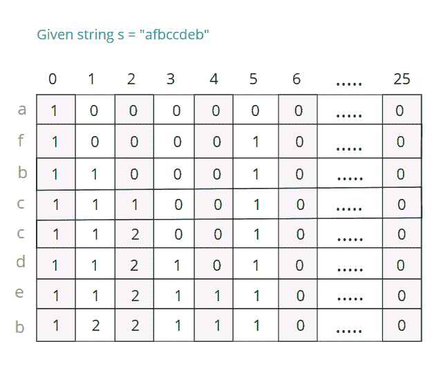

# 查询字符串中给定范围的第 N 个最小字符

> 原文：[https://www.geeksforgeeks.org/queries-for-nth-smallest-character-for-a-given-range-in-a-string/](https://www.geeksforgeeks.org/queries-for-nth-smallest-character-for-a-given-range-in-a-string/)

给定一个仅由小写字母组成的字符串 **str** 和一个数组 **arr [] []** ，该数组代表给定字符串 str 上的范围查询，其中每个查询包含 3 个整数，{L，R ，N}，这样对于每个查询，我们都必须输出在查询中指定的给定范围[L，R]中的第 N <sup>个第</sup>个最小字符。

**示例**：

> **输入**：str =“ afbccdeb”，arr [] [] = {{2，4，1}，{1，6，4}，{1，8，7}}
> **输出**：bce
> **说明**：
> 1 <sup>st</sup> 范围[2，4]或子字符串“ fbc”中的最小字符是'b '
> 范围[1，6]或子字符串“ afbccd”中的第<sup>个最小字符[c]
> 7 <sup>范围[</sup>最小字符[ 1，8]或整个字符串为'e'</sup>
> 
> **输入**：str =“ geeksforgeeks”，arr [] [] = {{1，4，2}，{3，7，3}，{4，13，4}}
> **输出**：ekg
> **说明**：
> 2 <sup>和</sup>范围[1，4]或子字符串“怪胎”中的最小字符是'e '
> 3 <sup>rd</sup> 范围[3，7]或子字符串“ eksfo”中的最小字符是'k'
> 4 <sup>th</sup> 范围中的最小字符[ 4，13]或在子字符串“ sforgeeks”中为“ g”

**天真的方法**：天真的方法是运行从 **L** 到 **R** 的循环，并生成此范围内的子字符串。 找到子字符串后，[对子字符串](https://www.geeksforgeeks.org/sort-string-characters/)进行排序，以在排序的字符串中找到第 N <sup>个</sup>字符。

**时间复杂度分析**：

*   在最坏的情况下，从 **L** 到 **R** 的遍历将具有 **`O(n)`**的复杂度。

*   子字符串排序的复杂度为 **`O(N * log(N))`**。

*   由于我们为每个查询对子字符串进行排序，因此，总体时间复杂度为 **O（N <sup>2</sup> * Log（N））**。

**高效方法**：的想法是利用二维[哈希表](https://www.geeksforgeeks.org/hashtable-in-java/)。 哈希表 **H [] []** 初始化为 **N 行**和 **26 列**，其中 N 表示字符串的长度，而 26 表示总长度 26 个小写字母。

哈希表的原理是，对于每个索引 **i** ，其中'i'的范围为 1 到 N，我们跟踪 **i 或之前的 26 个小写字母中每个字母的出现次数 <sup>第</sup>** 个索引。 为此，使用[散列](http://www.geeksforgeeks.org/hashing-data-structure/)，其中将每个字符按以下方式视为数字：

```
'a' -> 0
'b' -> 1
.
.
.
'z' -> 25

```

因此，对于每个查询{L，R，N}，我们通过从 **H [ R] [j]** ，其中 j 以[哈希表](https://www.geeksforgeeks.org/hashtable-in-java/)的形式介于 0 到 25 之间。 此后，我们要做的就是从 0 遍历到 25 遍历，并添加结果数组的内容。 每当总和等于或超过 **N** 时，代表该索引的字符就是必需的答案。

例如，如果在第 5 个<sup>索引[j = 4]上，总和超过 N，则答案为“ e”，因为 4 等于字符“ e”。 下面是示例案例的图形表示：</sup>

[](https://media.geeksforgeeks.org/wp-content/uploads/20200317083955/gfg137.png)

该图像描述了与给定字符串相对应的哈希表。 对于范围 **[2，4]** ，我们从 **H [4]** 减去 **H [2-1 – 1]** 的内容。 我们得到：

[](https://media.geeksforgeeks.org/wp-content/uploads/20200317085033/gfg221-1.png)

显然，此结果数组包含[2，4]范围内的元素计数。 因此，我们只需从 0 遍历到 25，然后对内容进行计数，直到达到 N。在查询 N = 1 时，答案为“ b”，对于 N = 2，则答案为“ c”，依此类推。

下面是上述方法的实现：

## C++

```cpp

// C++ implementation to find the Nth 
// smallest character in a given range 
// of a string 

#include <bits/stdc++.h> 
using namespace std; 

// Query structure to represent a query range 
// along with n 
struct Query { 
    int l, r, n; 
}; 

// Function to print the Nth smallest 
// character for a given range in a string 
int findSmallest(string s, Query q[], int m) 
{ 

    // Integer N contains the 
    // length of the string s 
    int N = s.length(); 

    // We initialise our hash array and 
    // set all the elements to 0 
    int H[N + 1][26]; 
    memset(H, 0, sizeof(H)); 

    // We preprocess our string in which we 
    // update the current character 
    // as well as add the H[i - 1]th 
    // array to H[i] 
    for (int i = 1; i <= N; i++) { 

        // Incrementing the frequency of 
        // ith row based on the occurrence 
        // of the characters up to i-th index 
        ++H[i][s[i - 1] - 'a']; 

        // Adding the values of the array at 
        // the previous index to the next index 
        for (int j = 0; j < 26; j++) { 
            H[i][j] += H[i - 1][j]; 
        } 
    } 

    // We traverse from 0 to m to 
    // fetch all the queries 
    for (int j = 0; j < m; j++) { 

        // Extracting L, R and N 
        // from the query array q 
        int l = q[j].l, r = q[j].r, 
            n = q[j].n; 

        // The initial sum is set to 0 
        int sum = 0; 

        // We subtract H[l-1] from h[r] 
        // and add it to the sum 
        for (int i = 0; i < 26; i++) { 
            sum += H[r][i] - H[l - 1][i]; 

            // Whenever the sum is greater than 
            // or equal to N, the equivalent 
            // character of the index is our 
            // nth smallest character 
            if (sum >= n) { 
                cout << (char)('a' + i) << "\n"; 
                break; 
            } 
        } 
    } 
} 

// Driver code 
int main() 
{ 
    // Input string s 
    string s = "afbccdeb"; 
    // Query array q, for each q 
    // it contains l, r and n 
    Query q[] = { { 2, 4, 1 }, 
                  { 1, 6, 4 }, 
                  { 1, 8, 7 } }; 
    int x = sizeof(q) / sizeof(q[0]); 

    findSmallest(s, q, x); 
} 

```

## Java

```java

// JAVA implementation to find the Nth 
// smallest character for a given range 
// in a string 

import java.io.*; 
import java.util.*; 

class GFG { 

    // Query class to represent a query range 
    // along with n 
    public static class Query { 
        public int l, r, n; 

        // Constructor for the Query class which 
        // takes three integers L, R, N 
        public Query(int l, int r, int n) 
        { 
            this.l = l; 
            this.r = r; 
            this.n = n; 
        } 
    } 

    // Function to print the Nth smallest 
    // character for a given range in a string 
    public static void printSmallest(String s, Query[] q) 
    { 

        // Integer N contains the 
        // length of the string s 
        int N = s.length(); 

        // We initialise our hash array and 
        // set all the elements to 0 
        int[][] H = new int[N + 1][26]; 

        // We preprocess our string in which we 
        // update the current character 
        // as well as add the H[i - 1]th 
        // array to H[i] 
        for (int i = 1; i <= N; i++) { 

            // Incrementing the frequency of 
            // ith row based on the occurrence 
            // of the characters up to i-th index 
            ++H[i][s.charAt(i - 1) - 'a']; 

            // Adding the values of the array at 
            // the previous index to the next index 
            for (int j = 0; j < 26; j++) { 
                H[i][j] += H[i - 1][j]; 
            } 
        } 

        // Integer m contains the 
        // number of queries 
        int m = q.length; 

        // We traverse from 0 to m to 
        // fetch all the queries 
        for (int j = 0; j < m; j++) { 

            // Extracting l, r and n 
            // from the query array q 
            int l = q[j].l, r = q[j].r, 
                n = q[j].n; 

            // The initial sum is set to 0 
            int sum = 0; 

            // We subtract H[l-1] from h[r] 
            // and add it to the sum 
            for (int i = 0; i < 26; i++) { 
                sum += H[r][i] - H[l - 1][i]; 

                // Whenever the sum is greater than 
                // or equal to N, the equivalent 
                // character of the index is our 
                // nth smallest character 
                if (sum >= n) { 
                    System.out.println((char)('a' + i)); 
                    break; 
                } 
            } 
        } 
    } 

    // Driver code 
    public static void main(String args[]) 
    { 
        // Input string s 
        String s = "afbccdeb"; 

        // Query array q, for each q 
        // it contains l, r and n 
        Query[] q = { new Query(2, 4, 1), 
                      new Query(1, 6, 4), 
                      new Query(1, 8, 7) }; 

        // Calling the function 
        printSmallest(s, q); 
    } 
} 

```

## Python3

```py

# Python3 implementation to find the Nth 
# smallest character in a given range 
# of a string 

# Function to print the Nth smallest 
# character for a given range in a string 
def findSmallest(s, q, m): 

    # Integer N contains the 
    # length of the s 
    N = len(s) 

    # We initialise our hash array and 
    # set all the elements to 0 
    H = [[0 for i in range(26)]for i in range(N + 1)] 

    # We preprocess our in which we 
    # update the current character 
    # as well as add the H[i - 1]th 
    # array to H[i] 
    for i in range(1, N + 1): 

        # Incrementing the frequency of 
        # ith row based on the occurrence 
        # of the characters up to i-th index 
        H[i][ord(s[i - 1]) - ord('a')] += 1

        # Adding the values of the array at 
        # the previous index to the next index 
        for j in range(26): 
            H[i][j] += H[i - 1][j] 

    # We traverse from 0 to m to 
    # fetch all the queries 
    for j in range(m): 

        # Extracting L, R and N 
        # from the query array q 
        l = q[j][0] 
        r = q[j][1] 
        n = q[j][2] 

        # The initial sum is set to 0 
        sum = 0

        # We subtract H[l-1] from h[r] 
        # and add it to the sum 
        for i in range(26): 
            sum += H[r][i] - H[l - 1][i] 

            # Whenever the sum is greater than 
            # or equal to N, the equivalent 
            # character of the index is our 
            # nth smallest character 
            if (sum >= n): 
                print(chr(ord('a') + i)) 
                break

# Driver code 
if __name__ == '__main__': 

    # Input s 
    s = "afbccdeb"

    # Query array q, for each q 
    # it contains l, r and n 
    q = [ [ 2, 4, 1 ], 
        [ 1, 6, 4 ], 
        [ 1, 8, 7 ] ] 
    x = len(q) 

    findSmallest(s, q, x) 

# This code is contributed by mohit kumar 29     

```

## C#

```cs

// C# implementation to find the Nth 
// smallest character for a given range 
// in a string 
using System; 

class GFG { 

    // Query class to represent a query range 
    // along with n 
    public class Query { 
        public int l, r, n; 

        // Constructor for the Query class which 
        // takes three integers L, R, N 
        public Query(int l, int r, int n) 
        { 
            this.l = l; 
            this.r = r; 
            this.n = n; 
        } 
    } 

    // Function to print the Nth smallest 
    // character for a given range in a string 
    public static void printSmallest(String s, Query[] q) 
    { 

        // int N contains the 
        // length of the string s 
        int N = s.Length; 

        // We initialise our hash array and 
        // set all the elements to 0 
        int[,] H = new int[N + 1,26]; 

        // We preprocess our string in which we 
        // update the current character 
        // as well as add the H[i - 1]th 
        // array to H[i] 
        for (int i = 1; i <= N; i++) { 

            // Incrementing the frequency of 
            // ith row based on the occurrence 
            // of the characters up to i-th index 
            ++H[i, s[i - 1] - 'a']; 

            // Adding the values of the array at 
            // the previous index to the next index 
            for (int j = 0; j < 26; j++) { 
                H[i, j] += H[i - 1, j]; 
            } 
        } 

        // int m contains the 
        // number of queries 
        int m = q.Length; 

        // We traverse from 0 to m to 
        // fetch all the queries 
        for (int j = 0; j < m; j++) { 

            // Extracting l, r and n 
            // from the query array q 
            int l = q[j].l, r = q[j].r, 
                n = q[j].n; 

            // The initial sum is set to 0 
            int sum = 0; 

            // We subtract H[l-1] from h[r] 
            // and add it to the sum 
            for (int i = 0; i < 26; i++) { 
                sum += H[r, i] - H[l - 1, i]; 

                // Whenever the sum is greater than 
                // or equal to N, the equivalent 
                // character of the index is our 
                // nth smallest character 
                if (sum >= n) { 
                    Console.WriteLine((char)('a' + i)); 
                    break; 
                } 
            } 
        } 
    } 

    // Driver code 
    public static void Main(String []args) 
    { 
        // Input string s 
        String s = "afbccdeb"; 

        // Query array q, for each q 
        // it contains l, r and n 
        Query[] q = { new Query(2, 4, 1), 
                    new Query(1, 6, 4), 
                    new Query(1, 8, 7) }; 

        // Calling the function 
        printSmallest(s, q); 
    } 
} 

// This code is contributed by Rajput-Ji 

```

**Output:**

```
b
c
e

```

**时间复杂度分析**：

*   对于上述方法，尽管预处理由两个循环组成，但第二个循环运行了固定次数（26）。 因此，预处理花费的时间为 **`O(n)`**。

*   预处理之后，对于每个查询，字符都会以恒定的时间返回，因为这里 for 循环再次运行固定的次数（26）。 因此，回答每个查询所花费的时间为 **`O(1)`**。


* * *

* * *


