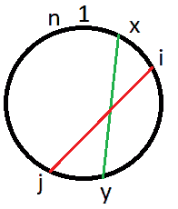
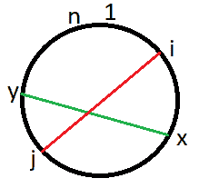

# 查询以圆形是否可以合并框

考虑 **n** 个框，它们沿顺时针方向（从 1 到 n）以递增顺序排列成一个圆圈。 您将获得 **q** 个查询，每个查询包含两个整数 i 和 j。 任务是检查是否可以通过杆将**框 i** 与**框 j** 连接，而没有相交的杆来连接先前查询中的其他框。 同样，每个盒子最多只能连接到另一个盒子，任何盒子都不能与其自身连接。

**示例：**

> **输入：** n = 10，q = 7
> q1 =（1，5）
> q2 =（2，7）
> q3 =（2，3）
> q4 = （2，4）
> q5 =（9，9）
> q6 =（10，9）
> q7 =（8，6）
> 
> **输出：**
> 是
> 否
> 是
> 否
> 否
> 是
> 是
> 
> 盒子 1 和 v 5 可以用一根杆连接。
> 盒 2 和盒 7 不能通过杆连接，因为该杆与连接盒 1 和盒 5 的杆相交。
> 盒 2 和盒 3 可以无交叉连接。
> 无法连接 Box 2 和 Box 4，因为 Box 2 已经连接到 Box 3。
> 可以连接 Box 10 和 Box 9。
> 可以连接 Box 8 和 Box 6。

**方法：**
假设框 x 已连接到框 y。 我们需要将方框 i 连接到方框 j。
现在，观察到在两种情况下，连接箱 i 和箱 j 的两个杆与连接箱 x 和箱 y 的杆相交。
**情况 1：** x < i 和 y 位于 i 和 j 之间：

**情况 2：** x 位于 i 和 j 之间，并且 y > j：


我们将明确检查是否打算将一根杆连接到其自身，或者该杆是否打算连接两个盒，以使其中至少一个已经连接。

因此，我们将检查以上两个条件。 如果两个都满足，则无法连接，否则我们可以连接盒子。
 **下面是上述方法的实现：**

## C++

```cpp

// C++ implementation of above approach 
#include <bits/stdc++.h> 
using namespace std; 
#define MAX 50 

// Print the answer to each query 
void solveQuery(int n, int q, int qi[], int qj[]) 
{ 
    int arr[MAX]; 
    for (int i = 0; i <= n; i++) 
        arr[i] = 0; 

    for (int k = 0; k < q; k++) { 

        // setting the flag for exception 
        int flag = 0; 

        // replacing the greater element in i and j 
        if (qj[k] < qi[k]) { 
            int temp = qi[k]; 
            qi[k] = qj[k]; 
            qj[k] = temp; 
        } 

        // checking if that box is not 
        // used in previous query. 
        if (arr[qi[k]] != 0 || arr[qj[k]] != 0) 
            flag = 1; 

        // checking if connecting to the same box 
        else if (qi[k] == qj[k]) 
            flag = 1; 

        else { 

            // case 1: x < i and y lies between i and j 
            for (int i = 1; i < qi[k]; i++) { 
                if (arr[i] != 0 && arr[i] < qj[k] && qi[k] < arr[i]) { 
                    flag = 1; 
                    break; 
                } 
            } 

            // case 2: x lies between i and j and y >j 
            if (flag == 0) { 
                for (int i = qi[k] + 1; i < qj[k]; i++) { 
                    if (arr[i] != 0 && arr[i] > qj[k]) { 
                        flag = 1; 
                        break; 
                    } 
                } 
            } 
        } 

        // if flag is not reset inbetween. 
        if (flag == 0) { 
            cout << "YES\n"; 
            arr[qi[k]] = qj[k]; 
            arr[qj[k]] = qi[k]; 
        } 
        else
            cout << "NO\n"; 
    } 
} 

// Driver code 
int main() 
{ 
    int n = 10; 
    int q = 7; 
    int qi[] = { 1, 2, 2, 2, 9, 10, 8 }; 
    int qj[] = { 5, 7, 3, 4, 9, 9, 6 }; 

    solveQuery(n, q, qi, qj); 

    return 0; 
} 

```

## Java

```java

// Java implementation of  
// above approach 
class GFG  
{ 
static int MAX = 50; 

// Print the answer to each query 
static void solveQuery(int n, int q, 
                       int qi[], int qj[]) 
{ 
int[] arr = new int[MAX]; 
for (int i = 0; i <= n; i++) 
    arr[i] = 0; 

for (int k = 0; k < q; k++)  
{ 

    // setting the flag for exception 
    int flag = 0; 

    // replacing the greater  
    // element in i and j 
    if (qj[k] < qi[k]) 
    { 
        int temp = qi[k]; 
        qi[k] = qj[k]; 
        qj[k] = temp; 
    } 

    // checking if that box is not 
    // used in previous query. 
    if (arr[qi[k]] != 0 ||  
        arr[qj[k]] != 0) 
        flag = 1; 

    // checking if connecting  
    // to the same box 
    else if (qi[k] == qj[k]) 
        flag = 1; 

    else 
    { 

        // case 1: x < i and y lies 
        // between i and j 
        for (int i = 1; i < qi[k]; i++)  
        { 
            if (arr[i] != 0 && arr[i] < qj[k] &&  
                                qi[k] < arr[i])  
            { 
                flag = 1; 
                break; 
            } 
        } 

        // case 2: x lies between  
        // i and j and y >j 
        if (flag == 0)  
        { 
            for (int i = qi[k] + 1;  
                     i < qj[k]; i++) 
            { 
                if (arr[i] != 0 && arr[i] > qj[k]) 
                { 
                    flag = 1; 
                    break; 
                } 
            } 
        } 
    } 

    // if flag is not reset inbetween. 
    if (flag == 0) 
    { 
        System.out.println("YES"); 
        arr[qi[k]] = qj[k]; 
        arr[qj[k]] = qi[k]; 
    } 
    else
        System.out.println("NO"); 
} 
} 

// Driver code 
public static void main(String[] args) 
{ 
    int n = 10; 
    int q = 7; 
    int qi[] = { 1, 2, 2, 2, 9, 10, 8 }; 
    int qj[] = { 5, 7, 3, 4, 9, 9, 6 }; 

    solveQuery(n, q, qi, qj); 
} 
}  

// This code is contributed 
// by ChitraNayal 

```

## Python 3

```

# Python 3 implementation of  
# above approach 

MAX = 50

# Print the answer to each query 
def solveQuery(n, q, qi, qj): 

    arr = [None] * MAX
    for i in range(n + 1): 
        arr[i] = 0

    for k in range(q): 

        # setting the flag  
        # for exception 
        flag = 0

        # replacing the greater 
        # element in i and j 
        if (qj[k] < qi[k]): 
            qj[k], qi[k] = qi[k], qj[k] 

        # checking if that box is not 
        # used in previous query. 
        if (arr[qi[k]] != 0 or 
            arr[qj[k]] != 0): 
            flag = 1

        # checking if connecting  
        # to the same box 
        elif (qi[k] == qj[k]): 
            flag = 1

        else : 

            # case 1: x < i and y  
            # lies between i and j 
            for i in range(1, qi[k]) : 
                if (arr[i] != 0 and 
                    arr[i] < qj[k] and 
                    qi[k] < arr[i]): 
                    flag = 1
                    break

            # case 2: x lies between 
            # i and j and y >j 
            if (flag == 0): 
                for i in range(qi[k] + 1, qj[k]) : 
                    if (arr[i] != 0 and 
                        arr[i] > qj[k]): 
                        flag = 1
                        break

        # if flag is not reset inbetween. 
        if (flag == 0): 
            print("YES") 
            arr[qi[k]] = qj[k] 
            arr[qj[k]] = qi[k] 

        else: 
            print("NO") 

# Driver code 
if __name__ == "__main__": 
    n = 10
    q = 7
    qi = [ 1, 2, 2, 2, 9, 10, 8 ] 
    qj = [ 5, 7, 3, 4, 9, 9, 6 ] 

    solveQuery(n, q, qi, qj) 

# This code is contributed 
# by ChitraNayal 

```

## C#

```cs

// C# implementation of  
// above approach 
using System; 

class GFG  
{ 

static int MAX = 50; 

// Print the answer to each query 
static void solveQuery(int n, int q,  
                       int[] qi, int[] qj) 
{ 
int[] arr = new int[MAX]; 
for (int i = 0; i <= n; i++) 
    arr[i] = 0; 

for (int k = 0; k < q; k++)  
{ 

    // setting the flag for exception 
    int flag = 0; 

    // replacing the greater 
    // element in i and j 
    if (qj[k] < qi[k])  
    { 
        int temp = qi[k]; 
        qi[k] = qj[k]; 
        qj[k] = temp; 
    } 

    // checking if that box is not 
    // used in previous query. 
    if (arr[qi[k]] != 0 || arr[qj[k]] != 0) 
        flag = 1; 

    // checking if connecting 
    // to the same box 
    else if (qi[k] == qj[k]) 
        flag = 1; 

    else
    { 

        // case 1: x < i and y lies 
        // between i and j 
        for (int i = 1; i < qi[k]; i++) 
        { 
            if (arr[i] != 0 && arr[i] < qj[k] &&  
                                qi[k] < arr[i])  
            { 
                flag = 1; 
                break; 
            } 
        } 

        // case 2: x lies between  
        // i and j and y >j 
        if (flag == 0)  
        { 
            for (int i = qi[k] + 1;  
                     i < qj[k]; i++)  
            { 
                if (arr[i] != 0 &&  
                    arr[i] > qj[k])  
                { 
                    flag = 1; 
                    break; 
                } 
            } 
        } 
    } 

    // if flag is not reset inbetween. 
    if (flag == 0)  
    { 
        Console.Write("YES\n"); 
        arr[qi[k]] = qj[k]; 
        arr[qj[k]] = qi[k]; 
    } 
    else
        Console.Write("NO\n"); 
} 
} 

// Driver code 
public static void Main()  
{ 
    int n = 10; 
    int q = 7; 
    int[] qi = { 1, 2, 2, 2, 9, 10, 8 }; 
    int[] qj = { 5, 7, 3, 4, 9, 9, 6 }; 

    solveQuery(n, q, qi, qj); 
} 
}  

// This code is contributed  
// by ChitraNayal 

```

## PHP

```php

<?php  
// PHP implementation of 
// above approach 

$MAX = 50; 

// Print the answer to each query 
function solveQuery($n, $q, &$qi, &$qj) 
{ 
    global $MAX; 
    $arr = array_fill(0, $MAX, NULL); 
    for ($i = 0; $i <= $n; $i++) 
        $arr[$i] = 0; 

    for ($k = 0; $k < $q; $k++) 
    { 

        // setting the flag  
        // for exception 
        $flag = 0; 

        // replacing the greater  
        // element in i and j 
        if ($qj[$k] < $qi[$k])  
        { 
            $temp = $qi[$k]; 
            $qi[$k] = $qj[$k]; 
            $qj[$k] = $temp; 
        } 

        // checking if that box is not 
        // used in previous query. 
        if ($arr[$qi[$k]] != 0 ||  
            $arr[$qj[$k]] != 0) 
            $flag = 1; 

        // checking if connecting 
        // to the same box 
        else if ($qi[$k] == $qj[$k]) 
            $flag = 1; 

        else 
        { 

            // case 1: x < i and y lies  
            // between i and j 
            for ($i = 1; $i < $qi[$k]; $i++)  
            { 
                if ($arr[$i] != 0 && $arr[$i] <  
                    $qj[$k] && $qi[$k] < $arr[$i])  
                { 
                    $flag = 1; 
                    break; 
                } 
            } 

            // case 2: x lies between  
            // i and j and y >j 
            if ($flag == 0) 
            { 
                for ($i = $qi[$k] + 1;  
                     $i < $qj[$k]; $i++) 
                { 
                    if ($arr[$i] != 0 &&  
                        $arr[$i] > $qj[$k])  
                    { 
                        $flag = 1; 
                        break; 
                    } 
                } 
            } 
        } 

        // if flag is not reset inbetween. 
        if ($flag == 0)  
        { 
            echo "YES\n"; 
            $arr[$qi[$k]] = $qj[$k]; 
            $arr[$qj[$k]] = $qi[$k]; 
        } 
        else
            echo "NO\n"; 
    } 
} 

// Driver code 
$n = 10; 
$q = 7; 
$qi = array( 1, 2, 2, 2, 9, 10, 8 ); 
$qj = array( 5, 7, 3, 4, 9, 9, 6 ); 

solveQuery($n, $q, $qi, $qj); 

// This code is contributed 
// by ChitraNayal 
?> 

```

**Output:**

```
YES
NO
YES
NO
NO
YES
YES

```


* * *

* * *


