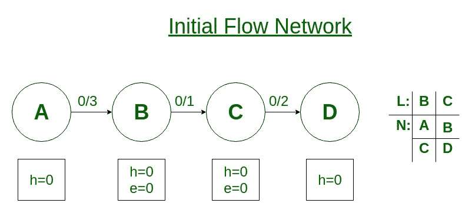
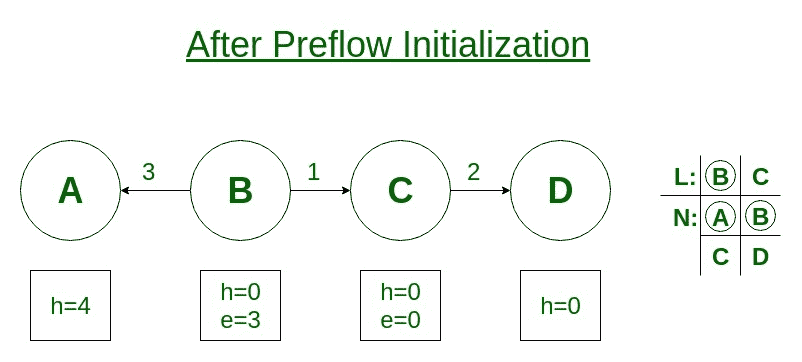

# 前端重新标记算法

> 原文： [https://www.geeksforgeeks.org/relabel-to-front-algorithm/](https://www.geeksforgeeks.org/relabel-to-front-algorithm/)

重新标记到最前面的算法用于查找网络中的最大流量。 重贴标签算法比通用的[推重贴标签](https://www.geeksforgeeks.org/push-relabel-algorithm-set-1-introduction-and-illustration/)方法更有效。 在 push-relabel 方法中，我们可以按任意顺序应用 push 和 relabel 的基本操作。 重贴标签算法会仔细选择顺序，并有效地管理网络数据结构。

首先，我们需要了解基本操作，即**推**和**重新标记**：
网络中的每个顶点都有 **2 个与之相关的变量**，它们是[HTG7 高度变量[h] 和**多余流量[e]** 。

1.  **推入：**如果顶点有过多的流动，并且相邻节点的高度较低（在残差图中），则我们将流动从顶点推向较低高度的节点。
2.  **重新标记：**如果顶点有过多的流量并且没有可用的较低高度的相邻节点，则可以使用重新标记操作来增加顶点的高度，以便其可以执行推入操作。

重新标记前算法会维护网络中的顶点列表。 它从列表的开头开始，并反复选择一个溢出的顶点 u 并对其执行放电操作。
放电操作将执行推入和重新标记操作，直到顶点 u 没有正向多余流量（e）为止。

**算法：**

*   将**预流程**和**高度**初始化为与通用**推入重贴标签**算法相同的值。
*   初始化列表 **L** ，其中包含**源**和**宿**之外的所有顶点。
*   初始化每个顶点 **u** 到 u 邻居列表 **N** 中第一个顶点的当前指针。 邻居列表 **N** 包含那些存在残留边的顶点。
*   当算法到达列表 **L** 的末尾时。
    *   从列表 **L** 中选择顶点 **u** 并执行放电操作。
    *   如果 **u** 通过放电重新标记，则将 **u** 移到列表的最前面。
    *   如果将 **u** 移到列表的最前面，则下一迭代中的顶点是 **u** 在列表中新位置之后的顶点。

**示例：**
考虑给定的流动网络。右侧显示初始列表 L =（B，C），其中初始 u = B。

在预流初始化操作之后，在列表 L 中的每个顶点下是其邻居列表 N，其中当前邻居盘旋了。

顶点 B 由于有多余的流 3（e = 3）而经历排放操作。顶点 B 没有高度较低的节点，因此它执行重新标记操作（h = 1），并将流 1 推到顶点 C.

顶点 B 仍然有多余的流量 2（e = 2），因此它执行重新标记操作（h = 5）并将流量 2 推送到顶点 A.由于顶点 B 被重新标记，它仍位于列表的前面。 现在顶点 C 经历排放操作，因为它有多余的流量 1（e = 1）。

顶点 C 执行重新标记操作（h = 1）并将流 1 推送到节点 D.由于顶点 C 执行了重新标记操作，因此将其移到列表的前面。

现在，顶点 B 跟随 L 中的顶点 C，但是 B 没有多余的流量。 RELABEL-TO-FRONT 已到达列表 L 的末尾并终止。 没有溢出的顶点，因此预流是最大流。 这里最大流量是 1。

**时间复杂度：**以 **O（V 3 ）**时间在网络上运行 **G =（V，E）**。 因此，它比在 **O（V 2 E）**时间运行的通用**推入重贴标签**算法更有效。

**参考：** [算法入门第三版，作者：Clifford Stein，Thomas H. Cormen，Charles E. Leiserson，Ronald L. Rivest](http://www.euroinformatica.ro/documentation/programming/!!!Algorithms_CORMEN!!!/DDU0165.html)

* * *

* * *

如果您喜欢 GeeksforGeeks 并希望做出贡献，则还可以使用 [tribution.geeksforgeeks.org](https://contribute.geeksforgeeks.org/) 撰写文章，或将您的文章邮寄至 tribution@geeksforgeeks.org。 查看您的文章出现在 GeeksforGeeks 主页上，并帮助其他 Geeks。

如果您发现任何不正确的地方，请单击下面的“改进文章”按钮，以改进本文。