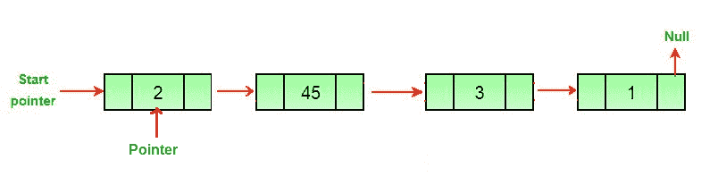

# 删除链接列表

的最后一个节点

给定一个链表，任务是删除链表的最后一个节点并更新链表的头指针。

**示例：**

```
Input: 1 -> 2 -> 3 -> 4 -> 5 -> NULL
Output: 1 -> 2 -> 3 -> 4 -> NULL

Explanation: The last node of the linked list
is 5, so 5 is deleted.

Input: 2 -> 4 -> 6 -> 8 -> 33 -> 67 -> NULL
Output: 2 -> 4 -> 6 -> 8 -> 33 -> NULL

Explanation: The last node of the linked list
is 67, so 67 is deleted.

```

**方法：**要删除链表的最后一个节点，请找到倒数第二个节点，并使该节点的下一个指针为空。


**算法：**

1.  如果第一个节点为 *null* 或只有一个节点，则返回 *null*

    ```
    if *headNode* == null then return null
    if *headNode*.nextNode == null then free 
    head and return null

    ```

2.  创建一个额外的空间 *secondLast* ，并遍历链接列表，直到倒数第二个节点。

    ```
    while *secondLast*.nextNode.nextNode != null 
          *secondLast* = *secondLast*.nextNode 

    ```

3.  删除最后一个节点，即倒数第二个节点的下一个节点delete（ *secondLast* .nextNode），并将倒数第二个节点的next值设置为null。

**实施：**

## C ++

*filter_none*

*编辑*
*关闭*

*play_arrow*

*链接*
*亮度_4*
*代码*

| `// CPP program to remove last node of``// linked list.``#include <iostream>``using` `namespace` `std;` [`/* Link list node */``struct` `Node {` `int` `data;` `struct` `Node* next;``};``/* Function to remove the last node  ` `of the linked list */``Node* removeLastNode(` `struct` `Node* head)``{` `if` `(head == NULL)` `return` `NULL;` [ `if` `(head->next == NULL) {` `delete` `head;` `return` `NULL;` `}` `// Find the second last node` `Node* second_last = head;` `while` `(second_last->next->next != NULL)` `second_last = second_last->next;` `// Delete last node` `delete` `(second_last->next);` `// Change next of second last` `second_last->next = NULL;` `return` `head;``}``// Function to push node at head``void` `push(` `struct` `Node** head_ref,` `int` `new_data)``{` `struct` `Node* new_node =` `new` `Node;` `new_node->data = new_data;` `new_node->next = (*head_ref);` `(*head_ref) = new_node;``}``// Driver code``int` `main()``{` `/* Start with the empty list */` `Node* head = NULL;` `/* Use push() function to construct   ` `the below list 8 -> 23 -> 11 -> 29 -> 12 */` `push(&head, 12);` `push(&head, 29);` `push(&head, 11);` `push(&head, 23);` `push(&head, 8);` `head = removeLastNode(head);` `for` `(Node* temp = head; temp != NULL; temp = temp->next)` `cout << temp->data <<` `" "` `;` `return` `0;``}` |

*chevron_right**filter_none*