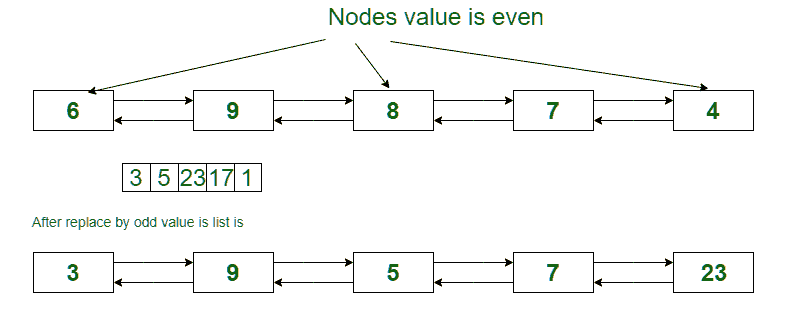

# 将双向链表的偶数节点替换为数组

> 原文：[https://www.geeksforgeeks.org/replace-even-nodes-of-a-doubly-linked-list-with-the-elements-of-array/](https://www.geeksforgeeks.org/replace-even-nodes-of-a-doubly-linked-list-with-the-elements-of-array/)

的元素

给定一个双链表和一个只有奇数值的数组。 两者的大小均为 N。任务是用 Array 元素从左到右替换所有具有偶数值的节点。



**示例**：

> **输入**：列表= 6 9 8 7 4
> Arr [] = {3，5，23，17，1}
> **输出**：列表= 3 9 5 7 23
> 
> **输入**：列表= 9 14 7 12 8 13
> Arr [] = {5，1，17，21，11，7}
> **输出**：列表= 9 5 7 1 17 13

**方法**：的想法是一次遍历双向链表的节点，获取具有偶数数据的节点的指针，然后替换为数组的值，并递增数组的索引并移动 到链表中的下一个节点。

下面是上述方法的实现：

## C++

```cpp

// C++ implementation to create 
// odd doubly linked list 
#include <bits/stdc++.h> 
using namespace std; 

// Node of the doubly linked list 
struct Node { 
    int data; 
    Node *prev, *next; 
}; 

// function to insert a node at the beginning 
// of the Doubly Linked List 
void push(Node** head_ref, int new_data) 
{ 
    // allocate node 
    Node* new_node = (Node*)malloc(sizeof(struct Node)); 

    // put in the data 
    new_node->data = new_data; 

    // since we are adding at the beginning, 
    // prev is always NULL 
    new_node->prev = NULL; 

    // link the old list off the new node 
    new_node->next = (*head_ref); 

    // change prev of head node to new node 
    if ((*head_ref) != NULL) 
        (*head_ref)->prev = new_node; 

    // move the head to point to the new node 
    (*head_ref) = new_node; 
} 

// function to make all node is odd 
void makeOddNode(Node** head_ref, int A[], int n) 
{ 
    Node* ptr = *head_ref; 
    Node* next; 
    int i = 0; 
    // traves list till last node 
    while (ptr != NULL) { 
        next = ptr->next; 
        // check if node is even then 
        // replace it and incriment in i 
        if (ptr->data % 2 == 0) { 
            ptr->data = A[i]; 
            i++; 
        } 
        ptr = next; 
    } 
    // return sum of nodes which is divided by K 
} 
// function to print nodes in a 
// given doubly linked list 
void printList(Node* head) 
{ 
    while (head != NULL) { 
        cout << head->data << " "; 
        head = head->next; 
    } 
} 

// Driver program to test above 
int main() 
{ 
    // start with the empty list 
    Node* head = NULL; 

    // create the doubly linked list 
    // 6 <=> 9 <=> 8 <=> 7 <=> 4 
    int Arr[] = { 3, 5, 23, 17, 1 }; 
    push(&head, 4); 
    push(&head, 7); 
    push(&head, 8); 
    push(&head, 9); 
    push(&head, 6); 
    int n = sizeof(Arr) / sizeof(Arr[0]); 
    cout << "Original List: "; 
    printList(head); 
    cout << endl; 
    makeOddNode(&head, Arr, n); 
    cout << "New odd List: "; 
    printList(head); 
} 

```

## Java

```java

// Java implementation to create  
// odd doubly linked list  
class GFG 
{ 

// Node of the doubly linked list  
static class Node 
{  
    int data;  
    Node prev, next;  
};  

// function to insert a node at the beginning  
// of the Doubly Linked List  
static Node push(Node head_ref, int new_data)  
{  
    // allocate node  
    Node new_node = new Node();  

    // put in the data  
    new_node.data = new_data;  

    // since we are adding at the beginning,  
    // prev is always null  
    new_node.prev = null;  

    // link the old list off the new node  
    new_node.next = (head_ref);  

    // change prev of head node to new node  
    if ((head_ref) != null)  
        (head_ref).prev = new_node;  

    // move the head to point to the new node  
    (head_ref) = new_node;  
    return head_ref; 
}  

// function to make all node is odd  
static Node makeOddNode(Node head_ref, int A[], int n)  
{  
    Node ptr = head_ref;  
    Node next;  
    int i = 0;  
    // traves list till last node  
    while (ptr != null)  
    {  
        next = ptr.next;  

        // check if node is even then  
        // replace it and incriment in i  
        if (ptr.data % 2 == 0) 
        {  

            ptr.data = A[i];  
            i++;  
        }  
        ptr = next;  
    }  

    // return sum of nodes which is divided by K  
    return head_ref; 
}  

// function to print nodes in a  
// given doubly linked list  
static void printList(Node head)  
{  
    while (head != null) 
    {  
        System.out.print( head.data + " ");  
        head = head.next;  
    }  
}  

// Driver code  
public static void main(String args[]) 
{  
    // start with the empty list  
    Node head = null;  

    // create the doubly linked list  
    // 6 <=> 9 <=> 8 <=> 7 <=> 4  
    int Arr[] = { 3, 5, 23, 17, 1 };  
    head = push(head, 4);  
    head = push(head, 7);  
    head = push(head, 8);  
    head = push(head, 9);  
    head = push(head, 6);  
    int n = Arr.length;  
    System.out.print( "Original List: ");  
    printList(head);  
    System.out.println();  
    head = makeOddNode(head, Arr, n);  
    System.out.print("New odd List: ");  
    printList(head);  
}  
} 

// This code is contributed by Arnab Kundu 

```

## Python3

```py

# Python3 implementation to  
# create odd doubly linked list  

# Node of the doubly linked list  
class Node: 

    def __init__(self, data): 
        self.data = data 
        self.prev = None
        self.next = None

# Function to insert a node at the  
# beginning of the Doubly Linked List  
def push(head_ref, new_data):  

    # allocate node  
    new_node = Node(new_data)  

    # link the old list off the new node  
    new_node.next = head_ref  

    # change prev of head node to new node  
    if head_ref != None:  
        head_ref.prev = new_node  

    # move the head to point to the new node  
    head_ref = new_node 
    return head_ref 

# Function to make all node is odd  
def makeOddNode(head_ref, A, n):  

    ptr = head_ref  
    i = 0

    # traves list till last node  
    while ptr != None: 

        next = ptr.next

        # check if node is even then  
        # replace it and incriment in i  
        if ptr.data % 2 == 0:  
            ptr.data = A[i]  
            i += 1

        ptr = next

    # return sum of nodes which is divided by K  

# Function to print nodes in a  
# given doubly linked list  
def printList(head):  

    while head != None: 
        print(head.data, end = " ")  
        head = head.next

# Driver Code 
if __name__ == "__main__":  

    # start with the empty list  
    head = None

    # create the doubly linked list  
    # 6 <=> 9 <=> 8 <=> 7 <=> 4  
    Arr = [3, 5, 23, 17, 1]  
    head = push(head, 4)  
    head = push(head, 7)  
    head = push(head, 8)  
    head = push(head, 9)  
    head = push(head, 6)  
    n = len(Arr)  

    print("Original List:", end = " ")  
    printList(head)  
    print() 

    makeOddNode(head, Arr, n)  
    print("New odd List:", end = " ")  
    printList(head)  

# This code is contributed by Rituraj Jain 

```

## C#

```cs

// C# implementation to create  
// odd doubly linked list 
using System; 

class GFG 
{ 

// Node of the doubly linked list  
public class Node 
{  
    public int data;  
    public Node prev, next;  
};  

// function to insert a node at the beginning  
// of the Doubly Linked List  
static Node push(Node head_ref, int new_data)  
{  
    // allocate node  
    Node new_node = new Node();  

    // put in the data  
    new_node.data = new_data;  

    // since we are adding at the beginning,  
    // prev is always null  
    new_node.prev = null;  

    // link the old list off the new node  
    new_node.next = (head_ref);  

    // change prev of head node to new node  
    if ((head_ref) != null)  
        (head_ref).prev = new_node;  

    // move the head to point to the new node  
    (head_ref) = new_node;  
    return head_ref; 
}  

// function to make all node is odd  
static Node makeOddNode(Node head_ref, int []A, int n)  
{  
    Node ptr = head_ref;  
    Node next;  
    int i = 0;  

    // traves list till last node  
    while (ptr != null)  
    {  
        next = ptr.next;  

        // check if node is even then  
        // replace it and incriment in i  
        if (ptr.data % 2 == 0) 
        {  

            ptr.data = A[i];  
            i++;  
        }  
        ptr = next;  
    }  

    // return sum of nodes which is divided by K  
    return head_ref; 
}  

// function to print nodes in a  
// given doubly linked list  
static void printList(Node head)  
{  
    while (head != null) 
    {  
        Console.Write( head.data + " ");  
        head = head.next;  
    }  
}  

// Driver code  
public static void Main(String []args) 
{  
    // start with the empty list  
    Node head = null;  

    // create the doubly linked list  
    // 6 <=> 9 <=> 8 <=> 7 <=> 4  
    int []Arr = { 3, 5, 23, 17, 1 };  
    head = push(head, 4);  
    head = push(head, 7);  
    head = push(head, 8);  
    head = push(head, 9);  
    head = push(head, 6);  
    int n = Arr.Length;  
    Console.WriteLine( "Original List: ");  
    printList(head);  
    Console.WriteLine();  
    head = makeOddNode(head, Arr, n);  
    Console.WriteLine("New odd List: ");  
    printList(head);  
}  
} 

// This code contributed by Rajput-Ji 

```

**Output:**

```
Original List: 6 9 8 7 4 
New odd List: 3 9 5 7 23

```

**时间复杂度：`O(n)`，**，其中 N 是节点总数。


* * *

* * *

如果您喜欢 GeeksforGeeks 并希望做出贡献，则还可以使用 [tribution.geeksforgeeks.org](https://contribute.geeksforgeeks.org/) 撰写文章，或将您的文章邮寄至 tribution@geeksforgeeks.org。 查看您的文章出现在 GeeksforGeeks 主页上，并帮助其他 Geeks。

如果您发现任何不正确的地方，请单击下面的“改进文章”按钮，以改进本文。