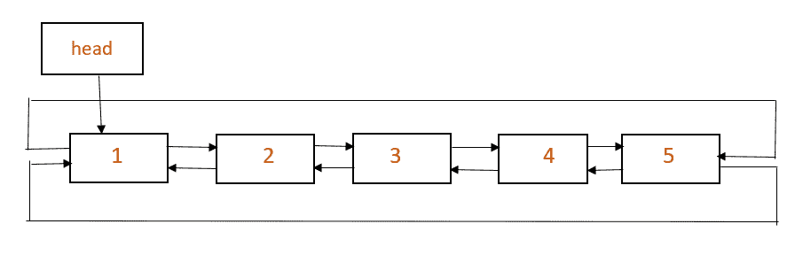

# 反转循环双链表

> 原文：[https://www.geeksforgeeks.org/reverse-a-doubly-circular-linked-list/](https://www.geeksforgeeks.org/reverse-a-doubly-circular-linked-list/)

问题是要反转给定的循环双链表。

**示例**：

输入：



输出：


**算法**：

```
insertEnd(head, new_node) 
    Declare last

    if head == NULL then
        new_node->next = new_node->prev = new_node
        head = new_node
        return 

    last = head->prev
    new_node->next = head  
    head->prev = new_node
    new_node->prev = last  
    last->next = new_node

reverse(head)
    Initialize new_head = NULL
    Declare last

    last = head->prev
    Initialize curr = last, prev

    while curr->prev != last
        prev = curr->prev
        insertEnd(&new_head, curr)
        curr = prev
    insertEnd(&new_head, curr)

    return new_head

```

**说明**：`insertEnd()`的参数列表中的变量`head`是指针变量的指针。 `reverse()`从`head`指针开始向后遍历循环双链表，并一一获得遍历中的节点。 借助函数`insertEnd()`，将那些节点插入到以`new_head`指针开头的列表的末尾，最后返回`new_head`。

## C++

```cpp

// C++ implementation to revesre a 
// doubly circular linked list 
#include <bits/stdc++.h> 

using namespace std; 

// structure of a node of linked list 
struct Node { 
    int data; 
    Node *next, *prev; 
}; 

// function to create and return a new node 
Node* getNode(int data) 
{ 
    Node* newNode = (Node*)malloc(sizeof(Node)); 
    newNode->data = data; 
    return newNode; 
} 

// Function to insert at the end 
void insertEnd(Node** head, Node* new_node) 
{ 
    // If the list is empty, create a single node 
    // circular and doubly list 
    if (*head == NULL) { 
        new_node->next = new_node->prev = new_node; 
        *head = new_node; 
        return; 
    } 

    // If list is not empty 

    /* Find last node */
    Node* last = (*head)->prev; 

    // Start is going to be next of new_node 
    new_node->next = *head; 

    // Make new node previous of start 
    (*head)->prev = new_node; 

    // Make last preivous of new node 
    new_node->prev = last; 

    // Make new node next of old last 
    last->next = new_node; 
} 

// Uitlity function to revesre a 
// doubly circular linked list 
Node* reverse(Node* head) 
{ 
    if (!head) 
        return NULL; 

    // Initialize a new head pointer 
    Node* new_head = NULL; 

    // get pointer to the the last node 
    Node* last = head->prev; 

    // set 'curr' to last node 
    Node *curr = last, *prev; 

    // traverse list in backward direction 
    while (curr->prev != last) { 
        prev = curr->prev; 

        // insert 'curr' at the end of the list 
        // starting with the 'new_head' pointer 
        insertEnd(&new_head, curr); 
        curr = prev; 
    } 
    insertEnd(&new_head, curr); 

    // head pointer of the reversed list 
    return new_head; 
} 

// function to display a doubly circular list in 
// forward and backward direction 
void display(Node* head) 
{ 
    if (!head) 
        return; 

    Node* temp = head; 

    cout << "Forward direction: "; 
    while (temp->next != head) { 
        cout << temp->data << " "; 
        temp = temp->next; 
    } 
    cout << temp->data; 

    Node* last = head->prev; 
    temp = last; 

    cout << "\nBackward direction: "; 
    while (temp->prev != last) { 
        cout << temp->data << " "; 
        temp = temp->prev; 
    } 
    cout << temp->data; 
} 

// Driver program to test above 
int main() 
{ 
    Node* head = NULL; 

    insertEnd(&head, getNode(1)); 
    insertEnd(&head, getNode(2)); 
    insertEnd(&head, getNode(3)); 
    insertEnd(&head, getNode(4)); 
    insertEnd(&head, getNode(5)); 

    cout << "Current list:\n"; 
    display(head); 

    head = reverse(head); 

    cout << "\n\nReversed list:\n"; 
    display(head); 

    return 0; 
} 

```

## Java

```java

// Java implementation to revesre a  
// doubly circular linked list  
class GFG 
{ 

// structure of a node of linked list  
static class Node 
{  
    int data;  
    Node next, prev;  
};  

// function to create and return a new node  
static Node getNode(int data)  
{  
    Node newNode = new Node();  
    newNode.data = data;  
    return newNode;  
}  

// Function to insert at the end  
static Node insertEnd(Node head, Node new_node)  
{  
    // If the list is empty, create a single node  
    // circular and doubly list  
    if (head == null)  
    {  
        new_node.next = new_node.prev = new_node;  
        head = new_node;  
        return head;  
    }  

    // If list is not empty  

    // Find last node / 
    Node last = (head).prev;  

    // Start is going to be next of new_node  
    new_node.next = head;  

    // Make new node previous of start  
    (head).prev = new_node;  

    // Make last preivous of new node  
    new_node.prev = last;  

    // Make new node next of old last  
    last.next = new_node;  
    return head; 
}  

// Uitlity function to revesre a  
// doubly circular linked list  
static Node reverse(Node head)  
{  
    if (head==null)  
        return null;  

    // Initialize a new head pointer  
    Node new_head = null;  

    // get pointer to the the last node  
    Node last = head.prev;  

    // set 'curr' to last node  
    Node curr = last, prev;  

    // traverse list in backward direction  
    while (curr.prev != last)  
    {  
        prev = curr.prev;  

        // insert 'curr' at the end of the list  
        // starting with the 'new_head' pointer  
        new_head=insertEnd(new_head, curr);  
        curr = prev;  
    }  
    new_head=insertEnd(new_head, curr);  

    // head pointer of the reversed list  
    return new_head;  
}  

// function to display a doubly circular list in  
// forward and backward direction  
static void display(Node head)  
{  
    if (head==null)  
        return;  

    Node temp = head;  

    System.out.print( "Forward direction: ");  
    while (temp.next != head)  
    {  
        System.out.print( temp.data + " ");  
        temp = temp.next;  
    }  
        System.out.print( temp.data + " ");  

    Node last = head.prev;  
    temp = last;  

    System.out.print( "\nBackward direction: ");  
    while (temp.prev != last)  
    {  
        System.out.print( temp.data + " ");  
        temp = temp.prev;  
    }  
        System.out.print( temp.data + " ");  
}  

// Driver code  
public static void main(String args[]) 
{  
    Node head = null;  

    head =insertEnd(head, getNode(1));  
    head =insertEnd(head, getNode(2));  
    head =insertEnd(head, getNode(3));  
    head =insertEnd(head, getNode(4));  
    head =insertEnd(head, getNode(5));  

    System.out.print( "Current list:\n");  
    display(head);  

    head = reverse(head);  

    System.out.print( "\n\nReversed list:\n");  
    display(head);  
} 
}  

// This code is contributed by Arnab Kundu 

```

## Python3

```py

# Python3 implementation to revesre a 
# doubly circular linked list 
import math 

# structure of a node of linked list 
class Node:  
    def __init__(self, data):  
        self.data = data  
        self.next = None

# function to create and return a new node 
def getNode(data): 
    newNode = Node(data) 
    newNode.data = data 
    return newNode 

# Function to insert at the end 
def insertEnd(head, new_node): 

    # If the list is empty, create a single node 
    # circular and doubly list 
    if (head == None) : 
        new_node.next = new_node 
        new_node.prev = new_node 
        head = new_node 
        return head 

    # If list is not empty 

    # Find last node  
    last = head.prev 

    # Start is going to be next of new_node 
    new_node.next = head 

    # Make new node previous of start 
    head.prev = new_node 

    # Make last preivous of new node 
    new_node.prev = last 

    # Make new node next of old last 
    last.next = new_node 
    return head 

# Uitlity function to revesre a 
# doubly circular linked list 
def reverse(head): 
    if (head == None): 
        return None

    # Initialize a new head pointer 
    new_head = None

    # get pointer to the the last node 
    last = head.prev 

    # set 'curr' to last node 
    curr = last 
    #*prev 

    # traverse list in backward direction 
    while (curr.prev != last): 
        prev = curr.prev 

        # insert 'curr' at the end of the list 
        # starting with the 'new_head' pointer 
        new_head = insertEnd(new_head, curr) 
        curr = prev 

    new_head = insertEnd(new_head, curr) 

    # head pointer of the reversed list 
    return new_head 

# function to display a doubly circular list in 
# forward and backward direction 
def display(head): 
    if (head == None): 
        return

    temp = head 

    print("Forward direction: ", end = "") 
    while (temp.next != head): 
        print(temp.data, end = " ") 
        temp = temp.next

    print(temp.data) 

    last = head.prev 
    temp = last 

    print("Backward direction: ", end = "") 
    while (temp.prev != last): 
        print(temp.data, end = " ") 
        temp = temp.prev 

    print(temp.data) 

# Driver Code 
if __name__=='__main__':  

    head = None

    head = insertEnd(head, getNode(1)) 
    head = insertEnd(head, getNode(2)) 
    head = insertEnd(head, getNode(3)) 
    head = insertEnd(head, getNode(4)) 
    head = insertEnd(head, getNode(5)) 

    print("Current list:") 
    display(head) 

    head = reverse(head) 

    print("\nReversed list:") 
    display(head) 

# This code is contributed by Srathore 

```

## C#

```cs

// C# implementation to revesre a  
// doubly circular linked list 
using System; 

class GFG  
{  

// structure of a node of linked list  
public class Node  
{  
    public int data;  
    public Node next, prev;  
};  

// function to create and return a new node  
static Node getNode(int data)  
{  
    Node newNode = new Node();  
    newNode.data = data;  
    return newNode;  
}  

// Function to insert at the end  
static Node insertEnd(Node head, Node new_node)  
{  
    // If the list is empty, create a single node  
    // circular and doubly list  
    if (head == null)  
    {  
        new_node.next = new_node.prev = new_node;  
        head = new_node;  
        return head;  
    }  

    // If list is not empty  

    // Find last node /  
    Node last = (head).prev;  

    // Start is going to be next of new_node  
    new_node.next = head;  

    // Make new node previous of start  
    (head).prev = new_node;  

    // Make last preivous of new node  
    new_node.prev = last;  

    // Make new node next of old last  
    last.next = new_node;  
    return head;  
}  

// Uitlity function to revesre a  
// doubly circular linked list  
static Node reverse(Node head)  
{  
    if (head == null)  
        return null;  

    // Initialize a new head pointer  
    Node new_head = null;  

    // get pointer to the the last node  
    Node last = head.prev;  

    // set 'curr' to last node  
    Node curr = last, prev;  

    // traverse list in backward direction  
    while (curr.prev != last)  
    {  
        prev = curr.prev;  

        // insert 'curr' at the end of the list  
        // starting with the 'new_head' pointer  
        new_head=insertEnd(new_head, curr);  
        curr = prev;  
    }  
    new_head=insertEnd(new_head, curr);  

    // head pointer of the reversed list  
    return new_head;  
}  

// function to display a doubly circular list in  
// forward and backward direction  
static void display(Node head)  
{  
    if (head == null)  
        return;  

    Node temp = head;  

    Console.Write( "Forward direction: ");  
    while (temp.next != head)  
    {  
        Console.Write( temp.data + " ");  
        temp = temp.next;  
    }  
        Console.Write( temp.data + " ");  

    Node last = head.prev;  
    temp = last;  

    Console.Write( "\nBackward direction: ");  
    while (temp.prev != last)  
    {  
        Console.Write( temp.data + " ");  
        temp = temp.prev;  
    }  
        Console.Write( temp.data + " ");  
}  

// Driver code  
public static void Main(String []args)  
{  
    Node head = null;  

    head = insertEnd(head, getNode(1));  
    head = insertEnd(head, getNode(2));  
    head = insertEnd(head, getNode(3));  
    head = insertEnd(head, getNode(4));  
    head = insertEnd(head, getNode(5));  

    Console.Write( "Current list:\n");  
    display(head);  

    head = reverse(head);  

    Console.Write( "\n\nReversed list:\n");  
    display(head);  
}  
}  

// This code contributed by Rajput-Ji 

```

**输出**：

```
Current list:
Forward direction: 1 2 3 4 5
Backward direction: 5 4 3 2 1

Reversed list:
Forward direction: 5 4 3 2 1
Backward direction: 1 2 3 4 5

```

**时间复杂度**：`O(n)`。


* * *

* * *

如果您喜欢 GeeksforGeeks 并希望做出贡献，则还可以使用 [tribution.geeksforgeeks.org](https://contribute.geeksforgeeks.org/) 撰写文章，或将您的文章邮寄至 tribution@geeksforgeeks.org。 查看您的文章出现在 GeeksforGeeks 主页上，并帮助其他 Geeks。

如果您发现任何不正确的地方，请单击下面的“改进文章”按钮，以改进本文。