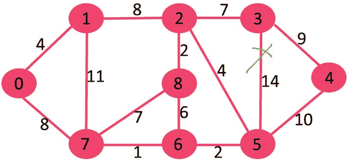
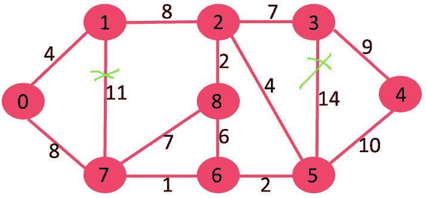
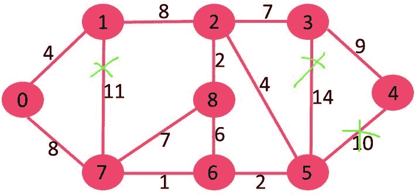

# 最小生成树

的反向删除算法

> 原文： [https://www.geeksforgeeks.org/reverse-delete-algorithm-minimum-spanning-tree/](https://www.geeksforgeeks.org/reverse-delete-algorithm-minimum-spanning-tree/)

反向删除算法与 [Kruskal 算法](https://www.geeksforgeeks.org/greedy-algorithms-set-2-kruskals-minimum-spanning-tree-mst/)密切相关。 在 Kruskal 的算法中，我们要做的是：按权重的增加顺序对边缘进行排序。 排序后，我们以递增顺序一个接一个地拾取边缘。 如果在生成树中包含 V-1 个边（直到 V =顶点数）之前不包含任何周期，则将当前选取的边包括在内。

在反向删除算法中，我们以**的权重按**的顺序递减所有边缘。 排序后，我们以降序一个接一个地拾取边缘。 如果**排除当前沿会导致电流图**中的断开连接，则包括**。 如果删除边缘不会导致图形断开，则主要思想是删除边缘。**

算法

```
1) Sort all edges of graph in non-increasing order of
   edge weights.

2) Initialize MST as original graph and remove extra
   edges using step 3.

3) Pick highest weight edge from remaining edges and 
   check if deleting the edge disconnects the graph  
   or not.
       If disconnects, then we don't delete the edge.
       Else we delete the edge and continue. 
```

**插图**：
让我们用以下示例理解：
[](https://media.geeksforgeeks.org/wp-content/cdn-uploads/Fig-11.jpg)

如果我们删除权重 14 的最高权重边，则图形不会断开连接，因此我们将其删除。


接下来，我们删除 11，因为删除它不会断开图形。


接下来，我们删除 10 个，因为删除它不会断开图形。


接下来是 9。我们无法删除 9，因为删除它会导致断开连接。


我们将以这种方式继续进行下去，最终的 MST 仍将保持其优势。

```
Edges in MST
(3, 4) 
(0, 7) 
(2, 3) 
(2, 5) 
(0, 1) 
(5, 6) 
(2, 8) 
(6, 7) 
```

 **注意**：在相同重量边缘的情况下，我们可以选择相同重量边缘的任何边缘。

以下是上述步骤的 C ++实现。

## C ++

```

// C++ program to find Minimum Spanning Tree 
// of a graph using Reverse Delete Algorithm 
#include<bits/stdc++.h> 
using namespace std; 

// Creating shortcut for an integer pair 
typedef  pair<int, int> iPair; 

// Graph class represents a directed graph 
// using adjacency list representation 
class Graph 
{ 
    int V;    // No. of vertices 
    list<int> *adj; 
    vector< pair<int, iPair> > edges; 
    void DFS(int v, bool visited[]); 

public: 
    Graph(int V);   // Constructor 

    // function to add an edge to graph 
    void addEdge(int u, int v, int w); 

    // Returns true if graph is connected 
    bool isConnected(); 

    void reverseDeleteMST(); 
}; 

Graph::Graph(int V) 
{ 
    this->V = V; 
    adj = new list<int>[V]; 
} 

void Graph::addEdge(int u, int v, int w) 
{ 
    adj[u].push_back(v); // Add w to v’s list. 
    adj[v].push_back(u); // Add w to v’s list. 
    edges.push_back({w, {u, v}}); 
} 

void Graph::DFS(int v, bool visited[]) 
{ 
    // Mark the current node as visited and print it 
    visited[v] = true; 

    // Recur for all the vertices adjacent to 
    // this vertex 
    list<int>::iterator i; 
    for (i = adj[v].begin(); i != adj[v].end(); ++i) 
        if (!visited[*i]) 
            DFS(*i, visited); 
} 

// Returns true if given graph is connected, else false 
bool Graph::isConnected() 
{ 
    bool visited[V]; 
    memset(visited, false, sizeof(visited)); 

    // Find all reachable vertices from first vertex 
    DFS(0, visited); 

    // If set of reachable vertices includes all, 
    // return true. 
    for (int i=1; i<V; i++) 
        if (visited[i] == false) 
            return false; 

    return true; 
} 

// This function assumes that edge (u, v) 
// exists in graph or not, 
void Graph::reverseDeleteMST() 
{ 
    // Sort edges in increasing order on basis of cost 
    sort(edges.begin(), edges.end()); 

    int mst_wt = 0;  // Initialize weight of MST 

    cout << "Edges in MST\n"; 

    // Iterate through all sorted edges in 
    // decreasing order of weights 
    for (int i=edges.size()-1; i>=0; i--) 
    { 
        int u = edges[i].second.first; 
        int v = edges[i].second.second; 

        // Remove edge from undirected graph 
        adj[u].remove(v); 
        adj[v].remove(u); 

        // Adding the edge back if removing it 
        // causes disconnection. In this case this  
        // edge becomes part of MST. 
        if (isConnected() == false) 
        { 
            adj[u].push_back(v); 
            adj[v].push_back(u); 

            // This edge is part of MST 
            cout << "(" << u << ", " << v << ") \n"; 
            mst_wt += edges[i].first; 
        } 
    } 

    cout << "Total weight of MST is " << mst_wt; 
} 

// Driver code 
int main() 
{ 
    // create the graph given in above fugure 
    int V = 9; 
    Graph g(V); 

    //  making above shown graph 
    g.addEdge(0, 1, 4); 
    g.addEdge(0, 7, 8); 
    g.addEdge(1, 2, 8); 
    g.addEdge(1, 7, 11); 
    g.addEdge(2, 3, 7); 
    g.addEdge(2, 8, 2); 
    g.addEdge(2, 5, 4); 
    g.addEdge(3, 4, 9); 
    g.addEdge(3, 5, 14); 
    g.addEdge(4, 5, 10); 
    g.addEdge(5, 6, 2); 
    g.addEdge(6, 7, 1); 
    g.addEdge(6, 8, 6); 
    g.addEdge(7, 8, 7); 

    g.reverseDeleteMST(); 
    return 0; 
} 

```