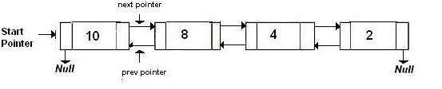

# 反转双链表 | 系列 2

> 原文：[https://www.geeksforgeeks.org/reverse-doubly-linked-list-set-2/](https://www.geeksforgeeks.org/reverse-doubly-linked-list-set-2/)

编写一个程序来反转给定的双链表。

例如，请参见下图。

```
          (a) Original Doubly Linked List  

```



```
          (b) Reversed Doubly Linked List  

```


**方法**：在[上一篇文章](https://www.geeksforgeeks.org/reverse-a-doubly-linked-list/)中，通过交换所有节点的上一个指针和下一个指针，更改头的`prev`（或开始），然后更改头的指针，来反转双向链表 到底。 在本文中，我们创建一个`push`函数，将给定节点添加到给定列表的开头。 我们遍历原始列表，然后将当前节点指针一一传递给`push`函数。 此过程将反转列表。 最后返回此反向列表的新头部。

## C++

```cpp

// C++ implementation to reverse 
// a doubly linked list 
#include <bits/stdc++.h> 

using namespace std; 

// a node of the doubly linked list 
struct Node { 
    int data; 
    Node *next, *prev; 
}; 

// function to get a new node 
Node* getNode(int data) 
{ 
    // allocate space 
    Node* new_node = (Node*)malloc(sizeof(Node)); 

    // put in the data 
    new_node->data = data; 
    new_node->next = new_node->prev = NULL; 
    return new_node; 
} 

// function to insert a node at the beginging 
// of the Doubly Linked List 
void push(Node** head_ref, Node* new_node) 
{ 
    // since we are adding at the beginning, 
    // prev is always NULL 
    new_node->prev = NULL; 

    // link the old list off the new node 
    new_node->next = (*head_ref); 

    // change prev of head node to new node 
    if ((*head_ref) != NULL) 
        (*head_ref)->prev = new_node; 

    // move the head to point to the new node 
    (*head_ref) = new_node; 
} 

// function to reverse a doubly linked list 
void reverseList(Node** head_ref) 
{ 
    // if list is empty or it contains 
    // a single node only 
    if (!(*head_ref) || !((*head_ref)->next)) 
        return; 

    Node* new_head = NULL; 
    Node *curr = *head_ref, *next; 

    while (curr != NULL) { 

        // get pointer to next node 
        next = curr->next; 

        // push 'curr' node at the beginning of the 
        // list with starting with 'new_head' 
        push(&new_head, curr); 

        // update 'curr' 
        curr = next; 
    } 

    // update 'head_ref' 
    *head_ref = new_head; 
} 

// Function to print nodes in a 
// given doubly linked list 
void printList(Node* head) 
{ 
    while (head != NULL) { 
        cout << head->data << " "; 
        head = head->next; 
    } 
} 

// Driver program to test above 
int main() 
{ 
    // Start with the empty list 
    Node* head = NULL; 

    // Create doubly linked: 10<->8<->4<->2 */ 
    push(&head, getNode(2)); 
    push(&head, getNode(4)); 
    push(&head, getNode(8)); 
    push(&head, getNode(10)); 

    cout << "Original list: "; 
    printList(head); 

    // Reverse doubly linked list 
    reverseList(&head); 

    cout << "\nReversed list: "; 
    printList(head); 

    return 0; 
} 

```

## Java

```java

// Java implementation to reverse  
// a doubly linked list  
class GFG 
{ 

// a node of the doubly linked list  
static class Node  
{  
    int data;  
    Node next, prev;  
};  

// function to get a new node  
static Node getNode(int data)  
{  
    // allocate space  
    Node new_node = new Node();  

    // put in the data  
    new_node.data = data;  
    new_node.next = new_node.prev = null;  
    return new_node;  
}  

// function to insert a node at the beginging  
// of the Doubly Linked List  
static Node push(Node head_ref, Node new_node)  
{  
    // since we are adding at the beginning,  
    // prev is always null  
    new_node.prev = null;  

    // link the old list off the new node  
    new_node.next = (head_ref);  

    // change prev of head node to new node  
    if ((head_ref) != null)  
        (head_ref).prev = new_node;  

    // move the head to point to the new node  
    (head_ref) = new_node; 

    return head_ref; 
}  

// function to reverse a doubly linked list  
static Node reverseList(Node head_ref)  
{  
    // if list is empty or it contains  
    // a single node only  
    if ((head_ref) == null || ((head_ref).next) == null)  
        return null;  

    Node new_head = null;  
    Node curr = head_ref, next;  

    while (curr != null) 
    {  

        // get pointer to next node  
        next = curr.next;  

        // push 'curr' node at the beginning of the  
        // list with starting with 'new_head'  
        new_head = push(new_head, curr);  

        // update 'curr'  
        curr = next;  
    }  

    // update 'head_ref'  
    head_ref = new_head; 

    return head_ref; 
}  

// Function to print nodes in a  
// given doubly linked list  
static void printList(Node head)  
{  
    while (head != null)  
    {  
        System.out.print(head.data + " ");  
        head = head.next;  
    }  
}  

// Driver program to test above  
public static void main(String args[]) 
{  
    // Start with the empty list  
    Node head = null;  

    // Create doubly linked: 10< - >8< - >4< - >2 /  
    head = push(head, getNode(2));  
    head = push(head, getNode(4));  
    head = push(head, getNode(8));  
    head = push(head, getNode(10));  

    System.out.print("Original list: ");  
    printList(head);  

    // Reverse doubly linked list  
    head = reverseList(head);  

    System.out.print("\nReversed list: ");  
    printList(head);  
} 
}  

// This code is contributed by Arnab Kundu 

```

## Python3

```py

# Python3 implementation to reverse 
# a doubly linked list 
import math 

# a node of the doubly linked list 
class Node:  
    def __init__(self, data):  
        self.data = data  
        self.next = None

# function to get a new node 
def getNode(data): 

    # allocate space 
    new_node = Node(data) 

    # put in the data 
    new_node.data = data 
    new_node.next = None
    new_node.prev = None
    return new_node 

# function to insert a node at the beginging 
# of the Doubly Linked List 
def push(head_ref, new_node): 

    # since we are adding at the beginning, 
    # prev is always None 
    new_node.prev = None

    # link the old list off the new node 
    new_node.next = head_ref 

    # change prev of head node to new node 
    if (head_ref != None): 
        head_ref.prev = new_node 

    # move the head to po to the new node 
    head_ref = new_node 
    return head_ref 

# function to reverse a doubly linked list 
def reverseList(head_ref): 

    # if list is empty or it contains 
    # a single node only 
    if (head_ref == None or 
       (head_ref).next == None): 
        return None

    new_head = None
    curr = head_ref 

    while (curr != None): 

        # get poer to next node 
        next = curr.next

        # push 'curr' node at the beginning of the 
        # list with starting with 'new_head' 
        new_head = push(new_head, curr) 

        # update 'curr' 
        curr = next

    # update 'head_ref' 
    head_ref = new_head 

    return head_ref 

# Function to pr nodes in a 
# given doubly linked list 
def prList(head): 
    while (head != None) : 
        print(head.data, end = " ") 
        head = head.next

# Driver Code 
if __name__=='__main__': 

    # Start with the empty list 
    head = None

    # Create doubly linked: 10<.8<.4<.2 */ 
    head = push(head, getNode(2));  
    head = push(head, getNode(4));  
    head = push(head, getNode(8));  
    head = push(head, getNode(10)); 

    print("Original list: ", end = "") 
    prList(head) 

    # Reverse doubly linked list 
    head = reverseList(head) 

    print("\nReversed list: ", end = "") 
    prList(head) 

# This code is contributed by Srathore 

```

## C#

```cs

// C# implementation to reverse  
// a doubly linked list  
using System; 

class GFG  
{  

// a node of the doubly linked list  
public class Node  
{  
    public int data;  
    public Node next, prev;  
};  

// function to get a new node  
static Node getNode(int data)  
{  
    // allocate space  
    Node new_node = new Node();  

    // put in the data  
    new_node.data = data;  
    new_node.next = new_node.prev = null;  
    return new_node;  
}  

// function to insert a node at the beginging  
// of the Doubly Linked List  
static Node push(Node head_ref, Node new_node)  
{  
    // since we are adding at the beginning,  
    // prev is always null  
    new_node.prev = null;  

    // link the old list off the new node  
    new_node.next = (head_ref);  

    // change prev of head node to new node  
    if ((head_ref) != null)  
        (head_ref).prev = new_node;  

    // move the head to point to the new node  
    (head_ref) = new_node;  

    return head_ref;  
}  

// function to reverse a doubly linked list  
static Node reverseList(Node head_ref)  
{  
    // if list is empty or it contains  
    // a single node only  
    if ((head_ref) == null || ((head_ref).next) == null)  
        return null;  

    Node new_head = null;  
    Node curr = head_ref, next;  

    while (curr != null)  
    {  

        // get pointer to next node  
        next = curr.next;  

        // push 'curr' node at the beginning of the  
        // list with starting with 'new_head'  
        new_head = push(new_head, curr);  

        // update 'curr'  
        curr = next;  
    }  

    // update 'head_ref'  
    head_ref = new_head;  

    return head_ref;  
}  

// Function to print nodes in a  
// given doubly linked list  
static void printList(Node head)  
{  
    while (head != null)  
    {  
        Console.Write(head.data + " ");  
        head = head.next;  
    }  
}  

// Driver code 
public static void Main(String []args)  
{  
    // Start with the empty list  
    Node head = null;  

    // Create doubly linked: 10< - >8< - >4< - >2 /  
    head = push(head, getNode(2));  
    head = push(head, getNode(4));  
    head = push(head, getNode(8));  
    head = push(head, getNode(10));  

    Console.Write("Original list: ");  
    printList(head);  

    // Reverse doubly linked list  
    head = reverseList(head);  

    Console.Write("\nReversed list: ");  
    printList(head);  
}  
}  

// This code has been contributed by 29AjayKumar 

```

**输出**：

```
Original list: 10 8 4 2
Reversed list: 2 4 8 10

```

**时间复杂度**：`O(n)`。


* * *

* * *

如果您喜欢 GeeksforGeeks 并希望做出贡献，则还可以使用 [tribution.geeksforgeeks.org](https://contribute.geeksforgeeks.org/) 撰写文章，或将您的文章邮寄至 tribution@geeksforgeeks.org。 查看您的文章出现在 GeeksforGeeks 主页上，并帮助其他 Geeks。

如果您发现任何不正确的地方，请单击下面的“改进文章”按钮，以改进本文。