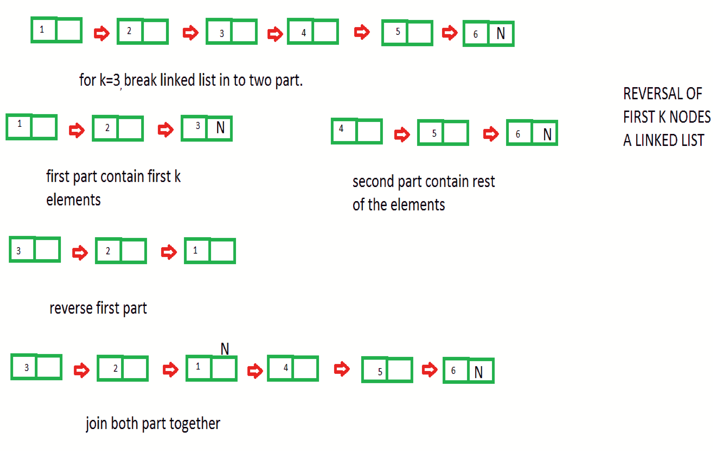

# 反转给定链表的前`K`个元素

> 原文：[https://www.geeksforgeeks.org/reverse-first-k-elements-given-linked-list/](https://www.geeksforgeeks.org/reverse-first-k-elements-given-linked-list/)

给定指向链表的头节点和数字`K`的指针，任务是反转链表的前`K`个节点。 我们需要通过更改节点之间的链接来反转列表。

也检查[链表的反向](https://www.geeksforgeeks.org/reverse-a-linked-list/)

**示例**：

```
Input : 1->2->3->4->5->6->7->8->9->10->NULL
        k = 3
Output :3->2->1->4->5->6->7->8->9->10->NULL

Input :10->18->20->25->35->NULL
       k = 2
Output :18->10->20->25->35->NULL

```

方法说明：

假设链表为`1 -> 2 -> 3 -> 4 -> 5 -> NULL`，并且`k = 3`

1.  遍历链表直到第`K`点。

2.  从第`k`个点将链表分成两部分。 分区后的链表看起来像`1 -> 2 -> 3 -> NULL`和`4 -> 5 -> NULL`

3.  [反转链表](https://www.geeksforgeeks.org/reverse-a-linked-list/)，保留第二部分，即保留为`3 -> 2 -> 1 -> NULL`和`4 -> 5 -> NULL`

4.  连接两个部分 链表，我们得到`3 -> 2 -> 1 -> 4 -> 5 -> NULL`

该算法如何工作的图形表示



## C++

```cpp

// C++ program for reversal of first k elements 
// of given linked list 
#include <bits/stdc++.h> 
using namespace std; 

/* Link list node */
struct Node { 
    int data; 
    struct Node* next; 
}; 

/* Function to reverse first k elements of linked list */
static void reverseKNodes(struct Node** head_ref, int k) 
{ 
    // traverse the linked list until break 
    // point not meet 
    struct Node* temp = *head_ref; 
    int count = 1; 
    while (count < k) { 
        temp = temp->next; 
        count++; 
    } 

    // backup the joint point 
    struct Node* joint_point = temp->next; 
    temp->next = NULL; // break the list 

    // reverse the list till break point 
    struct Node* prev = NULL; 
    struct Node* current = *head_ref; 
    struct Node* next; 
    while (current != NULL) { 
        next = current->next; 
        current->next = prev; 
        prev = current; 
        current = next; 
    } 

    // join both parts of the linked list 
    // traverse the list until NULL is not 
    // found 
    *head_ref = prev; 
    current = *head_ref; 
    while (current->next != NULL) 
        current = current->next; 

    // joint both part of the list 
    current->next = joint_point; 
} 

/* Function to push a node */
void push(struct Node** head_ref, int new_data) 
{ 
    struct Node* new_node = 
          (struct Node*)malloc(sizeof(struct Node)); 
    new_node->data = new_data; 
    new_node->next = (*head_ref); 
    (*head_ref) = new_node; 
} 

/* Function to print linked list */
void printList(struct Node* head) 
{ 
    struct Node* temp = head; 
    while (temp != NULL) { 
        printf("%d ", temp->data); 
        temp = temp->next; 
    } 
} 

/* Driver program to test above function*/
int main() 
{ 
    // Create a linked list 1->2->3->4->5 
    struct Node* head = NULL; 
    push(&head, 5); 
    push(&head, 4); 
    push(&head, 3); 
    push(&head, 2); 
    push(&head, 1); 

    // k should be less than the 
    // numbers of nodes 
    int k = 3; 

    cout << "\nGiven list\n"; 
    printList(head); 

    reverseKNodes(&head, k); 

    cout << "\nModified list\n"; 
    printList(head); 

    return 0; 
} 

```

## Java

```java

// Java program for reversal of first k elements  
// of given linked list  
class Sol 
{ 

// Link list node  
static class Node 
{  
    int data;  
    Node next;  
};  

// Function to reverse first k elements of linked list  
static Node reverseKNodes( Node head_ref, int k)  
{  
    // traverse the linked list until break  
    // point not meet  
    Node temp = head_ref;  
    int count = 1;  
    while (count < k) 
    {  
        temp = temp.next;  
        count++;  
    }  

    // backup the joint point  
    Node joint_point = temp.next;  
    temp.next = null; // break the list  

    // reverse the list till break point  
    Node prev = null;  
    Node current = head_ref;  
    Node next;  
    while (current != null) 
    {  
        next = current.next;  
        current.next = prev;  
        prev = current;  
        current = next;  
    }  

    // join both parts of the linked list  
    // traverse the list until null is not  
    // found  
    head_ref = prev;  
    current = head_ref;  
    while (current.next != null)  
        current = current.next;  

    // joint both part of the list  
    current.next = joint_point; 
    return head_ref; 
}  

// Function to push a node  
static Node push( Node head_ref, int new_data)  
{  
    Node new_node = new Node();  
    new_node.data = new_data;  
    new_node.next = (head_ref);  
    (head_ref) = new_node;  
    return head_ref; 
}  

// Function to print linked list  
static void printList( Node head)  
{  
    Node temp = head;  
    while (temp != null) 
    {  
        System.out.printf("%d ", temp.data);  
        temp = temp.next;  
    }  
}  

// Driver program to test above function 
public static void main(String args[]) 
{  
    // Create a linked list 1.2.3.4.5  
    Node head = null;  
    head = push(head, 5);  
    head = push(head, 4);  
    head = push(head, 3);  
    head = push(head, 2);  
    head = push(head, 1);  

    // k should be less than the  
    // numbers of nodes  
    int k = 3;  

    System.out.print("\nGiven list\n");  
    printList(head);  

    head = reverseKNodes(head, k);  

    System.out.print("\nModified list\n");  
    printList(head);  
} 
} 

// This code is contributed by Arnab Kundu 

```

## Python

```py

# Python program for reversal of first k elements  
# of given linked list  

# Node of a linked list  
class Node:  
    def __init__(self, next = None, data = None):  
        self.next = next
        self.data = data  

# Function to reverse first k elements of linked list  
def reverseKNodes(head_ref, k) : 

    # traverse the linked list until break  
    # point not meet  
    temp = head_ref  
    count = 1
    while (count < k): 

        temp = temp.next
        count = count + 1

    # backup the joint point  
    joint_point = temp.next
    temp.next = None # break the list  

    # reverse the list till break point  
    prev = None
    current = head_ref  
    next = None
    while (current != None): 

        next = current.next
        current.next = prev  
        prev = current  
        current = next

    # join both parts of the linked list  
    # traverse the list until None is not  
    # found  
    head_ref = prev  
    current = head_ref  
    while (current.next != None):  
        current = current.next

    # joint both part of the list  
    current.next = joint_point 
    return head_ref 

# Function to push a node  
def push(head_ref, new_data) : 

    new_node = Node()  
    new_node.data = new_data  
    new_node.next = (head_ref)  
    (head_ref) = new_node  
    return head_ref 

# Function to print linked list  
def printList( head) : 

    temp = head  
    while (temp != None): 

        print(temp.data, end = " ")  
        temp = temp.next

# Driver program to test above function 

# Create a linked list 1.2.3.4.5  
head = None
head = push(head, 5)  
head = push(head, 4)  
head = push(head, 3)  
head = push(head, 2)  
head = push(head, 1)  

# k should be less than the  
# numbers of nodes  
k = 3

print("\nGiven list")  
printList(head)  

head = reverseKNodes(head, k)  

print("\nModified list")  
printList(head)  

# This code is contributed by Arnab Kundu 

```

## C#

```cs

// C# program for reversal of first k elements  
// of given linked list  
using System; 

class GFG 
{ 

// Link list node  
public class Node 
{  
    public int data;  
    public Node next;  
};  

// Function to reverse first k elements of linked list  
static Node reverseKNodes(Node head_ref, int k)  
{  

    // traverse the linked list until break  
    // point not meet  
    Node temp = head_ref;  
    int count = 1;  
    while (count < k) 
    {  
        temp = temp.next;  
        count++;  
    }  

    // backup the joint point  
    Node joint_point = temp.next;  
    temp.next = null; // break the list  

    // reverse the list till break point  
    Node prev = null;  
    Node current = head_ref;  
    Node next;  
    while (current != null) 
    {  
        next = current.next;  
        current.next = prev;  
        prev = current;  
        current = next;  
    }  

    // join both parts of the linked list  
    // traverse the list until null is not  
    // found  
    head_ref = prev;  
    current = head_ref;  
    while (current.next != null)  
        current = current.next;  

    // joint both part of the list  
    current.next = joint_point; 
    return head_ref; 
}  

// Function to push a node  
static Node push( Node head_ref, int new_data)  
{  
    Node new_node = new Node();  
    new_node.data = new_data;  
    new_node.next = (head_ref);  
    (head_ref) = new_node;  
    return head_ref; 
}  

// Function to print linked list  
static void printList( Node head)  
{  
    Node temp = head;  
    while (temp != null) 
    {  
        Console.Write("{0} ", temp.data);  
        temp = temp.next;  
    }  
}  

// Driver Code 
public static void Main(String []args) 
{  
    // Create a linked list 1.2.3.4.5  
    Node head = null;  
    head = push(head, 5);  
    head = push(head, 4);  
    head = push(head, 3);  
    head = push(head, 2);  
    head = push(head, 1);  

    // k should be less than the  
    // numbers of nodes  
    int k = 3;  

    Console.Write("Given list\n");  
    printList(head);  

    head = reverseKNodes(head, k);  

    Console.Write("\nModified list\n");  
    printList(head);  
} 
} 

// This code is contributed by Princi Singh 

```

**输出**：

```
Given list
1 2 3 4 5 
Modified list
3 2 1 4 5 
```

**时间复杂度**：`O(n)`


* * *

* * *

如果您喜欢 GeeksforGeeks 并希望做出贡献，则还可以使用 [tribution.geeksforgeeks.org](https://contribute.geeksforgeeks.org/) 撰写文章，或将您的文章邮寄至 tribution@geeksforgeeks.org。 查看您的文章出现在 GeeksforGeeks 主页上，并帮助其他 Geeks。

如果您发现任何不正确的地方，请单击下面的“改进文章”按钮，以改进本文。