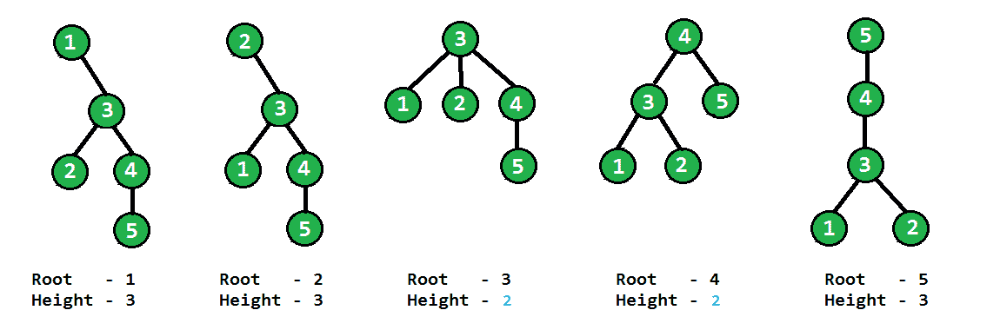

# 赋予最小高度的树的根

> 原文： [https://www.geeksforgeeks.org/roots-tree-gives-minimum-height/](https://www.geeksforgeeks.org/roots-tree-gives-minimum-height/)

给定无向图，它具有树特征。 可以选择任何节点作为根，任务是仅找到那些最小化树高的节点。

**示例**：
在下图中，所有节点都被一一设为根，我们可以看到当 3 和 4 为根时，树的高度为最小（2），因此{3，4}为 我们的答案。



我们可以通过首先考虑一维解决方案来解决此问题，即如果给出了最长的图，则如果总节点数为奇数，则将高度最小化的节点将为中间节点，如果总数为奇数，则将是两个中间节点 节点数是偶数。 可以通过以下方法实现此解决方案–从路径的两端开始两个指针，每次移动一个步骤，直到指针相遇或离开一步，最后，指针将位于那些将高度最小化的节点上，因为我们拥有 均匀划分节点，以使高度最小。
相同的方法也可以应用于一般树。 从所有叶节点开始指针，每次都向内移动一步，继续合并在移动时重叠的指针，最后在某个顶点上将只保留一个指针，或者在相距一距离处保留两个指针。 这些节点代表顶点的根，它将最小化树的高度。
因此，如上所述，根据树的结构，最小高度只能有一个根或最多两个根。 对于实现，我们将不使用实际的指针，而是遵循类似 BFS 的方法，首先将所有叶节点推入队列，然后将其从树中删除，将下一个新叶节点推入队列，此过程将 直到我们的树中只有 1 或 2 个节点，它们代表结果。

## C ++

```

//  C++ program to find root which gives minimum height to tree
#include <bits/stdc++.h>
using namespace std;

// This class represents a undirected graph using adjacency list
// representation
class Graph
{
public:
    int V; // No. of vertices

    // Pointer to an array containing adjacency lists
    list<int> *adj;

    // Vector which stores degree of all vertices
    vector<int> degree;

    Graph(int V);            // Constructor
    void addEdge(int v, int w);   // To add an edge

    // function to get roots which give minimum height
    vector<int> rootForMinimumHeight();
};

// Constructor of graph, initializes adjacency list and
// degree vector
Graph::Graph(int V)
{
    this->V = V;
    adj = new list<int>[V];
    for (int i = 0; i < V; i++)
        degree.push_back(0);
}

// addEdge method adds vertex to adjacency list and increases
// degree by 1
void Graph::addEdge(int v, int w)
{
    adj[v].push_back(w);    // Add w to v’s list
    adj[w].push_back(v);    // Add v to w’s list
    degree[v]++;            // increment degree of v by 1
    degree[w]++;            // increment degree of w by 1
}

//  Method to return roots which gives minimum height to tree
vector<int> Graph::rootForMinimumHeight()
{
    queue<int> q;

    //  first enqueue all leaf nodes in queue
    for (int i = 0; i < V; i++)
        if (degree[i] == 1)
            q.push(i);

    //  loop untill total vertex remains less than 2
    while (V > 2)
    {
        int popEle = q.size();
        V -= popEle;      // popEle number of vertices will be popped

        for (int i = 0; i < popEle; i++)
        {
            int t = q.front();
            q.pop();

            // for each neighbour, decrease its degree and
            // if it become leaf, insert into queue
            for (auto j = adj[t].begin(); j != adj[t].end(); j++)
            {
                degree[*j]--;
                if (degree[*j] == 1)
                    q.push(*j);
            }
        }
    }

    //  copying the result from queue to result vector
    vector<int> res;
    while (!q.empty())
    {
        res.push_back(q.front());
        q.pop();
    }
    return res;
}

//  Driver code
int main()
{
    Graph g(6);
    g.addEdge(0, 3);
    g.addEdge(1, 3);
    g.addEdge(2, 3);
    g.addEdge(4, 3);
    g.addEdge(5, 4);

      // Function Call
    vector<int> res = g.rootForMinimumHeight();
    for (int i = 0; i < res.size(); i++)
        cout << res[i] << " ";
    cout << endl;
}

```

## 蟒蛇

```

# Python program to find root which gives minimum
# height to tree

# This class represents a undirected graph using
# adjacency list representation

class Graph:

    # Constructor of graph, initialize adjacency list
    # and degree vector
    def __init__(self, V, addEdge, rootForMinimumHeight):
        self.V = V
        self.adj = dict((i, []) for i in range(V))
        self.degree = list()
        for i in range(V):
            self.degree.append(0)

        # The below lines allows us define methods outside
        # of class definition
        # Check http://bit.ly/2e5HfrW for better explanation
        Graph.addEdge = addEdge
        Graph.rootForMinimumHeight = rootForMinimumHeight

# addEdge method adds vertex to adjacency list and
# increases degree by 1
def addEdge(self, v, w):
    self.adj[v].append(w)  # Adds w to v's list
    self.adj[w].append(v)  # Adds v to w's list
    self.degree[v] += 1      # increment degree of v by 1
    self.degree[w] += 1      # increment degree of w by 1

# Method to return roots which gives minimum height to tree
def rootForMinimumHeight(self):

    from Queue import Queue
    q = Queue()

    # First enqueue all leaf nodes in queue
    for i in range(self.V):
        if self.degree[i] == 1:
            q.put(i)

    # loop until total vertex remains less than 2
    while(self.V > 2):
        p = q.qsize()
        self.V -= p
        for i in range(p):
            t = q.get()

            # for each neighbour, decrease its degree and
            # if it become leaf, insert into queue
            for j in self.adj[t]:
                self.degree[j] -= 1
                if self.degree[j] == 1:
                    q.put(j)

    #  Copying the result from queue to result vector
    res = list()
    while(q.qsize() > 0):
        res.append(q.get())

    return res

# Driver code
g = Graph(6, addEdge, rootForMinimumHeight)
g.addEdge(0, 3)
g.addEdge(1, 3)
g.addEdge(2, 3)
g.addEdge(4, 3)
g.addEdge(5, 4)

# Function call 
res = g.rootForMinimumHeight()
for i in res:
    print i,

# This code is contributed by Nikhil Kumar Singh(nickzuck_007)

```

**Output**

```
3 4 

```

当我们访问每个节点一次时，解决方案的总**时间复杂度**为 O（n）。

本文由 [**Utkarsh Trivedi**](https://in.linkedin.com/in/utkarsh-trivedi-253069a7) 提供。 如果您喜欢 GeeksforGeeks 并希望做出贡献，则还可以使用 [tribution.geeksforgeeks.org](http://www.contribute.geeksforgeeks.org) 撰写文章，或将您的文章邮寄至 tribution@geeksforgeeks.org。 查看您的文章出现在 GeeksforGeeks 主页上，并帮助其他 Geeks。
如果发现任何不正确的内容，或者想分享有关上述主题的更多信息，请发表评论。

