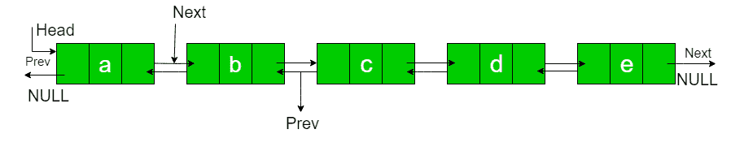
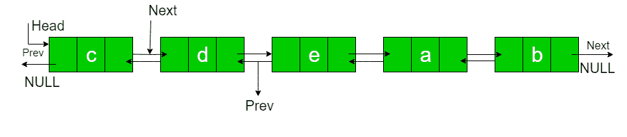

# 旋转 N 个节点的双链表

> 原文：[https://www.geeksforgeeks.org/rotate-doubly-linked-list-n-nodes/](https://www.geeksforgeeks.org/rotate-doubly-linked-list-n-nodes/)

给定一个双向链表，将链表逆时针旋转 N 个节点。 N 是给定的正整数，小于链表中节点的数量。



N = 2

轮播名单：



**示例**：

```
Input : a  b  c  d  e  N = 2
Output : c  d  e  a  b 

Input : a  b  c  d  e  f  g  h  N = 4
Output : e  f  g  h  a  b  c  d 

```

**在** [亚马逊](https://www.geeksforgeeks.org/amazon-interview-experience-set-424-sde-2/)

中问

要旋转双链表，我们需要将第 N 个节点的下一个更改为 NULL，将最后一个节点的下一个更改为上一个头节点，将头节点的上一个更改为最后一个节点，最后将头更改为第（N + 1）个节点，然后将上一个更改为 将新的头节点设置为 NULL（双向链表中的头节点的上一个为 NULL）

因此，我们需要掌握三个节点：第 N 个节点，第（N + 1）个节点和最后一个节点。 从头开始遍历列表，并在第 N 个节点处停止。 存储指向第 N 个节点的指针。 我们可以使用 NthNode-> next 获得第（N + 1）个节点。 继续遍历直到结束，并将指针也存储到最后一个节点。 最后，使用

PrintList 功能更改上述指针，并更改“ Last Print Rotated List”的指针。

## C++

```cpp

// C++ program to rotate a Doubly linked  
// list counter clock wise by N times 
#include <bits/stdc++.h> 
using namespace std; 

/* Link list node */
struct Node { 
    char data; 
    struct Node* prev; 
    struct Node* next; 
}; 

// This function rotates a doubly linked 
// list counter-clockwise and updates the  
// head. The function assumes that N is 
// smallerthan size of linked list. It  
// doesn't modify the list if N is greater  
// than or equal to size 
void rotate(struct Node** head_ref, int N) 
{ 
    if (N == 0) 
        return; 

    // Let us understand the below code  
    // for example N = 2 and 
    // list = a <-> b <-> c <-> d <-> e. 
    struct Node* current = *head_ref; 

    // current will either point to Nth 
    // or NULL after this loop. Current  
    // will point to node 'b' in the  
    // above example 
    int count = 1; 
    while (count < N && current != NULL) { 
        current = current->next; 
        count++; 
    } 

    // If current is NULL, N is greater 
    // than or equal to count of nodes 
    // in linked list. Don't change the  
    // list in this case 
    if (current == NULL) 
        return; 

    // current points to Nth node. Store  
    // it in a variable. NthNode points to 
    // node 'b' in the above example 
    struct Node* NthNode = current; 

    // current will point to last node 
    // after this loop current will point  
    // to node 'e' in the above example 
    while (current->next != NULL) 
        current = current->next; 

    // Change next of last node to previous 
    // head. Next of 'e' is now changed to 
    // node 'a' 
    current->next = *head_ref; 

    // Change prev of Head node to current 
    // Prev of 'a' is now changed to node 'e' 
    (*head_ref)->prev = current; 

    // Change head to (N+1)th node 
    // head is now changed to node 'c' 
    *head_ref = NthNode->next; 

    // Change prev of New Head node to NULL 
    // Because Prev of Head Node in Doubly  
    // linked list is NULL 
    (*head_ref)->prev = NULL; 

    // change next of Nth node to NULL 
    // next of 'b' is now NULL 
    NthNode->next = NULL; 
} 

// Function to insert a node at the 
// beginning of the Doubly Linked List 
 void push(struct Node** head_ref, int new_data) 
{ 
    struct Node* new_node =  new Node; 
    new_node->data = new_data; 
    new_node->prev = NULL; 
    new_node->next = (*head_ref); 
    if ((*head_ref) != NULL) 
        (*head_ref)->prev = new_node; 
   *head_ref = new_node; 
} 

/* Function to print linked list */
void printList(struct Node* node) 
{ 
    while (node->next != NULL) { 
        cout << node->data << " "
             << "<=>"
             << " "; 
        node = node->next; 
    } 
    cout << node->data; 
} 

// Driver's Code 
int main(void) 
{ 
    /* Start with the empty list */
    struct Node* head = NULL; 

    /* Let us create the doubly  
      linked list a<->b<->c<->d<->e */
    push(&head, 'e'); 
    push(&head, 'd'); 
    push(&head, 'c'); 
    push(&head, 'b'); 
    push(&head, 'a'); 

    int N = 2; 

    cout << "Given linked list \n"; 
    printList(head); 
    rotate(&head, N); 

    cout << "\nRotated Linked list \n"; 
    printList(head); 

    return 0; 
} 

```

## Java

```java

// Java program to rotate a Doubly linked  
// list counter clock wise by N times  
class GfG {  

/* Link list node */
static class Node 
{  
    char data;  
    Node prev;  
    Node next;  
} 
static Node head = null; 

// This function rotates a doubly linked  
// list counter-clockwise and updates the  
// head. The function assumes that N is  
// smallerthan size of linked list. It  
// doesn't modify the list if N is greater  
// than or equal to size  
static void rotate( int N)  
{  
    if (N == 0)  
        return;  

    // Let us understand the below code  
    // for example N = 2 and  
    // list = a <-> b <-> c <-> d <-> e.  
    Node current = head;  

    // current will either point to Nth  
    // or NULL after this loop. Current  
    // will point to node 'b' in the  
    // above example  
    int count = 1;  
    while (count < N && current != null) 
    {  
        current = current.next;  
        count++;  
    }  

    // If current is NULL, N is greater  
    // than or equal to count of nodes  
    // in linked list. Don't change the  
    // list in this case  
    if (current == null)  
        return;  

    // current points to Nth node. Store  
    // it in a variable. NthNode points to  
    // node 'b' in the above example  
    Node NthNode = current;  

    // current will point to last node  
    // after this loop current will point  
    // to node 'e' in the above example  
    while (current.next != null)  
        current = current.next;  

    // Change next of last node to previous  
    // head. Next of 'e' is now changed to  
    // node 'a'  
    current.next = head;  

    // Change prev of Head node to current  
    // Prev of 'a' is now changed to node 'e'  
    (head).prev = current;  

    // Change head to (N+1)th node  
    // head is now changed to node 'c'  
    head = NthNode.next;  

    // Change prev of New Head node to NULL  
    // Because Prev of Head Node in Doubly  
    // linked list is NULL  
    (head).prev = null;  

    // change next of Nth node to NULL  
    // next of 'b' is now NULL  
    NthNode.next = null;  
}  

// Function to insert a node at the  
// beginning of the Doubly Linked List  
static void push(char new_data)  
{  
    Node new_node = new Node();  
    new_node.data = new_data;  
    new_node.prev = null;  
    new_node.next = (head);  
    if ((head) != null)  
        (head).prev = new_node;  
head = new_node;  
}  

/* Function to print linked list */
static void printList(Node node)  
{  
    while (node != null && node.next != null) 
    {  
        System.out.print(node.data + " ");  
        node = node.next;  
    }  
    if(node != null) 
    System.out.print(node.data);  
}  

// Driver's Code  
public static void main(String[] args)  
{  
    /* Start with the empty list */
    // Node head = null;  

    /* Let us create the doubly  
    linked list a<->b<->c<->d<->e */
    push( 'e');  
    push( 'd');  
    push('c');  
    push('b');  
    push( 'a');  

    int N = 2;  

    System.out.println("Given linked list ");  
    printList(head);  
    rotate( N);  
    System.out.println(); 
    System.out.println("Rotated Linked list ");  
    printList(head);  
}  
}  

// This code is contributed by Prerna Saini 

```

## Python3

```py

# Node of a doubly linked list  
class Node:  
    def __init__(self, next = None,  
                       prev = None, data = None):  
        self.next = next # reference to next node in DLL  
        self.prev = prev # reference to previous node in DLL  
        self.data = data  

def push(head, new_data):  

    new_node = Node(data = new_data)  

    new_node.next = head  
    new_node.prev = None

    if head is not None:  
        head.prev = new_node  

    head = new_node 
    return head 

def printList(head): 

    node = head 

    print("Given linked list") 
    while(node is not None):  
        print(node.data, end = " "),  
        last = node  
        node = node.next

def rotate(start, N): 
    if N == 0 : 
        return

    # Let us understand the below code  
    # for example N = 2 and  
    # list = a <-> b <-> c <-> d <-> e.  
    current = start  

    # current will either point to Nth  
    # or None after this loop. Current  
    # will point to node 'b' in the  
    # above example  
    count = 1
    while count < N and current != None : 
        current = current.next
        count += 1

    # If current is None, N is greater  
    # than or equal to count of nodes  
    # in linked list. Don't change the  
    # list in this case  
    if current == None : 
        return

    # current points to Nth node. Store  
    # it in a variable. NthNode points to  
    # node 'b' in the above example  
    NthNode = current  

    # current will point to last node  
    # after this loop current will point  
    # to node 'e' in the above example  
    while current.next != None : 
        current = current.next

    # Change next of last node to previous  
    # head. Next of 'e' is now changed to  
    # node 'a'  
    current.next = start  

    # Change prev of Head node to current  
    # Prev of 'a' is now changed to node 'e'  
    start.prev = current  

    # Change head to (N+1)th node  
    # head is now changed to node 'c'  
    start = NthNode.next

    # Change prev of New Head node to None  
    # Because Prev of Head Node in Doubly  
    # linked list is None  
    start.prev = None

    # change next of Nth node to None  
    # next of 'b' is now None  
    NthNode.next = None

    return start 

# Driver Code 
if __name__ == "__main__": 
    head = None

    head = push(head, 'e') 
    head = push(head, 'd') 
    head = push(head, 'c') 
    head = push(head, 'b') 
    head = push(head, 'a') 

    printList(head) 
    print("\n") 

    N = 2
    head = rotate(head, N) 

    printList(head) 

# This code is contributed by vinayak sharma 

```

## C#

```cs

// C# program to rotate a Doubly linked  
// list counter clock wise by N times  
using System; 

class GfG  
{  

/* Link list node */
public class Node  
{  
    public char data;  
    public Node prev;  
    public Node next;  
}  
static Node head = null;  

// This function rotates a doubly linked  
// list counter-clockwise and updates the  
// head. The function assumes that N is  
// smallerthan size of linked list. It  
// doesn't modify the list if N is greater  
// than or equal to size  
static void rotate( int N)  
{  
    if (N == 0)  
        return;  

    // Let us understand the below code  
    // for example N = 2 and  
    // list = a <-> b <-> c <-> d <-> e.  
    Node current = head;  

    // current will either point to Nth  
    // or NULL after this loop. Current  
    // will point to node 'b' in the  
    // above example  
    int count = 1;  
    while (count < N && current != null)  
    {  
        current = current.next;  
        count++;  
    }  

    // If current is NULL, N is greater  
    // than or equal to count of nodes  
    // in linked list. Don't change the  
    // list in this case  
    if (current == null)  
        return;  

    // current points to Nth node. Store  
    // it in a variable. NthNode points to  
    // node 'b' in the above example  
    Node NthNode = current;  

    // current will point to last node  
    // after this loop current will point  
    // to node 'e' in the above example  
    while (current.next != null)  
        current = current.next;  

    // Change next of last node to previous  
    // head. Next of 'e' is now changed to  
    // node 'a'  
    current.next = head;  

    // Change prev of Head node to current  
    // Prev of 'a' is now changed to node 'e'  
    (head).prev = current;  

    // Change head to (N+1)th node  
    // head is now changed to node 'c'  
    head = NthNode.next;  

    // Change prev of New Head node to NULL  
    // Because Prev of Head Node in Doubly  
    // linked list is NULL  
    (head).prev = null;  

    // change next of Nth node to NULL  
    // next of 'b' is now NULL  
    NthNode.next = null;  
}  

// Function to insert a node at the  
// beginning of the Doubly Linked List  
static void push(char new_data)  
{  
    Node new_node = new Node();  
    new_node.data = new_data;  
    new_node.prev = null;  
    new_node.next = (head);  
    if ((head) != null)  
        (head).prev = new_node;  
    head = new_node;  
}  

/* Function to print linked list */
static void printList(Node node)  
{  
    while (node != null && node.next != null)  
    {  
        Console.Write(node.data + " ");  
        node = node.next;  
    }  
    if(node != null)  
    Console.Write(node.data);  
}  

// Driver Code  
public static void Main(String []args)  
{  
    /* Start with the empty list */
    // Node head = null;  

    /* Let us create the doubly  
    linked list a<->b<->c<->d<->e */
    push( 'e');  
    push( 'd');  
    push( 'c');  
    push( 'b');  
    push( 'a');  

    int N = 2;  

    Console.WriteLine("Given linked list ");  
    printList(head);  
    rotate( N);  
    Console.WriteLine();  
    Console.WriteLine("Rotated Linked list ");  
    printList(head);  
}  
}  

// This code is contributed by Arnab Kundu 

```

**Output:**

```
Given linked list 
a  b  c  d  e
Rotated Linked list 
c  d  e  a  b

```


* * *

* * *

如果您喜欢 GeeksforGeeks 并希望做出贡献，则还可以使用 [tribution.geeksforgeeks.org](https://contribute.geeksforgeeks.org/) 撰写文章，或将您的文章邮寄至 tribution@geeksforgeeks.org。 查看您的文章出现在 GeeksforGeeks 主页上，并帮助其他 Geeks。

如果您发现任何不正确的地方，请单击下面的“改进文章”按钮，以改进本文。