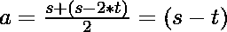

# 设置分区是 NP 完整

> 原文： [https://www.geeksforgeeks.org/set-partition-is-np-complete/](https://www.geeksforgeeks.org/set-partition-is-np-complete/)

**<u>设置分区问题</u>：**设置分区问题将数字数组划分为两个子集，以使这两个子集的总和相同。 假设 **S** 是一组数字，A 是总和为 **S1** 的数字子集，那么存在另一个包含子元素**（S – A）**的总和为 **S2** ，而 **S1 等于 S2** 。

**<u>问题陈述</u>：**给定 **N** 个数字的一​​组 **S** ，任务是确定该组是否包含**的两个分区 S** ，它们的总和完全相同。

**<u>解释</u>：**
问题的一个实例是为此问题指定的输入。 集分区问题的一个实例是集 **S** ，任务是检查是否存在元素总和为**的 **S** 的两个不重叠分区。 总和**。 由于 NP-Complete 问题是 **NP** 和 **NP-hard** 都存在的问题，因此证明问题为 NP-Complete 的陈述的证据包括两部分：

> 1.  问题本身在 NP 类中。
> 2.  NP 类中的所有其他问题都可以用多项式时间简化。 （B 是可简化为 C 的多项式时间，表示为 B≤P C ）

如果仅满足**第二条件**，则该问题称为 **NP-Hard** 。

但是不可能将每个 NP 问题都简化为另一个 NP 问题以始终显示其 NP 完整性。 因此，要证明问题是 NP-Complete，然后证明问题出在 NP 中，并且可以将任何 NP-Complete 问题还原为该问题，即，如果 B 是 NP-Complete 且 B≤P C NP，则 C 为 NP-Complete。 因此，可以得出结论，使用以下两个命题，**集分区问题**是 NP-Complete：

**设置分区问题在 NP 中：**
如果 NP 中存在任何问题，则给定“证书”，它是问题的解决方案和问题实例（集合 **S** 和两个分区 **A** 和 **A'**（在这种情况下），可以证明多项式时间内的证书。 这可以通过以下方式完成：

1.  对于 **A** 中的每个元素 **x** 和 **A'**中的 **x'**，请验证所有属于 **S** 的元素 ] 被覆盖的。
2.  令 **S1** 为 0， **S2** 为 0
3.  对于 **A** 中的每个元素 **x** ，将该值添加到 **S1** 中。
4.  对于 **A’**中的每个元素 **x’**，将该值添加到 **S2** 中。
5.  验证 **S1** 与 **S2** 相同。

该算法将线性时间花费在数字集的大小上。

**集分配问题为 NP-Hard：**
为了证明独立集问题为 NP-Hard，请将已知的 NP-Hard 问题简化为该问题。 进行简化，从中可以将[子集和问题](https://www.geeksforgeeks.org/dynamic-programming-subset-sum-problem/)简化为[集合分区问题](https://www.geeksforgeeks.org/partition-problem-dp-18/)。 子集问题以一组数字 **S** 和目标总和 **t** 的形式提供输入，该问题旨在找到属于 **S 的子集 **T**** 的总和与 **t** 相同。 设 **S** 的成员总数。 现在，将 **S’= S∪{s-2t}** 输入到 Set Partition 问题中。

现在证明计算集合分区的问题确实可以归结为子集和的计算。 减少可以通过以下两个命题证明：

现在，让我们考虑一组数字 **T** ，其总和等于 **t** （子集总和），然后 **S** 中的其余元素（假设 **O** ）的总和为 **o = s – t** 。 让我们假设原始集合等于 **T’= T∪（s – 2t）**，其总和等于 **t’**。
现在，以下观察成立：

> o = s – t
> o – t = s – 2t，O 和 T 之和之和。
> t'= t +（s – 2t）
> = = s – t
> = o， T'和 O 的总和相等。

因此，可以将原始集合划分为两个总和**（s – t）**的子集。 因此，满足了设置分区的问题。
现在假设存在 **S'** = **S∪{s-2t}** 的等和分割**（A，A’）**。 每个分区的总和由下式给出：

> 

认为包含元素 **{s – 2t}** 的分区为 **A’**。 令 **A = A’- {s – 2t}** 。 **A** 中元素的总和为：

> A = s – t – {s – 2t}
> = t

同样， **S’– S = {s – 2t}** 。 因此 **A** 是 **S** 的子集，总和等于 **t** 。

因此，满足子集和问题。

* * *

* * *

如果您喜欢 GeeksforGeeks 并希望做出贡献，则还可以使用 [tribution.geeksforgeeks.org](https://contribute.geeksforgeeks.org/) 撰写文章，或将您的文章邮寄至 tribution@geeksforgeeks.org。 查看您的文章出现在 GeeksforGeeks 主页上，并帮助其他 Geeks。

如果您发现任何不正确的地方，请单击下面的“改进文章”按钮，以改进本文。