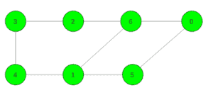
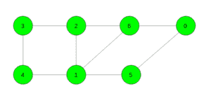

# 无向非加权图中的最短周期

> 原文： [https://www.geeksforgeeks.org/shortest-cycle-in-an-undirected-unweighted-graph/](https://www.geeksforgeeks.org/shortest-cycle-in-an-undirected-unweighted-graph/)

给定无向无权图。 任务是在给定图中找到最短周期的长度。 如果不存在循环，则打印-1。

**示例：**

> **输入：** 
> **输出：** 4
> 周期 6-> 1-> 5-> 0-> 6
> 
> **输入：** 
> **输出：** 3
> 周期 6-> 1-> 2-> 6

**先决条件：** [Dijikstra](https://www.geeksforgeeks.org/dijkstras-shortest-path-algorithm-greedy-algo-7/)

**方法：**对于每个顶点，我们检查是否有可能获得涉及该顶点的最短周期。 首先，对于每个顶点，将当前顶点推入队列，然后与之相邻，如果已经访问过的顶点再次出现，则存在该循环。

对每个顶点应用上述过程，并获得最短周期的长度。

下面是上述方法的实现：

## C ++

```

// C++ implementation of the approach 
#include <bits/stdc++.h> 
using namespace std; 
#define N 100200 

vector<int> gr[N]; 

// Function to add edge 
void Add_edge(int x, int y) 
{ 
    gr[x].push_back(y); 
    gr[y].push_back(x); 
} 

// Function to find the length of 
// the shortest cycle in the graph 
int shortest_cycle(int n) 
{ 
    // To store length of the shortest cycle 
    int ans = INT_MAX; 

    // For all vertices 
    for (int i = 0; i < n; i++) { 

        // Make distance maximum 
        vector<int> dist(n, (int)(1e9)); 

        // Take a imaginary parent 
        vector<int> par(n, -1); 

        // Distance of source to source is 0 
        dist[i] = 0; 
        queue<int> q; 

        // Push the source element 
        q.push(i); 

        // Continue until queue is not empty 
        while (!q.empty()) { 

            // Take the first element 
            int x = q.front(); 
            q.pop(); 

            // Traverse for all it's childs 
            for (int child : gr[x]) { 

                // If it is not visited yet 
                if (dist[child] == (int)(1e9)) { 

                    // Increase distance by 1 
                    dist[child] = 1 + dist[x]; 

                    // Change parent 
                    par[child] = x; 

                    // Push into the queue 
                    q.push(child); 
                } 

                // If it is already visited 
                else if (par[x] != child and par[child] != x) 
                    ans = min(ans, dist[x] + dist[child] + 1); 
            } 
        } 
    } 

    // If graph contains no cycle 
    if (ans == INT_MAX) 
        return -1; 

    // If graph contains cycle 
    else
        return ans; 
} 

// Driver code 
int main() 
{ 
    // Number of vertices 
    int n = 7; 

    // Add edges 
    Add_edge(0, 6); 
    Add_edge(0, 5); 
    Add_edge(5, 1); 
    Add_edge(1, 6); 
    Add_edge(2, 6); 
    Add_edge(2, 3); 
    Add_edge(3, 4); 
    Add_edge(4, 1); 

    // Function call 
    cout << shortest_cycle(n); 

    return 0; 
} 

```