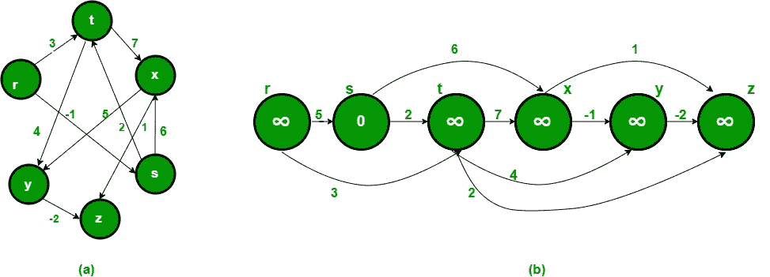
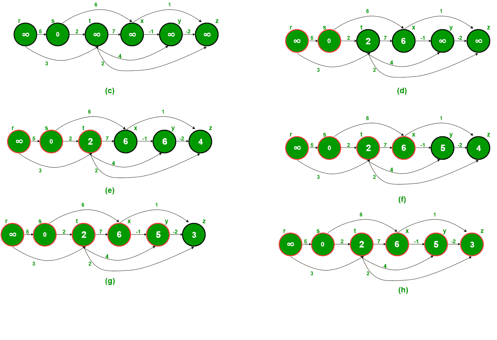

# 有向无环图

中的最短路径

> 原文： [https://www.geeksforgeeks.org/shortest-path-for-directed-acyclic-graphs/](https://www.geeksforgeeks.org/shortest-path-for-directed-acyclic-graphs/)

给定加权有向无环图和图中的源顶点，找到从给定源到所有其他顶点的最短路径。

对于一般的加权图，我们可以使用 [Bellman-Ford 算法](https://www.geeksforgeeks.org/dynamic-programming-set-23-bellman-ford-algorithm/)以 O（VE）时间计算单源最短距离。 对于没有负权重的图，我们可以做得更好，并使用 [Dijkstra 算法](https://www.geeksforgeeks.org/greedy-algorithms-set-7-dijkstras-algorithm-for-adjacency-list-representation/)在 O（E + VLogV）时间内计算单个源的最短距离。 有向无环图（DAG）我们还能做得更好吗？ 我们可以计算 DAG 的单源最短距离（O（V + E）时间）。 这个想法是使用[拓扑排序](https://www.geeksforgeeks.org/topological-sorting/)。

我们将到所有顶点的距离初始化为无穷大，到源的距离初始化为 0，然后找到图的拓扑排序。 [图的拓扑排序](https://www.geeksforgeeks.org/topological-sorting/)表示图的线性排序（请参见下面的图（b）是图（a）的线性表示）。 一旦我们有了拓扑顺序（或线性表示），我们便按拓扑顺序逐一处理所有顶点。 对于每个要处理的顶点，我们使用当前顶点的距离来更新其相邻的距离。

下图取自此来源[。 它逐步显示了寻找最短路径的过程。
](http://www.utdallas.edu/~sizheng/CS4349.d/l-notes.d/L17.pdf)[](https://media.geeksforgeeks.org/wp-content/uploads/shortestpathstart.jpg) 
[](https://media.geeksforgeeks.org/wp-content/uploads/shortestpathsteps.png)

以下是找到最短距离的完整算法。
**1）**初始化 dist [] = {INF，INF，…。}，并且 dist [s] = 0，其中 s 是源顶点。
**2）**创建所有顶点的拓扑顺序。
**3）**按照拓扑顺序对每个顶点 u 进行跟踪。
…...对 u 的每个相邻顶点 v 执行以下操作
………………if（dist [v] > dist [u] + weight（u，v））
…………………………dist [v] = dist [u] +权重（u，v）

## C ++

```

// C++ program to find single source shortest paths for Directed Acyclic Graphs 
#include<iostream> 
#include <bits/stdc++.h> 
#define INF INT_MAX 
using namespace std; 

// Graph is represented using adjacency list. Every node of adjacency list  
// contains vertex number of the vertex to which edge connects. It also  
// contains weight of the edge 
class AdjListNode 
{ 
    int v; 
    int weight; 
public: 
    AdjListNode(int _v, int _w)  { v = _v;  weight = _w;} 
    int getV()       {  return v;  } 
    int getWeight()  {  return weight; } 
}; 

// Class to represent a graph using adjacency list representation 
class Graph 
{ 
    int V;    // No. of vertices' 

    // Pointer to an array containing adjacency lists 
    list<AdjListNode> *adj; 

    // A function used by shortestPath 
    void topologicalSortUtil(int v, bool visited[], stack<int> &Stack); 
public: 
    Graph(int V);   // Constructor 

    // function to add an edge to graph 
    void addEdge(int u, int v, int weight); 

    // Finds shortest paths from given source vertex 
    void shortestPath(int s); 
}; 

Graph::Graph(int V) 
{ 
    this->V = V; 
    adj = new list<AdjListNode>[V]; 
} 

void Graph::addEdge(int u, int v, int weight) 
{ 
    AdjListNode node(v, weight); 
    adj[u].push_back(node); // Add v to u's list 
} 

// A recursive function used by shortestPath. See below link for details 
// https://www.geeksforgeeks.org/topological-sorting/ 
void Graph::topologicalSortUtil(int v, bool visited[], stack<int> &Stack) 
{ 
    // Mark the current node as visited 
    visited[v] = true; 

    // Recur for all the vertices adjacent to this vertex 
    list<AdjListNode>::iterator i; 
    for (i = adj[v].begin(); i != adj[v].end(); ++i) 
    { 
        AdjListNode node = *i; 
        if (!visited[node.getV()]) 
            topologicalSortUtil(node.getV(), visited, Stack); 
    } 

    // Push current vertex to stack which stores topological sort 
    Stack.push(v); 
} 

// The function to find shortest paths from given vertex. It uses recursive  
// topologicalSortUtil() to get topological sorting of given graph. 
void Graph::shortestPath(int s) 
{ 
    stack<int> Stack; 
    int dist[V]; 

    // Mark all the vertices as not visited 
    bool *visited = new bool[V]; 
    for (int i = 0; i < V; i++) 
        visited[i] = false; 

    // Call the recursive helper function to store Topological Sort 
    // starting from all vertices one by one 
    for (int i = 0; i < V; i++) 
        if (visited[i] == false) 
            topologicalSortUtil(i, visited, Stack); 

    // Initialize distances to all vertices as infinite and distance 
    // to source as 0 
    for (int i = 0; i < V; i++) 
        dist[i] = INF; 
    dist[s] = 0; 

    // Process vertices in topological order 
    while (Stack.empty() == false) 
    { 
        // Get the next vertex from topological order 
        int u = Stack.top(); 
        Stack.pop(); 

        // Update distances of all adjacent vertices 
        list<AdjListNode>::iterator i; 
        if (dist[u] != INF) 
        { 
          for (i = adj[u].begin(); i != adj[u].end(); ++i) 
             if (dist[i->getV()] > dist[u] + i->getWeight()) 
                dist[i->getV()] = dist[u] + i->getWeight(); 
        } 
    } 

    // Print the calculated shortest distances 
    for (int i = 0; i < V; i++) 
        (dist[i] == INF)? cout << "INF ": cout << dist[i] << " "; 
} 

// Driver program to test above functions 
int main() 
{ 
    // Create a graph given in the above diagram.  Here vertex numbers are 
    // 0, 1, 2, 3, 4, 5 with following mappings: 
    // 0=r, 1=s, 2=t, 3=x, 4=y, 5=z 
    Graph g(6); 
    g.addEdge(0, 1, 5); 
    g.addEdge(0, 2, 3); 
    g.addEdge(1, 3, 6); 
    g.addEdge(1, 2, 2); 
    g.addEdge(2, 4, 4); 
    g.addEdge(2, 5, 2); 
    g.addEdge(2, 3, 7); 
    g.addEdge(3, 4, -1); 
    g.addEdge(4, 5, -2); 

    int s = 1; 
    cout << "Following are shortest distances from source " << s <<" n"; 
    g.shortestPath(s); 

    return 0; 
} 

```

## 爪哇

```

// Java program to find single source shortest paths in Directed Acyclic Graphs 
import java.io.*; 
import java.util.*; 

class ShortestPath 
{ 
    static final int INF=Integer.MAX_VALUE; 
    class AdjListNode 
    { 
        private int v; 
        private int weight; 
        AdjListNode(int _v, int _w) { v = _v;  weight = _w; } 
        int getV() { return v; } 
        int getWeight()  { return weight; } 
    } 

    // Class to represent graph as an adjcency list of 
    // nodes of type AdjListNode 
    class Graph 
    { 
        private int V; 
        private LinkedList<AdjListNode>adj[]; 
        Graph(int v) 
        { 
            V=v; 
            adj = new LinkedList[V]; 
            for (int i=0; i<v; ++i) 
                adj[i] = new LinkedList<AdjListNode>(); 
        } 
        void addEdge(int u, int v, int weight) 
        { 
            AdjListNode node = new AdjListNode(v,weight); 
            adj[u].add(node);// Add v to u's list 
        } 

        // A recursive function used by shortestPath. 
        // See below link for details 
        void topologicalSortUtil(int v, Boolean visited[], Stack stack) 
        { 
            // Mark the current node as visited. 
            visited[v] = true; 
            Integer i; 

            // Recur for all the vertices adjacent to this vertex 
            Iterator<AdjListNode> it = adj[v].iterator(); 
            while (it.hasNext()) 
            { 
                AdjListNode node =it.next(); 
                if (!visited[node.getV()]) 
                    topologicalSortUtil(node.getV(), visited, stack); 
            } 
            // Push current vertex to stack which stores result 
            stack.push(new Integer(v)); 
        } 

        // The function to find shortest paths from given vertex. It 
        // uses recursive topologicalSortUtil() to get topological 
        // sorting of given graph. 
        void shortestPath(int s) 
        { 
            Stack stack = new Stack(); 
            int dist[] = new int[V]; 

            // Mark all the vertices as not visited 
            Boolean visited[] = new Boolean[V]; 
            for (int i = 0; i < V; i++) 
                visited[i] = false; 

            // Call the recursive helper function to store Topological 
            // Sort starting from all vertices one by one 
            for (int i = 0; i < V; i++) 
                if (visited[i] == false) 
                    topologicalSortUtil(i, visited, stack); 

            // Initialize distances to all vertices as infinite and 
            // distance to source as 0 
            for (int i = 0; i < V; i++) 
                dist[i] = INF; 
            dist[s] = 0; 

            // Process vertices in topological order 
            while (stack.empty() == false) 
            { 
                // Get the next vertex from topological order 
                int u = (int)stack.pop(); 

                // Update distances of all adjacent vertices 
                Iterator<AdjListNode> it; 
                if (dist[u] != INF) 
                { 
                    it = adj[u].iterator(); 
                    while (it.hasNext()) 
                    { 
                        AdjListNode i= it.next(); 
                        if (dist[i.getV()] > dist[u] + i.getWeight()) 
                            dist[i.getV()] = dist[u] + i.getWeight(); 
                    } 
                } 
            } 

            // Print the calculated shortest distances 
            for (int i = 0; i < V; i++) 
            { 
                if (dist[i] == INF) 
                    System.out.print( "INF "); 
                else
                    System.out.print( dist[i] + " "); 
            } 
        } 
    } 

    // Method to create a new graph instance through an object 
    // of ShortestPath class. 
    Graph newGraph(int number) 
    { 
        return new Graph(number); 
    } 

    public static void main(String args[]) 
    { 
        // Create a graph given in the above diagram.  Here vertex 
        // numbers are 0, 1, 2, 3, 4, 5 with following mappings: 
        // 0=r, 1=s, 2=t, 3=x, 4=y, 5=z 
        ShortestPath t = new ShortestPath(); 
        Graph g = t.newGraph(6); 
        g.addEdge(0, 1, 5); 
        g.addEdge(0, 2, 3); 
        g.addEdge(1, 3, 6); 
        g.addEdge(1, 2, 2); 
        g.addEdge(2, 4, 4); 
        g.addEdge(2, 5, 2); 
        g.addEdge(2, 3, 7); 
        g.addEdge(3, 4, -1); 
        g.addEdge(4, 5, -2); 

        int s = 1; 
        System.out.println("Following are shortest distances "+ 
                            "from source " + s ); 
        g.shortestPath(s); 
    } 
} 
//This code is contributed by Aakash Hasija 

```

## 蟒蛇

```

# Python program to find single source shortest paths 
# for Directed Acyclic Graphs Complexity :OV(V+E) 
from collections import defaultdict 

# Graph is represented using adjacency list. Every 
# node of adjacency list contains vertex number of 
# the vertex to which edge connects. It also contains 
# weight of the edge 
class Graph: 
    def __init__(self,vertices): 

        self.V = vertices # No. of vertices 

        # dictionary containing adjacency List 
        self.graph = defaultdict(list) 

    # function to add an edge to graph 
    def addEdge(self,u,v,w): 
        self.graph[u].append((v,w)) 

    # A recursive function used by shortestPath 
    def topologicalSortUtil(self,v,visited,stack): 

        # Mark the current node as visited. 
        visited[v] = True

        # Recur for all the vertices adjacent to this vertex 
        if v in self.graph.keys(): 
            for node,weight in self.graph[v]: 
                if visited[node] == False: 
                    self.topologicalSortUtil(node,visited,stack) 

        # Push current vertex to stack which stores topological sort 
        stack.append(v) 

    ''' The function to find shortest paths from given vertex. 
        It uses recursive topologicalSortUtil() to get topological 
        sorting of given graph.'''
    def shortestPath(self, s): 

        # Mark all the vertices as not visited 
        visited = [False]*self.V 
        stack =[] 

        # Call the recursive helper function to store Topological 
        # Sort starting from source vertice 
        for i in range(self.V): 
            if visited[i] == False: 
                self.topologicalSortUtil(s,visited,stack) 

        # Initialize distances to all vertices as infinite and 
        # distance to source as 0 
        dist = [float("Inf")] * (self.V) 
        dist[s] = 0

        # Process vertices in topological order 
        while stack: 

            # Get the next vertex from topological order 
            i = stack.pop() 

            # Update distances of all adjacent vertices 
            for node,weight in self.graph[i]: 
                if dist[node] > dist[i] + weight: 
                    dist[node] = dist[i] + weight 

        # Print the calculated shortest distances 
        for i in range(self.V): 
            print ("%d" %dist[i]) if dist[i] != float("Inf") else  "Inf" , 

g = Graph(6) 
g.addEdge(0, 1, 5) 
g.addEdge(0, 2, 3) 
g.addEdge(1, 3, 6) 
g.addEdge(1, 2, 2) 
g.addEdge(2, 4, 4) 
g.addEdge(2, 5, 2) 
g.addEdge(2, 3, 7) 
g.addEdge(3, 4, -1) 
g.addEdge(4, 5, -2) 

# source = 1 
s = 1

print ("Following are shortest distances from source %d " % s) 
g.shortestPath(s) 

# This code is contributed by Neelam Yadav 

```

## C＃

```

// C# program to find single source shortest 
// paths in Directed Acyclic Graphs 
using System; 
using System.Collections.Generic; 

public class ShortestPath 
{ 
    static readonly int INF = int.MaxValue; 
    class AdjListNode 
    { 
        public int v; 
        public int weight; 
        public AdjListNode(int _v, int _w) { v = _v; weight = _w; } 
        public int getV() { return v; } 
        public int getWeight() { return weight; } 
    } 

    // Class to represent graph as an adjcency list of 
    // nodes of type AdjListNode 
    class Graph 
    { 
        public int V; 
        public List<AdjListNode>[]adj; 
        public Graph(int v) 
        { 
            V = v; 
            adj = new List<AdjListNode>[V]; 
            for (int i = 0; i < v; ++i) 
                adj[i] = new List<AdjListNode>(); 
        } 
        public void addEdge(int u, int v, int weight) 
        { 
            AdjListNode node = new AdjListNode(v,weight); 
            adj[u].Add(node);// Add v to u's list 
        } 

        // A recursive function used by shortestPath. 
        // See below link for details 
        public void topologicalSortUtil(int v, Boolean []visited,  
                                        Stack<int> stack) 
        { 
            // Mark the current node as visited. 
            visited[v] = true; 

            // Recur for all the vertices adjacent to this vertex 
            foreach(AdjListNode it in adj[v]) 
            { 
                AdjListNode node = it; 
                if (!visited[node.getV()]) 
                    topologicalSortUtil(node.getV(), visited, stack); 
            } 

            // Push current vertex to stack which stores result 
            stack.Push(v); 
        } 

        // The function to find shortest paths from given vertex. It 
        // uses recursive topologicalSortUtil() to get topological 
        // sorting of given graph. 
        public void shortestPath(int s) 
        { 
            Stack<int> stack = new Stack<int>(); 
            int []dist = new int[V]; 

            // Mark all the vertices as not visited 
        Boolean []visited = new Boolean[V]; 
            for (int i = 0; i < V; i++) 
                visited[i] = false; 

            // Call the recursive helper function to store Topological 
            // Sort starting from all vertices one by one 
            for (int i = 0; i < V; i++) 
                if (visited[i] == false) 
                    topologicalSortUtil(i, visited, stack); 

            // Initialize distances to all vertices as infinite and 
            // distance to source as 0 
            for (int i = 0; i < V; i++) 
                dist[i] = INF; 
            dist[s] = 0; 

            // Process vertices in topological order 
            while (stack.Count != 0) 
            { 
                // Get the next vertex from topological order 
                int u = (int)stack.Pop(); 

                // Update distances of all adjacent vertices 
                if (dist[u] != INF) 
                { 
                    foreach(AdjListNode it in adj[u])  
                    { 
                        AdjListNode i= it; 
                        if (dist[i.getV()] > dist[u] + i.getWeight()) 
                            dist[i.getV()] = dist[u] + i.getWeight(); 
                    } 
                } 
            } 

            // Print the calculated shortest distances 
            for (int i = 0; i < V; i++) 
            { 
                if (dist[i] == INF) 
                    Console.Write( "INF "); 
                else
                    Console.Write( dist[i] + " "); 
            } 
        } 
    } 

    // Method to create a new graph instance through an object 
    // of ShortestPath class. 
    Graph newGraph(int number) 
    { 
        return new Graph(number); 
    } 

    // Driver code 
    public static void Main(String []args) 
    { 
        // Create a graph given in the above diagram. Here vertex 
        // numbers are 0, 1, 2, 3, 4, 5 with following mappings: 
        // 0=r, 1=s, 2=t, 3=x, 4=y, 5=z 
        ShortestPath t = new ShortestPath(); 
        Graph g = t.newGraph(6); 
        g.addEdge(0, 1, 5); 
        g.addEdge(0, 2, 3); 
        g.addEdge(1, 3, 6); 
        g.addEdge(1, 2, 2); 
        g.addEdge(2, 4, 4); 
        g.addEdge(2, 5, 2); 
        g.addEdge(2, 3, 7); 
        g.addEdge(3, 4, -1); 
        g.addEdge(4, 5, -2); 

        int s = 1; 
        Console.WriteLine("Following are shortest distances "+ 
                            "from source " + s ); 
        g.shortestPath(s); 
    } 
} 

// This code is contributed by Rajput-Ji 

```

**Output:**

```
Following are shortest distances from source 1
INF 0 2 6 5 3 
```

**时间复杂度**：拓扑排序的时间复杂度为 O（V + E）。 找到拓扑顺序后，该算法将处理所有顶点，并且对于每个顶点，它将为所有相邻顶点运行一个循环。 图中的相邻顶点总数为 O（E）。 因此，内部循环运行 O（V + E）次。 因此，该算法的总时间复杂度为 O（V + E）。

参考文献：
[http://www.utdallas.edu/~sizheng/CS4349.d/l-notes.d/L17.pdf](http://www.utdallas.edu/~sizheng/CS4349.d/l-notes.d/L17.pdf)

如果发现任何不正确的地方，或者想分享有关上述主题的更多信息，请发表评论。

