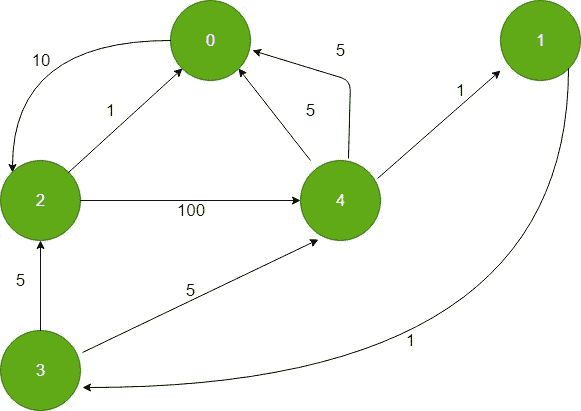

# 从所有顶点到目标

的最短路径

> 原文： [https://www.geeksforgeeks.org/shortest-paths-from-all-vertices-to-a-destination/](https://www.geeksforgeeks.org/shortest-paths-from-all-vertices-to-a-destination/)

给定加权有向图和图中的目标顶点，找到所有顶点到目标顶点的最短距离。

**输入**：


1

**Output :** 0 6 10 7 5

0 到 0 的距离：0

0 到 1 的距离：1 + 5 = 6（1- > 4- > 0）

0 到 2 的距离 10（2- > 0）

距 3 的距离为 0：1 + 1 + 5 = 7（3- > 1- > 4- > 0）

距 0 的距离为 4：5（4- [ > 0）

**方法**：该问题类似于 [Dijkstra 的问题。](https://www.geeksforgeeks.org/dijkstras-shortest-path-algorithm-using-priority_queue-stl/) 。想法是使用 Dijkstra 的算法。 为了找到所有顶点到给定目标顶点之间的最短距离，我们反转了有向图的所有边，并在 dijkstra 算法中将目标顶点用作源顶点。 由于现在所有边都反转了，因此计算从目标顶点到所有其他顶点的最短距离类似于计算从所有顶点到给定目标顶点的最短距离。

反转边后，图形如下所示：



现在，按照 Dijkstra 的算法，计算距目标顶点最短的距离作为源顶点。

下面是上述方法的实现：

```

// C++ implementation for the above approach 
#include <bits/stdc++.h> 
using namespace std; 
#define INF 0x3f3f3f3f 

// iPair ==>  Integer Pair 
typedef pair<int, int> iPair; 

// This class represents a directed graph using 
// adjacency list representation 
class Graph { 
    int V; // No. of vertices 

    // In a weighted graph, we need to store vertex 
    // and weight pair for every edge 
    list<pair<int, int> >* adj; 

public: 
    Graph(int V); // Constructor 

    // function to add an reverse edge to graph 
    void addEdgeRev(int u, int v, int w); 

    // prints shortest distance from all 
    // vertex to the given destination vertex 
    void shortestPath(int s); 
}; 

// Allocates memory for adjacency list 
Graph::Graph(int V) 
{ 
    this->V = V; 
    adj = new list<iPair>[V]; 
} 

void Graph::addEdgeRev(int u, int v, int w) 
{ 

    adj[v].push_back(make_pair(u, w)); 
} 

// Prints shortest distance from all vertex to 
// the given destination vertex 
void Graph::shortestPath(int dest) 
{ 
    // Create a priority queue to store vertices that 
    // are being preprocessed. This is weird syntax in C++. 
    // Refer below link for details of this syntax 
    // https:// www.geeksforgeeks.org/implement-min-heap-using-stl/ 
    priority_queue<iPair, vector<iPair>, greater<iPair> > pq; 

    // Create a vector for distances and initialize all 
    // distances as infinite (INF) 
    vector<int> dist(V, INF); 

    // Insert destination itself in priority queue and initialize 
    // its distance as 0\. 
    pq.push(make_pair(0, dest)); 
    dist[dest] = 0; 

    /* Looping till priority queue becomes empty (or all  
      distances are not finalized) */
    while (!pq.empty()) { 

        // The first vertex in pair is the minimum distance 
        // vertex, extract it from priority queue. 
        // vertex label is stored in second of pair (it 
        // has to be done this way to keep the vertices 
        // sorted distance (distance must be first item 
        // in pair) 
        int u = pq.top().second; 
        pq.pop(); 

        // 'i' is used to get all adjacent vertices of a vertex 
        list<pair<int, int> >::iterator i; 
        for (i = adj[u].begin(); i != adj[u].end(); ++i) { 

            // Get vertex label and weight of current adjacent 
            // of u. 
            int v = (*i).first; 
            int weight = (*i).second; 

            // If there is shorted path to v through u. 
            if (dist[v] > dist[u] + weight) { 
                // Updating distance of v 
                dist[v] = dist[u] + weight; 
                pq.push(make_pair(dist[v], v)); 
            } 
        } 
    } 

    // Print shortest distances stored in dist[] 
    printf("Destination Vertex Distance "
           "from all vertex\n"); 
    for (int i = 0; i < V; ++i) 
        printf("%d \t\t %d\n", i, dist[i]); 
} 

// Driver program to test methods of graph class 
int main() 
{ 
    // create the graph given in above figure 
    int V = 5; 
    Graph g(V); 

    // adding edges in reverse direction 
    g.addEdgeRev(0, 2, 1); 
    g.addEdgeRev(0, 4, 5); 
    g.addEdgeRev(1, 4, 1); 
    g.addEdgeRev(2, 0, 10); 
    g.addEdgeRev(2, 3, 5); 
    g.addEdgeRev(3, 1, 1); 
    g.addEdgeRev(4, 0, 5); 
    g.addEdgeRev(4, 2, 100); 
    g.addEdgeRev(4, 3, 5); 

    g.shortestPath(0); 

    return 0; 
} 

```

**Output:**

```
Destination Vertex Distance from all vertex
0                0
1                6
2                10
3                7
4                5         

```


* * *

* * *

如果您喜欢 GeeksforGeeks 并希望做出贡献，则还可以使用 [tribution.geeksforgeeks.org](https://contribute.geeksforgeeks.org/) 撰写文章，或将您的文章邮寄至 tribution@geeksforgeeks.org。 查看您的文章出现在 GeeksforGeeks 主页上，并帮助其他 Geeks。

如果您发现任何不正确的地方，请单击下面的“改进文章”按钮，以改进本文。