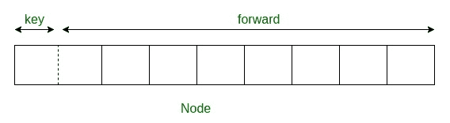

# 跳表 | 系列 2（插入）

> 原文：[https://www.geeksforgeeks.org/skip-list-set-2-insertion/](https://www.geeksforgeeks.org/skip-list-set-2-insertion/)

我们已经在[系列 1（简介）](https://www.geeksforgeeks.org/skip-list/)中讨论了跳表的概念以及它们在跳表中的工作方式。在本文中，我们将讨论如何在跳表中插入元素。

**决定节点级别**

列表中的每个元素都由一个节点表示，在插入列表时会随机选择节点的级别。 **级别不取决于节点中元素的数量。** 节点的级别由以下算法决定：

```
randomLevel()
lvl := 1
//random() that returns a random value in [0...1)
while random() < p and lvl < MaxLevel do
lvl := lvl + 1
return lvl

```

`MaxLevel`是跳表中级别数的上限。 可以确定为`L(N) = log(p/2, N)`。 上面的算法确保随机级别永远不会大于`MaxLevel`。 `p`是具有`i`个指针的节点的分数，也具有`i + 1`个指针的指针，`N`是列表中节点的数量。

**节点结构**

每个节点携带一个键和一个**前向**数组，该数组携带指向不同级别节点的指针。 级别`i`的节点携带索引为 0 到`i`的`i`个前向指针。



**插入跳表**

我们将从列表中的最高级别开始，将当前节点的下一个节点的键与要插入的键进行比较。 基本思想是-

1.  下一个节点的键小于要插入的键，然后我们继续在相同级别上前进

2.  下一个节点的键大于要插入的键，然后在`update[i]`处存储指向当前节点`i`的指针，然后向下移动一级并继续搜索。

在级别 0，我们肯定会找到一个插入给定键的位置。 以下是插入算法的伪代码：

```
Insert(list, searchKey)
local update[0...MaxLevel+1]
x := list -> header
for i := list -> level downto 0 do
    while x -> forward[i] -> key  forward[i]
update[i] := x
x := x -> forward[0]
lvl := randomLevel()
if lvl > list -> level then
for i := list -> level + 1 to lvl do
    update[i] := list -> header
    list -> level := lvl
x := makeNode(lvl, searchKey, value)
for i := 0 to level do
    x -> forward[i] := update[i] -> forward[i]
    update[i] -> forward[i] := x

```

在这里，`update[i]`保持指向级别`i`的节点的指针，从该指针我们向下移动至级别`i-1`，节点的指针指向级别 0 的插入位置。考虑此示例 我们要在其中插入键 17 的位置：


以下是在跳表中插入键的代码：

## C++

```cpp

// C++ code for inserting element in skip list 

#include <bits/stdc++.h> 
using namespace std; 

// Class to implement node 
class Node 
{ 
public: 
    int key; 

    // Array to hold pointers to node of different level  
    Node **forward; 
    Node(int, int); 
}; 

Node::Node(int key, int level) 
{ 
    this->key = key; 

    // Allocate memory to forward  
    forward = new Node*[level+1]; 

    // Fill forward array with 0(NULL) 
    memset(forward, 0, sizeof(Node*)*(level+1)); 
}; 

// Class for Skip list 
class SkipList 
{ 
    // Maximum level for this skip list 
    int MAXLVL; 

    // P is the fraction of the nodes with level  
    // i pointers also having level i+1 pointers 
    float P; 

    // current level of skip list 
    int level; 

    // pointer to header node 
    Node *header; 
public: 
    SkipList(int, float); 
    int randomLevel(); 
    Node* createNode(int, int); 
    void insertElement(int); 
    void displayList(); 
}; 

SkipList::SkipList(int MAXLVL, float P) 
{ 
    this->MAXLVL = MAXLVL; 
    this->P = P; 
    level = 0; 

    // create header node and initialize key to -1 
    header = new Node(-1, MAXLVL); 
}; 

// create random level for node 
int SkipList::randomLevel() 
{ 
    float r = (float)rand()/RAND_MAX; 
    int lvl = 0; 
    while (r < P && lvl < MAXLVL) 
    { 
        lvl++; 
        r = (float)rand()/RAND_MAX; 
    } 
    return lvl; 
}; 

// create new node 
Node* SkipList::createNode(int key, int level) 
{ 
    Node *n = new Node(key, level); 
    return n; 
}; 

// Insert given key in skip list 
void SkipList::insertElement(int key) 
{ 
    Node *current = header; 

    // create update array and initialize it 
    Node *update[MAXLVL+1]; 
    memset(update, 0, sizeof(Node*)*(MAXLVL+1)); 

    /*    start from highest level of skip list 
        move the current pointer forward while key  
        is greater than key of node next to current 
        Otherwise inserted current in update and  
        move one level down and continue search 
    */
    for (int i = level; i >= 0; i--) 
    { 
        while (current->forward[i] != NULL && 
              current->forward[i]->key < key) 
            current = current->forward[i]; 
        update[i] = current; 
    } 

    /* reached level 0 and forward pointer to  
       right, which is desired position to  
       insert key.  
    */
    current = current->forward[0]; 

    /* if current is NULL that means we have reached 
       to end of the level or current's key is not equal 
       to key to insert that means we have to insert 
       node between update[0] and current node */
    if (current == NULL || current->key != key) 
    { 
        // Generate a random level for node 
        int rlevel = randomLevel(); 

        // If random level is greater than list's current 
        // level (node with highest level inserted in  
        // list so far), initialize update value with pointer 
        // to header for further use 
        if (rlevel > level) 
        { 
            for (int i=level+1;i<rlevel+1;i++) 
                update[i] = header; 

            // Update the list current level 
            level = rlevel; 
        } 

        // create new node with random level generated 
        Node* n = createNode(key, rlevel); 

        // insert node by rearranging pointers  
        for (int i=0;i<=rlevel;i++) 
        { 
            n->forward[i] = update[i]->forward[i]; 
            update[i]->forward[i] = n; 
        } 
        cout << "Successfully Inserted key " << key << "\n"; 
    } 
}; 

// Display skip list level wise 
void SkipList::displayList() 
{ 
    cout<<"\n*****Skip List*****"<<"\n"; 
    for (int i=0;i<=level;i++) 
    { 
        Node *node = header->forward[i]; 
        cout << "Level " << i << ": "; 
        while (node != NULL) 
        { 
            cout << node->key<<" "; 
            node = node->forward[i]; 
        } 
        cout << "\n"; 
    } 
}; 

// Driver to test above code 
int main() 
{ 
    // Seed random number generator 
    srand((unsigned)time(0)); 

    // create SkipList object with MAXLVL and P  
    SkipList lst(3, 0.5); 

    lst.insertElement(3); 
    lst.insertElement(6); 
    lst.insertElement(7); 
    lst.insertElement(9); 
    lst.insertElement(12); 
    lst.insertElement(19); 
    lst.insertElement(17); 
    lst.insertElement(26); 
    lst.insertElement(21); 
    lst.insertElement(25); 
    lst.displayList(); 
} 

```

## Python

```py

# Python3 code for inserting element in skip list 

import random 

class Node(object): 
    ''' 
    Class to implement node 
    '''
    def __init__(self, key, level): 
        self.key = key 

        # list to hold references to node of different level  
        self.forward = [None]*(level+1) 

class SkipList(object): 
    ''' 
    Class for Skip list 
    '''
    def __init__(self, max_lvl, P): 
        # Maximum level for this skip list 
        self.MAXLVL = max_lvl 

        # P is the fraction of the nodes with level  
        # i references also having level i+1 references 
        self.P = P 

        # create header node and initialize key to -1 
        self.header = self.createNode(self.MAXLVL, -1) 

        # current level of skip list 
        self.level = 0

    # create  new node 
    def createNode(self, lvl, key): 
        n = Node(key, lvl) 
        return n 

    # create random level for node 
    def randomLevel(self): 
        lvl = 0
        while random.random()<self.P and \ 
              lvl<self.MAXLVL:lvl += 1
        return lvl 

    # insert given key in skip list 
    def insertElement(self, key): 
        # create update array and initialize it 
        update = [None]*(self.MAXLVL+1) 
        current = self.header 

        ''' 
        start from highest level of skip list 
        move the current reference forward while key  
        is greater than key of node next to current 
        Otherwise inserted current in update and  
        move one level down and continue search 
        '''
        for i in range(self.level, -1, -1): 
            while current.forward[i] and \ 
                  current.forward[i].key < key: 
                current = current.forward[i] 
            update[i] = current 

        '''  
        reached level 0 and forward reference to  
        right, which is desired position to  
        insert key. 
        ''' 
        current = current.forward[0] 

        ''' 
        if current is NULL that means we have reached 
           to end of the level or current's key is not equal 
           to key to insert that means we have to insert 
           node between update[0] and current node 
       '''
        if current == None or current.key != key: 
            # Generate a random level for node 
            rlevel = self.randomLevel() 

            ''' 
            If random level is greater than list's current 
            level (node with highest level inserted in  
            list so far), initialize update value with reference 
            to header for further use 
            '''
            if rlevel > self.level: 
                for i in range(self.level+1, rlevel+1): 
                    update[i] = self.header 
                self.level = rlevel 

            # create new node with random level generated 
            n = self.createNode(rlevel, key) 

            # insert node by rearranging references  
            for i in range(rlevel+1): 
                n.forward[i] = update[i].forward[i] 
                update[i].forward[i] = n 

            print("Successfully inserted key {}".format(key)) 

    # Display skip list level wise 
    def displayList(self): 
        print("\n*****Skip List******") 
        head = self.header 
        for lvl in range(self.level+1): 
            print("Level {}: ".format(lvl), end=" ") 
            node = head.forward[lvl] 
            while(node != None): 
                print(node.key, end=" ") 
                node = node.forward[lvl] 
            print("") 

# Driver to test above code 
def main(): 
    lst = SkipList(3, 0.5) 
    lst.insertElement(3) 
    lst.insertElement(6) 
    lst.insertElement(7) 
    lst.insertElement(9) 
    lst.insertElement(12) 
    lst.insertElement(19) 
    lst.insertElement(17) 
    lst.insertElement(26) 
    lst.insertElement(21) 
    lst.insertElement(25) 
    lst.displayList() 

main() 

```

Output:

```
Successfully Inserted key 3
Successfully Inserted key 6
Successfully Inserted key 7
Successfully Inserted key 9
Successfully Inserted key 12
Successfully Inserted key 19
Successfully Inserted key 17
Successfully Inserted key 26
Successfully Inserted key 21
Successfully Inserted key 25

****Skip List****
Level 0: 3 6 7 9 12 17 19 21 25 26 
Level 1: 3 6 12 17 25 
Level 2: 6 12 17 25 
Level 3: 12 17 25 

```

**注意**：节点的级别是随机决定的，因此输出可能会有所不同。

**时间复杂度（平均）**：`O(log n)`

**时间复杂度（最差）**：`O(n)`

在下一篇文章中，我们将讨论跳过中的搜索和删除 列表。

**参考**

*   [ftp://ftp.cs.umd.edu/pub/skipLists/skiplists.pdf](ftp://ftp.cs.umd.edu/pub/skipLists/skiplists.pdf)

本文由 [**Atul Kumar**](https://www.linkedin.com/in/atul-kumar-733b32136/) 提供。 如果您喜欢 GeeksforGeeks 并希望做出贡献，则还可以使用 [tribution.geeksforgeeks.org](http://www.contribute.geeksforgeeks.org) 撰写文章，或将您的文章邮寄至 tribution@geeksforgeeks.org。 查看您的文章出现在 GeeksforGeeks 主页上，并帮助其他 Geeks。

如果发现任何不正确的地方，或者您想分享有关上述主题的更多信息，请发表评论。

