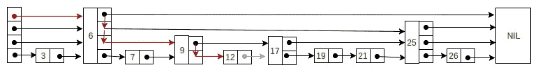
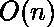

# 跳表 | 系列 3（搜索和删除）

> 原文：[https://www.geeksforgeeks.org/skip-list-set-3-searching-deletion/](https://www.geeksforgeeks.org/skip-list-set-3-searching-deletion/)

在上一篇文章[中，跳表 | 系列 2（插入）](https://www.geeksforgeeks.org/skip-list-set-2-insertion/)我们讨论了跳过节点的结构以及如何在跳表中插入元素。 在本文中，我们将讨论如何在跳表中搜索和删除元素。

**在跳表**中搜索元素

搜索元素与搜索要在跳表中插入元素的地点的方法非常相似。 基本想法是-

1.  下一个节点的关键字小于搜索关键字，然后我们继续在相同级别上前进。

2.  下一个节点的密钥大于要插入的密钥，然后在 **update [i]** 处存储指向当前节点 **i** 的指针，然后向下移动一级并继续搜索。

在最低级别（0），如果最右边元素（update [0]）旁边的元素的键等于搜索键，则我们发现该键否则失败。

以下是用于搜索元素的伪代码–

```
Search(list, searchKey)
x := list -> header
-- loop invariant: x -> key  level downto 0 do
    while x -> forward[i] -> key  forward[i]
x := x -> forward[0]
if x -> key = searchKey then return x -> value
else return failure

```

考虑这个示例，我们要在其中搜索键 17-



**从跳表中删除元素**

在删除元素 k 之前，使用上述搜索算法在跳表中定位元素。 定位元素后，就像我们在单链列表中一样，完成了指针的重新排列以删除元素表单列表。 我们从最低级别开始进行重新排列，直到 update [i]旁边的元素不是 k。

删除元素后，可能会存在没有元素的级别，因此我们也将通过减少“跳过”列表的级别来删除这些级别。 以下是删除的伪代码–

```
Delete(list, searchKey)
local update[0..MaxLevel+1]
x := list -> header
for i := list -> level downto 0 do
    while x -> forward[i] -> key  forward[i]
    update[i] := x
x := x -> forward[0]
if x -> key = searchKey then
    for i := 0 to list -> level do
        if update[i] -> forward[i] ≠ x then break
        update[i] -> forward[i] := x -> forward[i]
    free(x)
    while list -> level > 0 and list -> header -> forward[list -> level] = NIL do
        list -> level := list -> level – 1

```

考虑这个示例，我们要删除元素 6 –


在第 3 层，删除元素 6 后没有元素（红色箭头）。因此，我们将跳表的层数减 1。

以下是用于从跳表中搜索和删除元素的代码–

## C++

```cpp

// C++ code for searching and deleting element in skip list 

#include <bits/stdc++.h> 
using namespace std; 

// Class to implement node 
class Node 
{ 
public: 
    int key; 

    // Array to hold pointers to node of different level  
    Node **forward; 
    Node(int, int); 
}; 

Node::Node(int key, int level) 
{ 
    this->key = key; 

    // Allocate memory to forward  
    forward = new Node*[level+1]; 

    // Fill forward array with 0(NULL) 
    memset(forward, 0, sizeof(Node*)*(level+1)); 
}; 

// Class for Skip list 
class SkipList 
{ 
    // Maximum level for this skip list 
    int MAXLVL; 

    // P is the fraction of the nodes with level  
    // i pointers also having level i+1 pointers 
    float P; 

    // current level of skip list 
    int level; 

    // pointer to header node 
    Node *header; 
public: 
    SkipList(int, float); 
    int randomLevel(); 
    Node* createNode(int, int); 
    void insertElement(int); 
    void deleteElement(int); 
    void searchElement(int); 
    void displayList(); 
}; 

SkipList::SkipList(int MAXLVL, float P) 
{ 
    this->MAXLVL = MAXLVL; 
    this->P = P; 
    level = 0; 

    // create header node and initialize key to -1 
    header = new Node(-1, MAXLVL); 
}; 

// create random level for node 
int SkipList::randomLevel() 
{ 
    float r = (float)rand()/RAND_MAX; 
    int lvl = 0; 
    while(r < P && lvl < MAXLVL) 
    { 
        lvl++; 
        r = (float)rand()/RAND_MAX; 
    } 
    return lvl; 
}; 

// create new node 
Node* SkipList::createNode(int key, int level) 
{ 
    Node *n = new Node(key, level); 
    return n; 
}; 

// Insert given key in skip list 
void SkipList::insertElement(int key) 
{ 
    Node *current = header; 

    // create update array and initialize it 
    Node *update[MAXLVL+1]; 
    memset(update, 0, sizeof(Node*)*(MAXLVL+1)); 

    /*    start from highest level of skip list 
        move the current pointer forward while key  
        is greater than key of node next to current 
        Otherwise inserted current in update and  
        move one level down and continue search 
    */
    for(int i = level; i >= 0; i--) 
    { 
        while(current->forward[i] != NULL && 
              current->forward[i]->key < key) 
            current = current->forward[i]; 
        update[i] = current; 
    } 

    /* reached level 0 and forward pointer to  
       right, which is desired position to  
       insert key.  
    */
    current = current->forward[0]; 

    /* if current is NULL that means we have reached 
       to end of the level or current's key is not equal 
       to key to insert that means we have to insert 
       node between update[0] and current node */
    if (current == NULL || current->key != key) 
    { 
        // Generate a random level for node 
        int rlevel = randomLevel(); 

        /* If random level is greater than list's current 
           level (node with highest level inserted in  
           list so far), initialize update value with pointer 
           to header for further use */
        if(rlevel > level) 
        { 
            for(int i=level+1;i<rlevel+1;i++) 
                update[i] = header; 

            // Update the list current level 
            level = rlevel; 
        } 

        // create new node with random level generated 
        Node* n = createNode(key, rlevel); 

        // insert node by rearranging pointers  
        for(int i=0;i<=rlevel;i++) 
        { 
            n->forward[i] = update[i]->forward[i]; 
            update[i]->forward[i] = n; 
        } 
        cout<<"Successfully Inserted key "<<key<<"\n"; 
    } 
}; 

// Delete element from skip list 
void SkipList::deleteElement(int key) 
{ 
    Node *current = header; 

    // create update array and initialize it 
    Node *update[MAXLVL+1]; 
    memset(update, 0, sizeof(Node*)*(MAXLVL+1)); 

    /*    start from highest level of skip list 
        move the current pointer forward while key  
        is greater than key of node next to current 
        Otherwise inserted current in update and  
        move one level down and continue search 
    */
    for(int i = level; i >= 0; i--) 
    { 
        while(current->forward[i] != NULL  && 
              current->forward[i]->key < key) 
            current = current->forward[i]; 
        update[i] = current; 
    } 

    /* reached level 0 and forward pointer to  
       right, which is possibly our desired node.*/
    current = current->forward[0]; 

    // If current node is target node 
    if(current != NULL and current->key == key) 
    { 
        /* start from lowest level and rearrange 
           pointers just like we do in singly linked list 
           to remove target node */
        for(int i=0;i<=level;i++) 
        { 
            /* If at level i, next node is not target  
               node, break the loop, no need to move  
              further level */
            if(update[i]->forward[i] != current) 
                break; 

            update[i]->forward[i] = current->forward[i]; 
        } 

        // Remove levels having no elements  
        while(level>0 && 
              header->forward[level] == 0) 
            level--; 
         cout<<"Successfully deleted key "<<key<<"\n"; 
    } 
}; 

// Search for element in skip list 
void SkipList::searchElement(int key) 
{ 
    Node *current = header; 

    /*    start from highest level of skip list 
        move the current pointer forward while key  
        is greater than key of node next to current 
        Otherwise inserted current in update and  
        move one level down and continue search 
    */
    for(int i = level; i >= 0; i--) 
    { 
        while(current->forward[i] && 
               current->forward[i]->key < key) 
            current = current->forward[i]; 

    } 

    /* reached level 0 and advance pointer to  
       right, which is possibly our desired node*/
    current = current->forward[0]; 

    // If current node have key equal to 
    // search key, we have found our target node 
    if(current and current->key == key)  
        cout<<"Found key: "<<key<<"\n"; 
}; 

// Display skip list level wise 
void SkipList::displayList() 
{ 
    cout<<"\n*****Skip List*****"<<"\n"; 
    for(int i=0;i<=level;i++) 
    { 
        Node *node = header->forward[i]; 
        cout<<"Level "<<i<<": "; 
        while(node != NULL) 
        { 
            cout<<node->key<<" "; 
            node = node->forward[i]; 
        } 
        cout<<"\n"; 
    } 
}; 

// Driver to test above code 
int main() 
{ 
    // Seed random number generator 
    srand((unsigned)time(0)); 

    // create SkipList object with MAXLVL and P  
    SkipList lst(3, 0.5); 

    lst.insertElement(3); 
    lst.insertElement(6); 
    lst.insertElement(7); 
    lst.insertElement(9); 
    lst.insertElement(12); 
    lst.insertElement(19); 
    lst.insertElement(17); 
    lst.insertElement(26); 
    lst.insertElement(21); 
    lst.insertElement(25); 
    lst.displayList(); 

    //Search for node 19 
    lst.searchElement(19); 

    //Delete node 19 
    lst.deleteElement(19); 
    lst.displayList(); 
} 

```

## Python

```py

# Python3 code for searching and deleting element in skip list 

import random 

class Node(object): 
    ''' 
    Class to implement node 
    '''
    def __init__(self, key, level): 
        self.key = key 

        # list to hold references to node of different level  
        self.forward = [None]*(level+1) 

class SkipList(object): 
    ''' 
    Class for Skip list 
    '''
    def __init__(self, max_lvl, P): 
        # Maximum level for this skip list 
        self.MAXLVL = max_lvl 

        # P is the fraction of the nodes with level  
        # i references also having level i+1 references 
        self.P = P 

        # create header node and initialize key to -1 
        self.header = self.createNode(self.MAXLVL, -1) 

        # current level of skip list 
        self.level = 0

    # create  new node 
    def createNode(self, lvl, key): 
        n = Node(key, lvl) 
        return n 

    # create random level for node 
    def randomLevel(self): 
        lvl = 0
        while random.random()<self.P and \ 
              lvl<self.MAXLVL:lvl += 1
        return lvl 

    # insert given key in skip list 
    def insertElement(self, key): 
        # create update array and initialize it 
        update = [None]*(self.MAXLVL+1) 
        current = self.header 

        ''' 
        start from highest level of skip list 
        move the current reference forward while key  
        is greater than key of node next to current 
        Otherwise inserted current in update and  
        move one level down and continue search 
        '''
        for i in range(self.level, -1, -1): 
            while current.forward[i] and \ 
                  current.forward[i].key < key: 
                current = current.forward[i] 
            update[i] = current 

        '''  
        reached level 0 and forward reference to  
        right, which is desired position to  
        insert key. 
        ''' 
        current = current.forward[0] 

        ''' 
        if current is NULL that means we have reached 
           to end of the level or current's key is not equal 
           to key to insert that means we have to insert 
           node between update[0] and current node 
       '''
        if current == None or current.key != key: 
            # Generate a random level for node 
            rlevel = self.randomLevel() 

            ''' 
            If random level is greater than list's current 
            level (node with highest level inserted in  
            list so far), initialize update value with reference 
            to header for further use 
            '''
            if rlevel > self.level: 
                for i in range(self.level+1, rlevel+1): 
                    update[i] = self.header 
                self.level = rlevel 

            # create new node with random level generated 
            n = self.createNode(rlevel, key) 

            # insert node by rearranging references  
            for i in range(rlevel+1): 
                n.forward[i] = update[i].forward[i] 
                update[i].forward[i] = n 

            print("Successfully inserted key {}".format(key)) 

    def deleteElement(self, search_key): 

        # create update array and initialize it 
        update = [None]*(self.MAXLVL+1) 
        current = self.header 

        ''' 
        start from highest level of skip list 
        move the current reference forward while key  
        is greater than key of node next to current 
        Otherwise inserted current in update and  
        move one level down and continue search 
        '''
        for i in range(self.level, -1, -1): 
            while(current.forward[i] and \ 
                  current.forward[i].key < search_key): 
                current = current.forward[i] 
            update[i] = current 

        '''  
        reached level 0 and advance reference to  
        right, which is prssibly our desired node 
        ''' 
        current = current.forward[0] 

        # If current node is target node 
        if current != None and current.key == search_key: 

            ''' 
            start from lowest level and rearrange references  
            just like we do in singly linked list 
            to remove target node 
            '''
            for i in range(self.level+1): 

                ''' 
                If at level i, next node is not target  
                node, break the loop, no need to move  
                further level 
                '''
                if update[i].forward[i] != current: 
                    break
                update[i].forward[i] = current.forward[i] 

            # Remove levels having no elements 
            while(self.level>0 and\ 
                  self.header.forward[self.level] == None): 
                self.level -= 1
            print("Successfully deleted {}".format(search_key)) 

    def searchElement(self, key):  
        current = self.header 

        ''' 
        start from highest level of skip list 
        move the current reference forward while key  
        is greater than key of node next to current 
        Otherwise inserted current in update and  
        move one level down and continue search 
        '''
        for i in range(self.level, -1, -1): 
            while(current.forward[i] and\ 
                  current.forward[i].key < key): 
                current = current.forward[i] 

        # reached level 0 and advance reference to  
        # right, which is prssibly our desired node 
        current = current.forward[0] 

        # If current node have key equal to 
        # search key, we have found our target node 
        if current and current.key == key: 
            print("Found key ", key) 

    # Display skip list level wise 
    def displayList(self): 
        print("\n*****Skip List******") 
        head = self.header 
        for lvl in range(self.level+1): 
            print("Level {}: ".format(lvl), end=" ") 
            node = head.forward[lvl] 
            while(node != None): 
                print(node.key, end=" ") 
                node = node.forward[lvl] 
            print("") 

# Driver to test above code 
def main(): 
    lst = SkipList(3, 0.5) 
    lst.insertElement(3) 
    lst.insertElement(6) 
    lst.insertElement(7) 
    lst.insertElement(9) 
    lst.insertElement(12) 
    lst.insertElement(19) 
    lst.insertElement(17) 
    lst.insertElement(26) 
    lst.insertElement(21) 
    lst.insertElement(25) 
    lst.displayList() 

    # Search for node 19 
    lst.searchElement(19) 

    # Delete node 19 
    lst.deleteElement(19) 
    lst.displayList() 

main() 

```

输出：

```
Successfully Inserted key 3
Successfully Inserted key 6
Successfully Inserted key 7
Successfully Inserted key 9
Successfully Inserted key 12
Successfully Inserted key 19
Successfully Inserted key 17
Successfully Inserted key 26
Successfully Inserted key 21
Successfully Inserted key 25

*****Skip List*****
Level 0: 3 6 7 9 12 17 19 21 25 26 
Level 1: 3 17 19 21 26 
Level 2: 17 19 21 
Found key: 19
Successfully deleted key 19

*****Skip List*****
Level 0: 3 6 7 9 12 17 21 25 26 
Level 1: 3 17 21 26 
Level 2: 17 21 

```

搜索和删除的时间复杂度相同–

**时间复杂度（平均）**：

**时间复杂度（最差）**：

**参考**

[ftp://ftp.cs.umd.edu/pub/skipLists/skiplists.pdf](ftp://ftp.cs.umd.edu/pub/skipLists/skiplists.pdf)

本文由 [**Atul Kumar**](https://www.linkedin.com/in/atul-kumar-733b32136/) 提供。 如果您喜欢 GeeksforGeeks 并希望做出贡献，则还可以使用 [tribution.geeksforgeeks.org](http://www.contribute.geeksforgeeks.org) 撰写文章，或将您的文章邮寄至 tribution@geeksforgeeks.org。 查看您的文章出现在 GeeksforGeeks 主页上，并帮助其他 Geeks。

如果发现任何不正确的地方，或者您想分享有关上述主题的更多信息，请发表评论。

