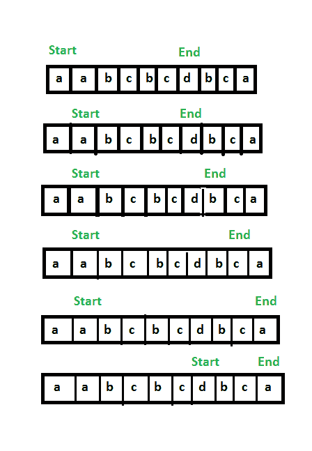

# 包含字符串本身的所有字符的最小窗口

> 原文：[https://www.geeksforgeeks.org/smallest-window-contains-characters-string/](https://www.geeksforgeeks.org/smallest-window-contains-characters-string/)

给定一个字符串，找到具有给定字符串的所有不同字符的最小窗口长度。 例如。 `str = "aabcbcdbca"`，则结果将是 4，因为最小的窗口将是`"dbca"`。

**示例**：

```
Input: aabcbcdbca
Output: dbca
Explanation: 
Possible substrings= {aabcbcd, abcbcd, 
bcdbca, dbca....}
Of the set of possible substrings 'dbca' 
is the shortest substring having all the 
distinct characters of given string. 

Input: aaab
Output: ab
Explanation: 
Possible substrings={aaab, aab, ab}
Of the set of possible substrings 'ab' 
is the shortest substring having all 
the distinct characters of given string.    

```

**解决方案**：上述问题指出，即使最小的字符串包含重复元素，我们也必须找到包含给定字符串的所有不同字符的最小窗口。

例如，在`"aabcbcdb"`中，包含所有字符的最小字符串是`"abcbcd"`。

**方法 1** ：这是使用`HashMap`解决问题的蛮力方法。

*   **Approach :** For solving the problem we first have to find out all the distinct characters present in the string. This can be done using a [**HashMap**](http://www.geeksforgeeks.org/java-util-hashmap-in-java/). The next thing is to generate all the possible substrings. This follows by checking whether a substring generated has all the required characters(stored in the hash_map) or not. If yes, then compare its length with the minimum substring length which follows the above constraints, found till now.

    [`HashMap`](http://www.geeksforgeeks.org/java-util-hashmap-in-java/)：`HashMap`自 Java 1.2 以来就是 Java 集合的一部分。 它提供了 Java `Map`接口的基本实现。 它以（键，值）对存储数据。 要访问一个值，必须知道其键。 `HashMap`被称为`HashMap`，因为它使用了一种称为哈希的技术。 散列是一种将大字符串转换为代表相同字符串的小字符串的技术。 较短的值有助于索引编制和更快的搜索。 `HashSet`还内部使用`HashMap`。 它在内部使用链接列表来存储已在`HashSet`中详细解释的键值对以及其他文章。

*   **算法**：

    1.  将给定字符串的所有不同字符存储在`hash_map`中。

    2.  进行变量计数并将其初始化为值 0。

    3.  使用两个指针生成子字符串。

    4.  **现在检查生成的子字符串是否有效**：

        1.  一旦我们发现之前从未遇到过生成的子字符串的字符，则以 **1** 递增计数。

        2.  我们可以使用`max_chars`大小的访问数组来查找当前字符是否曾经遇到过。

        3.  如果`count`等于`hash_map`的大小，则生成的子字符串有效

        4.  如果它是有效的子字符串，请将其与已生成的最小长度的子字符串进行比较。

*   **伪代码**：

    ```
    maphash_map;
    for ( i=0 to str.length())
    hash_map[str[i]]++;//finding all distinct charaters of string
    minimum_size=INT_MAX
    Distinct_chars=hash_map.size()
    for(i=0 to str.length())
    count=0;
    sub_str="";
    visited[256]={0};
     for(j=i to n)
       sub_str+=str[j]
       if(visited[str[j]]==0)
       count++
       visited[str[j]]=1;
       if(count==Distinct_chars)
       end loop

    if(sub_str.length()<minimum_size&&
    count==Distinct_chars)
    ans=sub_str;

    return ans

    ```

*   **Implementation:**

    ```
    // C++ program to find the smallest
    // window containing all characters
    // of a pattern.
    #include <bits/stdc++.h>
    using namespace std;
    const int MAX_CHARS = 256;
    // Function to find smallest window containing
    // all distinct characters
    string findSubString(string str)
    {
    int n = str.length();
    的
    // Count all distinct characters.
    int dist_count = 0;
    unordered_map< int , int > hash_map;
    for ( int i = 0; i < n; i++) {
    hash_map[str[i]]++;
    }
    的
    dist_count = hash_map.size();
    int size = INT_MAX;
    string res;
    // Now follow the algorithm discussed in below
    for ( int i = 0; i < n; i++) {
    int count = 0;
    int visited[256] = { 0 };
    string sub_str = "" ;
    for ( int j = i; j < n; j++) {
    if (visited[str[j]] == 0) {
    count++;
    visited[str[j]] = 1;
    }
    sub_str += str[j];
    if (count == dist_count)
    break ;
    }
    if (sub_str.length() < size && count == dist_count)
    res = sub_str;
    }
    return res;
    }
    // Driver Code
    int main()
    {
    [ string str = "aabcbcdbca" ;
    cout << "Smallest window containing all distinct"
    " characters is: "
    << findSubString(str);
    return 0;
    }
    ```

    **输出**：

    ```
    Smallest window containing all 
    distinct characters is: dbca

    ```

*   **Complexiy Analysis:**

    *   **时间复杂度**：`O(N ^ 2)`。

        需要这段时间来生成长度为`N`的字符串的所有可能的子字符串。

    *   **空间复杂度**：`O(n)`。

        由于大小为`N`的`hash_map`。

**方法 2** ：这里我们使用了[滑动窗口](https://www.geeksforgeeks.org/window-sliding-technique/)技术来得出解决方案。 该技术说明了如何将很少出现问题的嵌套`for`循环转换为单个`for`循环，从而降低时间复杂度。

*   **Approach:** Basically a window of characters is maintained by using two pointers namely **start** and **end**. These **start** and **end** pointers can be used to shrink and increase the size of window respectively. Whenever the window contains all characters of given string, the window is shrinked from left side to remove extra characters and then its length is compared with the smallest window found so far.

    If in the present window, no more characters can be deleted then we start increasing the size of the window using the **end** until all the distinct characters present in the string are also there in the window. Finally, find the minimum size of each window.

    [](https://media.geeksforgeeks.org/wp-content/uploads/20200408143729/Sliding-window-simulation2.png)

*   **Algorithm :**

    1.  维护一个数组（已访问），该数组最多包含可能的字符（256 个字符），一旦我们在字符串中找到任何字符，就在数组中标记该索引（这是为了计算字符串中所有不同的字符）

    2.  取两个指针`start`和`end`，它们将标记窗口的开始和结束。

    3.  取一个计数器`count = 0`，该计数器将用于计算窗口中的不同字符。

    4.  现在开始读取给定字符串的字符，如果遇到尚未访问的字符，则将计数器增加 **1**。

    5.  如果`count`等于不同字符的总数，请尝试缩小窗口。

    6.  **用于缩小窗口**：

        1.  如果开始指针处字符的**频率**大于 1，则增加指针，因为它是多余的。

        2.  现在将当前窗口的长度与最小窗口长度进行比较。

*   **实现**：

    ## C++

    ```cpp

    // C++ program to find the smallest  
    // window containing all characters  
    // of a pattern. 
    #include <bits/stdc++.h> 
    using namespace std; 

    const int MAX_CHARS = 256; 

    // Function to find smallest window containing 
    // all distinct characters 
    string findSubString(string str) 
    { 
        int n = str.length(); 

        // Count all distinct characters. 
        int dist_count = 0; 
        bool visited[MAX_CHARS] = { false }; 
        for (int i = 0; i < n; i++) { 
            if (visited[str[i]] == false) { 
                visited[str[i]] = true; 
                dist_count++; 
            } 
        } 

        // Now follow the algorithm discussed in below 
        // post. We basically maintain a window of characters 
        // that contains all characters of given string. 
        int start = 0, start_index = -1, min_len = INT_MAX; 

        int count = 0; 
        int curr_count[MAX_CHARS] = { 0 }; 
        for (int j = 0; j < n; j++) { 
            // Count occurrence of characters of string 
            curr_count[str[j]]++; 

            // If any distinct character matched, 
            // then increment count 
            if (curr_count[str[j]] == 1) 
                count++; 

            // if all the characters are matched 
            if (count == dist_count) { 
                // Try to minimize the window i.e., check if 
                // any character is occurring more no. of times 
                // than its occurrence in pattern, if yes 
                // then remove it from starting and also remove 
                // the useless characters. 
                while (curr_count[str[start]] > 1) { 
                    if (curr_count[str[start]] > 1) 
                        curr_count[str[start]]--; 
                    start++; 
                } 

                // Update window size 
                int len_window = j - start + 1; 
                if (min_len > len_window) { 
                    min_len = len_window; 
                    start_index = start; 
                } 
            } 
        } 

        // Return substring starting from start_index 
        // and length min_len 
        return str.substr(start_index, min_len); 
    } 

    // Driver code 
    int main() 
    { 
        string str = "aabcbcdbca"; 
        cout << "Smallest window containing all distinct"
                " characters is: "
             << findSubString(str); 
        return 0; 
    } 

    ```

    ## Java

    ```java

    // Java program to find the smallest window containing 
    // all characters of a pattern. 
    import java.util.Arrays; 
    public class GFG { 

        static final int MAX_CHARS = 256; 

        // Function to find smallest window containing 
        // all distinct characters 
        static String findSubString(String str) 
        { 
            int n = str.length(); 

            // Count all distinct characters. 
            int dist_count = 0; 

            boolean[] visited = new boolean[MAX_CHARS]; 
            Arrays.fill(visited, false); 
            for (int i = 0; i < n; i++) { 
                if (visited[str.charAt(i)] == false) { 
                    visited[str.charAt(i)] = true; 
                    dist_count++; 
                } 
            } 

            // Now follow the algorithm discussed in below 
            // post. We basically maintain a window of characters 
            // that contains all characters of given string. 
            int start = 0, start_index = -1; 
            int min_len = Integer.MAX_VALUE; 

            int count = 0; 
            int[] curr_count = new int[MAX_CHARS]; 
            for (int j = 0; j < n; j++) { 
                // Count occurrence of characters of string 
                curr_count[str.charAt(j)]++; 

                // If any distinct character matched, 
                // then increment count 
                if (curr_count[str.charAt(j)] == 1) 
                    count++; 

                // if all the characters are matched 
                if (count == dist_count) { 
                    // Try to minimize the window i.e., check if 
                    // any character is occurring more no. of times 
                    // than its occurrence in pattern, if yes 
                    // then remove it from starting and also remove 
                    // the useless characters. 
                    while (curr_count[str.charAt(start)] > 1) { 
                        if (curr_count[str.charAt(start)] > 1) 
                            curr_count[str.charAt(start)]--; 
                        start++; 
                    } 

                    // Update window size 
                    int len_window = j - start + 1; 
                    if (min_len > len_window) { 
                        min_len = len_window; 
                        start_index = start; 
                    } 
                } 
            } 
            // Return substring starting from start_index 
            // and length min_len 
            return str.substring(start_index, start_index + min_len); 
        } 

        // Driver code 
        public static void main(String args[]) 
        { 
            String str = "aabcbcdbca"; 
            System.out.println("Smallest window containing all distinct"
                               + " characters is: " + findSubString(str)); 
        } 
    } 
    // This code is contributed by Sumit Ghosh 

    ```

    ## 蟒蛇

    ```

    # Python program to find the smallest  
    # window containing 
    # all characters of a pattern 
    from collections import defaultdict 

    MAX_CHARS = 256

    # Function to find smallest window 
    # containing all distinct characters 
    def findSubString(strr): 

        n = len(strr) 

        # Count all distinct characters. 
        dist_count = len(set([x for x in strr])) 

        curr_count = defaultdict(lambda: 0) 
        count = 0
        start = 0
        min_len = n 

        # Now follow the algorithm discussed in below 
        # post. We basically maintain a window of characters 
        # that contains all characters of given string. 
        for j in range(n): 
            curr_count[strr[j]] += 1

            # If any distinct character matched, 
            # then increment count 
            if curr_count[strr[j]] == 1: 
                count += 1

            # Try to minimize the window i.e., check if 
            # any character is occurring more no. of times 
            # than its occurrence in pattern, if yes 
            # then remove it from starting and also remove 
            # the useless characters. 
            if count == dist_count: 
                while curr_count[strr[start]] > 1: 
                    if curr_count[strr[start]] > 1: 
                        curr_count[strr[start]] -= 1

                    start += 1

                # Update window size 
                len_window = j - start + 1

                if min_len > len_window: 
                    min_len = len_window 
                    start_index = start 

        # Return substring starting from start_index 
        # and length min_len """ 
        return str(strr[start_index: start_index +
                                     min_len]) 

    # Driver code 
    if __name__=='__main__': 

        print("Smallest window containing " 
              "all distinct characters is: {}".format( 
               findSubString("aabcbcdbca"))) 

    # This code is contributed by   
    # Subhrajit  

    ```

    ## C#

    ```

    // C# program to find the smallest window containing 
    // all characters of a pattern. 
    using System; 

    class GFG { 

        static int MAX_CHARS = 256; 

        // Function to find smallest window containing 
        // all distinct characters 
        static string findSubString(string str) 
        { 
            int n = str.Length; 

            // Count all distinct characters. 
            int dist_count = 0; 
            bool[] visited = new bool[MAX_CHARS]; 
            for (int i = 0; i < n; i++) { 
                if (visited[str[i]] == false) { 
                    visited[str[i]] = true; 
                    dist_count++; 
                } 
            } 

            // Now follow the algorithm discussed in below 
            // post. We basically maintain a window of characters 
            // that contains all characters of given string. 
            int start = 0, start_index = -1, min_len = int.MaxValue; 

            int count = 0; 
            int[] curr_count = new int[MAX_CHARS]; 
            for (int j = 0; j < n; j++) { 
                // Count occurrence of characters of string 
                curr_count[str[j]]++; 

                // If any distinct character matched, 
                // then increment count 
                if (curr_count[str[j]] == 1) 
                    count++; 

                // if all the characters are matched 
                if (count == dist_count) { 
                    // Try to minimize the window i.e., check if 
                    // any character is occurring more no. of times 
                    // than its occurrence in pattern, if yes 
                    // then remove it from starting and also remove 
                    // the useless characters. 
                    while (curr_count[str[start]] > 1) { 
                        if (curr_count[str[start]] > 1) 
                            curr_count[str[start]]--; 
                        start++; 
                    } 

                    // Update window size 
                    int len_window = j - start + 1; 
                    if (min_len > len_window) { 
                        min_len = len_window; 
                        start_index = start; 
                    } 
                } 
            } 

            // Return substring starting from start_index 
            // and length min_len 
            return str.Substring(start_index, min_len); 
        } 

        // Driver code 
        public static void Main(String[] args) 
        { 
            string str = "aabcbcdbca"; 
            Console.WriteLine("Smallest window containing all distinct"
                              + " characters is: " + findSubString(str)); 
        } 
    } 

    // This code contributed by Rajput-Ji 

    ```

    **输出**：

    ```
    Smallest window containing all 
    distinct characters is dbca

    ```

*   **Complexiy Analysis:**

    *   **时间复杂度**：`O(n)`。

        由于仅使用两个指针遍历字符串一次。

    *   **空间复杂度**：`O(n)`。

        作为大小为`N`的`hash_map`被使用。

**相关文章**：

1.  [包含最大不同字符的最小子字符串的长度](https://www.geeksforgeeks.org/length-smallest-sub-string-consisting-maximum-distinct-characters/)

2.  [https://www.geeksforgeeks.org/find-the-smallest-window-in-a-string- contains-all-characters-of-another-string /](https://www.geeksforgeeks.org/find-the-smallest-window-in-a-string-containing-all-characters-of-another-string/)

本文由 [**Sahil Chhabra**](https://www.facebook.com/sahil.chhabra.965) 贡献。 如果您喜欢 GeeksforGeeks 并希望做出贡献，则还可以使用 [tribution.geeksforgeeks.org](http://contribute.geeksforgeeks.org) 撰写文章，或将您的文章邮寄至 tribution@geeksforgeeks.org。 查看您的文章出现在 GeeksforGeeks 主页上，并帮助其他 Geeks。

如果发现任何不正确的地方，或者想分享有关上述主题的更多信息，请写评论。

