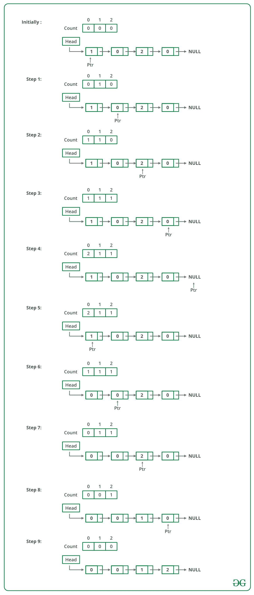

# 对0、1、2和2的链接列表进行排序

给定一个链接列表0、1和2，对其进行排序。

**范例**：

> **输入：** 1-> 1-> 2-> 0-> 2-> 0-> 1->空
> **输出：** 0-> 0-> 1-> 1-> 1-> 2-> 2-> NULL
> 
> **输入：** 1-> 1-> 2-> 1-> 0->空
> **输出：** 0-> 1-> 1-> 1-> 2->空

资料来源：[微软访谈| 设置1](https://www.geeksforgeeks.org/microsoft-interview-set-1/)

可以使用以下步骤对给定的链表进行排序。

*   遍历列表并计算0、1和2的数量。 设计数分别为n1，n2和n3。
*   再次遍历列表，用0填充前n1个节点，然后用1填充n2个节点，最后用2填充n3个节点。

下图是上述方法的模拟：



下面是上述方法的实现：

## C++

```cpp

// C++ Program to sort a linked list 0s, 1s or 2s  
#include <bits/stdc++.h> 
using namespace std; 

/* Link list node */
class Node  
{  
    public: 
    int data;  
    Node* next;  
};  

// Function to sort a linked list of 0s, 1s and 2s  
void sortList(Node *head)  
{  
    int count[3] = {0, 0, 0}; // Initialize count of '0', '1' and '2' as 0  
    Node *ptr = head;  

    /* count total number of '0', '1' and '2'  
    * count[0] will store total number of '0's  
    * count[1] will store total number of '1's  
    * count[2] will store total number of '2's */
    while (ptr != NULL)  
    {  
        count[ptr->data] += 1;  
        ptr = ptr->next;  
    }  

    int i = 0;  
    ptr = head;  

    /* Let say count[0] = n1, count[1] = n2 and count[2] = n3  
    * now start traversing list from head node,  
    * 1) fill the list with 0, till n1 > 0  
    * 2) fill the list with 1, till n2 > 0  
    * 3) fill the list with 2, till n3 > 0 */
    while (ptr != NULL)  
    {  
        if (count[i] == 0)  
            ++i;  
        else
        {  
            ptr->data = i;  
            --count[i];  
            ptr = ptr->next;  
        }  
    }  
}  

/* Function to push a node */
void push (Node** head_ref, int new_data)  
{  
    /* allocate node */
    Node* new_node = new Node(); 

    /* put in the data */
    new_node->data = new_data;  

    /* link the old list off the new node */
    new_node->next = (*head_ref);  

    /* move the head to point to the new node */
    (*head_ref) = new_node;  
}  

/* Function to print linked list */
void printList(Node *node)  
{  
    while (node != NULL)  
    {  
        cout << node->data << " ";  
        node = node->next;  
    }  
    cout << endl;  
}  

/* Driver code*/
int main(void)  
{  
    Node *head = NULL;  
    push(&head, 0);  
    push(&head, 1);  
    push(&head, 0);  
    push(&head, 2);  
    push(&head, 1);  
    push(&head, 1);  
    push(&head, 2);  
    push(&head, 1);  
    push(&head, 2);  

    cout << "Linked List Before Sorting\n";  
    printList(head);  

    sortList(head);  

    cout << "Linked List After Sorting\n";  
    printList(head);  

    return 0;  
}  

// This code is contributed by rathbhupendra 

```

## C

```c

// C Program to sort a linked list 0s, 1s or 2s 
#include<stdio.h> 
#include<stdlib.h> 

/* Link list node */
struct Node 
{ 
    int data; 
    struct Node* next; 
}; 

// Function to sort a linked list of 0s, 1s and 2s 
void sortList(struct Node *head) 
{ 
    int count[3] = {0, 0, 0};  // Initialize count of '0', '1' and '2' as 0 
    struct Node *ptr = head; 

    /* count total number of '0', '1' and '2' 
     * count[0] will store total number of '0's 
     * count[1] will store total number of '1's 
     * count[2] will store total number of '2's  */
    while (ptr != NULL) 
    { 
        count[ptr->data] += 1; 
        ptr = ptr->next; 
    } 

    int i = 0; 
    ptr = head; 

    /* Let say count[0] = n1, count[1] = n2 and count[2] = n3 
     * now start traversing list from head node, 
     * 1) fill the list with 0, till n1 > 0 
     * 2) fill the list with 1, till n2 > 0 
     * 3) fill the list with 2, till n3 > 0  */
    while (ptr != NULL) 
    { 
        if (count[i] == 0) 
            ++i; 
        else
        { 
            ptr->data = i; 
            --count[i]; 
            ptr = ptr->next; 
        } 
    } 
} 

/* Function to push a node */
void push (struct Node** head_ref, int new_data) 
{ 
    /* allocate node */
    struct Node* new_node = 
        (struct Node*) malloc(sizeof(struct Node)); 

    /* put in the data  */
    new_node->data  = new_data; 

    /* link the old list off the new node */
    new_node->next = (*head_ref); 

    /* move the head to point to the new node */
    (*head_ref)    = new_node; 
} 

/* Function to print linked list */
void printList(struct Node *node) 
{ 
    while (node != NULL) 
    { 
        printf("%d  ", node->data); 
        node = node->next; 
    } 
    printf("n"); 
} 

/* Driver program to test above function*/
int main(void) 
{ 
    struct Node *head = NULL; 
    push(&head, 0); 
    push(&head, 1); 
    push(&head, 0); 
    push(&head, 2); 
    push(&head, 1); 
    push(&head, 1); 
    push(&head, 2); 
    push(&head, 1); 
    push(&head, 2); 

    printf("Linked List Before Sorting\n"); 
    printList(head); 

    sortList(head); 

    printf("Linked List After Sorting\n"); 
    printList(head); 

    return 0; 
} 

```

## Java

```java

// Java program to sort a linked list of 0, 1 and 2 
class LinkedList 
{ 
    Node head;  // head of list 

    /* Linked list Node*/
    class Node 
    { 
        int data; 
        Node next; 
        Node(int d) {data = d; next = null; } 
    } 

    void sortList() 
    { 
       // initialise count of 0 1 and 2 as 0 
       int count[] = {0, 0, 0};  

       Node ptr = head; 

       /* count total number of '0', '1' and '2' 
        * count[0] will store total number of '0's 
        * count[1] will store total number of '1's 
        * count[2] will store total number of '2's  */
       while (ptr != null)  
       { 
            count[ptr.data]++; 
            ptr = ptr.next; 
       } 

       int i = 0; 
       ptr = head; 

       /* Let say count[0] = n1, count[1] = n2 and count[2] = n3 
        * now start traversing list from head node, 
        * 1) fill the list with 0, till n1 > 0 
        * 2) fill the list with 1, till n2 > 0 
        * 3) fill the list with 2, till n3 > 0  */
        while (ptr != null)  
        { 
            if (count[i] == 0) 
                i++; 
            else 
            { 
               ptr.data= i; 
               --count[i]; 
               ptr = ptr.next; 
            } 
         } 
    }                        

    /* Utility functions */

    /* Inserts a new Node at front of the list. */
    public void push(int new_data) 
    { 
        /* 1 & 2: Allocate the Node & 
                  Put in the data*/
        Node new_node = new Node(new_data); 

        /* 3\. Make next of new Node as head */
        new_node.next = head; 

        /* 4\. Move the head to point to new Node */
        head = new_node; 
    } 

    /* Function to print linked list */
    void printList() 
    { 
        Node temp = head; 
        while (temp != null) 
        { 
           System.out.print(temp.data+" "); 
           temp = temp.next; 
        }   
        System.out.println(); 
    } 

     /* Driver program to test above functions */
    public static void main(String args[]) 
    { 
        LinkedList llist = new LinkedList(); 

        /* Constructed Linked List is 1->2->3->4->5->6->7-> 
           8->8->9->null */
        llist.push(0); 
        llist.push(1); 
        llist.push(0); 
        llist.push(2); 
        llist.push(1); 
        llist.push(1); 
        llist.push(2); 
        llist.push(1); 
        llist.push(2); 

        System.out.println("Linked List before sorting"); 
        llist.printList(); 

        llist.sortList(); 

        System.out.println("Linked List after sorting"); 
        llist.printList(); 
    } 
}  
/* This code is contributed by Rajat Mishra */

```

## 蟒蛇

```

# Python program to sort a linked list of 0, 1 and 2 
class LinkedList(object): 
    def __init__(self): 

         # head of list 
         self.head = None

    # Linked list Node 
    class Node(object): 
        def __init__(self, d): 
            self.data = d 
            self.next = None

    def sortList(self): 

        # initialise count of 0 1 and 2 as 0 
        count = [0, 0, 0] 

        ptr = self.head 

        # count total number of '0', '1' and '2' 
        # * count[0] will store total number of '0's 
        # * count[1] will store total number of '1's 
        # * count[2] will store total number of '2's   
        while ptr != None: 
            count[ptr.data]+=1
            ptr = ptr.next

        i = 0
        ptr = self.head 

        # Let say count[0] = n1, count[1] = n2 and count[2] = n3 
        # * now start traversing list from head node, 
        # * 1) fill the list with 0, till n1 > 0 
        # * 2) fill the list with 1, till n2 > 0 
        # * 3) fill the list with 2, till n3 > 0   
        while ptr != None: 
            if count[i] == 0: 
                i+=1
            else: 
                ptr.data = i 
                count[i]-=1
                ptr = ptr.next

    # Utility functions 
    # Inserts a new Node at front of the list. 
    def push(self, new_data): 

        # 1 & 2: Allocate the Node & 
        # Put in the data 
        new_node = self.Node(new_data) 

        # 3\. Make next of new Node as head 
        new_node.next = self.head 

        # 4\. Move the head to point to new Node 
        self.head = new_node 

    # Function to print linked list 
    def printList(self): 
        temp = self.head 
        while temp != None: 
            print str(temp.data), 
            temp = temp.next
        print '' 

# Driver program to test above functions 
llist = LinkedList() 
llist.push(0) 
llist.push(1) 
llist.push(0) 
llist.push(2) 
llist.push(1) 
llist.push(1) 
llist.push(2) 
llist.push(1) 
llist.push(2) 

print "Linked List before sorting"
llist.printList() 

llist.sortList() 

print "Linked List after sorting"
llist.printList() 

# This code is contributed by BHAVYA JAIN 

```

## C#

```cs

// C# program to sort a linked  
// list of 0, 1 and 2 
using System; 

public class LinkedList 
{ 
    Node head; // head of list 

    /* Linked list Node*/
    class Node 
    { 
        public int data; 
        public Node next; 
        public Node(int d)  
        { 
            data = d; next = null; 
        } 
    } 

    void sortList() 
    { 

        // initialise count of 0 1 and 2 as 0 
        int []count = {0, 0, 0};  

        Node ptr = head; 

        /* count total number of '0', '1' and '2' 
        * count[0] will store total number of '0's 
        * count[1] will store total number of '1's 
        * count[2] will store total number of '2's */
        while (ptr != null)  
        { 
               count[ptr.data]++; 
            ptr = ptr.next; 
        } 

        int i = 0; 
        ptr = head; 

        /* Let say count[0] = n1, count[1] = n2 and count[2] = n3 
        * now start traversing list from head node, 
        * 1) fill the list with 0, till n1 > 0 
        * 2) fill the list with 1, till n2 > 0 
        * 3) fill the list with 2, till n3 > 0 */
        while (ptr != null)  
        { 
            if (count[i] == 0) 
                i++; 
            else
            { 
                ptr.data= i; 
                --count[i]; 
                ptr = ptr.next; 
            } 
        } 
    }                      

    /* Utility functions */

    /* Inserts a new Node at front of the list. */
    public void push(int new_data) 
    { 
        /* 1 & 2: Allocate the Node & 
                Put in the data*/
        Node new_node = new Node(new_data); 

        /* 3\. Make next of new Node as head */
        new_node.next = head; 

        /* 4\. Move the head to point to new Node */
        head = new_node; 
    } 

    /* Function to print linked list */
    void printList() 
    { 
        Node temp = head; 
        while (temp != null) 
        { 
            Console.Write(temp.data+" "); 
            temp = temp.next; 
        }  
        Console.WriteLine(); 
    } 

    /* Driver code */
    public static void Main(String []args) 
    { 
        LinkedList llist = new LinkedList(); 

        /* Constructed Linked List is 1->2->3->4-> 
        5->6->7->8->8->9->null */
        llist.push(0); 
        llist.push(1); 
        llist.push(0); 
        llist.push(2); 
        llist.push(1); 
        llist.push(1); 
        llist.push(2); 
        llist.push(1); 
        llist.push(2); 

        Console.WriteLine("Linked List before sorting"); 
        llist.printList(); 

        llist.sortList(); 

        Console.WriteLine("Linked List after sorting"); 
        llist.printList(); 
    } 
}  

/* This code is contributed by 29AjayKumar */

```

**Output:**

```
Linked List Before Sorting
2  1  2  1  1  2  0  1  0
Linked List After Sorting
0  0  1  1  1  1  2  2  2
```

**时间复杂度：** O（n），其中n是链表中的节点数。
**辅助空间：** O（1）

 **[通过更改链接对[0G]，[1S]和[2S]的链表进行排序](https://www.geeksforgeeks.org/sort-linked-list-0s-1s-2s-changing-links/)**

本文由 **Narendra Kangralkar** 编写。 如果发现任何不正确的地方，或者您想分享有关上述主题的更多信息，请发表评论。

