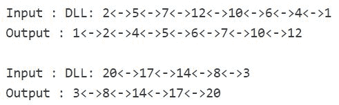

# 排序生物体双向链表

对给定的生物张力双链表进行排序。 双调双向链表是一个双向链表，它首先增加然后减小。 严格增加或严格减少的列表也是生物群落双链表。

**示例：**



**方法：**在列表中找到小于前一个节点的第一个节点。 使其为**当前**。 如果不存在这样的节点，则列表已经排序。 其他将列表分为两个列表，**第一个**从**头**节点开始直到**当前的**先前节点，**第二个**从**当前开始** 节点直到列表的末尾。 颠倒**第二个**双链表。 请参阅此帖子。 现在合并**第一个**和**第二个**排序的双链表。 请参阅此帖子的[合并程序。 最终的合并列表是必需的排序的双链表。](https://www.geeksforgeeks.org/merge-sort-for-doubly-linked-list/)

## C++

```cpp

// C++ implementation to sort the biotonic doubly linked list 
#include <bits/stdc++.h> 

using namespace std; 

// a node of the doubly linked list 
struct Node { 
    int data; 
    struct Node* next; 
    struct Node* prev; 
}; 

// Function to reverse a Doubly Linked List 
void reverse(struct Node** head_ref) 
{ 
    struct Node* temp = NULL; 
    struct Node* current = *head_ref; 

    // swap next and prev for all nodes 
    // of doubly linked list 
    while (current != NULL) { 
        temp = current->prev; 
        current->prev = current->next; 
        current->next = temp; 
        current = current->prev; 
    } 

    // Before changing head, check for the cases  
    // like empty list and list with only one node 
    if (temp != NULL) 
        *head_ref = temp->prev; 
} 

// Function to merge two sorted doubly linked lists 
struct Node* merge(struct Node* first, struct Node* second) 
{ 
    // If first linked list is empty 
    if (!first) 
        return second; 

    // If second linked list is empty 
    if (!second) 
        return first; 

    // Pick the smaller value 
    if (first->data < second->data) { 
        first->next = merge(first->next, second); 
        first->next->prev = first; 
        first->prev = NULL; 
        return first; 
    } else { 
        second->next = merge(first, second->next); 
        second->next->prev = second; 
        second->prev = NULL; 
        return second; 
    } 
} 

// function to sort a biotonic doubly linked list 
struct Node* sort(struct Node* head) 
{ 
    // if list is empty or if it contains a single 
    // node only 
    if (head == NULL || head->next == NULL) 
        return head; 

    struct Node* current = head->next; 

    while (current != NULL) { 

        // if true, then 'current' is the first node 
        // which is smaller than its previous node 
        if (current->data < current->prev->data) 
            break; 

        // move to the next node 
        current = current->next; 
    } 

    // if true, then list is already sorted 
    if (current == NULL) 
        return head; 

    // spilt into two lists, one starting with 'head' 
    // and other starting with 'current' 
    current->prev->next = NULL; 
    current->prev = NULL; 

    // reverse the list starting with 'current' 
    reverse(¤t); 

    // merge the two lists and return the 
    // final merged doubly linked list 
    return merge(head, current); 
} 

// Function to insert a node at the beginning 
// of the Doubly Linked List 
void push(struct Node** head_ref, int new_data) 
{ 
    // allocate node 
    struct Node* new_node = 
        (struct Node*)malloc(sizeof(struct Node)); 

    // put in the data 
    new_node->data = new_data; 

    // since we are adding at the beginning, 
    // prev is always NULL 
    new_node->prev = NULL; 

    // link the old list off the new node 
    new_node->next = (*head_ref); 

    // change prev of head node to new node 
    if ((*head_ref) != NULL) 
        (*head_ref)->prev = new_node; 

    // move the head to point to the new node 
    (*head_ref) = new_node; 
} 

// Function to print nodes in a given doubly  
// linked list 
void printList(struct Node* head) 
{ 
    // if list is empty 
    if (head == NULL) 
        cout << "Doubly Linked list empty"; 

    while (head != NULL) { 
        cout << head->data << " "; 
        head = head->next; 
    } 
} 

// Driver program to test above 
int main() 
{ 
    struct Node* head = NULL; 

    // Create the doubly linked list: 
    // 2<->5<->7<->12<->10<->6<->4<->1 
    push(&head, 1); 
    push(&head, 4); 
    push(&head, 6); 
    push(&head, 10); 
    push(&head, 12); 
    push(&head, 7); 
    push(&head, 5); 
    push(&head, 2); 

    cout << "Original Doubly linked list:n"; 
    printList(head); 

    // sort the biotonic DLL 
    head = sort(head); 

    cout << "\nDoubly linked list after sorting:n"; 
    printList(head); 

    return 0; 
} 

```

## Java

```java

// Java implementation to sort the 
// biotonic doubly linked list 
class GFG 
{ 

// a node of the doubly linked list 
static class Node  
{ 
    int data; 
    Node next; 
    Node prev; 
} 

// Function to reverse a Doubly Linked List 
static Node reverse( Node head_ref) 
{ 
    Node temp = null; 
    Node current = head_ref; 

    // swap next and prev for all nodes 
    // of doubly linked list 
    while (current != null) 
    { 
        temp = current.prev; 
        current.prev = current.next; 
        current.next = temp; 
        current = current.prev; 
    } 

    // Before changing head, check for the cases  
    // like empty list and list with only one node 
    if (temp != null) 
        head_ref = temp.prev; 
        return head_ref; 
} 

// Function to merge two sorted doubly linked lists 
static Node merge(Node first, Node second) 
{ 
    // If first linked list is empty 
    if (first == null) 
        return second; 

    // If second linked list is empty 
    if (second == null) 
        return first; 

    // Pick the smaller value 
    if (first.data < second.data) 
    { 
        first.next = merge(first.next, second); 
        first.next.prev = first; 
        first.prev = null; 
        return first; 
    }  
    else 
    { 
        second.next = merge(first, second.next); 
        second.next.prev = second; 
        second.prev = null; 
        return second; 
    } 
} 

// function to sort a biotonic doubly linked list 
static Node sort(Node head) 
{ 
    // if list is empty or if it contains  
    // a single node only 
    if (head == null || head.next == null) 
        return head; 

    Node current = head.next; 

    while (current != null)  
    { 

        // if true, then 'current' is the first node 
        // which is smaller than its previous node 
        if (current.data < current.prev.data) 
            break; 

        // move to the next node 
        current = current.next; 
    } 

    // if true, then list is already sorted 
    if (current == null) 
        return head; 

    // spilt into two lists, one starting with 'head' 
    // and other starting with 'current' 
    current.prev.next = null; 
    current.prev = null; 

    // reverse the list starting with 'current' 
    current = reverse(current); 

    // merge the two lists and return the 
    // final merged doubly linked list 
    return merge(head, current); 
} 

// Function to insert a node at the beginning 
// of the Doubly Linked List 
static Node push( Node head_ref, int new_data) 
{ 
    // allocate node 
    Node new_node = new Node(); 

    // put in the data 
    new_node.data = new_data; 

    // since we are adding at the beginning, 
    // prev is always null 
    new_node.prev = null; 

    // link the old list off the new node 
    new_node.next = (head_ref); 

    // change prev of head node to new node 
    if ((head_ref) != null) 
        (head_ref).prev = new_node; 

    // move the head to point to the new node 
    (head_ref) = new_node; 
    return head_ref; 
} 

// Function to print nodes in a given doubly  
// linked list 
static void printList( Node head) 
{ 
    // if list is empty 
    if (head == null) 
        System.out.println("Doubly Linked list empty"); 

    while (head != null) 
    { 
        System.out.print(head.data + " "); 
        head = head.next; 
    } 
} 

// Driver Code 
public static void main(String args[]) 
{ 
    Node head = null; 

    // Create the doubly linked list: 
    // 2<.5<.7<.12<.10<.6<.4<.1 
    head = push(head, 1); 
    head = push(head, 4); 
    head = push(head, 6); 
    head = push(head, 10); 
    head = push(head, 12); 
    head = push(head, 7); 
    head = push(head, 5); 
    head = push(head, 2); 

    System.out.println("Original Doubly linked list:n"); 
    printList(head); 

    // sort the biotonic DLL 
    head = sort(head); 

    System.out.println("\nDoubly linked list after sorting:n"); 
    printList(head); 
} 
} 

// This code is contributed by Arnab Kundu 

```

## 蟒蛇

```

# Python implementation to sort the 
# biotonic doubly linked list 

# Node of a doubly linked list  
class Node:  
    def __init__(self, next = None, prev = None, 
                data = None):  
        self.next = next
        self.prev = prev  
        self.data = data  

# Function to reverse a Doubly Linked List 
def reverse( head_ref): 

    temp = None
    current = head_ref 

    # swap next and prev for all nodes 
    # of doubly linked list 
    while (current != None): 

        temp = current.prev 
        current.prev = current.next
        current.next = temp 
        current = current.prev 

    # Before changing head, check for the cases  
    # like empty list and list with only one node 
    if (temp != None): 
        head_ref = temp.prev 
        return head_ref 

# Function to merge two sorted doubly linked lists 
def merge( first, second): 

    # If first linked list is empty 
    if (first == None): 
        return second 

    # If second linked list is empty 
    if (second == None): 
        return first 

    # Pick the smaller value 
    if (first.data < second.data): 

        first.next = merge(first.next, second) 
        first.next.prev = first 
        first.prev = None
        return first 

    else: 

        second.next = merge(first, second.next) 
        second.next.prev = second 
        second.prev = None
        return second 

# function to sort a biotonic doubly linked list 
def sort( head): 

    # if list is empty or if it contains  
    # a single node only 
    if (head == None or head.next == None): 
        return head 

    current = head.next

    while (current != None) : 

        # if true, then 'current' is the first node 
        # which is smaller than its previous node 
        if (current.data < current.prev.data): 
            break

        # move to the next node 
        current = current.next

    # if true, then list is already sorted 
    if (current == None): 
        return head 

    # spilt into two lists, one starting with 'head' 
    # and other starting with 'current' 
    current.prev.next = None
    current.prev = None

    # reverse the list starting with 'current' 
    current = reverse(current) 

    # merge the two lists and return the 
    # final merged doubly linked list 
    return merge(head, current) 

# Function to insert a node at the beginning 
# of the Doubly Linked List 
def push( head_ref, new_data): 

    # allocate node 
    new_node =Node() 

    # put in the data 
    new_node.data = new_data 

    # since we are adding at the beginning, 
    # prev is always None 
    new_node.prev = None

    # link the old list off the new node 
    new_node.next = (head_ref) 

    # change prev of head node to new node 
    if ((head_ref) != None): 
        (head_ref).prev = new_node 

    # move the head to point to the new node 
    (head_ref) = new_node 
    return head_ref 

# Function to print nodes in a given doubly  
# linked list 
def printList( head): 

    # if list is empty 
    if (head == None): 
        print("Doubly Linked list empty") 

    while (head != None): 

        print(head.data, end= " ") 
        head = head.next

# Driver Code 

head = None

# Create the doubly linked list: 
# 2<.5<.7<.12<.10<.6<.4<.1 
head = push(head, 1) 
head = push(head, 4) 
head = push(head, 6) 
head = push(head, 10) 
head = push(head, 12) 
head = push(head, 7) 
head = push(head, 5) 
head = push(head, 2) 

print("Original Doubly linked list:n") 
printList(head) 

# sort the biotonic DLL 
head = sort(head) 

print("\nDoubly linked list after sorting:") 
printList(head) 

# This code is contributed by Arnab Kundu 

```

## C#

```cs

// C# implementation to sort the 
// biotonic doubly linked list 
using System; 

class GFG 
{ 

// a node of the doubly linked list 
public class Node  
{ 
    public int data; 
    public Node next; 
    public Node prev; 
} 

// Function to reverse a Doubly Linked List 
static Node reverse( Node head_ref) 
{ 
    Node temp = null; 
    Node current = head_ref; 

    // swap next and prev for all nodes 
    // of doubly linked list 
    while (current != null) 
    { 
        temp = current.prev; 
        current.prev = current.next; 
        current.next = temp; 
        current = current.prev; 
    } 

    // Before changing head, check for the cases  
    // like empty list and list with only one node 
    if (temp != null) 
        head_ref = temp.prev; 
        return head_ref; 
} 

// Function to merge two sorted doubly linked lists 
static Node merge(Node first, Node second) 
{ 
    // If first linked list is empty 
    if (first == null) 
        return second; 

    // If second linked list is empty 
    if (second == null) 
        return first; 

    // Pick the smaller value 
    if (first.data < second.data) 
    { 
        first.next = merge(first.next, second); 
        first.next.prev = first; 
        first.prev = null; 
        return first; 
    }  
    else
    { 
        second.next = merge(first, second.next); 
        second.next.prev = second; 
        second.prev = null; 
        return second; 
    } 
} 

// function to sort a biotonic doubly linked list 
static Node sort(Node head) 
{ 
    // if list is empty or if it contains  
    // a single node only 
    if (head == null || head.next == null) 
        return head; 

    Node current = head.next; 

    while (current != null)  
    { 

        // if true, then 'current' is the first node 
        // which is smaller than its previous node 
        if (current.data < current.prev.data) 
            break; 

        // move to the next node 
        current = current.next; 
    } 

    // if true, then list is already sorted 
    if (current == null) 
        return head; 

    // spilt into two lists, one starting with 'head' 
    // and other starting with 'current' 
    current.prev.next = null; 
    current.prev = null; 

    // reverse the list starting with 'current' 
    current = reverse(current); 

    // merge the two lists and return the 
    // final merged doubly linked list 
    return merge(head, current); 
} 

// Function to insert a node at the beginning 
// of the Doubly Linked List 
static Node push( Node head_ref, int new_data) 
{ 
    // allocate node 
    Node new_node = new Node(); 

    // put in the data 
    new_node.data = new_data; 

    // since we are adding at the beginning, 
    // prev is always null 
    new_node.prev = null; 

    // link the old list off the new node 
    new_node.next = (head_ref); 

    // change prev of head node to new node 
    if ((head_ref) != null) 
        (head_ref).prev = new_node; 

    // move the head to point to the new node 
    (head_ref) = new_node; 
    return head_ref; 
} 

// Function to print nodes in a given doubly  
// linked list 
static void printList( Node head) 
{ 
    // if list is empty 
    if (head == null) 
        Console.WriteLine("Doubly Linked list empty"); 

    while (head != null) 
    { 
        Console.Write(head.data + " "); 
        head = head.next; 
    } 
} 

// Driver Code 
public static void Main(String []args) 
{ 
    Node head = null; 

    // Create the doubly linked list: 
    // 2<.5<.7<.12<.10<.6<.4<.1 
    head = push(head, 1); 
    head = push(head, 4); 
    head = push(head, 6); 
    head = push(head, 10); 
    head = push(head, 12); 
    head = push(head, 7); 
    head = push(head, 5); 
    head = push(head, 2); 

    Console.WriteLine("Original Doubly linked list:n"); 
    printList(head); 

    // sort the biotonic DLL 
    head = sort(head); 

    Console.WriteLine("\nDoubly linked list after sorting:n"); 
    printList(head); 
} 
} 

// This code is contributed by PrinciRaj1992 

```

**Output:**

```
Original Doubly linked list:
2 5 7 12 10 6 4 1
Doubly linked list after sorting:
1 2 4 5 6 7 10 12

```

时间复杂度：`O(n)`

本文由 **Ayush Jauhari** 提供。 如果您喜欢 GeeksforGeeks 并希望做出贡献，则还可以使用 [tribution.geeksforgeeks.org](http://www.contribute.geeksforgeeks.org) 撰写文章，或将您的文章邮寄至 tribution@geeksforgeeks.org。 查看您的文章出现在 GeeksforGeeks 主页上，并帮助其他 Geeks。

如果发现任何不正确的地方，或者您想分享有关上述主题的更多信息，请发表评论。

