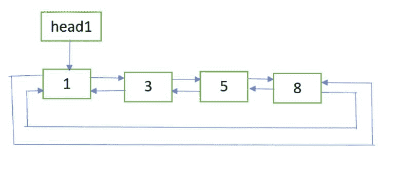

# 两个排序的双循环链表的排序合并

> 原文：[https://www.geeksforgeeks.org/sorted-merge-of-two-sorted-doubly-circular-linked-lists/](https://www.geeksforgeeks.org/sorted-merge-of-two-sorted-doubly-circular-linked-lists/)

给定两个已排序的[双循环链表](https://www.geeksforgeeks.org/doubly-circular-linked-list-set-1-introduction-and-insertion/)，分别包含 **n1** 和 **n2** 个节点。 问题是合并两个列表，使结果列表也处于排序顺序。

**示例**：

**列表 1**：



**列表 2**：


**最终列表**：


**方法**：以下是步骤：

1.  如果 head1 == NULL，则返回 head2。

2.  如果 head2 == NULL，则返回 head1。

3.  令 **last1** 和 **last2** 分别是两个列表的最后一个节点。 可以在第一个节点的先前链接的帮助下获得它们。

4.  获取指向该节点的指针，该节点将成为最终列表的最后一个节点。 如果 last1.data < last2.data, then **last_node** = last2，则其他 **last_node** = last1。

5.  更新 last1.next = last2.next = NULL。

6.  现在将两个列表合并为两个已排序的双向链表。 请参阅此帖子的**合并[的](https://www.geeksforgeeks.org/merge-sort-for-doubly-linked-list/)**程序。 令最终列表的第一个节点为 **finalHead** 。

7.  更新 finalHead.prev = last_node 和 last_node.next = finalHead。

8.  返回 **finalHead** 。

## C++

```cpp

// C++ implementation for Sorted merge of two 
// sorted doubly circular linked list 
#include <bits/stdc++.h> 
using namespace std; 

struct Node { 
    int data; 
    Node *next, *prev; 
}; 

// A utility function to insert a new node at the 
// beginning of doubly circular linked list 
void insert(Node** head_ref, int data) 
{ 
    // allocate space 
    Node* new_node = new Node; 

    // put in the data 
    new_node->data = data; 

    // if list is empty 
    if (*head_ref == NULL) { 
        new_node->next = new_node; 
        new_node->prev = new_node; 
    } 

    else { 

        // pointer points to last Node 
        Node* last = (*head_ref)->prev; 

        // setting up previous and next of new node 
        new_node->next = *head_ref; 
        new_node->prev = last; 

        // update next and previous pointers of head_ref 
        // and last. 
        last->next = (*head_ref)->prev = new_node; 
    } 

    // update head_ref pointer 
    *head_ref = new_node; 
} 

// function for Sorted merge of two 
// sorted doubly linked list 
Node* merge(Node* first, Node* second) 
{ 
    // If first list is empty 
    if (!first) 
        return second; 

    // If second list is empty 
    if (!second) 
        return first; 

    // Pick the smaller value and adjust 
    // the links 
    if (first->data < second->data) { 
        first->next = merge(first->next, second); 
        first->next->prev = first; 
        first->prev = NULL; 
        return first; 
    } 
    else { 
        second->next = merge(first, second->next); 
        second->next->prev = second; 
        second->prev = NULL; 
        return second; 
    } 
} 

// function for Sorted merge of two sorted 
// doubly circular linked list 
Node* mergeUtil(Node* head1, Node* head2) 
{ 
    // if 1st list is empty 
    if (!head1) 
        return head2; 

    // if 2nd list is empty 
    if (!head2) 
        return head1; 

    // get pointer to the node which will be the 
    // last node of the final list 
    Node* last_node; 
    if (head1->prev->data < head2->prev->data) 
        last_node = head2->prev; 
    else
        last_node = head1->prev; 

    // store NULL to the 'next' link of the last nodes 
    // of the two lists 
    head1->prev->next = head2->prev->next = NULL; 

    // sorted merge of head1 and head2 
    Node* finalHead = merge(head1, head2); 

    // 'prev' of 1st node pointing the last node 
    // 'next' of last node pointing to 1st node 
    finalHead->prev = last_node; 
    last_node->next = finalHead; 

    return finalHead; 
} 

// function to print the list 
void printList(Node* head) 
{ 
    Node* temp = head; 

    while (temp->next != head) { 
        cout << temp->data << " "; 
        temp = temp->next; 
    } 
    cout << temp->data << " "; 
} 

// Driver program to test above 
int main() 
{ 
    Node *head1 = NULL, *head2 = NULL; 

    // list 1: 
    insert(&head1, 8); 
    insert(&head1, 5); 
    insert(&head1, 3); 
    insert(&head1, 1); 

    // list 2: 
    insert(&head2, 11); 
    insert(&head2, 9); 
    insert(&head2, 7); 
    insert(&head2, 2); 

    Node* newHead = mergeUtil(head1, head2); 

    cout << "Final Sorted List: "; 
    printList(newHead); 

    return 0; 
} 

```

## Java

```java

// Java implementation for Sorted merge of two  
// sorted doubly circular linked list  
class GFG 
{ 

static class Node 
{  
    int data;  
    Node next, prev;  
};  

// A utility function to insert a new node at the  
// beginning of doubly circular linked list  
static Node insert(Node head_ref, int data)  
{  
    // allocate space  
    Node new_node = new Node();  

    // put in the data  
    new_node.data = data;  

    // if list is empty  
    if (head_ref == null) 
    {  
        new_node.next = new_node;  
        new_node.prev = new_node;  
    }  

    else
    {  

        // pointer points to last Node  
        Node last = (head_ref).prev;  

        // setting up previous and next of new node  
        new_node.next = head_ref;  
        new_node.prev = last;  

        // update next and previous pointers of head_ref  
        // and last.  
        last.next = (head_ref).prev = new_node;  
    }  

    // update head_ref pointer  
    head_ref = new_node;  
    return head_ref; 
}  

// function for Sorted merge of two  
// sorted doubly linked list  
static Node merge(Node first, Node second)  
{  
    // If first list is empty  
    if (first == null)  
        return second;  

    // If second list is empty  
    if (second == null)  
        return first;  

    // Pick the smaller value and adjust  
    // the links  
    if (first.data < second.data)  
    {  
        first.next = merge(first.next, second);  
        first.next.prev = first;  
        first.prev = null;  
        return first;  
    }  
    else 
    {  
        second.next = merge(first, second.next);  
        second.next.prev = second;  
        second.prev = null;  
        return second;  
    }  
}  

// function for Sorted merge of two sorted  
// doubly circular linked list  
static Node mergeUtil(Node head1, Node head2)  
{  
    // if 1st list is empty  
    if (head1 == null)  
        return head2;  

    // if 2nd list is empty  
    if (head2 == null)  
        return head1;  

    // get pointer to the node which will be the  
    // last node of the final list  
    Node last_node;  
    if (head1.prev.data < head2.prev.data)  
        last_node = head2.prev;  
    else
        last_node = head1.prev;  

    // store null to the 'next' link of the last nodes  
    // of the two lists  
    head1.prev.next = head2.prev.next = null;  

    // sorted merge of head1 and head2  
    Node finalHead = merge(head1, head2);  

    // 'prev' of 1st node pointing the last node  
    // 'next' of last node pointing to 1st node  
    finalHead.prev = last_node;  
    last_node.next = finalHead;  

    return finalHead;  
}  

// function to print the list  
static void printList(Node head)  
{  
    Node temp = head;  

    while (temp.next != head) 
    {  
        System.out.print ( temp.data+ " ");  
        temp = temp.next;  
    }  
    System.out.print ( temp.data + " ");  
}  

// Driver code  
public static void main(String args[]) 
{  
    Node head1 = null, head2 = null;  

    // list 1:  
    head1 = insert(head1, 8);  
    head1 = insert(head1, 5);  
    head1 = insert(head1, 3);  
    head1 = insert(head1, 1);  

    // list 2:  
    head2 = insert(head2, 11);  
    head2 = insert(head2, 9);  
    head2 = insert(head2, 7);  
    head2 = insert(head2, 2);  

    Node newHead = mergeUtil(head1, head2);  

    System.out.print( "Final Sorted List: ");  
    printList(newHead);  
} 
}  

// This code is contributed by Arnab Kundu 

```

## Python3

```py

    # Python3 implementation for Sorted merge  
# of two sorted doubly circular linked list 
import math 

class Node:  
    def __init__(self, data):  
        self.data = data  
        self.next = None
        self.prev = None

# A utility function to insert 
# a new node at the beginning  
# of doubly circular linked list 
def insert(head_ref, data): 

    # allocate space 
    new_node = Node(data) 

    # put in the data 
    new_node.data = data 

    # if list is empty 
    if (head_ref == None): 
        new_node.next = new_node 
        new_node.prev = new_node 

    else : 

        # pointer points to last Node 
        last = head_ref.prev 

        # setting up previous and  
        # next of new node 
        new_node.next = head_ref 
        new_node.prev = last 

        # update next and previous pointers  
        # of head_ref and last. 
        last.next = new_node 
        head_ref.prev = new_node 

    # update head_ref pointer 
    head_ref = new_node 
    return head_ref 

# function for Sorted merge of two 
# sorted doubly linked list 
def merge(first, second): 

    # If first list is empty 
    if (first == None): 
        return second 

    # If second list is empty 
    if (second == None): 
        return first 

    # Pick the smaller value and  
    # adjust the links 
    if (first.data < second.data) : 
        first.next = merge(first.next,  
                           second) 
        first.next.prev = first 
        first.prev = None
        return first 

    else : 
        second.next = merge(first,  
                            second.next) 
        second.next.prev = second 
        second.prev = None
        return second 

# function for Sorted merge of two sorted 
# doubly circular linked list 
def mergeUtil(head1, head2): 

    # if 1st list is empty 
    if (head1 == None): 
        return head2 

    # if 2nd list is empty 
    if (head2 == None): 
        return head1 

    # get pointer to the node  
    # which will be the last node  
    # of the final list last_node 
    if (head1.prev.data < head2.prev.data): 
        last_node = head2.prev 
    else: 
        last_node = head1.prev 

    # store None to the 'next' link of 
    # the last nodes of the two lists 
    head1.prev.next = None
    head2.prev.next = None

    # sorted merge of head1 and head2 
    finalHead = merge(head1, head2) 

    # 'prev' of 1st node pointing the last node 
    # 'next' of last node pointing to 1st node 
    finalHead.prev = last_node 
    last_node.next = finalHead 

    return finalHead 

# function to print the list 
def printList(head): 
    temp = head 

    while (temp.next != head): 
        print(temp.data, end = " ") 
        temp = temp.next

    print(temp.data, end = " ") 

# Driver Code 
if __name__=='__main__':  
    head1 = None
    head2 = None

    # list 1: 
    head1 = insert(head1, 8) 
    head1 = insert(head1, 5) 
    head1 = insert(head1, 3) 
    head1 = insert(head1, 1) 

    # list 2: 
    head2 = insert(head2, 11) 
    head2 = insert(head2, 9) 
    head2 = insert(head2, 7) 
    head2 = insert(head2, 2) 

    newHead = mergeUtil(head1, head2) 

    print("Final Sorted List: ", end = "") 
    printList(newHead) 

# This code is contributed by Srathore 

```

## C#

```cs

// C# implementation for Sorted merge of two  
// sorted doubly circular linked list  
using System; 

class GFG 
{ 

public class Node 
{  
    public int data;  
    public Node next, prev;  
};  

// A utility function to insert a new node at the  
// beginning of doubly circular linked list  
static Node insert(Node head_ref, int data)  
{  
    // allocate space  
    Node new_node = new Node();  

    // put in the data  
    new_node.data = data;  

    // if list is empty  
    if (head_ref == null) 
    {  
        new_node.next = new_node;  
        new_node.prev = new_node;  
    }  

    else
    {  

        // pointer points to last Node  
        Node last = (head_ref).prev;  

        // setting up previous and next of new node  
        new_node.next = head_ref;  
        new_node.prev = last;  

        // update next and previous pointers of head_ref  
        // and last.  
        last.next = (head_ref).prev = new_node;  
    }  

    // update head_ref pointer  
    head_ref = new_node;  
    return head_ref; 
}  

// function for Sorted merge of two  
// sorted doubly linked list  
static Node merge(Node first, Node second)  
{  
    // If first list is empty  
    if (first == null)  
        return second;  

    // If second list is empty  
    if (second == null)  
        return first;  

    // Pick the smaller value and adjust  
    // the links  
    if (first.data < second.data)  
    {  
        first.next = merge(first.next, second);  
        first.next.prev = first;  
        first.prev = null;  
        return first;  
    }  
    else
    {  
        second.next = merge(first, second.next);  
        second.next.prev = second;  
        second.prev = null;  
        return second;  
    }  
}  

// function for Sorted merge of two sorted  
// doubly circular linked list  
static Node mergeUtil(Node head1, Node head2)  
{  
    // if 1st list is empty  
    if (head1 == null)  
        return head2;  

    // if 2nd list is empty  
    if (head2 == null)  
        return head1;  

    // get pointer to the node which will be the  
    // last node of the final list  
    Node last_node;  
    if (head1.prev.data < head2.prev.data)  
        last_node = head2.prev;  
    else
        last_node = head1.prev;  

    // store null to the 'next' link of the last nodes  
    // of the two lists  
    head1.prev.next = head2.prev.next = null;  

    // sorted merge of head1 and head2  
    Node finalHead = merge(head1, head2);  

    // 'prev' of 1st node pointing the last node  
    // 'next' of last node pointing to 1st node  
    finalHead.prev = last_node;  
    last_node.next = finalHead;  

    return finalHead;  
}  

// function to print the list  
static void printList(Node head)  
{  
    Node temp = head;  

    while (temp.next != head) 
    {  
        Console.Write(temp.data + " ");  
        temp = temp.next;  
    }  
    Console.Write(temp.data + " ");  
}  

// Driver code  
public static void Main() 
{  
    Node head1 = null, head2 = null;  

    // list 1:  
    head1 = insert(head1, 8);  
    head1 = insert(head1, 5);  
    head1 = insert(head1, 3);  
    head1 = insert(head1, 1);  

    // list 2:  
    head2 = insert(head2, 11);  
    head2 = insert(head2, 9);  
    head2 = insert(head2, 7);  
    head2 = insert(head2, 2);  

    Node newHead = mergeUtil(head1, head2);  

    Console.Write( "Final Sorted List: ");  
    printList(newHead);  
} 
}  

// This code is contributed by Princi Singh 

```

**Output:**

```
Final Sorted List: 1 2 3 5 7 8 9 11

```

**时间复杂度**：O（n1 + n2）。


* * *

* * *

如果您喜欢 GeeksforGeeks 并希望做出贡献，则还可以使用 [tribution.geeksforgeeks.org](https://contribute.geeksforgeeks.org/) 撰写文章，或将您的文章邮寄至 tribution@geeksforgeeks.org。 查看您的文章出现在 GeeksforGeeks 主页上，并帮助其他 Geeks。

如果您发现任何不正确的地方，请单击下面的“改进文章”按钮，以改进本文。