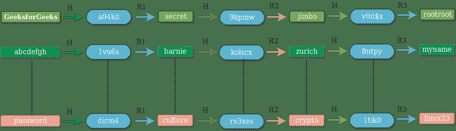

# 如何在数据库中存储密码？

> 原文：[https://www.geeksforgeeks.org/store-password-database/](https://www.geeksforgeeks.org/store-password-database/)

大多数 Web 应用程序要求其用户通过询问用户名和密码来对自己进行身份验证。 他们将用户提供的凭据与存储在其数据库中的数据进行比较，如果凭据匹配，则授予用户访问权限。 听起来不错！ 但是，如果网站存储密码的数据库遭到破坏，将会发生什么？

本文介绍了在数据库中存储密码的各种技术。

根据[裸露安全性](https://nakedsecurity.sophos.com/2013/04/23/users-same-password-most-websites/)，大多数网站中有 55% 的网络用户使用相同的密码！ 这意味着，如果以纯文本形式存储您的密码的网站遭到破坏，黑客不仅可以访问该网站上的帐户，还可以访问您使用相同密码的所有社交媒体，电子邮件，论坛等帐户！

好吧，许多人一定想知道，如果数据库暴露给黑客，那该怎么办？ 黑客有权访问所有信息。 错误！！ 有很多方法可以使黑客从数据库中检索密码变得很麻烦。 即使这样，开发人员还是倾向于忽略基本准则，而是以纯文本形式存储密码。有超过 30% 的网站以纯文本形式存储您的密码（也包括一些知名网站）。 如果网站以纯文本形式存储您的密码，那么无论您选择多强的密码，都不安全！

**在数据库中存储纯文本密码是一种罪过。**

人们可能还认为，如果不是纯文本，那么我们必须加密密码然后存储。 这也是一个可怕的想法。 加密功能提供输入和输出之间的一对一映射，并且它们始终是可逆的。 如果黑客获得了键，他将能够解密密码。 更好的方法是使用单向加密哈希函数。 散列函数在输入和输出之间提供多对一映射，实际上不可能反转输出。 好的加密哈希函数具有较少的[冲突](https://en.wikipedia.org/wiki/Collision_(computer_science))数量（即，对于该函数的不同输入值，很难获得相同的输出）。 由于[鸽笼原理](https://en.wikipedia.org/wiki/Pigeonhole_principle)，无法完全避免碰撞。 对于哈希密码，我们可以假设哈希函数将生成唯一的输出，即没有两个不同的密码，我们将获得相同的哈希值。

一些流行的加密哈希函数是 [MD5](https://en.wikipedia.org/wiki/MD5) 和 [SHA1](https://en.wikipedia.org/wiki/SHA-1) 。 代替将纯文本密码存储在数据库中，一种方法是存储密码的哈希。 您可能会想，如果我们无法从哈希中找回实际密码，那么我们将如何验证用户输入的凭据？ 很简单，对用户输入的密码应用相同的哈希函数，然后将其与数据库中存储的哈希进行比较。 如果两个哈希都匹配，则对用户进行身份验证（因为相同输入的哈希将提供相同的输出）。 现在，如果攻击者能够访问数据库，则他将只能查看哈希输出，而不能查看实际密码。

***使用加密哈希功能比存储纯文本密码*更好。**

黑客是聪明的人，一旦他们知道开发人员正在存储哈希密码，便会预先计算大量单词的哈希（从流行的单词列表或词典单词中得出）。 他们创建了一个单词表及其相应的哈希表。 该表被称为[彩虹表](https://en.wikipedia.org/wiki/Rainbow_table)，可随时在线获得。 他们可以使用此表通过比较从数据库获得的哈希值来反向查找实际密码。 因此，拥有一个**强密码**非常重要，因为密码出现在单词列表中的可能性越来越小。

简单地存储密码的哈希值将无济于事。 随着 GPU 和 CUDA，OpenCL 库的引入，处理能力大大提高。 快速的 GPU 可以在一秒钟内生成数百万个 MD5/SHA1 哈希。 因此，黑客可以通过暴力破解各种可能的组合轻松地生成大量哈希，并将其与存储在数据库中的哈希进行比较以提取实际密码。

**即使是哈希密码也不安全！ 惊讶吗** 

不要失去希望！ 开发人员仍然可以采取一些措施来防止您的密码被黑客窃取。 加入一些盐使密码更美味！ 是的，对..！ 加入[盐](https://en.wikipedia.org/wiki/Salt_(cryptography))。 盐是随机数据，在将其作为哈希函数的输入发送之前，已与您的密码连接在一起。

**例如**：

如果您的密码是`abc`，并且盐是`!ZaP0#8`，则结果`hashFunction('abc!ZaP0#8')`将存储在数据库中，而不是`hashFunction('abc')`。

因此，彩虹表攻击现在将不再有效，因为彩虹表包含`'abc!ZaP0#8'`的哈希值的可能性很小（因为通常彩虹表是由常用词，字典构成的 单词等）。 盐不存储在数据库中，而仅存在于外部用户无法访问的应用程序配置文件中。 获得对源文件的访问比获得对数据库的访问困难。

上述盐化方法是静态的。 我们为所有密码设置了一个固定的位数。 要验证用户身份，请先将固定盐连接到用户提供的输入（密码），然后将值传递给哈希函数，然后将其与数据库中存储的值进行比较。 但是，这种方法仍然容易受到暴力攻击，如果攻击者能够获得静态盐，则可以通过将盐连接在每个单词中来使用旧的攻击方法。

更好的方法是使用动态盐。 对于每个用户，加密强度高的随机字符串生成器都会生成新的盐。 用户输入的密码与随机生成的盐和静态盐连接在一起。 连接的字符串作为哈希函数的输入传递。 获得的结果存储在数据库中。 由于动态盐对于不同用户而言是不同的，因此需要将其存储在数据库中。 当要对用户进行身份验证时，首先从数据库中获取该用户的动态盐的值，然后将其与用户提供的输入和静态盐连接起来。 将结果与存储在数据库中的哈希进行比较。

如果数据库遭到破坏，黑客不仅会获取您的密码哈希，还会获取所使用的动态盐。 您可能想知道，如果攻击者拥有动态盐，那么动态盐比静态盐有什么优势？ 即使攻击者拥有动态盐，他也需要为数据库中存在的每个用户（根据动态盐）创建一个新的哈希表（或彩虹表）。 这比为所有用户只创建一张表要昂贵得多。

上面的方法很好地降低了黑客的速度。 但是，建议使用 *bcrypt* 和 *scrypt* 之类的算法代替 MD5/SHA1。 Bcrypt 是基于 Blowfish 的哈希算法。 它要求您指定成本/工作系数。 工作因子使整个过程变慢，因此生成哈希表所需的时间将增加多次。

**参考**：

[https://nakedsecurity.sophos.com/2013/11/20/serious-security-how-to-store-your-users- 安全密码/](https://nakedsecurity.sophos.com/2013/11/20/serious-security-how-to-store-your-users-passwords-safely/)

本文由 [**Saket Kumar**](https://www.facebook.com/saketkumar95) 提供。 如果您喜欢 GeeksforGeeks 并希望做出贡献，则还可以使用 [tribution.geeksforgeeks.org](http://www.contribute.geeksforgeeks.org) 撰写文章，或将您的文章邮寄至 tribution@geeksforgeeks.org。 查看您的文章出现在 GeeksforGeeks 主页上，并帮助其他 Geeks。

如果发现任何不正确的地方，或者想分享有关上述主题的更多信息，请写评论。

