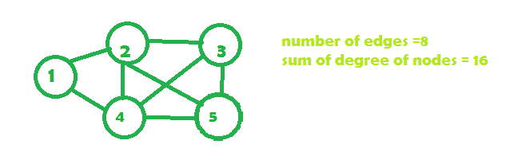

# 无向图

所有节点的度和

> 原文： [https://www.geeksforgeeks.org/sum-of-degrees-of-all-nodes-of-a-undirected-graph/](https://www.geeksforgeeks.org/sum-of-degrees-of-all-nodes-of-a-undirected-graph/)

给定图的边列表，我们必须找到无向图的所有节点的度数之和。
**范例**

**范例**：

```
Input : edge list : (1, 2), (2, 3), (1, 4), (2, 4)  
Output : sum= 8

```

**蛮力逼近**
我们将添加图的每个节点的度数并打印总和。

## C++

```cpp

// C++ implementation of above approach 
#include <bits/stdc++.h> 
using namespace std; 

// returns the sum of degree of all 
// the nodes in a undirected graph 
int count(int edges[][2], int len, int n) 
{ 
    int degree[n + 1] = { 0 }; 

    // compute the degree of each node 
    for (int i = 0; i < len; i++) { 

        // increase the degree of the 
        // nodes 
        degree[edges[i][0]]++; 
        degree[edges[i][1]]++; 
    } 

    // calculate the sum of degree 
    int sum = 0; 
    for (int i = 1; i <= n; i++) 
        sum += degree[i]; 

    return sum; 
} 

// main function 
int main() 
{ 
    // the edge list 
    int edges[][2] = { { 1, 2 }, 
                       { 2, 3 }, 
                       { 1, 4 }, 
                       { 2, 4 } }; 
    int len = sizeof(edges) / (sizeof(int) * 2), n = 4; 

    // display the result 
    cout << "sum = " << count(edges, len, n) << endl; 
    return 0; 
} 

```