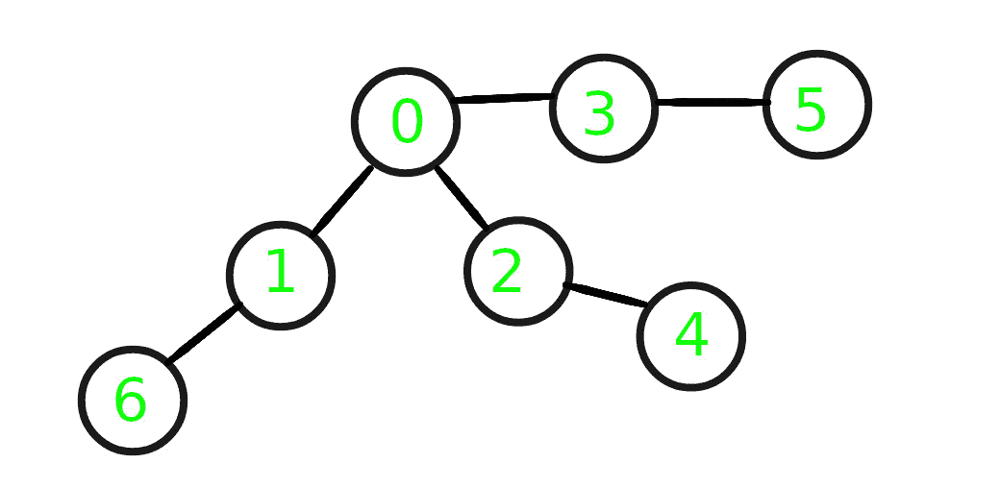

# 给定非循环图

每个深度处的最小元素总和

> 原文： [https://www.geeksforgeeks.org/sum-of-minimum-element-at-each-depth-of-a-given-non-cyclic-graph/](https://www.geeksforgeeks.org/sum-of-minimum-element-at-each-depth-of-a-given-non-cyclic-graph/)

给定一个具有`V`个节点和`E`边缘以及一个源节点`S`的非循环图，任务是计算每个级别上最小元素的总和 给定图中来自源节点`S`的数据。
**范例**：

> **输入**：S = 0，以下为给定图形。
> 
> [](https://media.geeksforgeeks.org/wp-content/uploads/20200623030949/graph.jpg)
> 
> **输出**：5
> **说明**：
> 深度 0 处只有一个节点，即 0。
> 深度 1 处有 3 个节点 1、2、3， 且它们的最小值为 1。
> 在深度 2 处还有另外 3 个节点，即 6、4、5，并且它们的最小值为 4。
> 因此，每个深度处的最小元素之和为 0 +1 + 4 = 5。
> 
> **输入**：S = 2，下面是给定的图形。
> 
> [](https://media.geeksforgeeks.org/wp-content/uploads/20200623030949/graph.jpg)
> 
> **输出**：8
> **说明**：
> 在深度 0 处只有 1 个节点，即 2。
> 在深度 1 处的最小元素为 0。
> 在深度 2 处 最小元素为 1\.
> 在深度 3 处的最小元素为 5
> ，因此每个深度的最小元素之和为 2 + 0 + 1 + 5 = 8。

**方法**：的想法是使用 [DFS 遍历](https://www.geeksforgeeks.org/depth-first-search-or-dfs-for-a-graph/)。 步骤如下：

1.  初始化一个数组（例如 **arr []** ）以在每个级别存储最小元素。
2.  从给定的具有可变深度（最初为`0`）的源节点`S`开始 DFS 遍历。
3.  更新数组 **arr []** 中当前深度的最小值。
4.  通过从前一个递归调用增加 depth 的值来递归地为子节点递归，以便可以相应地更新对应深度处的最小值。
5.  完成上述步骤后， **arr []** 中存储的值总和就是所需的总和。

下面是上述方法的实现：

## C++

```cpp

// C++ program for the above approach 
#include <bits/stdc++.h> 
using namespace std; 

// Function to add an edge in a graph 
void addEdge(vector<int> adj[], 
            int u, int v) 
{ 
    adj[u].push_back(v); 
    adj[v].push_back(u); 
} 

// Variable to store depth of graph 
int max_depth = 0; 

// Function to know the depth of graph 
void find_depth(vector<int> adj[], 
                vector<bool>& visited, 
                int start, int depth) 
{ 
    // Mark the node start as true 
    visited[start] = true; 

    // Update the maximum depth 
    max_depth = max(max_depth, depth); 

    // Recurr for the child node of 
    // start node 
    for (auto i : adj[start]) { 
        if (!visited[i]) 
            find_depth(adj, visited, 
                    i, depth + 1); 
    } 
} 

// Function to calculate min value 
// at every depth 
void dfs(vector<int> adj[], int start, 
        vector<bool>& visited, 
        vector<int>& store_min_elements, 
        int depth) 
{ 
    // marking already visited 
    // vertices as true 
    visited[start] = true; 

    // Store the min value for 
    // every depth 
    store_min_elements[depth] 
        = min(store_min_elements[depth], 
            start); 

    // Traverse Child node of start node 
    for (auto i : adj[start]) { 
        if (!visited[i]) 
            dfs(adj, i, visited, 
                store_min_elements, 
                depth + 1); 
    } 
} 

// Function to calculate the sum 
void minSum_depth(vector<int> adj[], 
                int start, 
                int total_nodes) 
{ 
    vector<bool> visited(total_nodes, 
                        false); 

    // Calling function to know 
    // the depth of graph 
    find_depth(adj, visited, 
            start, 0); 

    // Set all value of visited 
    // to false again 
    fill(visited.begin(), 
        visited.end(), false); 

    // Declaring vector of 
    // "max_depth + 1" size to 
    // store min values at every 
    // depth initialise vector 
    // with max number 
    vector<int> store_min_elements( 
        max_depth + 1, INT_MAX); 

    // Calling dfs function for 
    // calculation of min element 
    // at every depth 
    dfs(adj, start, visited, 
        store_min_elements, 0); 

    // Variable to store sum of 
    // all min elements 
    int min_sum = 0; 

    // Calculation of minimum sum 
    for (int i = 0; 
        i < store_min_elements.size(); 
        i++) { 
        min_sum += store_min_elements[i]; 
    } 

    // Print the minimum sum 
    cout << min_sum << endl; 
} 

// Driver Code 
int main() 
{ 
    // Given Nodes and start node 
    int V = 7, start = 0; 

    // Given graph 
    vector<int> adj[V]; 
    addEdge(adj, 0, 1); 
    addEdge(adj, 0, 2); 
    addEdge(adj, 0, 3); 
    addEdge(adj, 1, 6); 
    addEdge(adj, 2, 4); 
    addEdge(adj, 3, 5); 

    // Function Call 
    minSum_depth(adj, start, V); 
} 

```

## Java

```java

// Java program for the above approach  
import java.io.*;  
import java.util.*; 

class Graph{ 

public static int V; 

// Variable to store depth of graph 
public static int max_depth = 0;  
private static LinkedList<Integer> adj[];  

@SuppressWarnings("unchecked") 
Graph(int v)  
{  
    V = v;  
    adj = new LinkedList[v];  
    for(int i = 0; i < v; ++i)  
        adj[i] = new LinkedList();  
}  

static void addEdge(int v, int w)  
{  
    adj[v].add(w);  
}  

static void find_depth(boolean visited[],  
                       int start, int depth)  
{  

    // Mark the node start as true  
    visited[start] = true;  

    // Update the maximum depth  
    max_depth = Math.max(max_depth, depth);  

    // Recurr for the child node of  
    // start node  
    Iterator<Integer> i = adj[start].listIterator(); 
    while (i.hasNext())  
    { 
        int n = i.next();  
        if (!visited[n])  
            find_depth(visited, n, depth + 1);  
    } 
}  

// Function to calculate min value  
// at every depth  
static void dfs(int start, boolean visited[],  
                int store_min_elements[],  
                int depth)  
{  

    // Marking already visited  
    // vertices as true  
    visited[start] = true;  

    // Store the min value for  
    // every depth  
    store_min_elements[depth] = Math.min( 
        store_min_elements[depth], start);  

    // Traverse Child node of start node  
    Iterator<Integer> i = adj[start].listIterator(); 
    while (i.hasNext())  
    { 
        int n = i.next();  
        if (!visited[n])  
            dfs(n, visited, store_min_elements,  
                depth + 1);  
    } 
}  

// Function to calculate the sum  
static void minSum_depth(int start, int total_nodes)  
{  
    boolean visited[] = new boolean[total_nodes];  

    // Calling function to know  
    // the depth of graph  
    find_depth(visited, start, 0);  

    // Set all value of visited  
    // to false again  
    Arrays.fill(visited, false);  

    // Declaring vector of  
    // "max_depth + 1" size to  
    // store min values at every  
    // depth initialise vector  
    // with max number  
    int store_min_elements[] = new int[max_depth + 1]; 
    Arrays.fill(store_min_elements,  
                Integer.MAX_VALUE); 

    // Calling dfs function for  
    // calculation of min element  
    // at every depth  
    dfs(start, visited,  
        store_min_elements, 0);  

    // Variable to store sum of  
    // all min elements  
    int min_sum = 0;  

    // Calculation of minimum sum  
    for(int i = 0;  
            i < store_min_elements.length;  
            i++) 
    {  
        min_sum += store_min_elements[i];  
    }  

    // Print the minimum sum  
    System.out.println(min_sum); 
}  

// Driver Code  
public static void main(String args[])  
{  

    // Given Nodes and start node 
    V = 7; 
    int start = 0;  

    Graph g = new Graph(V);  

    // Given graph  
    g.addEdge(0, 1);  
    g.addEdge(0, 2);  
    g.addEdge(0, 3);  
    g.addEdge(1, 6);  
    g.addEdge(2, 4);  
    g.addEdge(3, 5);  

    // Function call  
    minSum_depth( start, V);  
}  
}  

// This code is contributed by Stream_Cipher 

```

## C#

```cs

// C# program for the above approach 
using System; 
using System.Collections.Generic;  

class Graph{  

private static int V; 
private static int start; 

// Variable to store depth of graph 
public static int max_depth = 0;  
private static List<int>[] adj;  

Graph(int v)  
{  
    V = v;  
    adj = new List<int>[v];  
    for(int i = 0; i < v; ++i)  
        adj[i] = new List<int>();  
}  

// Function to add an edge in a graph  
void addEdge(int v, int w)  
{  
    adj[v].Add(w);  
}  

// Function to know the depth of graph 
void find_depth(bool []visited,  
                int start, int depth)  
{  

    // Mark the node start as true  
    visited[start] = true;  

    // Update the maximum depth  
    max_depth = Math.Max(max_depth, depth);  

    // Recurr for the child node of  
    // start node  
    List<int> vList = adj[start];  
    foreach(var n in vList)  
    {  
        if (!visited[n])  
            find_depth(visited, n,  
                       depth + 1);  
    }  
}  

// Function to calculate min value  
// at every depth  
void dfs(int start, bool []visited,  
         int []store_min_elements,  
         int depth)  
{  

    // Marking already visited  
    // vertices as true  
    visited[start] = true;  

    // Store the min value for  
    // every depth  
    store_min_elements[depth] = Math.Min( 
        store_min_elements[depth], start);  

    // Traverse Child node of start node  
    List<int> vList = adj[start];  
    foreach(var n in vList)  
    {  
        if (!visited[n])  
            dfs(n, visited,  
                store_min_elements,  
                depth + 1);  
    }  
}  

// Function to calculate the sum  
void minSum_depth(int start, int total_nodes)  
{  
    bool []visited = new bool[total_nodes];  

    // Calling function to know  
    // the depth of graph  
    find_depth(visited, start, 0);  

    // Set all value of visited  
    // to false again 
    for(int i = 0; i < visited.Length; i++)  
    {  
        visited[i] = false; 
    }  

    // Declaring vector of "max_depth + 1" 
    // size to store min values at every  
    // depth initialise vector with max number  
    int []store_min_elements = new int [max_depth + 1]; 
    for(int i = 0;  
            i < store_min_elements.Length; 
            i++)  
    {  
        store_min_elements[i] = Int32.MaxValue; 
    }  

    // Calling dfs function for  
    // calculation of min element  
    // at every depth  
    dfs(start, visited, store_min_elements, 0);  

    // Variable to store sum of  
    // all min elements  
    int min_sum = 0;  

    // Calculation of minimum sum  
    for(int i = 0;  
            i < store_min_elements.Length; 
            i++) 
    {  
        min_sum += store_min_elements[i];  
    }  

    // Print the minimum sum  
    Console.WriteLine(min_sum); 
}  

// Driver Code  
public static void Main()  
{  

    // Given Nodes and start node 
    V = 7; 
    start = 0;  
    Graph g = new Graph(V);  

    // Given graph  
    g.addEdge(0, 1);  
    g.addEdge(0, 2);  
    g.addEdge(0, 3);  
    g.addEdge(1, 6);  
    g.addEdge(2, 4);  
    g.addEdge(3, 5);  

    // Function call 
    g.minSum_depth(start , V);  
}  
}  

// This code is contributed by Stream_Cipher 

```

**Output:** 

```
5

```

**时间复杂度**：*O（V + E）*
**辅助空间**：*O（V）*


* * *

* * *

如果您喜欢 GeeksforGeeks 并希望做出贡献，则还可以使用 [tribution.geeksforgeeks.org](https://contribute.geeksforgeeks.org/) 撰写文章，或将您的文章邮寄至 tribution@geeksforgeeks.org。 查看您的文章出现在 GeeksforGeeks 主页上，并帮助其他 Geeks。

如果您发现任何不正确的地方，请单击下面的“改进文章”按钮，以改进本文。