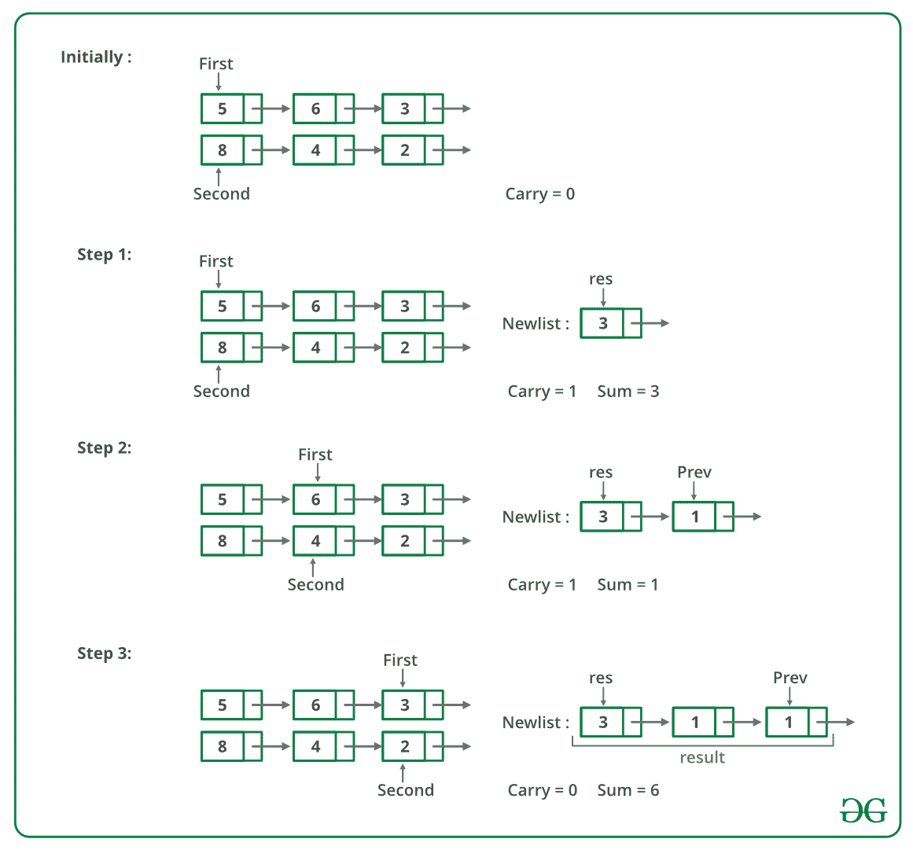

# 添加两个由链表表示的数字 | 系列 2

> 原文：[https://www.geeksforgeeks.org/sum-of-two-linked-lists/](https://www.geeksforgeeks.org/sum-of-two-linked-lists/)

给定由两个链表表示的两个数字，编写一个返回求和表的函数。 求和列表是两个输入数字相加的链表表示。 不允许修改列表。 另外，不允许使用显式的额外空间（提示：使用递归）。

**示例**：

```
Input:
  First List: 5->6->3  
  Second List: 8->4->2 
Output
  Resultant list: 1->4->0->5

```

我们在此处讨论了一种解决方案[，该解决方案用于链表，其中最低有效位是列表的第一个节点，而最高有效位是最后一个节点。 在此问题中，最高有效节点是第一个节点，最低有效位数是最后一个节点，我们不允许修改列表。 此处使用递归从右到左计算总和。

以下是步骤。

1.  计算给定两个链表的大小。

2.  如果大小相同，则使用递归计算总和。 将所有节点保持在递归调用栈中，直到最右边的节点，计算最右边的节点的总和，然后再进位到左边。

3.  如果尺寸不相同，请执行以下步骤：

    +  计算两个链表的大小差异。 假设差异为`diff`，

    +   将`diff`节点移到较大的链表中。 现在，使用步骤 2 计算较小列表和较大列表的右子列表（大小相同）的总和。 另外，存储此和的进位。

    +   用较大列表的剩余左子列表计算进位总和（在上一步中计算）。 此和的节点将添加到上一步获得的和列表的开头。

[以下是上述方法的模拟](https://www.geeksforgeeks.org/archives/15194) ：



下图是上述方法的实现。

## C++

```cpp

// A C++ recursive program to add two linked lists
#include <bits/stdc++.h>
using namespace std;

// A linked List Node
class Node {
public:
    int data;
    Node* next;
};

typedef Node node;

/* A utility function to insert
a node at the beginning of linked list */
void push(Node** head_ref, int new_data)
{
    /* allocate node */
    Node* new_node = new Node[(sizeof(Node))];

    /* put in the data */
    new_node->data = new_data;

    /* link the old list off the new node */
    new_node->next = (*head_ref);

    /* move the head to point to the new node */
    (*head_ref) = new_node;
}

/* A utility function to print linked list */
void printList(Node* node)
{
    while (node != NULL) {
        cout << node->data << " ";
        node = node->next;
    }
    cout << endl;
}

// A utility function to swap two pointers
void swapPointer(Node** a, Node** b)
{
    node* t = *a;
    *a = *b;
    *b = t;
}

/* A utility function to get size of linked list */
int getSize(Node* node)
{
    int size = 0;
    while (node != NULL) {
        node = node->next;
        size++;
    }
    return size;
}

// Adds two linked lists of same size
// represented by head1 and head2 and returns
// head of the resultant linked list. Carry
// is propagated while returning from the recursion
node* addSameSize(Node* head1, Node* head2, int* carry)
{
    // Since the function assumes linked lists are of same
    // size, check any of the two head pointers
    if (head1 == NULL)
        return NULL;

    int sum;

    // Allocate memory for sum node of current two nodes
    Node* result = new Node[(sizeof(Node))];

    // Recursively add remaining nodes and get the carry
    result->next
        = addSameSize(head1->next, head2->next, carry);

    // add digits of current nodes and propagated carry
    sum = head1->data + head2->data + *carry;
    *carry = sum / 10;
    sum = sum % 10;

    // Assigne the sum to current node of resultant list
    result->data = sum;

    return result;
}

// This function is called after the
// smaller list is added to the bigger
// lists's sublist of same size. Once the
// right sublist is added, the carry
// must be added toe left side of larger
// list to get the final result.
void addCarryToRemaining(Node* head1, Node* cur, int* carry,
                         Node** result)
{
    int sum;

    // If diff. number of nodes are not traversed, add carry
    if (head1 != cur) {
        addCarryToRemaining(head1->next, cur, carry,
                            result);

        sum = head1->data + *carry;
        *carry = sum / 10;
        sum %= 10;

        // add this node to the front of the result
        push(result, sum);
    }
}

// The main function that adds two linked lists
// represented by head1 and head2\. The sum of
// two lists is stored in a list referred by result
void addList(Node* head1, Node* head2, Node** result)
{
    Node* cur;

    // first list is empty
    if (head1 == NULL) {
        *result = head2;
        return;
    }

    // second list is empty
    else if (head2 == NULL) {
        *result = head1;
        return;
    }

    int size1 = getSize(head1);
    int size2 = getSize(head2);

    int carry = 0;

    // Add same size lists
    if (size1 == size2)
        *result = addSameSize(head1, head2, &carry);

    else {
        int diff = abs(size1 - size2);

        // First list should always be larger than second
        // list. If not, swap pointers
        if (size1 < size2)
            swapPointer(&head1, &head2);

        // move diff. number of nodes in first list
        for (cur = head1; diff--; cur = cur->next)
            ;

        // get addition of same size lists
        *result = addSameSize(cur, head2, &carry);

        // get addition of remaining first list and carry
        addCarryToRemaining(head1, cur, &carry, result);
    }

    // if some carry is still there, add a new node to the
    // fron of the result list. e.g. 999 and 87
    if (carry)
        push(result, carry);
}

// Driver code
int main()
{
    Node *head1 = NULL, *head2 = NULL, *result = NULL;

    int arr1[] = { 9, 9, 9 };
    int arr2[] = { 1, 8 };

    int size1 = sizeof(arr1) / sizeof(arr1[0]);
    int size2 = sizeof(arr2) / sizeof(arr2[0]);

    // Create first list as 9->9->9
    int i;
    for (i = size1 - 1; i >= 0; --i)
        push(&head1, arr1[i]);

    // Create second list as 1->8
    for (i = size2 - 1; i >= 0; --i)
        push(&head2, arr2[i]);

    addList(head1, head2, &result);

    printList(result);

    return 0;
}

// This code is contributed by rathbhupendra

```

## C

```c

// A recursive program to add two linked lists

#include <stdio.h>
#include <stdlib.h>

// A linked List Node
struct Node {
    int data;
    struct Node* next;
};

typedef struct Node node;

/* A utility function to insert a 
  node at the beginning of
 * linked list */
void push(struct Node** head_ref, int new_data)
{
    /* allocate node */
    struct Node* new_node
        = (struct Node*)malloc(sizeof(struct Node));

    /* put in the data  */
    new_node->data = new_data;

    /* link the old list off the new node */
    new_node->next = (*head_ref);

    /* move the head to point to the new node */
    (*head_ref) = new_node;
}

/* A utility function to print linked list */
void printList(struct Node* node)
{
    while (node != NULL) {
        printf("%d  ", node->data);
        node = node->next;
    }
    printf("n");
}

// A utility function to swap two pointers
void swapPointer(Node** a, Node** b)
{
    node* t = *a;
    *a = *b;
    *b = t;
}

/* A utility function to get size 
   of linked list */
int getSize(struct Node* node)
{
    int size = 0;
    while (node != NULL) {
        node = node->next;
        size++;
    }
    return size;
}

// Adds two linked lists of same 
// size represented by head1
// and head2 and returns head of 
// the resultant linked list.
// Carry is propagated while 
// returning from the recursion
node* addSameSize(Node* head1,
                  Node* head2, int* carry)
{
    // Since the function assumes
    // linked lists are of same
    // size, check any of the two 
    // head pointers
    if (head1 == NULL)
        return NULL;

    int sum;

    // Allocate memory for sum 
    // node of current two nodes
    Node* result = (Node*)malloc(sizeof(Node));

    // Recursively add remaining nodes
    // and get the carry
    result->next
        = addSameSize(head1->next, 
                      head2->next, carry);

    // add digits of current nodes 
    // and propagated carry
    sum = head1->data + head2->data + *carry;
    *carry = sum / 10;
    sum = sum % 10;

    // Assigne the sum to current 
    // node of resultant list
    result->data = sum;

    return result;
}

// This function is called after 
// the smaller list is added
// to the bigger lists's sublist 
// of same size.  Once the
// right sublist is added, the 
// carry must be added toe left
// side of larger list to get 
// the final result.
void addCarryToRemaining(Node* head1, 
                         Node* cur, int* carry,
                         Node** result)
{
    int sum;

    // If diff. number of nodes are 
    // not traversed, add carry
    if (head1 != cur) {
        addCarryToRemaining(head1->next,
                            cur, carry,
                            result);

        sum = head1->data + *carry;
        *carry = sum / 10;
        sum %= 10;

        // add this node to the front of the result
        push(result, sum);
    }
}

// The main function that adds two 
// linked lists represented
// by head1 and head2\. The sum of
// two lists is stored in a
// list referred by result
void addList(Node* head1, 
             Node* head2, Node** result)
{
    Node* cur;

    // first list is empty
    if (head1 == NULL) {
        *result = head2;
        return;
    }

    // second list is empty
    else if (head2 == NULL)
    {
        *result = head1;
        return;
    }

    int size1 = getSize(head1);
    int size2 = getSize(head2);

    int carry = 0;

    // Add same size lists
    if (size1 == size2)
        *result = addSameSize(head1, head2, &carry);

    else {
        int diff = abs(size1 - size2);

        // First list should always be 
        // larger than second
        // list. If not, swap pointers
        if (size1 < size2)
            swapPointer(&head1, &head2);

        // move diff. number of nodes in first list
        for (cur = head1; diff--; cur = cur->next)
            ;

        // get addition of same size lists
        *result = addSameSize(cur, 
                              head2, &carry);

        // get addition of remaining first list and carry
        addCarryToRemaining(head1, 
                            cur, &carry, result);
    }

    // if some carry is still there, add a new node to the
    // fron of the result list. e.g. 999 and 87
    if (carry)
        push(result, carry);
}

// Driver code
int main()
{
    Node *head1 = NULL, *head2 = NULL, *result = NULL;

    int arr1[] = { 9, 9, 9 };
    int arr2[] = { 1, 8 };

    int size1 = sizeof(arr1) / sizeof(arr1[0]);
    int size2 = sizeof(arr2) / sizeof(arr2[0]);

    // Create first list as 9->9->9
    int i;
    for (i = size1 - 1; i >= 0; --i)
        push(&head1, arr1[i]);

    // Create second list as 1->8
    for (i = size2 - 1; i >= 0; --i)
        push(&head2, arr2[i]);

    addList(head1, head2, &result);

    printList(result);

    return 0;
}

```

## Java

```java

// Java program to add two linked lists

public class linkedlistATN 
{
    class node 
    {
        int val;
        node next;

        public node(int val) 
        {
            this.val = val;
        }
    }

    // Function to print linked list
    void printlist(node head) 
    {
        while (head != null) 
        {
            System.out.print(head.val + " ");
            head = head.next;
        }
    }

    node head1, head2, result;
    int carry;

    /* A utility function to push a value to linked list */
    void push(int val, int list) 
    {
        node newnode = new node(val);
        if (list == 1) 
        {
            newnode.next = head1;
            head1 = newnode;
        } 
        else if (list == 2) 
        {
            newnode.next = head2;
            head2 = newnode;
        } 
        else
        {
            newnode.next = result;
            result = newnode;
        }

    }

    // Adds two linked lists of same size represented by
    // head1 and head2 and returns head of the resultant 
    // linked list. Carry is propagated while returning 
    // from the recursion
    void addsamesize(node n, node m) 
    {
        // Since the function assumes linked lists are of 
        // same size, check any of the two head pointers
        if (n == null)
            return;

        // Recursively add remaining nodes and get the carry
        addsamesize(n.next, m.next);

        // add digits of current nodes and propagated carry
        int sum = n.val + m.val + carry;
        carry = sum / 10;
        sum = sum % 10;

        // Push this to result list
        push(sum, 3);

    }

    node cur;

    // This function is called after the smaller list is 
    // added to the bigger lists's sublist of same size. 
    // Once the right sublist is added, the carry must be 
    // added to the left side of larger list to get the 
    // final result.
    void propogatecarry(node head1) 
    {
        // If diff. number of nodes are not traversed, add carry
        if (head1 != cur) 
        {
            propogatecarry(head1.next);
            int sum = carry + head1.val;
            carry = sum / 10;
            sum %= 10;

            // add this node to the front of the result
            push(sum, 3);
        }
    }

    int getsize(node head) 
    {
        int count = 0;
        while (head != null) 
        {
            count++;
            head = head.next;
        }
        return count;
    }

    // The main function that adds two linked lists 
    // represented by head1 and head2\. The sum of two 
    // lists is stored in a list referred by result
    void addlists() 
    {
        // first list is empty
        if (head1 == null) 
        {
            result = head2;
            return;
        }

        // first list is empty
        if (head2 == null) 
        {
            result = head1;
            return;
        }

        int size1 = getsize(head1);
        int size2 = getsize(head2);

        // Add same size lists
        if (size1 == size2) 
        {
            addsamesize(head1, head2);
        } 
        else
        {
            // First list should always be larger than second list.
            // If not, swap pointers
            if (size1 < size2) 
            {
                node temp = head1;
                head1 = head2;
                head2 = temp;
            }
            int diff = Math.abs(size1 - size2);

            // move diff. number of nodes in first list
            node temp = head1;
            while (diff-- >= 0) 
            {
                cur = temp;
                temp = temp.next;
            }

            // get addition of same size lists
            addsamesize(cur, head2);

            // get addition of remaining first list and carry
            propogatecarry(head1);
        }
            // if some carry is still there, add a new node to 
            // the front of the result list. e.g. 999 and 87
            if (carry > 0)
                push(carry, 3);

    }

    // Driver program to test above functions
    public static void main(String args[])
    {
        linkedlistATN list = new linkedlistATN();
        list.head1 = null;
        list.head2 = null;
        list.result = null;
        list.carry = 0;
        int arr1[] = { 9, 9, 9 };
        int arr2[] = { 1, 8 };

        // Create first list as 9->9->9
        for (int i = arr1.length - 1; i >= 0; --i)
            list.push(arr1[i], 1);

        // Create second list as 1->8
        for (int i = arr2.length - 1; i >= 0; --i)
            list.push(arr2[i], 2);

        list.addlists();

        list.printlist(list.result);
    }
}

// This code is contributed by Rishabh Mahrsee

```

**Output**

```
1 0 1 7 

```

时间复杂度：`O(M + N)`，其中`m`和`n`是给定两个链表的大小。

**迭代方法**：

此实现没有任何递归调用开销，这意味着它是一个迭代解决方案。

由于我们需要从两个链表中的最后一个开始添加数字。 因此，这里我们将使用栈数据结构来实现这一点。

*   我们首先将从给定的两个链表中获得两个栈。

*   然后，我们将运行一个循环，直到两个栈都为空。

*   在每次迭代中，我们都会跟踪进位。

*   最后，如果进位> 0，则意味着我们需要在结果列表的开头增加一个节点以容纳此进位。

## C++

```cpp

// C++ Iterative program to add two linked lists  
#include <bits/stdc++.h> 
using namespace std; 

// A linked List Node  
class Node  
{  
    public: 
    int data;  
    Node* next;  
};

// to push a new node to linked list
void push(Node** head_ref, int new_data)  
{  
    /* allocate node */
    Node* new_node = new Node[(sizeof(Node))];  

    /* put in the data */
    new_node->data = new_data;  

    /* link the old list off the new node */
    new_node->next = (*head_ref);  

    /* move the head to point to the new node */
    (*head_ref) = new_node;  
}

// to add two new numbers
Node* addTwoNumList(Node* l1, Node* l2) {
    stack<int> s1,s2;
    while(l1!=NULL){
        s1.push(l1->data);
        l1=l1->next;
    }
    while(l2!=NULL){
        s2.push(l2->data);
        l2=l2->next;
    }
    int carry=0;
    Node* result=NULL;
    while(s1.empty()==false || s2.empty()==false){
        int a=0,b=0;
        if(s1.empty()==false){
            a=s1.top();s1.pop();
        }
        if(s2.empty()==false){
            b=s2.top();s2.pop();
        }
        int total=a+b+carry;
        Node* temp=new Node();
        temp->data=total%10;
        carry=total/10;
        if(result==NULL){
            result=temp;
        }else{
            temp->next=result;
            result=temp;
        }
    }
    if(carry!=0){
        Node* temp=new Node();
        temp->data=carry;
        temp->next=result;
        result=temp;
    }
    return result;
}

// to print a linked list
void printList(Node *node)  
{  
    while (node != NULL)  
    {  
        cout<<node->data<<" ";  
        node = node->next;  
    }  
    cout<<endl;  
}

// Driver Code
int main()  
{  
    Node *head1 = NULL, *head2 = NULL;  

    int arr1[] = {5, 6, 7};  
    int arr2[] = {1, 8};  

    int size1 = sizeof(arr1) / sizeof(arr1[0]);  
    int size2 = sizeof(arr2) / sizeof(arr2[0]);  

    // Create first list as 5->6->7  
    int i;  
    for (i = size1-1; i >= 0; --i)  
        push(&head1, arr1[i]);  

    // Create second list as 1->8  
    for (i = size2-1; i >= 0; --i)  
        push(&head2, arr2[i]);  

    Node* result=addTwoNumList(head1, head2);
    printList(result);  

    return 0;  
}

```

**Output**

```
5 8 5 

```

相关文章：[添加两个由链表表示的数字 | 系列 1](https://www.geeksforgeeks.org/add-two-numbers-represented-by-linked-lists/)

如果发现不正确的内容，或者想分享有关上述主题的更多信息，请写评论。

