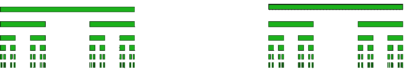

# 康托尔集的三进制表示

> 原文：[https://www.geeksforgeeks.org/ternary-representation-of-cantor-set/](https://www.geeksforgeeks.org/ternary-representation-of-cantor-set/)

给定三个整数`A`，`B`和`L`，任务是在`L`级别打印范围`[A, B]`。

**三元康托尔集**：三元康托尔集是通过将线段的中间部分（分为 3 部分）移除并在剩余的较短段上重复此过程而构建的。 以下是康托尔集的图示。



三元康托尔集的示意图

**示例**：

> **输入**：`A = 0, B = 1, L = 2`
>
> **输出**：
>
> 级别 0：`[0.000000]-[1.000000]`
>
> 级别 1：`[0.000000]-[0.333333] [0.666667]-[1.000000]`
>
> 级别 2：`[0.000000]-[0.111111] [0.222222]-[0.333333] [0.666667]-[0.777778] [0.888889]-[1.000000]`
>
> **说明**：对于级别 1 的给定范围`[0, 1]`，它分为三个部分（`[0, 0.33], [0.33, 0.67], [0.67, 1]`）。 在这三个部分中，中间部分被忽略。 对于后续执行中的每个部分，将继续执行此过程。
> 
> **输入**：`A = 0, B = 9, L = 3`
>
> **输出**：
>
> 级别 0：`[0.000000] — [9.000000]`
>
> 级别 1：`[0.000000]-[3.000000] [6.000000]-[9.000000]`
>
> 级别 2：`[0.000000]-[1.000000] [2.000000]-[3.000000] [6.000000]-[7.000000] [8.000000]-[9.000000]`
>
> 级别 3：`[0.000000]-[0.333333] [0.666667]-[1.000000] [2.000000]-[2.333333] [2.666667]-[3.000000] [6.000000]-[6.333333] [6.666667]-[7.000000] [8.000000]-[8.333333] [8.666667]-[9.000000]`

**方法**：

1.  为集合的每个节点创建一个[链表](http://www.geeksforgeeks.org/data-structures/linked-list/)数据结构，并具有开始值，结束值和指向下一个节点的指针。

2.  使用给定的开始和结束值初始化列表。

3.  对于下一个级别：

    *   创建一个新节点，其起始值和终止值之差为初始值的`1/3 rd`，即起始值小于初始终止值的`1/3 rd`。

    *   此外，修改原始节点，以使最终值比初始值高`1/3 rd`。

    *   相应地，将指向新节点的指针放在原始节点之后

下面是上述方法的实现：

## C++

```cpp

// C++ implementation to find the cantor set 
// for n levels and 
// for a given start_num and end_num 
#include <bits/stdc++.h> 
using namespace std; 

// The Linked List Structure for the Cantor Set 
typedef struct cantor { 
    double start, end; 
    struct cantor* next; 
} Cantor; 

// Function to initialize the Cantor Set List 
Cantor* startList(Cantor* head, 
                double start_num, 
                double end_num) 
{ 
    if (head == NULL) { 
        head = new Cantor; 
        head->start = start_num; 
        head->end = end_num; 
        head->next = NULL; 
    } 
    return head; 
} 

// Function to propogate the list 
// by adding new nodes for the next levels 
Cantor* propagate(Cantor* head) 
{ 
    Cantor* temp = head; 

    if (temp != NULL) { 
        Cantor* newNode 
            = new Cantor; 
        double diff 
            = (((temp->end) - (temp->start)) / 3); 

        // Modifying the start and end values 
        // for the next level 
        newNode->end = temp->end; 
        temp->end = ((temp->start) + diff); 
        newNode->start = (newNode->end) - diff; 

        // Changing the pointers 
        // to the next node 
        newNode->next = temp->next; 
        temp->next = newNode; 

        // Recursively call the function 
        // to generate the Cantor Set 
        // for the entire level 
        propagate(temp->next->next); 
    } 

    return head; 
} 

// Function to print a level of the Set 
void print(Cantor* temp) 
{ 
    while (temp != NULL) { 
        printf("[%lf] -- [%lf]\t", 
            temp->start, temp->end); 
        temp = temp->next; 
    } 
    cout << endl; 
} 

// Function to build and display 
// the Cantor Set for each level 
void buildCantorSet(int A, int B, int L) 
{ 
    Cantor* head = NULL; 
    head = startList(head, A, B); 
    for (int i = 0; i < L; i++) { 
        cout <<"Level_"<< i<<" : "; 
        print(head); 
        propagate(head); 
    } 
    cout <<"Level_"<< L<<" : "; 
    print(head); 
} 

// Driver code 
int main() 
{ 
    int A = 0; 
    int B = 9; 
    int L = 2; 
    buildCantorSet(A, B, L); 

    return 0; 
} 

// This code is contributed by shivanisingh 

```

## C

```c

// C implementation to find the cantor set 
// for n levels and 
// for a given start_num and end_num 

#include <stdio.h> 
#include <stdlib.h> 
#include <string.h> 

// The Linked List Structure for the Cantor Set 
typedef struct cantor { 
    double start, end; 
    struct cantor* next; 
} Cantor; 

// Function to initialize the Cantor Set List 
Cantor* startList(Cantor* head, 
                  double start_num, 
                  double end_num) 
{ 
    if (head == NULL) { 
        head = (Cantor*)malloc(sizeof(Cantor)); 
        head->start = start_num; 
        head->end = end_num; 
        head->next = NULL; 
    } 
    return head; 
} 

// Function to propogate the list 
// by adding new nodes for the next levels 
Cantor* propagate(Cantor* head) 
{ 
    Cantor* temp = head; 

    if (temp != NULL) { 
        Cantor* newNode 
            = (Cantor*)malloc(sizeof(Cantor)); 
        double diff 
            = (((temp->end) - (temp->start)) / 3); 

        // Modifying the start and end values 
        // for the next level 
        newNode->end = temp->end; 
        temp->end = ((temp->start) + diff); 
        newNode->start = (newNode->end) - diff; 

        // Changing the pointers 
        // to the next node 
        newNode->next = temp->next; 
        temp->next = newNode; 

        // Recursively call the function 
        // to generate the Cantor Set 
        // for the entire level 
        propagate(temp->next->next); 
    } 

    return head; 
} 

// Function to print a level of the Set 
void print(Cantor* temp) 
{ 
    while (temp != NULL) { 
        printf("[%lf] -- [%lf]\t", 
               temp->start, temp->end); 
        temp = temp->next; 
    } 
    printf("\n"); 
} 

// Function to build and display 
// the Cantor Set for each level 
void buildCantorSet(int A, int B, int L) 
{ 
    Cantor* head = NULL; 
    head = startList(head, A, B); 
    for (int i = 0; i < L; i++) { 
        printf("Level_%d : ", i); 
        print(head); 
        propagate(head); 
    } 
    printf("Level_%d : ", L); 
    print(head); 
} 

// Driver code 
int main() 
{ 
    int A = 0; 
    int B = 9; 
    int L = 2; 
    buildCantorSet(A, B, L); 

    return 0; 
} 

```

## Java

```java

// Java implementation to find the cantor set 
// for n levels and 
// for a given start_num and end_num 

class GFG 
{ 

    // The Linked List Structure for the Cantor Set 
    static class Cantor 
    { 
        double start, end; 
        Cantor next; 
    }; 

    static Cantor Cantor; 

    // Function to initialize the Cantor Set List 
    static Cantor startList(Cantor head, double start_num,  
                            double end_num) 
    { 
        if (head == null)  
        { 
            head = new Cantor(); 
            head.start = start_num; 
            head.end = end_num; 
            head.next = null; 
        } 
        return head; 
    } 

    // Function to propogate the list 
    // by adding new nodes for the next levels 
    static Cantor propagate(Cantor head)  
    { 
        Cantor temp = head; 

        if (temp != null) 
        { 
            Cantor newNode = new Cantor(); 
            double diff = (((temp.end) - (temp.start)) / 3); 

            // Modifying the start and end values 
            // for the next level 
            newNode.end = temp.end; 
            temp.end = ((temp.start) + diff); 
            newNode.start = (newNode.end) - diff; 

            // Changing the pointers 
            // to the next node 
            newNode.next = temp.next; 
            temp.next = newNode; 

            // Recursively call the function 
            // to generate the Cantor Set 
            // for the entire level 
            propagate(temp.next.next); 
        } 

        return head; 
    } 

    // Function to print a level of the Set 
    static void print(Cantor temp) 
    { 
        while (temp != null)  
        { 
            System.out.printf("[%f] -- [%f]", temp.start, temp.end); 
            temp = temp.next; 
        } 
        System.out.printf("\n"); 
    } 

    // Function to build and display 
    // the Cantor Set for each level 
    static void buildCantorSet(int A, int B, int L) 
    { 
        Cantor head = null; 
        head = startList(head, A, B); 
        for (int i = 0; i < L; i++)  
        { 
            System.out.printf("Level_%d : ", i); 
            print(head); 
            propagate(head); 
        } 
        System.out.printf("Level_%d : ", L); 
        print(head); 
    } 

    // Driver code 
    public static void main(String[] args)  
    { 
        int A = 0; 
        int B = 9; 
        int L = 2; 
        buildCantorSet(A, B, L); 
    } 
} 

// This code is contributed by Rajput-Ji 

```

## C#

```cs

// C# implementation to find the cantor set 
// for n levels and 
// for a given start_num and end_num 
using System; 

class GFG 
{ 

    // The Linked List Structure for the Cantor Set 
    class Cantor 
    { 
        public double start, end; 
        public Cantor next; 
    }; 

    static Cantor cantor; 

    // Function to initialize the Cantor Set List 
    static Cantor startList(Cantor head, double start_num,  
                            double end_num) 
    { 
        if (head == null)  
        { 
            head = new Cantor(); 
            head.start = start_num; 
            head.end = end_num; 
            head.next = null; 
        } 
        return head; 
    } 

    // Function to propogate the list 
    // by adding new nodes for the next levels 
    static Cantor propagate(Cantor head)  
    { 
        Cantor temp = head; 

        if (temp != null) 
        { 
            Cantor newNode = new Cantor(); 
            double diff = (((temp.end) - (temp.start)) / 3); 

            // Modifying the start and end values 
            // for the next level 
            newNode.end = temp.end; 
            temp.end = ((temp.start) + diff); 
            newNode.start = (newNode.end) - diff; 

            // Changing the pointers 
            // to the next node 
            newNode.next = temp.next; 
            temp.next = newNode; 

            // Recursively call the function 
            // to generate the Cantor Set 
            // for the entire level 
            propagate(temp.next.next); 
        } 

        return head; 
    } 

    // Function to print a level of the Set 
    static void print(Cantor temp) 
    { 
        while (temp != null)  
        { 
            Console.Write("[{0:F6}] -- [{1:F6}]",  
                            temp.start, temp.end); 
            temp = temp.next; 
        } 
        Console.Write("\n"); 
    } 

    // Function to build and display 
    // the Cantor Set for each level 
    static void buildCantorSet(int A, int B, int L) 
    { 
        Cantor head = null; 
        head = startList(head, A, B); 
        for (int i = 0; i < L; i++)  
        { 
            Console.Write("Level_{0} : ", i); 
            print(head); 
            propagate(head); 
        } 
        Console.Write("Level_{0} : ", L); 
        print(head); 
    } 

    // Driver code 
    public static void Main(String[] args)  
    { 
        int A = 0; 
        int B = 9; 
        int L = 2; 
        buildCantorSet(A, B, L); 
    } 
} 

// This code is contributed by Rajput-Ji 

```

**输出**：
> Level_0：[0.000000] — [9.000000]
> Level_1：[0.000000] — [3.000000] [6.000000] — [9.000000]
> Level_2：[0.000000] — [1.000000] [2.000000] — [3.000000] [6.000000] -[7.000000] [8.000000]-[9.000000]

**参考**：[康托尔集维基百科](https://en.wikipedia.org/wiki/Cantor_set)

**相关文章**：[乔治·康托尔有理数集的第`N`项](https://www.geeksforgeeks.org/n-th-term-of-george-cantor-set-of-rational-numbers/)


* * *

* * *

如果您喜欢 GeeksforGeeks 并希望做出贡献，则还可以使用 [tribution.geeksforgeeks.org](https://contribute.geeksforgeeks.org/) 撰写文章，或将您的文章邮寄至 tribution@geeksforgeeks.org。 查看您的文章出现在 GeeksforGeeks 主页上，并帮助其他 Geeks。

如果您发现任何不正确的地方，请单击下面的“改进文章”按钮，以改进本文。