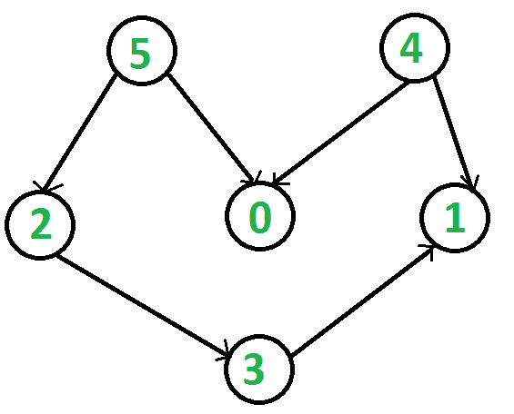

# 使用顶点

的离开时间对图进行拓扑排序

> 原文： [https://www.geeksforgeeks.org/topological-sorting-using-departure-time-of-vertex/](https://www.geeksforgeeks.org/topological-sorting-using-departure-time-of-vertex/)

给定有向无环图（DAG），找到图的拓扑排序。

**有向无环图（DAG）的拓扑排序**是顶点的线性排序，因此对于每个有向边 uv，顶点 u 在该排序中都位于 v 之前。 如果图形不是 DAG，则无法对图形进行拓扑排序。

例如，下图的拓扑排序是“ 5 4 2 3 1 0”。 一个图可以有多个拓扑排序。 例如，下图的另一拓扑排序是“ 4 5 2 3 1 0”。



请注意，拓扑排序中的第一个顶点始终是度数为 0 的顶点（没有输入边的顶点）。 对于上面的图，顶点 4 和 5 没有传入边。

我们已经讨论了使用堆栈的[基于 DFS 的算法](https://www.geeksforgeeks.org/topological-sorting/)和用于拓扑排序的 [Kahn 算法](https://www.geeksforgeeks.org/topological-sorting-indegree-based-solution/)。 我们还在这里讨论了如何打印 DAG [的所有拓扑类型。 在这篇文章中，讨论了另一种基于 DFS 的方法，该方法通过引入 DFS 中顶点的到达和离开时间的**概念来查找图的拓扑排序。**](https://www.geeksforgeeks.org/all-topological-sorts-of-a-directed-acyclic-graph/)

**什么是 DFS 中顶点的到达时间&离开时间？**

在 DFS 中，**到达时间**是第一次探索顶点的时间，**出发时间**是我们探索顶点的所有邻居的时间， 准备回溯。

**如何使用出发时间找到图的拓扑排序？**
要查找图的拓扑排序，我们从所有未访问的顶点开始一个一个地运行 [DFS](https://www.geeksforgeeks.org/depth-first-traversal-for-a-graph/) 。 对于任何顶点，在探索其任何邻居之前，我们会记录该顶点的到达时间，而在探索该顶点的所有邻居之后，我们会记录其出发时间。 请注意，只需要离开时间即可找到图的拓扑排序，因此我们可以跳过顶点的到达时间。 最后，在访问完图的所有顶点之后，我们按照顶点减小的离开时间的顺序打印顶点，这是我们所需的顶点拓扑顺序。

以下是上述想法的 C ++实现–

```

// A C++ program to print topological sorting of a DAG 
#include<bits/stdc++.h> 
using namespace std; 

// Graph class represents a directed graph using adjacency  
// list representation 
class Graph 
{ 
    int V; // No. of vertices 
    // Pointer to an array containing adjacency lists 
    list<int>* adj; 
public: 
    Graph(int); // Constructor 
    ~Graph();    // Destructor 

    // function to add an edge to graph 
    void addEdge(int, int); 

    // The function to do DFS traversal 
    void DFS(int, vector<bool> &, vector<int> &, int &); 

    // The function to do Topological Sort. 
    void topologicalSort(); 
}; 

Graph::Graph(int V) 
{ 
    this->V = V; 
    adj = new list<int>[V]; 
} 

Graph::~Graph() 
{ 
    delete[] adj; 
} 

void Graph::addEdge(int v, int w) 
{ 
    adj[v].push_back(w);    // Add w to v's list. 
} 

// The function to do DFS() and stores departure time  
// of all vertex 
void Graph::DFS(int v, vector<bool> &visited,  
                vector<int> &departure, int &time) 
{ 
    visited[v] = true; 
    // time++;    // arrival time of vertex v 

    for(int i : adj[v]) 
        if(!visited[i]) 
            DFS(i, visited, departure, time); 

    // set departure time of vertex v 
    departure[++time] = v; 
} 

// The function to do Topological Sort. It uses DFS(). 
void Graph::topologicalSort() 
{ 
    // vector to store departure time of vertex. 
    vector<int> departure(V, -1); 

    // Mark all the vertices as not visited 
    vector<bool> visited(V, false); 
    int time = -1; 

    // perform DFS on all unvisited vertices 
    for(int i = 0; i < V; i++) 
        if(!visited[i]) 
            DFS(i, visited, departure, time); 

    // Print vertices in topological order 
    for(int i = V - 1; i >= 0; i--) 
        cout << departure[i] << " "; 
} 

// Driver program to test above functions 
int main() 
{ 
    // Create a graph given in the above diagram 
    Graph g(6); 
    g.addEdge(5, 2); 
    g.addEdge(5, 0); 
    g.addEdge(4, 0); 
    g.addEdge(4, 1); 
    g.addEdge(2, 3); 
    g.addEdge(3, 1); 

    cout << "Topological Sort of the given graph is \n"; 
    g.topologicalSort(); 

    return 0; 
} 

```

输出：

```
Topological Sort of the given graph is 
5 4 2 3 1 0 

```

**上述解决方案的时间复杂度**为 O（V + E）。

本文由 **Aditya Goel** 提供。 如果您喜欢 GeeksforGeeks 并希望做出贡献，则还可以使用 [tribution.geeksforgeeks.org](http://www.contribute.geeksforgeeks.org) 撰写文章，或将您的文章邮寄至 tribution@geeksforgeeks.org。 查看您的文章出现在 GeeksforGeeks 主页上，并帮助其他 Geeks。

如果发现任何不正确的地方，或者想分享有关上述主题的更多信息，请写评论。

