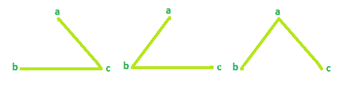

# 循环图中的生成树总数

> 原文： [https://www.geeksforgeeks.org/total-number-of-spanning-trees-in-a-cycle-graph/](https://www.geeksforgeeks.org/total-number-of-spanning-trees-in-a-cycle-graph/)

给定循环图中的顶点数。 任务是找到可能的生成树总数。
**注意**：循环/圆形图是仅包含一个循环的图。 生成树是图形中涵盖图形所有顶点的最短/最小路径。

**示例**：

```
Input: Vertices = 3
Output: Total Spanning tree = 3

Input: Vertices = 4
Output: Total Spanning tree = 4

```

**示例 1**：
**对于顶点= 3 的循环图**


**生成树可能为 3**


**示例 2**：
**对于顶点= 4 的循环图**


**生成树可能为 4**


因此，生成树的数量将始终等于循环图中的顶点数量。

**以下是必需的实现**：

## C++

```cpp

// C++ program to find number of 
// spanning trees 
#include <bits/stdc++.h> 
using namespace std; 

// function that calculates the 
// total Spanning tree 
int Spanning(int vertices) 
{ 
    result = 0; 

    result = vertices; 
    return result; 
} 

// Driver code 
int main() 
{ 
    int vertices = 4; 

    cout << "Spanning tree = " << Spanning(vertices); 
    return 0; 
} 

```