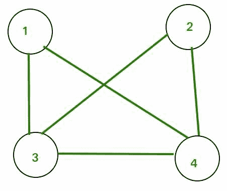

# 图形

中的生成树总数

> 原文： [https://www.geeksforgeeks.org/total-number-spanning-trees-graph/](https://www.geeksforgeeks.org/total-number-spanning-trees-graph/)

如果图是具有 n 个顶点的完整图，则生成树的总数为 n （n-2），其中 n 是图中的节点数。 在完整图中，该任务等于对具有 n 个节点的不同标记树进行计数，这些节点的树具有 [Cayley 公式](https://www.geeksforgeeks.org/g-fact-20-cayleys-formula-for-number-of-labelled-trees/)。

**如果图形不完整怎么办？**
遵循给定的过程：-
步骤 1：为给定的图形创建邻接矩阵。
步骤 2：将所有对角元素替换为节点的度数。 例如。 邻接矩阵（1,1）位置的元素将替换为节点 1 的度数，邻接矩阵（2,2）位置的元素将替换为节点 2 的度数，依此类推。
步骤 3：将所有非对角 1 替换为-1。
步骤 4：计算任何元素的辅因子。
步骤 5：获得的辅因子是该图的生成树总数。

考虑下图：

上图的邻接矩阵如下：

在应用了 STEP 2 和 STEP 3 之后，邻接矩阵将看起来像

（1，1）的辅因子是 8。 可以形成的生成树的最大数量为 8。
注意-所有元素的辅因子将相同。 因此，我们可以为矩阵的任何元素计算辅助因子。

此方法也称为[基尔霍夫定理](https://en.wikipedia.org/wiki/Kirchhoff%27s_theorem)。 它也可以应用于完整的图形。

请参考以下链接以证明上述步骤。
[https://en.wikipedia.org/wiki/Kirchhoff%27s_theorem#Proof_outline](https://en.wikipedia.org/wiki/Kirchhoff%27s_theorem#Proof_outline)

本文由 **Kapil Khandelwal** 提供。 如果您喜欢 GeeksforGeeks 并希望做出贡献，那么您也可以写一篇文章，并将您的文章邮寄到 contribution@geeksforgeeks.org。 查看您的文章出现在 GeeksforGeeks 主页上，并帮助其他 Geeks。

如果发现任何不正确的地方，或者想分享有关上述主题的更多信息，请发表评论。

