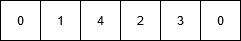

# 使用遗传算法

的旅行推销员问题

> 原文： [https://www.geeksforgeeks.org/traveling-salesman-problem-using-genetic-algorithm/](https://www.geeksforgeeks.org/traveling-salesman-problem-using-genetic-algorithm/)

**先决条件**：[遗传算法](https://www.geeksforgeeks.org/genetic-algorithms/)，[旅行商问题](https://www.geeksforgeeks.org/traveling-salesman-problem-tsp-implementation/)

在本文中，提出了一种遗传算法来解决[旅行商问题](https://www.geeksforgeeks.org/travelling-salesman-problem-set-1/)。

遗传算法是启发式搜索算法，其灵感来自支持生命进化的过程。 该算法旨在复制自然选择过程以进行生成，即优胜劣汰的生存。 标准遗传算法分为五个阶段：

1.  创建初始种群。
2.  计算适合度。
3.  选择最佳基因。
4.  越过。
5.  变异以引入变异。

可以实施这些算法来找到各种优化问题的解决方案。 这样的问题之一就是[旅行商问题](https://www.geeksforgeeks.org/traveling-salesman-problem-tsp-implementation/)。 问题是推销员得到了一组城市，他必须找到最短的路线，以至于只访问一次每个城市并返回起始城市。

**方法**：在以下实现中，将城市作为基因，使用这些字符生成的字符串称为染色体，而将适合度得分等于所提到的所有城市的路径长度作为目标 人口。

适合度得分定义为基因描述的路径的长度。 路径长度更合适的是基因。 基因库中所有基因的优胜劣汰在群体测试中幸存下来，并进行下一次迭代。 迭代次数取决于冷却变量的值。 冷却变量的值随着每次迭代而不断减小，并在一定数量的迭代后达到阈值。

**算法**：

```
1\. Initialize the population randomly.
2\. Determine the fitness of the chromosome.
3\. Until done repeat:
    1\. Select parents.
    2\. Perform crossover and mutation.
    3\. Calculate the fitness of the new population.
    4\. Append it to the gene pool.

```

**伪代码**

```
Initialize procedure GA{
    Set cooling parameter = 0;
    Evaluate population P(t);
    While( Not Done ){
        Parents(t) = Select_Parents(P(t));
        Offspring(t) = Procreate(P(t));
        p(t+1) = Select_Survivors(P(t), Offspring(t));
        t = t + 1; 
    }
}

```

**突变如何起作用？**

假设有 5 个城市：0、1、2、3、4。推销员在城市 0 中，他必须找到通过所有城市返回城市 0 的最短路线。代表所选路径的染色体可以是 表示为：


该染色体发生突变。 突变过程中，两个城市在染色体中的位置被交换以形成新的构型，除了第一个和最后一个单元格外，因为它们代表起点和终点。


根据下面定义的输入，原始染色体的路径长度等于 **INT_MAX** ，因为城市 1 和城市 4 之间的路径不存在。 突变后，形成的新子代的路径长度等于 **21** ，这是比原始假设优化得多的答案。 这就是遗传算法如何优化难题的解决方案。

下面是上述方法的实现：

```

// C++ implementation of the above approach 
#include <bits/stdc++.h> 
#include <limits.h> 
using namespace std; 

// Number of cities in TSP 
#define V 5 

// Names of the cities 
#define GENES ABCDE 

// Starting Node Value 
#define START 0 

// Initial population size for the algorithm 
#define POP_SIZE 10 

// Structure of a GNOME 
// string defines the path traversed 
// by the salesman while the fitness value 
// of the path is stored in an integer 

struct individual { 
    string gnome; 
    int fitness; 
}; 

// Function to return a random number 
// from start and end 
int rand_num(int start, int end) 
{ 
    int r = end - start; 
    int rnum = start + rand() % r; 
    return rnum; 
} 

// Function to check if the character 
// has already occurred in the string 
bool repeat(string s, char ch) 
{ 
    for (int i = 0; i < s.size(); i++) { 
        if (s[i] == ch) 
            return true; 
    } 
    return false; 
} 

// Function to return a mutated GNOME 
// Mutated GNOME is a string 
// with a random interchange 
// of two genes to create variation in species 
string mutatedGene(string gnome) 
{ 
    while (true) { 
        int r = rand_num(1, V); 
        int r1 = rand_num(1, V); 
        if (r1 != r) { 
            char temp = gnome[r]; 
            gnome[r] = gnome[r1]; 
            gnome[r1] = temp; 
            break; 
        } 
    } 
    return gnome; 
} 

// Function to return a valid GNOME string 
// required to create the population 
string create_gnome() 
{ 
    string gnome = "0"; 
    while (true) { 
        if (gnome.size() == V) { 
            gnome += gnome[0]; 
            break; 
        } 
        int temp = rand_num(1, V); 
        if (!repeat(gnome, (char)(temp + 48))) 
            gnome += (char)(temp + 48); 
    } 
    return gnome; 
} 

// Function to return the fitness value of a gnome. 
// The fitness value is the path length 
// of the path represented by the GNOME. 
int cal_fitness(string gnome) 
{ 
    int map[V][V] = { { 0, 2, INT_MAX, 12, 5 }, 
                      { 2, 0, 4, 8, INT_MAX }, 
                      { INT_MAX, 4, 0, 3, 3 }, 
                      { 12, 8, 3, 0, 10 }, 
                      { 5, INT_MAX, 3, 10, 0 } }; 
    int f = 0; 
    for (int i = 0; i < gnome.size() - 1; i++) { 
        if (map[gnome[i] - 48][gnome[i + 1] - 48] == INT_MAX) 
            return INT_MAX; 
        f += map[gnome[i] - 48][gnome[i + 1] - 48]; 
    } 
    return f; 
} 

// Function to return the updated value 
// of the cooling element. 
int cooldown(int temp) 
{ 
    return (90 * temp) / 100; 
} 

// Comparator for GNOME struct. 
bool lessthan(struct individual t1, 
              struct individual t2) 
{ 
    return t1.fitness < t2.fitness; 
} 

// Utility function for TSP problem. 
void TSPUtil(int map[V][V]) 
{ 
    // Generation Number 
    int gen = 1; 
    // Number of Gene Iterations 
    int gen_thres = 5; 

    vector<struct individual> population; 
    struct individual temp; 

    // Populating the GNOME pool. 
    for (int i = 0; i < POP_SIZE; i++) { 
        temp.gnome = create_gnome(); 
        temp.fitness = cal_fitness(temp.gnome); 
        population.push_back(temp); 
    } 

    cout << "\nInitial population: " << endl 
         << "GNOME     FITNESS VALUE\n"; 
    for (int i = 0; i < POP_SIZE; i++) 
        cout << population[i].gnome << "   "
             << population[i].fitness << endl; 
    cout << "\n"; 

    bool found = false; 
    int temperature = 10000; 

    // Iteration to perform 
    // population crossing and gene mutation. 
    while (temperature > 1000 && gen <= gen_thres) { 
        sort(population.begin(), population.end(), lessthan); 
        cout << "\nCurrent temp: " << temperature << "\n"; 
        vector<struct individual> new_population; 

        for (int i = 0; i < POP_SIZE; i++) { 
            struct individual p1 = population[i]; 

            while (true) { 
                string new_g = mutatedGene(p1.gnome); 
                struct individual new_gnome; 
                new_gnome.gnome = new_g; 
                new_gnome.fitness = cal_fitness(new_gnome.gnome); 

                if (new_gnome.fitness <= population[i].fitness) { 
                    new_population.push_back(new_gnome); 
                    break; 
                } 
                else { 

                    // Accepting the rejected children at 
                    // a possible probablity above threshold. 
                    float prob = pow(2.7, 
                                     -1 * ((float)(new_gnome.fitness 
                                                   - population[i].fitness) 
                                           / temperature)); 
                    if (prob > 0.5) { 
                        new_population.push_back(new_gnome); 
                        break; 
                    } 
                } 
            } 
        } 

        temperature = cooldown(temperature); 
        population = new_population; 
        cout << "Generation " << gen << " \n"; 
        cout << "GNOME     FITNESS VALUE\n"; 

        for (int i = 0; i < POP_SIZE; i++) 
            cout << population[i].gnome << "   "
                 << population[i].fitness << endl; 
        gen++; 
    } 
} 

int main() 
{ 

    int map[V][V] = { { 0, 2, INT_MAX, 12, 5 }, 
                      { 2, 0, 4, 8, INT_MAX }, 
                      { INT_MAX, 4, 0, 3, 3 }, 
                      { 12, 8, 3, 0, 10 }, 
                      { 5, INT_MAX, 3, 10, 0 } }; 
    TSPUtil(map); 
} 

```

**Output:**

```
Initial population: 
GNOME     FITNESS VALUE
043210   24
023410   2147483647
031420   2147483647
034210   31
043210   24
023140   2147483647
032410   2147483647
012340   24
012340   24
032410   2147483647

Current temp: 10000
Generation 1 
GNOME     FITNESS VALUE
013240   21
013240   21
012430   31
012430   31
031240   32
024310   2147483647
013420   2147483647
032140   2147483647
034210   31
012430   31

Current temp: 9000
Generation 2 
GNOME     FITNESS VALUE
031240   32
043210   24
012340   24
042130   32
043210   24
012340   24
034210   31
014320   2147483647
014320   2147483647
023140   2147483647

Current temp: 8100
Generation 3 
GNOME     FITNESS VALUE
013240   21
042310   21
013240   21
013240   21
031240   32
013240   21
012430   31
034120   2147483647
041320   2147483647
043120   2147483647

Current temp: 7290
Generation 4 
GNOME     FITNESS VALUE
031240   32
043210   24
043210   24
043210   24
012340   24
042130   32
013240   21
014320   2147483647
021340   2147483647
043210   24

Current temp: 6561
Generation 5 
GNOME     FITNESS VALUE
043210   24
042310   21
042310   21
013240   21
042310   21
034210   31
013240   21
042310   21
024310   2147483647
024310   2147483647

```


* * *

* * *

如果您喜欢 GeeksforGeeks 并希望做出贡献，则还可以使用 [tribution.geeksforgeeks.org](https://contribute.geeksforgeeks.org/) 撰写文章，或将您的文章邮寄至 tribution@geeksforgeeks.org。 查看您的文章出现在 GeeksforGeeks 主页上，并帮助其他 Geeks。

如果您发现任何不正确的地方，请单击下面的“改进文章”按钮，以改进本文。