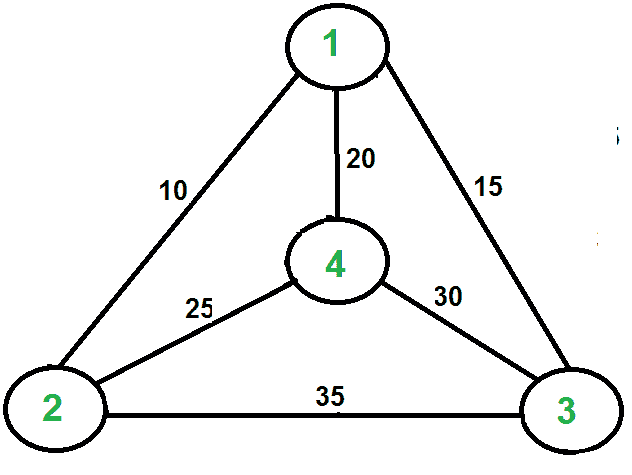

# 旅行商问题| 设置 2（使用 MST 估算）

> 原文： [https://www.geeksforgeeks.org/travelling-salesman-problem-set-2-approximate-using-mst/](https://www.geeksforgeeks.org/travelling-salesman-problem-set-2-approximate-using-mst/)

我们在[先前的帖子](https://www.geeksforgeeks.org/travelling-salesman-problem-set-1/)中介绍了[旅行商问题](https://www.geeksforgeeks.org/travelling-salesman-problem-set-1/)，并讨论了该问题的朴素和动态规划解决方案。 两种解决方案都不可行。 实际上，由于该问题是已知的 NP-Hard 问题，因此没有多项式时间解可用于该问题。 虽然有解决该问题的近似算法。 仅当问题实例满足 Triangle-Inequality 时，近似算法才有效。

**三角不等式**：从 i 到达顶点 j 的最小距离始终是直接从 i 到达 j，而不是通过其他某个顶点 k（或多个顶点），即 dis（i，j） 始终小于或等于 dis（i，k）+ dist（k，j）。 三角不等式在许多实际情况下均成立。
当成本函数满足三角不等式时，我们可以为 TSP 设计一种近似算法，该算法返回的成本不会超过最佳成本的两倍。 这个想法是使用`M`最少`S`平移`T`ree（MST）。 以下是基于 MST 的算法。

**算法**：
**1）**令 1 为推销员的起点和终点。
**2）**使用 [Prim 算法](https://www.geeksforgeeks.org/greedy-algorithms-set-5-prims-minimum-spanning-tree-mst-2/)从 1 为根构建 MST。
**3）**列出在构造的 MST 的预排序步中访问的顶点，并在末尾加 1。

让我们考虑以下示例。 第一张图是给定的图。 第二张图显示了以 1 为根构造的 MST。 MST 的预遍历为 1-2-4-3。 最后加 1 得到 1-2-4-3-1，这是该算法的输出。

  

在这种情况下，近似算法会产生最佳行程，但可能不会在所有情况下都产生最佳行程。

**该算法如何近似为 2？** 由上述算法产生的输出成本永远不会超过最佳输出成本的两倍。 让我们看看上面的算法如何保证这一点。
让我们定义术语 ***全程*** 来理解这一点。 完整步行会列出所有按预定顺序首次访问的顶点，也列出所有按预定顺序访问子树后返回的顶点。 上面那棵树的完整步伐是 1-2-1-4-1-3-1。
以下是一些证明 2 近似性的重要事实。
**1）**最好的旅行推销员之旅的费用永远不会少于 MST 的费用。 （ [MST](http://en.wikipedia.org/wiki/Minimum_spanning_tree) 的定义说，它是连接所有顶点的最小成本树）。
**2）**完整步行的总成本最多是 MST 的两倍（MST 的每个边缘最多访问两次）
**3）**输出 以上算法的成本小于全走的成本。 在上述算法中，我们将预订步行打印为输出。 在预定走步中，完整走步的两个或更多边由单个边代替。 例如，将 2-1 和 1-4 替换为 1 条边 2-4。 因此，如果图遵循三角形不等式，那么这始终是正确的。

从以上三个陈述，我们可以得出结论，近似算法产生的输出成本永远不会超过最佳解决方案成本的两倍。

我们已经讨论了一个非常简单的 2 近似算法，用于旅行商问题。 对于该问题，还有其他更好的近似算法。 例如， [Christofides 算法](http://en.wikipedia.org/wiki/Christofides_algorithm)是 1.5 近似算法。 我们很快将在单独的文章中讨论这些算法。

**参考**：
[Clifford Stein，Thomas H. Cormen，Charles E. Leiserson 和 Ronald L. Rivest 撰写的算法第三版](http://www.flipkart.com/introduction-algorithms-3/p/itmczynzhyhxv2gs?pid=9788120340077&affid=sandeepgfg)
[http：// www.personal.kent.edu/~rmuhamma/Algorithms/MyAlgorithms/AproxAlgor/TSP/tsp.htm](http://www.personal.kent.edu/~rmuhamma/Algorithms/MyAlgorithms/AproxAlgor/TSP/tsp.htm) 

如果发现任何不正确的地方，或者想分享有关上述主题的更多信息，请发表评论。

