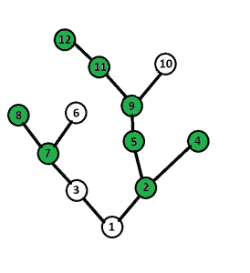

# 允许在相同高度的节点之间进行 k 次跳跃的树的遍历

> 原文：[https://www.geeksforgeeks.org/traversal-tree-ability-jump-nodes-height/](https://www.geeksforgeeks.org/traversal-tree-ability-jump-nodes-height/)

有一个带有 N 个节点的树，节点 1 是根节点。 树的每个节点可以包含或不包含果实。

最初，您位于根节点并开始爬到树上。

您可以从一个节点跳到同一级别的任何节点（即，节点到根的高度相同），

**从根节点爬升时，您最多只能进行 K 次跳跃。 （K < 20）**

现在，您必须以这种方式爬到树上（从根节点->任何叶节点），以便最多收集果实。

范例：

```
Input Tree : 
Number of Nodes N = 12
Number of jumps allowed : 2
Edges:
1 2
1 3
2 4
2 5
5 9
9 10
9 11
11 12
3 7
7 6
7 8
no of node having fruit(nf) : 8
Nodes Containing Fruits(lvn) : 2 4 5 7 8 9 11 12
Output: 7

```

上述测试用例的树：



说明：


**方法**：的想法是使用 [DFS](https://www.geeksforgeeks.org/tree-traversals-inorder-preorder-and-postorder/) 创建节点的高度邻接表并存储父级。 然后使用另一个 dfs 计算使用以下 dp 状态可以达到的最大特殊节点数：

```
dp[current_node][j] = max( max{ dp[child_i][j], for all children of current_node },
                         max{ dp[node_at_same_height_i][j - 1],
                         for all nodes at same height as current_node} )

```

因此， **dp [Root_Node] [Total_no_of_Jumps]** 给出了该问题的答案。

**以下是上述方法的实现**：

```
// Program to demonstrate tree traversal with
// ability to jump between nodes of same height
#include <bits/stdc++.h>
using namespace std;
#define N 1000
vector< int > H[N];
// Arrays declaration
int Fruit[N];
int Parent[N];
int dp[N][20];
// Function for DFS
void dfs1(vector< int > tree[], int s,
int p, int h)
{
Parent[s] = p;
int i;
H[h].push_back(s);
for (i = 0; i < tree[s].size(); i++) {
int v = tree[s][i];
if (v != p)
dfs1(tree, v, s, h + 1);
}
}
// Function for DFS
int dfs2(vector< int > tree[], int s,
int p, int h, int j)
{
int i;
int ans = 0;
if (dp[s][j] != -1)
return dp[s][j];
// jump
if (j > 0) {
for (i = 0; i < H[h].size(); i++) {
int v = H[h][i];
if (v != s)
ans = max(ans, dfs2(tree, v,
Parent[v], h, j - 1));
}
}
[
]
// climb
for (i = 0; i < tree[s].size(); i++) {
int v = tree[s][i];
if (v != p)
ans = max(ans, dfs2(tree, v, s, h + 1, j));
}
if (Fruit[s] == 1)
ans++;
dp[s][j] = ans;
return ans;
}
// Function to calculate and
// return maximum number of fruits
int maxFruit(vector< int > tree[],
int NodesWithFruits[],
int n, int m, int k)
{
// reseting dp table and Fruit array
for ( int i = 0; i < N; i++) {
[H TG418]          for ( int j = 0; j < 20; j++)
dp[i][j] = -1;
Fruit[i] = 0;
}
// This array is used to mark
// which nodes contain Fruits
for ( int i = 0; i < m; i++)
Fruit[NodesWithFruits[i]] = 1;
dfs1(tree, 1, 0, 0);
[ int ans = dfs2(tree, 1, 0, 0, k);
return ans;
}
// Function to add Edge
void addEdge(vector< int > tree[], int u, int v)
{
tree[u].push_back(v);
tree[v].push_back(u);
}
的[HTG46 3]
// Driver Code
int main()
{
int n = 12; // Number of nodes
int k = 2; // Number of allowed jumps
vector< int > tree[N];
[HTG228
// Edges
addEdge(tree, 1, 2);
addEdge(tree, 1, 3);
addEdge(tree, 2, 4);
addEdge(tree, 2, 5);
addEdge(tree, 5, 9);
addEdge(tree, 9, 10);
addEdge(tree, 9, 11);
addEdge(tree, 11, 12);
addEdge(tree, 3, 7);
addEdge(tree, 7, 6);
addEdge(tree, 7, 8);
]     ［HTG505］ ［HTG506］ ［HTG254］ ［HTG255］ ［HTG256］ ［HTG507］ ［HTG508］ ［HTG257］ ［HTG509］ ［HTG510］ ［HTG258］ ［HTG259］ ［HTG］ 511]
int m = sizeof (NodesWithFruits) / sizeof (NodesWithFruits[0]);
int ans = maxFruit(tree, NodesWithFruits, n, m, k);
cout << ans << endl;
return 0;
] }
```

**Output:**

```
7

```

**时间复杂度**：O（n * n * k）（最坏的情况，例如：2 层树，其根具有 n-1 个子节点）


* * *

* * *


