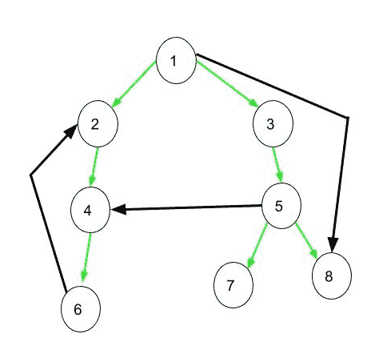

# 图形

的 DFS 中的树，后方，边缘和交叉边缘

> 原文： [https://www.geeksforgeeks.org/tree-back-edge-and-cross-edges-in-dfs-of-graph/](https://www.geeksforgeeks.org/tree-back-edge-and-cross-edges-in-dfs-of-graph/)

考虑下面给出的有向图，下图的 DFS 为 1 2 4 6 3 5 78。在下图中，如果在该图上应用 [DFS](http://www.geeksforgeeks.org/depth-first-traversal-for-a-graph/) ，则将获得使用绿色边连接的树。

**树边缘**：这是在图上应用 DFS 后获得的树中存在的边缘。 所有绿色边都是树边。

**前缘**：这是一个边缘（u，v），使得 v 为后代，但不属于 DFS 树。 **1 到 8** 的边缘是前向边缘。

**后边缘**：这是一条边缘（u，v），使得 v 是边缘 u 的祖先，但不是 DFS 树的一部分。 从 **6 到 2** 的边缘是后边缘。 [后边缘的存在指示有向图](https://www.geeksforgeeks.org/detect-cycle-in-a-graph/)中的一个循环。

**交叉边缘**：这是连接两个节点的边缘，因此两个节点之间没有任何祖先和后代关系。 从节点 **5 到 4** 的边缘为交叉边缘。

* * *

* * *

如果您喜欢 GeeksforGeeks 并希望做出贡献，则还可以使用 [tribution.geeksforgeeks.org](https://contribute.geeksforgeeks.org/) 撰写文章，或将您的文章邮寄至 tribution@geeksforgeeks.org。 查看您的文章出现在 GeeksforGeeks 主页上，并帮助其他 Geeks。

如果您发现任何不正确的地方，请单击下面的“改进文章”按钮，以改进本文。