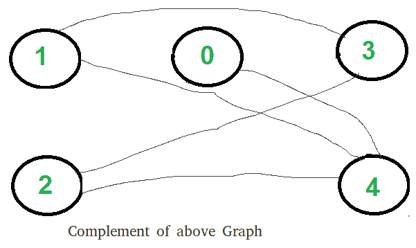

# 两个集团问题（检查图表是否可以分为两个集团）

> 原文： [https://www.geeksforgeeks.org/two-clique-problem-check-graph-can-divided-two-cliques/](https://www.geeksforgeeks.org/two-clique-problem-check-graph-can-divided-two-cliques/)

“派系”是图的子图，以使子图中的所有顶点彼此完全连接。 给定一个图，找到它是否可以分为两个集团。

**示例**：

```
Input : G[][] =   {{0, 1, 1, 0, 0},
                  {1, 0, 1, 1, 0},
                  {1, 1, 0, 0, 0},
                  {0, 1, 0, 0, 1},
                  {0, 0, 0, 1, 0}};
Output : Yes

```

首先，这个问题看起来很棘手，但是有一个简单而有趣的解决方案。 如果一个图的补图是 [Bipartitie](https://www.geeksforgeeks.org/bipartite-graph/) ，则该图可以分为两个类别。 因此，下面是两个步骤，以确定图是否可以分为两个集团。

1.  查找图的补码。 下面是补图，上面是显示图。 作为补充，所有原始边缘均被删除。 顶点之间没有边，现在有一条边将它们连接起来。
    
2.  如果补数为 Bipartite，则返回 true，否则返回 false。 上图所示为 Bipartite。 在此处讨论检查图是否为 Biparitite 或否。

**这是如何工作的？**
如果补数是 Bipartite，则图可以分为两组 U 和 V，这样就没有边连接到同一组顶点。 这意味着在原始图中，这些集合 U 和 V 完全连接。 因此，原始图可以分为两个集团。

**实现**：
以下是上述步骤的实现。

## C++

```cpp

// C++ program to find out whether a given graph can be 
// converted to two Cliques or not. 
#include <bits/stdc++.h> 
using namespace std; 

const int V = 5; 

// This function returns true if subgraph reachable from 
// src is Bipartite or not. 
bool isBipartiteUtil(int G[][V], int src, int colorArr[]) 
{ 
    colorArr[src] = 1; 

    // Create a queue (FIFO) of vertex numbers and enqueue 
    // source vertex for BFS traversal 
    queue <int> q; 
    q.push(src); 

    // Run while there are vertices in queue (Similar to BFS) 
    while (!q.empty()) 
    { 
        // Dequeue a vertex from queue 
        int u = q.front(); 
        q.pop(); 

        // Find all non-colored adjacent vertices 
        for (int v = 0; v < V; ++v) 
        { 
            // An edge from u to v exists and destination 
            // v is not colored 
            if (G[u][v] && colorArr[v] == -1) 
            { 
                // Assign alternate color to this adjacent 
                // v of u 
                colorArr[v] = 1 - colorArr[u]; 
                q.push(v); 
            } 

            // An edge from u to v exists and destination 
            // v is colored with same color as u 
            else if (G[u][v] && colorArr[v] == colorArr[u]) 
                return false; 
        } 
    } 

    // If we reach here, then all adjacent vertices can 
    // be colored with alternate color 
    return true; 
} 

// Returns true if a Graph G[][] is Bipartite or not. Note 
// that G may not be connected. 
bool isBipartite(int G[][V]) 
{ 
    // Create a color array to store colors assigned 
    // to all veritces. Vertex number is used as index in 
    // this array. The value '-1' of  colorArr[i] 
    // is used to indicate that no color is assigned to 
    // vertex 'i'.  The value 1 is used to indicate first 
    // color is assigned and value 0 indicates 
    // second color is assigned. 
    int colorArr[V]; 
    for (int i = 0; i < V; ++i) 
        colorArr[i] = -1; 

    // One by one check all not yet colored vertices. 
    for (int i = 0; i < V; i++) 
        if (colorArr[i] == -1) 
            if (isBipartiteUtil(G, i, colorArr) == false) 
                return false; 

    return true; 
} 

// Returns true if G can be divided into 
// two Cliques, else false. 
bool canBeDividedinTwoCliques(int G[][V]) 
{ 
    // Find complement of G[][] 
    // All values are complemented except 
    // diagonal ones 
    int GC[V][V]; 
    for (int i=0; i<V; i++) 
        for (int j=0; j<V; j++) 
             GC[i][j] = (i != j)?  !G[i][j] : 0; 

    // Return true if complement is Bipartite 
    // else false. 
    return  isBipartite(GC); 
} 

// Driver program to test above function 
int main() 
{ 
    int G[][V] = {{0, 1, 1, 1, 0}, 
        {1, 0, 1, 0, 0}, 
        {1, 1, 0, 0, 0}, 
        {0, 1, 0, 0, 1}, 
        {0, 0, 0, 1, 0} 
    }; 

    canBeDividedinTwoCliques(G) ? cout << "Yes" : 
                                  cout << "No"; 
    return 0; 
} 

```