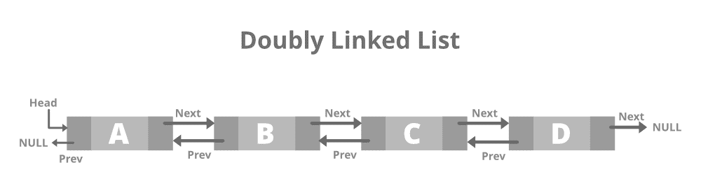
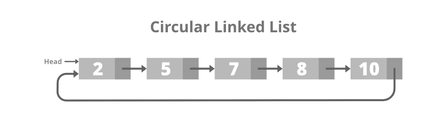
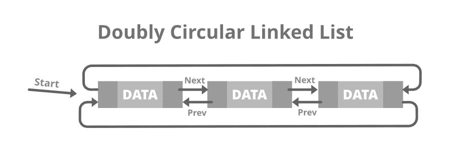
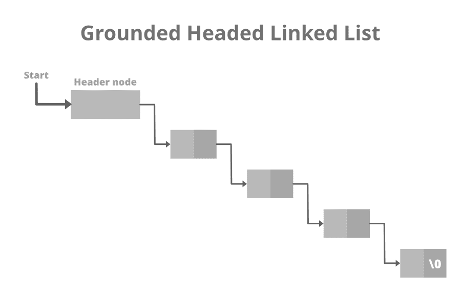

# 链接列表的类型

[链表](http://www.geeksforgeeks.org/data-structures/linked-list/)是线性数据结构，其中元素不存储在连续的存储位置中。 链接列表中的元素使用[指针](https://www.geeksforgeeks.org/pointers-in-c-and-c-set-1-introduction-arithmetic-and-array/)链接。 简而言之，链接列表由节点组成，其中每个节点都包含一个数据字段和到列表中下一个节点的引用（链接）。

### <u>链接列表的类型</u>

*   [**单链表：**](https://www.geeksforgeeks.org/data-structures/linked-list/singly-linked-list/) 这是链表的最简单类型，其中每个节点都包含一些数据和一个指向相同数据类型的下一个节点的指针。 该节点包含指向下一个节点的指针，这意味着该节点存储序列中下一个节点的地址。 单个链接列表仅允许以一种方式遍历数据。 以下是相同的图片：


*   **<u>单链表</u>的结构：**

## C ++

```

// Node of a doubly linked list
class Node {
public:
    int data;

    // Pointer to next node in LL
    Node* next;
};

```

*   **<u>单链接列表</u>的创建和遍历：**

## C ++

```

// C++ program to illustrate creation
// and traversal of Singly Linked List

#include <bits/stdc++.h>
using namespace std;

// Structure of Node
class Node {
public:
    int data;
    Node* next;
};

// Function to print the content of
// linked list starting from the
// given node
void printList(Node* n)
{

    // Iterate till n reaches NULL
    while (n != NULL) {

        // Print the data
        cout << n->data << " ";
        n = n->next;
    }
}

// Driver Code
int main()
{
    Node* head = NULL;
    Node* second = NULL;
    Node* third = NULL;

    // Allocate 3 nodes in the heap
    head = new Node();
    second = new Node();
    third = new Node();

    // Assign data in first node
    head->data = 1;

    // Link first node with second
    head->next = second;

    // Assign data to second node
    second->data = 2;
    second->next = third;

    // Assign data to third node
    third->data = 3;
    third->next = NULL;

    printList(head);

    return 0;
}

```

## 爪哇

```

// Java program to illustrate 
// creation and traversal of 
// Singly Linked List
class GFG{

// Structure of Node
static class Node 
{
  int data;
  Node next;
};

// Function to print the content of
// linked list starting from the
// given node
static void printList(Node n)
{
  // Iterate till n reaches null
  while (n != null) 
  {
    // Print the data
    System.out.print(n.data + " ");
    n = n.next;
  }
}

// Driver Code
public static void main(String[] args)
{
  Node head = null;
  Node second = null;
  Node third = null;

  // Allocate 3 nodes in 
  // the heap
  head = new Node();
  second = new Node();
  third = new Node();

  // Assign data in first
  // node
  head.data = 1;

  // Link first node with 
  // second
  head.next = second;

  // Assign data to second
  // node
  second.data = 2;
  second.next = third;

  // Assign data to third 
  // node
  third.data = 3;
  third.next = null;

  printList(head);
}
}

// This code is contributed by Princi Singh

```

## C＃

```

// C# program to illustrate 
// creation and traversal of 
// Singly Linked List
using System;

class GFG{

// Structure of Node
public class Node 
{
    public int data;
    public Node next;
};

// Function to print the content of
// linked list starting from the
// given node
static void printList(Node n)
{

    // Iterate till n reaches null
    while (n != null) 
    {

        // Print the data
        Console.Write(n.data + " ");
        n = n.next;
    }
}

// Driver Code
public static void Main(String[] args)
{
    Node head = null;
    Node second = null;
    Node third = null;

    // Allocate 3 nodes in 
    // the heap
    head = new Node();
    second = new Node();
    third = new Node();

    // Assign data in first
    // node
    head.data = 1;

    // Link first node with 
    // second
    head.next = second;

    // Assign data to second
    // node
    second.data = 2;
    second.next = third;

    // Assign data to third 
    // node
    third.data = 3;
    third.next = null;

    printList(head);
}
}

// This code is contributed by Amit Katiyar

```

**Output**

```
1 2 3 

```

*   [**双链表：**](https://www.geeksforgeeks.org/doubly-linked-list/) 双链表或双向链表是链表的一种更复杂的类型，它包含顺序指向下一个节点和上一个节点的指针 因此，它包含三部分：数据，指向下一个节点的指针和指向上一个节点的指针。 这也使我们能够向后遍历列表。 以下是相同的图片：



*   **<u>双链表</u>的结构：**

## C ++

```

// Node of a doubly linked list
struct Node {
    int data;

    // Pointer to next node in DLL
    struct Node* next;

    // Pointer to the previous node in DLL
    struct Node* prev;
};

```

*   **<u>双链表</u>的创建和遍历：**

## C ++

```

// C++ program to illustrate creation
// and traversal of Doubly Linked List
#include <bits/stdc++.h>
using namespace std;

// Doubly linked list node
class Node {
public:
    int data;
    Node* next;
    Node* prev;
};

// Function to push a new element in
// the Doubly Linked List
void push(Node** head_ref, int new_data)
{
    // Allocate node
    Node* new_node = new Node();

    // Put in the data
    new_node->data = new_data;

    // Make next of new node as
    // head and previous as NULL
    new_node->next = (*head_ref);
    new_node->prev = NULL;

    // Change prev of head node to
    // the new node
    if ((*head_ref) != NULL)
        (*head_ref)->prev = new_node;

    // Move the head to point to
    // the new node
    (*head_ref) = new_node;
}

// Function to traverse the Doubly LL
// in the forward & backward direction
void printList(Node* node)
{
    Node* last;

    cout << "\nTraversal in forward"
         << " direction \n";
    while (node != NULL) {

        // Print the data
        cout << " " << node->data << " ";
        last = node;
        node = node->next;
    }

    cout << "\nTraversal in reverse"
         << " direction \n";
    while (last != NULL) {

        // Print the data
        cout << " " << last->data << " ";
        last = last->prev;
    }
}

// Driver Code
int main()
{
    // Start with the empty list
    Node* head = NULL;

    // Insert 6.
    // So linked list becomes 6->NULL
    push(&head, 6);

    // Insert 7 at the beginning. So
    // linked list becomes 7->6->NULL
    push(&head, 7);

    // Insert 1 at the beginning. So
    // linked list becomes 1->7->6->NULL
    push(&head, 1);

    cout << "Created DLL is: ";
    printList(head);

    return 0;
}

```

## 爪哇

```

// Java program to illustrate 
// creation and traversal of 
// Doubly Linked List
import java.util.*;
class GFG{

// Doubly linked list 
// node
static class Node 
{
  int data;
  Node next;
  Node prev;
};

static Node head_ref;

// Function to push a new 
// element in the Doubly 
// Linked List
static void push(int new_data)
{
  // Allocate node
  Node new_node = new Node();

  // Put in the data
  new_node.data = new_data;

  // Make next of new node as
  // head and previous as null
  new_node.next = head_ref;
  new_node.prev = null;

  // Change prev of head node to
  // the new node
  if (head_ref != null)
    head_ref.prev = new_node;

  // Move the head to point to
  // the new node
  head_ref = new_node;
}

// Function to traverse the 
// Doubly LL in the forward 
// & backward direction
static void printList(Node node)
{
  Node last = null;

  System.out.print("\nTraversal in forward" + 
                   " direction \n");
  while (node != null) 
  {
    // Print the data
    System.out.print(" " +  node.data + 
                     " ");
    last = node;
    node = node.next;
  }

  System.out.print("\nTraversal in reverse" + 
                   " direction \n");

  while (last != null) 
  {
    // Print the data
    System.out.print(" " +  last.data + 
                     " ");
    last = last.prev;
  }
}

// Driver Code
public static void main(String[] args)
{
  // Start with the empty list
  head_ref = null;

  // Insert 6.
  // So linked list becomes 
  // 6.null
  push(6);

  // Insert 7 at the beginning. 
  // So linked list becomes 
  // 7.6.null
  push(7);

  // Insert 1 at the beginning. 
  // So linked list becomes 
  // 1.7.6.null
  push(1);

  System.out.print("Created DLL is: ");
  printList(head_ref);
}
}

// This code is contributed by Princi Singh

```

## C＃

```

// C# program to illustrate 
// creation and traversal of 
// Doubly Linked List
using System;

class GFG{

// Doubly linked list 
// node
public class Node 
{
  public int data;
  public Node next;
  public Node prev;
};

static Node head_ref;

// Function to push a new 
// element in the Doubly 
// Linked List
static void push(int new_data)
{

  // Allocate node
  Node new_node = new Node();

  // Put in the data
  new_node.data = new_data;

  // Make next of new node as
  // head and previous as null
  new_node.next = head_ref;
  new_node.prev = null;

  // Change prev of head node to
  // the new node
  if (head_ref != null)
    head_ref.prev = new_node;

  // Move the head to point to
  // the new node
  head_ref = new_node;
}

// Function to traverse the 
// Doubly LL in the forward 
// & backward direction
static void printList(Node node)
{
  Node last = null;

  Console.Write("\nTraversal in forward" + 
                " direction \n");

  while (node != null) 
  {

    // Print the data
    Console.Write(" " +  node.data + 
                  " ");
    last = node;
    node = node.next;
  }

  Console.Write("\nTraversal in reverse" + 
                " direction \n");

  while (last != null) 
  {

    // Print the data
    Console.Write(" " +  last.data + 
                  " ");
    last = last.prev;
  }
}

// Driver Code
public static void Main(String[] args)
{

  // Start with the empty list
  head_ref = null;

  // Insert 6.
  // So linked list becomes 
  // 6.null
  push(6);

  // Insert 7 at the beginning. 
  // So linked list becomes 
  // 7.6.null
  push(7);

  // Insert 1 at the beginning. 
  // So linked list becomes 
  // 1.7.6.null
  push(1);

  Console.Write("Created DLL is: ");
  printList(head_ref);
}
}

// This code is contributed by Amit Katiyar

```

**Output**

```
Created DLL is: 
Traversal in forward direction 
 1  7  6 
Traversal in reverse direction 
 6  7  1 

```

*   [**循环链接列表：**](https://www.geeksforgeeks.org/circular-linked-list/) 循环链接列表是最后一个节点包含指向列表第一个节点的指针的列表。 在遍历循环喜欢的列表时，我们可以从任何节点开始并以任何方向向前和向后遍历该列表，直到到达开始的相同节点。 因此，循环链表没有开始也没有结束。 以下是同一张图片：



*   **<u>循环链表</u>的结构：**

## C ++

```

// Structure for a node
class Node {
public:
    int data;

    // Pointer to next node in CLL
    Node* next;
};

```

*   **<u>循环链表</u>的创建和遍历：**

## C ++

```

// C++ program to illustrate creation
// and traversal of Circular LL
#include <bits/stdc++.h>
using namespace std;

// Structure for a node
class Node {
public:
    int data;
    Node* next;
};

// Function to insert a node at the
// beginning of Circular LL
void push(Node** head_ref, int data)
{
    Node* ptr1 = new Node();
    Node* temp = *head_ref;
    ptr1->data = data;
    ptr1->next = *head_ref;

    // If linked list is not NULL then
    // set the next of last node
    if (*head_ref != NULL) {
        while (temp->next != *head_ref) {
            temp = temp->next;
        }
        temp->next = ptr1;
    }

    // For the first node
    else
        ptr1->next = ptr1;

    *head_ref = ptr1;
}

// Function to print nodes in the
// Circular Linked List
void printList(Node* head)
{
    Node* temp = head;
    if (head != NULL) {
        do {

            // Print the data
            cout << temp->data << " ";
            temp = temp->next;
        } while (temp != head);
    }
}

// Driver Code
int main()
{
    // Initialize list as empty
    Node* head = NULL;

    // Created linked list will
    // be 11->2->56->12
    push(&head, 12);
    push(&head, 56);
    push(&head, 2);
    push(&head, 11);

    cout << "Contents of Circular"
         << " Linked List\n ";
    printList(head);

    return 0;
}

```

**Output**

```
Contents of Circular Linked List
 11 2 56 12 

```

*   [双循环链表：](https://www.geeksforgeeks.org/doubly-circular-linked-list-set-1-introduction-and-insertion/)双循环链表或循环双向链表是链表的一种更复杂的类型，它包含指向序列中的下一个节点和上一个节点的指针。 双向链表和循环链表之间的区别与单链表和循环链表之间的区别相同。 圆形双向链表在第一个节点的上一个字段中不包含null。 以下是相同的图片：



*   **<u>双循环链表</u>的结构：**

## C ++

```

// Node of doubly circular linked list
struct Node {

    int data;

    // Pointer to next node in DCLL
    struct Node* next;

    // Pointer to the previous node in DCLL
    struct Node* prev;
};

```

*   **<u>双循环链接列表</u>的创建和遍历：**

## C ++

```

// C++ program to illustrate creation
// & traversal of Doubly Circular LL
#include <bits/stdc++.h>
using namespace std;

// Structure of a Node
struct Node {
    int data;
    struct Node* next;
    struct Node* prev;
};

// Function to insert Node at
// the beginning of the List
void insertBegin(struct Node** start,
                 int value)
{
    // If the list is empty
    if (*start == NULL) {
        struct Node* new_node = new Node;
        new_node->data = value;
        new_node->next
            = new_node->prev = new_node;
        *start = new_node;
        return;
    }

    // Pointer points to last Node
    struct Node* last = (*start)->prev;

    struct Node* new_node = new Node;

    // Inserting the data
    new_node->data = value;

    // Update the previous and
    // next of new node
    new_node->next = *start;
    new_node->prev = last;

    // Update next and previous
    // pointers of start & last
    last->next = (*start)->prev
        = new_node;

    // Update start pointer
    *start = new_node;
}

// Function to traverse the circular
// doubly linked list
void display(struct Node* start)
{
    struct Node* temp = start;

    printf("\nTraversal in"
           " forward direction \n");
    while (temp->next != start) {
        printf("%d ", temp->data);
        temp = temp->next;
    }
    printf("%d ", temp->data);

    printf("\nTraversal in "
           "reverse direction \n");
    Node* last = start->prev;
    temp = last;

    while (temp->prev != last) {

        // Print the data
        printf("%d ", temp->data);
        temp = temp->prev;
    }
    printf("%d ", temp->data);
}

// Driver Code
int main()
{
    // Start with the empty list
    struct Node* start = NULL;

    // Insert 5
    // So linked list becomes 5->NULL
    insertBegin(&start, 5);

    // Insert 4 at the beginning
    // So linked list becomes 4->5
    insertBegin(&start, 4);

    // Insert 7 at the end
    // So linked list becomes 7->4->5
    insertBegin(&start, 7);

    printf("Created circular doubly"
           " linked list is: ");
    display(start);

    return 0;
}

```

**Output**

```
Created circular doubly linked list is: 
Traversal in forward direction 
7 4 5 
Traversal in reverse direction 
5 4 7 

```

*   [标头链接列表：](https://www.geeksforgeeks.org/header-linked-list-in-c/)标头链接列表是一种特殊类型的链接列表，它在列表的开头包含一个标头节点。 因此，在标题链接列表中， **START** 不会指向列表的第一个节点，但是 **START** 将包含标题节点的地址。 以下是“接地页眉链接列表”的图像：



*   **<u>接地标题链表</u>的结构：**

## C ++

```

// Structure of the list
struct link {
    int info;

    // Pointer to the next node
    struct link* next;
};

```

*   **<u>双循环链接列表</u>的创建和遍历：**

## C ++

```

// C++ program to illustrate creation
// and traversal of Header Linked List
#include <bits/stdc++.h>
// #include <malloc.h>
// #include <stdio.h>

// Structure of the list
struct link {
    int info;
    struct link* next;
};

// Empty List
struct link* start = NULL;

// Function to create header of the
// header linked list
struct link* create_header_list(int data)
{

    // Create a new node
    struct link *new_node, *node;
    new_node = (struct link*)
        malloc(sizeof(struct link));
    new_node->info = data;
    new_node->next = NULL;

    // If it is the first node
    if (start == NULL) {

        // Initialize the start
        start = (struct link*)
            malloc(sizeof(struct link));
        start->next = new_node;
    }
    else {

        // Insert the node in the end
        node = start;
        while (node->next != NULL) {
            node = node->next;
        }
        node->next = new_node;
    }
    return start;
}

// Function to display the
// header linked list
struct link* display()
{
    struct link* node;
    node = start;
    node = node->next;

    // Traverse until node is
    // not NULL
    while (node != NULL) {

        // Print the data
        printf("%d ", node->info);
        node = node->next;
    }
    printf("\n");

    // Return the start pointer
    return start;
}

// Driver Code
int main()
{
    // Create the list
    create_header_list(11);
    create_header_list(12);
    create_header_list(13);

    // Print the list
    printf("List After inserting"
           " 3 elements:\n");
    display();
    create_header_list(14);
    create_header_list(15);

    // Print the list
    printf("List After inserting"
           " 2 more elements:\n");
    display();

    return 0;
}

```

**Output**

```
List After inserting 3 elements:
11 12 13 
List After inserting 2 more elements:
11 12 13 14 15 

```

注意读者！ 现在不要停止学习。 通过 [**DSA自学课程**](https://practice.geeksforgeeks.org/courses/dsa-self-paced?utm_source=geeksforgeeks&utm_medium=article&utm_campaign=gfg_article_dsa_content_bottom) 以对学生方便的价格掌握所有重要的DSA概念，并为行业做好准备。

* * *

* * *

如果您喜欢GeeksforGeeks并希望做出贡献，则还可以使用 [tribution.geeksforgeeks.org](https://contribute.geeksforgeeks.org/) 撰写文章，或将您的文章邮寄至tribution@geeksforgeeks.org。 查看您的文章出现在GeeksforGeeks主页上，并帮助其他Geeks。

如果您发现任何不正确的地方，请单击下面的“改进文章”按钮，以改进本文。