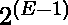
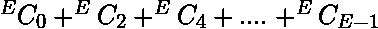

# 从完整图形中删除边以生成奇数边的方法

> 原文： [https://www.geeksforgeeks.org/ways-to-remove-edges-from-a-complete-graph-to-make-odd-edges/](https://www.geeksforgeeks.org/ways-to-remove-edges-from-a-complete-graph-to-make-odd-edges/)

给定具有`N`个顶点的完整图形，任务是计算去除边的方法数，以使生成的图形具有奇数个边。

**示例**：

> **输入**：N = 3
> **输出**：4
> 初始图具有 3 个边，因为它是完整图。 我们可以删除边缘（1、2）和（1、3）或（1、2）和（2、3）或（1、3）和（2、3），或者不删除任何边缘。
> 
> **输入**：N = 4
> **输出**：32

**方法**：由于图形完成，因此边的总数为 **E = N *（N – 1）/ 2** 。 现在有两种情况

1.  如果`E`是**甚至是**，那么您必须删除奇数个边，因此，通道总数为，与等效。
2.  如果`E`为**奇数**，那么您必须删除偶数个边，因此，通道总数为，与等效。

**注意**，如果 **N = 1** ，则答案将是`0`。

下面是上述方法的实现：

## C ++

```

// C++ implementation of the approach 
#include <bits/stdc++.h> 
using namespace std; 

// Function to return the number of ways 
// to remove edges from the graph so that 
// odd number of edges are left in the graph 
int countWays(int N) 
{ 
    // Total number of edges 
    int E = (N * (N - 1)) / 2; 

    if (N == 1) 
        return 0; 

    return pow(2, E - 1); 
} 

// Driver code 
int main() 
{ 
    int N = 4; 
    cout << countWays(N); 

    return 0; 
} 

```