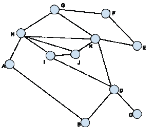
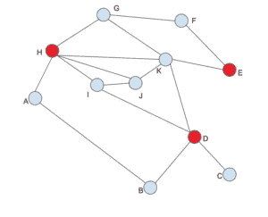

# 威尔士鲍威尔图着色算法

> 原文： [https://www.geeksforgeeks.org/welsh-powell-graph-colouring-algorithm/](https://www.geeksforgeeks.org/welsh-powell-graph-colouring-algorithm/)

在图论中，顶点着色是标记每个单独的顶点的方法，以使两个相邻的顶点都不具有相同的颜色。 但是我们需要找出满足给定条件所需的颜色数量。 不需要具有多种颜色或标签。 因此，我们有一种称为 welsh Powell 算法的算法，它可以提供所需的最小颜色。 此算法还用于查找图的色数。 这是一种迭代的 ***贪婪*** 方法。

**色数**：需要适当 K 种颜色才能正确着色的图 G 称为 K 色图，而编号 K 称为图 G 的色数。

威尔士鲍威尔算法包括以下步骤：

1.  查找每个顶点的度
2.  按降序排列顶点。
3.  用颜色 1 为第一个顶点着色。
4.  向下移动列表，并用相同的颜色为所有未连接到着色顶点的顶点着色。
5.  在所有未着色的顶点上以新的颜色（按降序排列）重复步骤 4，直到所有顶点都着色为止。

从最高的角度开始，我们确保可以尽早处理冲突数量最多的顶点。

| 顶点 | 度 |
| --- | --- |
| 一种 | 2 |
| 乙 | 2 |
| C | 1 |
| d | 4 |
| 是 | 2 |
| F | 2 |
| G | 3 |
| H | 5 |
| 一世 | 3 |
| Ĵ | 3 |
| 至 | 5 |

首先，以降序排列列表。 如果出现平局，我们可以随机选择任何打破方法。
因此，新订单将为：H，K，D，G，I，J，A，B，E，F，C

现在，按照威尔士鲍威尔图着色算法，
H –红色
K –红色，因为它连接到 H
D –红色
G –不着色红色， 当它连接到 H
I 时-不涂红色，当它连接至 H
J 时-不涂红色，因为它连接至 H
A-不要将其着色为红色，因为它 连接至 H
B –不连接红色，因为它连接至 D
E –着色为红色
F –不连接红色，因为其连接至 E
C –不连接 红色，因为它连接到 D

此后，该图将如下图所示。

忽略已经着色的顶点，我们剩下：K，G，I，J，A，B，F，C

我们可以用第二种颜色绿色重复该过程

K –绿色
G –绿色，因为它与 K
连接 I –绿色
，J –不，因为与 I
连接，绿色 A –绿色
B –请勿涂成绿色，因为它与 A 连接
F –涂成绿色
C –涂成绿色

同样，忽略着色的顶点，我们剩下 G，J，B，让我们用 Blue 对其进行着色。
G –蓝色
J –蓝色
B –蓝色

最终图如下所示。 现在，我们可以看到，使用威尔士·鲍威尔（Welsh Powell）算法，可以仅用 3 种颜色（此图的**色数为 3** ）为顶点着色，这是最佳解决方案，因为该图至少包含一个三角形 。

* * *

* * *

如果您喜欢 GeeksforGeeks 并希望做出贡献，则还可以使用 [tribution.geeksforgeeks.org](https://contribute.geeksforgeeks.org/) 撰写文章，或将您的文章邮寄至 tribution@geeksforgeeks.org。 查看您的文章出现在 GeeksforGeeks 主页上，并帮助其他 Geeks。

如果您发现任何不正确的地方，请单击下面的“改进文章”按钮，以改进本文。