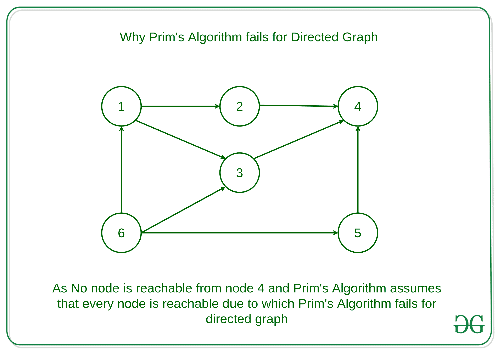
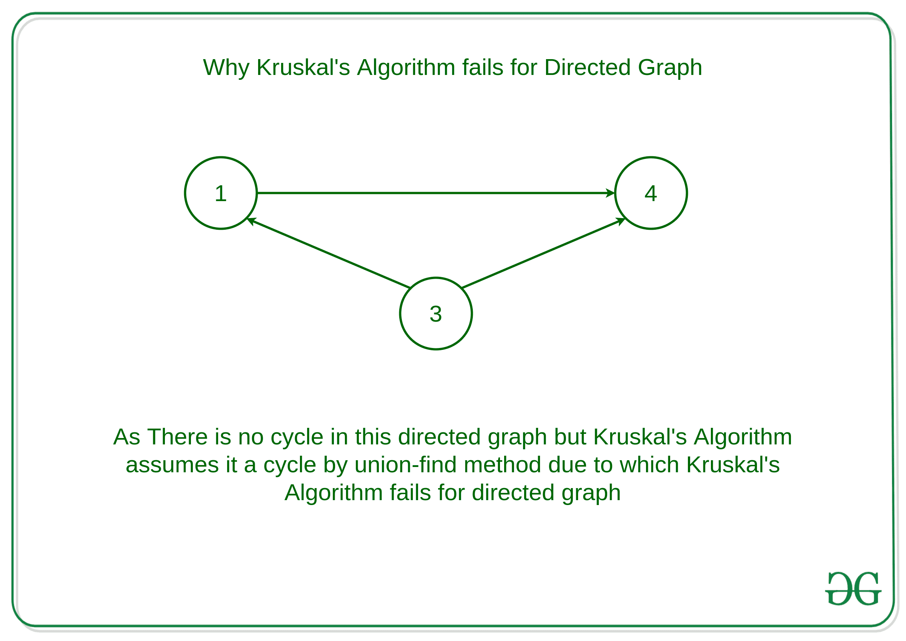

# 为什么有向图的 Prim 和 Kruskal 的 MST 算法失败？

> 原文： [https://www.geeksforgeeks.org/why-prims-and-kruskals-mst-algorithm-fails-for-directed-graph/](https://www.geeksforgeeks.org/why-prims-and-kruskals-mst-algorithm-fails-for-directed-graph/)

**先决条件**：

*   [图及其表示](https://www.geeksforgeeks.org/graph-and-its-representations/)
*   [贪心算法| 设置 5（Prim 的最小生成树（MST））](https://www.geeksforgeeks.org/prims-minimum-spanning-tree-mst-greedy-algo-5/)
*   [Kruskal 的最小生成树算法| 贪婪算法 2](https://www.geeksforgeeks.org/kruskals-minimum-spanning-tree-algorithm-greedy-algo-2/)

给定有向图 **D = < V，E >** ，任务是找到给定有向图的最小生成树

**示例**：

但是 [Prim 的最小生成树](https://www.geeksforgeeks.org/prims-minimum-spanning-tree-mst-greedy-algo-5/)和 [Kruskal 算法](http://www.geeksforgeeks.org/kruskals-minimum-spanning-tree-using-stl-in-c/)对于有向图而言是失败的。 让我们看看为什么

**为什么 Prim 的有向图算法失败？**

Prim 的算法假定所有顶点均已连接。 但是在有向图中，每个节点都不是每个其他节点都可达的。 因此，Prim 的算法由于这个原因而失败。
**例如**：

从图中可以看到，从节点 4 到任何节点都是不可达的。有向图无法满足所有顶点都必须连接的要求。

**为什么有向图的 Kruskal 算法失败？**
在 Kruskal 的算法中，在每个步骤中，都要检查边缘是否形成了到目前为止已形成的生成树的循环。 但是 Kruskal 的算法无法检测到有向图中的循环，因为在某些情况下顶点之间没有循环，但是 Kruskal 的算法假定其是循环的，并且没有考虑某些边，因此 Kruskal 的算法无法针对有向图进行处理。
**例如**：
 
该图将被报告为包含有 Union-Find 方法的循环，但是该图没有循环。

在有向图中，最小生成树的等效项是“最小生成树状化”（也称为最佳分支），可以通过 [Edmonds 算法](https://en.wikipedia.org/wiki/Edmonds%27_algorithm)来解决，其运行时间为 O（EV）。 该算法是最小生成树问题的定向模拟。

* * *

* * *

如果您喜欢 GeeksforGeeks 并希望做出贡献，则还可以使用 [tribution.geeksforgeeks.org](https://contribute.geeksforgeeks.org/) 撰写文章，或将您的文章邮寄至 tribution@geeksforgeeks.org。 查看您的文章出现在 GeeksforGeeks 主页上，并帮助其他 Geeks。

如果您发现任何不正确的地方，请单击下面的“改进文章”按钮，以改进本文。