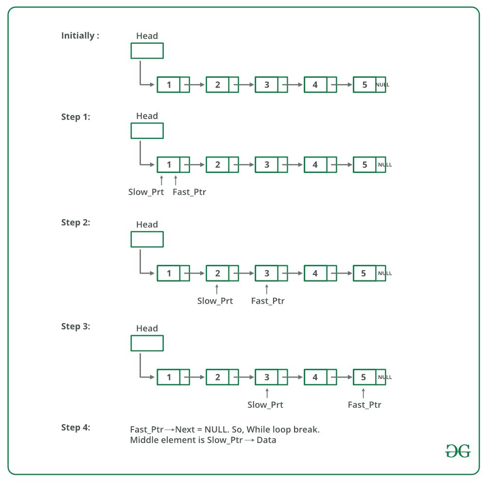

# 在 C 和 Java 中查找给定链表的中间部分

给定一个单链表，找到链表的中间。 例如，如果给定的链表为 1-> 2-> 3-> 4-> 5，则输出应为 3。
如果有偶数节点，则将有两个中间节点，我们需要打印第二个中间节点 元件。 例如，如果给定的链表是 1- > 2- > 3- > 4- > 5- > 6，则输出应为 4。

**方法 1：**
遍历整个链表并计算编号。 节点。 现在再次遍历列表，直到 count / 2 并返回 count / 2 处的节点。

**方法 2：**
使用两个指针遍历链表。 将一个指针移动一个，另一个指针移动两个。 当快速指针到达末尾时，慢速指针将到达链表的中间。

下图显示了 printMiddle 函数如何在代码中工作：



## C++

```cpp

#include<bits/stdc++.h> 
using namespace std; 

// Struct 
struct Node 
{ 
    int data; 
    struct Node* next; 
}; 

/* Function to get the middle of the linked list*/
void printMiddle(struct Node *head) 
{ 
    struct Node *slow_ptr = head; 
    struct Node *fast_ptr = head; 

    if (head!=NULL) 
    { 
        while (fast_ptr != NULL && fast_ptr->next != NULL) 
        { 
            fast_ptr = fast_ptr->next->next; 
            slow_ptr = slow_ptr->next; 
        } 
        printf("The middle element is [%d]\n\n", slow_ptr->data); 
    } 
} 

// Function to add a new node 
void push(struct Node** head_ref, int new_data) 
{ 
    /* allocate node */
    struct Node* new_node = new Node; 

    /* put in the data */
    new_node->data = new_data; 

    /* link the old list off the new node */
    new_node->next = (*head_ref); 

    /* move the head to point to the new node */
    (*head_ref) = new_node; 
} 

// A utility function to print a given linked list 
void printList(struct Node *ptr) 
{ 
    while (ptr != NULL) 
    { 
        printf("%d->", ptr->data); 
        ptr = ptr->next; 
    } 
    printf("NULL\n"); 
} 

// Driver Code
int main() 
{ 
    // Start with the empty list 
    struct Node* head = NULL; 

    // Iterate and add element 
    for (int i=5; i>0; i--) 
    { 
        push(&head, i); 
        printList(head); 
        printMiddle(head); 
    } 

    return 0; 
} 

```

## C

```c

#include<stdio.h> 
#include<stdlib.h> 

/* Link list node */
struct Node 
{ 
    int data; 
    struct Node* next; 
}; 

/* Function to get the middle of the linked list*/
void printMiddle(struct Node *head) 
{ 
    struct Node *slow_ptr = head; 
    struct Node *fast_ptr = head; 

    if (head!=NULL) 
    { 
        while (fast_ptr != NULL && fast_ptr->next != NULL) 
        { 
            fast_ptr = fast_ptr->next->next; 
            slow_ptr = slow_ptr->next; 
        } 
        printf("The middle element is [%d]\n\n", slow_ptr->data); 
    } 
} 

void push(struct Node** head_ref, int new_data) 
{ 
    /* allocate node */
    struct Node* new_node = 
        (struct Node*) malloc(sizeof(struct Node)); 

    /* put in the data */
    new_node->data = new_data; 

    /* link the old list off the new node */
    new_node->next = (*head_ref); 

    /* move the head to point to the new node */
    (*head_ref) = new_node; 
} 

// A utility function to print a given linked list 
void printList(struct Node *ptr) 
{ 
    while (ptr != NULL) 
    { 
        printf("%d->", ptr->data); 
        ptr = ptr->next; 
    } 
    printf("NULL\n"); 
} 

/* Driver program to test above function*/
int main() 
{ 
    /* Start with the empty list */
    struct Node* head = NULL; 
    int i; 

    for (i=5; i>0; i--) 
    { 
        push(&head, i); 
        printList(head); 
        printMiddle(head); 
    } 

    return 0; 
} 

```

## Java

```java

// Java program to find middle of linked list
class LinkedList
{
    Node head; // head of linked list

    /* Linked list node */
    class Node
    {
        int data;
        Node next;
        Node(int d)
        {
            data = d;
            next = null;
        }
    }

    /* Function to print middle of linked list */
    void printMiddle()
    {
        Node slow_ptr = head;
        Node fast_ptr = head;
        if (head != null)
        {
            while (fast_ptr != null && fast_ptr.next != null)
            {
                fast_ptr = fast_ptr.next.next;
                slow_ptr = slow_ptr.next;
            }
            System.out.println("The middle element is [" +
                                slow_ptr.data + "] \n");
        }
    }

    /* Inserts a new Node at front of the list. */
    public void push(int new_data)
    {
        /* 1 & 2: Allocate the Node &
                  Put in the data*/
        Node new_node = new Node(new_data);

        /* 3\. Make next of new Node as head */
        new_node.next = head;

        /* 4\. Move the head to point to new Node */
        head = new_node;
    }

    /* This function prints contents of linked list
       starting from  the given node */
    public void printList()
    {
        Node tnode = head;
        while (tnode != null)
        {
            System.out.print(tnode.data+"->");
            tnode = tnode.next;
        }
        System.out.println("NULL");
    }

    public static void main(String [] args)
    {
        LinkedList llist = new LinkedList();
        for (int i=5; i>0; --i)
        {
            llist.push(i);
            llist.printList();
            llist.printMiddle();
        }
    }
}
// This code is contributed by Rajat Mishra

```

**输出：**

```
5->NULL
The middle element is [5]

4->5->NULL
The middle element is [5]

3->4->5->NULL
The middle element is [4]

2->3->4->5->NULL
The middle element is [4]

1->2->3->4->5->NULL
The middle element is [3]

```

**方法 3：**。
将中间元素初始化为 head，并将计数器初始化为 0。从 head 遍历列表，同时遍历该计数器，并在计数器为奇数时将中间值更改为中间>。 。 因此，中部将仅移动列表总长度的一半。
感谢 Narendra Kangralkar 提出了这种方法。

## C++

```cpp

#include <bits/stdc++.h>
using namespace std;

// Link list node 
struct node
{
    int data;
    struct node* next;
};

// Function to get the middle of
// the linked list
void printMiddle(struct node* head)
{
    int count = 0;
    struct node* mid = head;

    while (head != NULL)
    {

        // Update mid, when 'count'
        // is odd number 
        if (count & 1)
            mid = mid->next;

        ++count;
        head = head->next;
    }

    // If empty list is provided 
    if (mid != NULL)
        printf("The middle element is [%d]\n\n", 
                mid->data);
}

void push(struct node** head_ref, int new_data)
{

    // Allocate node 
    struct node* new_node = (struct node*)malloc(
        sizeof(struct node));

    // Put in the data 
    new_node->data = new_data;

    // Link the old list off the new node 
    new_node->next = (*head_ref);

    // Move the head to point to
    // the new node 
    (*head_ref) = new_node;
}

// A utility function to print 
// a given linked list
void printList(struct node* ptr)
{
    while (ptr != NULL)
    {
        printf("%d->", ptr->data);
        ptr = ptr->next;
    }
    printf("NULL\n");
}

// Driver code
int main()
{

    // Start with the empty list 
    struct node* head = NULL;
    int i;

    for(i = 5; i > 0; i--) 
    {
        push(&head, i);
        printList(head);
        printMiddle(head);
    }
    return 0;
}

// This code is contributed by ac121102

```

## C

```c

#include <stdio.h>
#include <stdlib.h>

/* Link list node */
struct node {
    int data;
    struct node* next;
};

/* Function to get the middle of the linked list*/
void printMiddle(struct node* head)
{
    int count = 0;
    struct node* mid = head;

    while (head != NULL) {
        /* update mid, when 'count' is odd number */
        if (count & 1)
            mid = mid->next;

        ++count;
        head = head->next;
    }

    /* if empty list is provided */
    if (mid != NULL)
        printf("The middle element is [%d]\n\n", mid->data);
}

void push(struct node** head_ref, int new_data)
{
    /* allocate node */
    struct node* new_node
        = (struct node*)malloc(sizeof(struct node));

    /* put in the data  */
    new_node->data = new_data;

    /* link the old list off the new node */
    new_node->next = (*head_ref);

    /* move the head to point to the new node */
    (*head_ref) = new_node;
}

// A utility function to print a given linked list
void printList(struct node* ptr)
{
    while (ptr != NULL) {
        printf("%d->", ptr->data);
        ptr = ptr->next;
    }
    printf("NULL\n");
}

/* Driver program to test above function*/
int main()
{
    /* Start with the empty list */
    struct node* head = NULL;
    int i;

    for (i = 5; i > 0; i--) {
        push(&head, i);
        printList(head);
        printMiddle(head);
    }

    return 0;
}

```

## Java

```java

class GFG{

static Node head;

// Link list node
class Node
{
    int data;
    Node next;

    // Constructor
    public Node(Node next, int data)
    {
        this.data = data;
        this.next = next;
    }
}

// Function to get the middle of 
// the linked list
void printMiddle(Node head)
{
    int count = 0;
    Node mid = head;

    while (head != null)
    {

        // Update mid, when 'count' 
        // is odd number 
        if ((count % 2) == 1)
            mid = mid.next;

        ++count;
        head = head.next;
    }

    // If empty list is provided 
    if (mid != null)
        System.out.println("The middle element is [" +
                            mid.data + "]\n");
}

void push(Node head_ref, int new_data)
{

    // Allocate node 
    Node new_node = new Node(head_ref, new_data);

    // Move the head to point to the new node 
    head = new_node;
}

// A utility function to print a 
// given linked list
void printList(Node head)
{
    while (head != null)
    {
        System.out.print(head.data + "-> ");
        head = head.next;
    }
    System.out.println("null");
}

// Driver code
public static void main(String[] args)
{
    GFG ll = new GFG();

    for(int i = 5; i > 0; i--) 
    {
        ll.push(head, i);
        ll.printList(head);
        ll.printMiddle(head);
    }
}
}

// This code is contributed by mark_3

```

**Output**

```
5->NULL
The middle element is [5]

4->5->NULL
The middle element is [5]

3->4->5->NULL
The middle element is [4]

2->3->4->5->NULL
The middle element is [4]

1->2->3->4->5->NULL
The middle element is [3]

```

https://www.youtube.com/watch?v=BrmGrIPGbgk 

如果发现任何不正确的地方，或者您想分享有关上述主题的更多信息，请发表评论。

