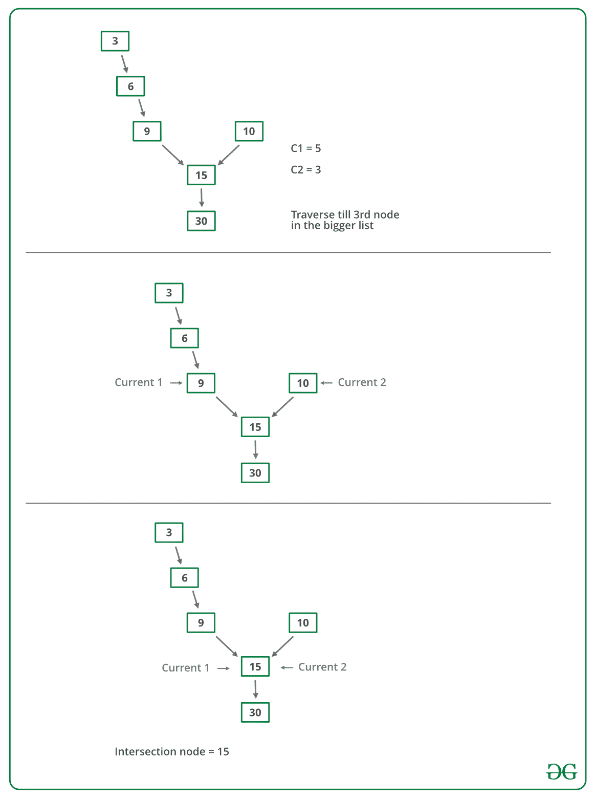

# 编写函数以获取两个链接列表的交点

系统中有两个单链表。 由于编程错误，链接列表之一的末端节点链接到第二个列表，从而形成了一个倒 Y 形列表。 编写程序以获取两个链接列表合并的点。


上图显示了一个以 15 为交点的两个链表的示例。

**方法 1（仅使用两个循环）**

使用 2 个嵌套的 for 循环。 外循环将用于第一个列表的每个节点，内循环将用于第二个列表。 在内部循环中，检查第二个列表中的任何节点是否与第一个链接列表的当前节点相同。 此方法的时间复杂度将为 O（M * N），其中 m 和 n 是两个列表中节点的数量。

**方法 2（标记访问的节点）**

此解决方案需要修改基本链表数据结构。 每个节点都有一个访问标志。 遍历第一个链表，并继续标记访问的节点。 现在遍历第二个链表，如果再次看到一个访问过的节点，则有一个相交点，则返回相交的节点。 此解决方案适用于 **O（m + n）**，但每个节点都需要其他信息。 此解决方案的一种变体不需要修改基本数据结构，可以使用哈希实现。 遍历第一个链接列表，并将访问的节点的地址存储在哈希中。 现在遍历第二个链接列表，如果您看到哈希中已经存在的地址，则返回相交的节点。

**方法 3（使用节点数的差异）**

*   获取第一个列表中节点的计数，令 count 为 c1。

*   获取第二个列表中节点的计数，将计数设为 c2。

*   获得计数差 **d = abs（c1 – c2）**

*   现在遍历从第一个节点到 d 个节点的较大列表，以便从此处开始，两个列表的节点数均相等

*   然后，我们可以并行遍历两个列表，直到遇到一个公共节点。 （请注意，获取公共节点是通过比较节点的地址来完成的）

下图是上述方法的模拟：



下面是上述方法的实现：

## C++

```cpp

// C++ program to get intersection point of two linked list
#include <bits/stdc++.h>
using namespace std;

/* Link list node */
class Node {
public:
    int data;
    Node* next;
};

/* Function to get the counts of node in a linked list */
int getCount(Node* head);

/* function to get the intersection point of two linked 
lists head1 and head2 where head1 has d more nodes than 
head2 */
int _getIntesectionNode(int d, Node* head1, Node* head2);

/* function to get the intersection point of two linked 
lists head1 and head2 */
int getIntesectionNode(Node* head1, Node* head2)
{

    // Count the number of nodes in
    // both the linked list
    int c1 = getCount(head1);
    int c2 = getCount(head2);
    int d;

    // If first is greater
    if (c1 > c2) {
        d = c1 - c2;
        return _getIntesectionNode(d, head1, head2);
    }
    else {
        d = c2 - c1;
        return _getIntesectionNode(d, head2, head1);
    }
}

/* function to get the intersection point of two linked 
lists head1 and head2 where head1 has d more nodes than 
head2 */
int _getIntesectionNode(int d, Node* head1, Node* head2)
{
    // Stand at the starting of the bigger list
    Node* current1 = head1;
    Node* current2 = head2;

    // Move the pointer forward
    for (int i = 0; i < d; i++) {
        if (current1 == NULL) {
            return -1;
        }
        current1 = current1->next;
    }

    // Move both pointers of both list till they
    // intersect with each other
    while (current1 != NULL && current2 != NULL) {
        if (current1 == current2)
            return current1->data;

        // Move both the pointers forward
        current1 = current1->next;
        current2 = current2->next;
    }

    return -1;
}

/* Takes head pointer of the linked list and 
returns the count of nodes in the list */
int getCount(Node* head)
{
    Node* current = head;

    // Counter to store count of nodes
    int count = 0;

    // Iterate till NULL
    while (current != NULL) {

        // Increase the counter
        count++;

        // Move the Node ahead
        current = current->next;
    }

    return count;
}

// Driver Code
int main()
{
    /* 
        Create two linked lists 

        1st 3->6->9->15->30 
        2nd 10->15->30 

        15 is the intersection point 
    */

    Node* newNode;

    // Addition of new nodes
    Node* head1 = new Node();
    head1->data = 10;

    Node* head2 = new Node();
    head2->data = 3;

    newNode = new Node();
    newNode->data = 6;
    head2->next = newNode;

    newNode = new Node();
    newNode->data = 9;
    head2->next->next = newNode;

    newNode = new Node();
    newNode->data = 15;
    head1->next = newNode;
    head2->next->next->next = newNode;

    newNode = new Node();
    newNode->data = 30;
    head1->next->next = newNode;

    head1->next->next->next = NULL;

    cout << "The node of intersection is " << getIntesectionNode(head1, head2);
}

// This code is contributed by rathbhupendra

```

## C

```c

// C program to get intersection point of two linked list
#include <stdio.h>
#include <stdlib.h>

/* Link list node */
struct Node {
    int data;
    struct Node* next;
};

/* Function to get the counts of node in a linked list */
int getCount(struct Node* head);

/* function to get the intersection point of two linked
   lists head1 and head2 where head1 has d more nodes than
   head2 */
int _getIntesectionNode(int d, struct Node* head1, struct Node* head2);

/* function to get the intersection point of two linked
   lists head1 and head2 */
int getIntesectionNode(struct Node* head1, struct Node* head2)
{
    int c1 = getCount(head1);
    int c2 = getCount(head2);
    int d;

    if (c1 > c2) {
        d = c1 - c2;
        return _getIntesectionNode(d, head1, head2);
    }
    else {
        d = c2 - c1;
        return _getIntesectionNode(d, head2, head1);
    }
}

/* function to get the intersection point of two linked
   lists head1 and head2 where head1 has d more nodes than
   head2 */
int _getIntesectionNode(int d, struct Node* head1, struct Node* head2)
{
    int i;
    struct Node* current1 = head1;
    struct Node* current2 = head2;

    for (i = 0; i < d; i++) {
        if (current1 == NULL) {
            return -1;
        }
        current1 = current1->next;
    }

    while (current1 != NULL && current2 != NULL) {
        if (current1 == current2)
            return current1->data;
        current1 = current1->next;
        current2 = current2->next;
    }

    return -1;
}

/* Takes head pointer of the linked list and
   returns the count of nodes in the list */
int getCount(struct Node* head)
{
    struct Node* current = head;
    int count = 0;

    while (current != NULL) {
        count++;
        current = current->next;
    }

    return count;
}

/* IGNORE THE BELOW LINES OF CODE. THESE LINES
   ARE JUST TO QUICKLY TEST THE ABOVE FUNCTION */
int main()
{
    /*
    Create two linked lists

    1st 3->6->9->15->30
    2nd 10->15->30

    15 is the intersection point
  */

    struct Node* newNode;
    struct Node* head1 = (struct Node*)malloc(sizeof(struct Node));
    head1->data = 10;

    struct Node* head2 = (struct Node*)malloc(sizeof(struct Node));
    head2->data = 3;

    newNode = (struct Node*)malloc(sizeof(struct Node));
    newNode->data = 6;
    head2->next = newNode;

    newNode = (struct Node*)malloc(sizeof(struct Node));
    newNode->data = 9;
    head2->next->next = newNode;

    newNode = (struct Node*)malloc(sizeof(struct Node));
    newNode->data = 15;
    head1->next = newNode;
    head2->next->next->next = newNode;

    newNode = (struct Node*)malloc(sizeof(struct Node));
    newNode->data = 30;
    head1->next->next = newNode;

    head1->next->next->next = NULL;

    printf("\n The node of intersection is %d \n",
           getIntesectionNode(head1, head2));

    getchar();
}

```

## Java

```java

// Java program to get intersection point of two linked list

class LinkedList {

    static Node head1, head2;

    static class Node {

        int data;
        Node next;

        Node(int d)
        {
            data = d;
            next = null;
        }
    }

    /*function to get the intersection point of two linked
    lists head1 and head2 */
    int getNode()
    {
        int c1 = getCount(head1);
        int c2 = getCount(head2);
        int d;

        if (c1 > c2) {
            d = c1 - c2;
            return _getIntesectionNode(d, head1, head2);
        }
        else {
            d = c2 - c1;
            return _getIntesectionNode(d, head2, head1);
        }
    }

    /* function to get the intersection point of two linked
     lists head1 and head2 where head1 has d more nodes than
     head2 */
    int _getIntesectionNode(int d, Node node1, Node node2)
    {
        int i;
        Node current1 = node1;
        Node current2 = node2;
        for (i = 0; i < d; i++) {
            if (current1 == null) {
                return -1;
            }
            current1 = current1.next;
        }
        while (current1 != null && current2 != null) {
            if (current1.data == current2.data) {
                return current1.data;
            }
            current1 = current1.next;
            current2 = current2.next;
        }

        return -1;
    }

    /*Takes head pointer of the linked list and
    returns the count of nodes in the list */
    int getCount(Node node)
    {
        Node current = node;
        int count = 0;

        while (current != null) {
            count++;
            current = current.next;
        }

        return count;
    }

    public static void main(String[] args)
    {
        LinkedList list = new LinkedList();

        // creating first linked list
        list.head1 = new Node(3);
        list.head1.next = new Node(6);
        list.head1.next.next = new Node(9);
        list.head1.next.next.next = new Node(15);
        list.head1.next.next.next.next = new Node(30);

        // creating second linked list
        list.head2 = new Node(10);
        list.head2.next = new Node(15);
        list.head2.next.next = new Node(30);

        System.out.println("The node of intersection is " + list.getNode());
    }
}

// This code has been contributed by Mayank Jaiswal

```

## C#

```cs

// C# program to get intersection point of two linked list
using System;
class LinkedList {

    Node head1, head2;

    public class Node {

        public int data;
        public Node next;

        public Node(int d)
        {
            data = d;
            next = null;
        }
    }

    /*function to get the intersection point of two linked 
    lists head1 and head2 */
    int getNode()
    {
        int c1 = getCount(head1);
        int c2 = getCount(head2);
        int d;

        if (c1 > c2) {
            d = c1 - c2;
            return _getIntesectionNode(d, head1, head2);
        }
        else {
            d = c2 - c1;
            return _getIntesectionNode(d, head2, head1);
        }
    }

    /* function to get the intersection point of two linked 
    lists head1 and head2 where head1 has d more nodes than 
    head2 */
    int _getIntesectionNode(int d, Node node1, Node node2)
    {
        int i;
        Node current1 = node1;
        Node current2 = node2;
        for (i = 0; i < d; i++) {
            if (current1 == null) {
                return -1;
            }
            current1 = current1.next;
        }
        while (current1 != null && current2 != null) {
            if (current1.data == current2.data) {
                return current1.data;
            }
            current1 = current1.next;
            current2 = current2.next;
        }

        return -1;
    }

    /*Takes head pointer of the linked list and 
    returns the count of nodes in the list */
    int getCount(Node node)
    {
        Node current = node;
        int count = 0;

        while (current != null) {
            count++;
            current = current.next;
        }

        return count;
    }

    public static void Main(String[] args)
    {
        LinkedList list = new LinkedList();

        // creating first linked list
        list.head1 = new Node(3);
        list.head1.next = new Node(6);
        list.head1.next.next = new Node(9);
        list.head1.next.next.next = new Node(15);
        list.head1.next.next.next.next = new Node(30);

        // creating second linked list
        list.head2 = new Node(10);
        list.head2.next = new Node(15);
        list.head2.next.next = new Node(30);

        Console.WriteLine("The node of intersection is " + list.getNode());
    }
}

// This code is contributed by Arnab Kundu

```

**Output**

```
The node of intersection is 15

```

**时间复杂度：** O（m + n）

**辅助空间：**`O(1)`

**方法 4（在第一个列表中圈出）**

感谢 **Saravanan Man** 提供以下解决方案。

1.遍历第一个链表（计算元素数）并制作一个循环链表。 （记住最后一个节点，以便我们以后可以打破圆圈）。

2.现在将问题视为在第二个链接列表中找到循环。 这样问题就解决了。

3.由于我们已经知道了循环的长度（第一个链接列表的大小），因此我们可以遍历第二个列表中的许多节点，然后从第二个列表的开头开始另一个指针。 我们必须遍历直到它们相等，这就是所需的交点。

4.从链接列表中删除圆圈。

**时间复杂度：** O（m + n）

**辅助空间：**`O(1)`

**方法 5（颠倒第一个列表并建立方程式）**

感谢 **Saravanan Mani** 提供了此方法。

```
1) Let X be the length of the first linked list until intersection point.
   Let Y be the length of the second linked list until the intersection point.
   Let Z be the length of the linked list from the intersection point to End of
   the linked list including the intersection node.
   We Have
           X + Z = C1;
           Y + Z = C2;
2) Reverse first linked list.
3) Traverse Second linked list. Let C3 be the length of second list - 1\. 
     Now we have
        X + Y = C3
     We have 3 linear equations. By solving them, we get
       X = (C1 + C3 – C2)/2;
       Y = (C2 + C3 – C1)/2;
       Z = (C1 + C2 – C3)/2;
      WE GOT THE INTERSECTION POINT.
4)  Reverse first linked list.

```

优点：无需比较指针。

劣势：修改链接列表（反向列表）。

**时间复杂度：** O（m + n）

**辅助空间：**`O(1)`

**方法 6（遍历两个列表并比较最后一个节点的地址）**此方法仅用于检测是否存在交叉点。 （感谢 NeoTheSaviour 提出的建议）

```
1) Traverse the list 1, store the last node address
2) Traverse the list 2, store the last node address.
3) If nodes stored in 1 and 2 are same then they are intersecting.

```

该方法的时间复杂度为 O（m + n），使用的辅助空间为`O(1)`

**方法 7（使用哈希）**

基本上，我们需要找到两个链表的公共节点。 因此，我们哈希第一个列表的所有节点，然后检查第二个列表。

1）创建一个空哈希集。

2）遍历第一个链接列表，并将所有节点的地址插入哈希集中。

3）遍历第二个列表。 对于每个节点，检查哈希集中是否存在该节点。 如果我们在哈希集中找到一个节点，则返回该节点。

## Java

```java

// Java program to get intersection point of two linked list
import java.util.*;
class Node {
    int data;
    Node next;
    Node(int d)
    {
        data = d;
        next = null;
    }
}
class LinkedListIntersect {
    public static void main(String[] args)
    {
        // list 1
        Node n1 = new Node(1);
        n1.next = new Node(2);
        n1.next.next = new Node(3);
        n1.next.next.next = new Node(4);
        n1.next.next.next.next = new Node(5);
        n1.next.next.next.next.next = new Node(6);
        n1.next.next.next.next.next.next = new Node(7);
        // list 2
        Node n2 = new Node(10);
        n2.next = new Node(9);
        n2.next.next = new Node(8);
        n2.next.next.next = n1.next.next.next;
        Print(n1);
        Print(n2);
        System.out.println(MegeNode(n1, n2).data);
    }

    // function to print the list
    public static void Print(Node n)
    {
        Node cur = n;
        while (cur != null) {
            System.out.print(cur.data + "  ");
            cur = cur.next;
        }
        System.out.println();
    }

    // function to find the intersection of two node
    public static Node MegeNode(Node n1, Node n2)
    {
        // define hashset
        HashSet<Node> hs = new HashSet<Node>();
        while (n1 != null) {
            hs.add(n1);
            n1 = n1.next;
        }
        while (n2 != null) {
            if (hs.contains(n2)) {
                return n2;
            }
            n2 = n2.next;
        }
        return null;
    }
}

```

## C#

```cs

// C# program to get intersection point of two linked list
using System;
using System.Collections.Generic; 

public class Node 
{
    public int data;
    public Node next;
    public Node(int d)
    {
        data = d;
        next = null;
    }
}
public class LinkedListIntersect
{
    public static void Main(String[] args)
    {
        // list 1
        Node n1 = new Node(1);
        n1.next = new Node(2);
        n1.next.next = new Node(3);
        n1.next.next.next = new Node(4);
        n1.next.next.next.next = new Node(5);
        n1.next.next.next.next.next = new Node(6);
        n1.next.next.next.next.next.next = new Node(7);
        // list 2
        Node n2 = new Node(10);
        n2.next = new Node(9);
        n2.next.next = new Node(8);
        n2.next.next.next = n1.next.next.next;
        Print(n1);
        Print(n2);
        Console.WriteLine(MegeNode(n1, n2).data);
    }

    // function to print the list
    public static void Print(Node n)
    {
        Node cur = n;
        while (cur != null) 
        {
            Console.Write(cur.data + " ");
            cur = cur.next;
        }
        Console.WriteLine();
    }

    // function to find the intersection of two node
    public static Node MegeNode(Node n1, Node n2)
    {
        // define hashset
        HashSet<Node> hs = new HashSet<Node>();
        while (n1 != null) 
        {
            hs.Add(n1);
            n1 = n1.next;
        }
        while (n2 != null)
        {
            if (hs.Contains(n2)) 
            {
                return n2;
            }
            n2 = n2.next;
        }
        return null;
    }
}

// This code is contributed by 29AjayKumar

```

**Output**

```
1  2  3  4  5  6  7  
10  9  8  4  5  6  7  
4

```

此方法需要`O(n)`额外的空间，如果一个列表很大，则效率不是很高。

**方法 8（2 指针技术）：**

使用两个指针：

*   在 head1 和 head2 初始化两个指针 ptr1 和 ptr2。

*   遍历列表，一次一个节点。

*   当 ptr1 到达列表的末尾时，将其重定向到 head2。

*   同样，当 ptr2 到达列表末尾时，将其重定向到 head1。

*   他们两个都重新分配后，它们将与

    碰撞点等距

*   如果在任何节点上 ptr1 与 ptr2 相遇，则它是相交节点。

*   在第二次迭代后，如果没有相交节点，则返回 NULL。

## C++

```cpp

// CPP program to print intersection of lists
#include <bits/stdc++.h>
using namespace std;

/* Link list node */
class Node {
public:
    int data;
    Node* next;
};

// A utility function to return  intersection node
Node* intersectPoint(Node* head1, Node* head2)
{
    // Maintaining two pointers ptr1 and ptr2
    // at the head of A and B,
    Node* ptr1 = head1;
    Node* ptr2 = head2;

    // If any one of head is NULL i.e
    // no Intersection Point
    if (ptr1 == NULL || ptr2 == NULL) {

        return NULL;
    }

    // Traverse through the lists until they
    // reach Intersection node
    while (ptr1 != ptr2) {

        ptr1 = ptr1->next;
        ptr2 = ptr2->next;

        // If at any node ptr1 meets ptr2, then it is
        // intersection node.Return intersection node.

        if (ptr1 == ptr2) {

            return ptr1;
        }
        /* Once both of them go through reassigning,
        they will be equidistant from the collision point.*/

        // When ptr1 reaches the end of a list, then
        // reassign it to the head2.
        if (ptr1 == NULL) {

            ptr1 = head2;
        }
        // When ptr2 reaches the end of a list, then
        // redirect it to the head1.
        if (ptr2 == NULL) {

            ptr2 = head1;
        }
    }

    return ptr1;
}

// Function to print intersection nodes
// in  a given linked list
void print(Node* node)
{
    if (node == NULL)
        cout << "NULL";
    while (node->next != NULL) {
        cout << node->data << "->";
        node = node->next;
    }
    cout << node->data;
}
// Driver code
int main()
{
    /*
    Create two linked lists

    1st Linked list is 3->6->9->15->30
    2nd Linked list is 10->15->30

    15 30 are elements in the intersection list
    */

    Node* newNode;
    Node* head1 = new Node();
    head1->data = 10;
    Node* head2 = new Node();
    head2->data = 3;
    newNode = new Node();
    newNode->data = 6;
    head2->next = newNode;
    newNode = new Node();
    newNode->data = 9;
    head2->next->next = newNode;
    newNode = new Node();
    newNode->data = 15;
    head1->next = newNode;
    head2->next->next->next = newNode;
    newNode = new Node();
    newNode->data = 30;
    head1->next->next = newNode;
    head1->next->next->next = NULL;
    Node* intersect_node = NULL;

    // Find the intersection node of two linked lists
    intersect_node = intersectPoint(head1, head2);

    cout << "INTERSEPOINT LIST :";

    print(intersect_node);

    return 0;
  // This code is contributed by bolliranadheer
}

```

**Output**

```
INTERSEPOINT LIST :15->30

```

**时间复杂度：** O（m + n）

**辅助空间：**`O(1)`

如果您发现上述算法有任何错误，或者找到解决同一问题的更好方法，请发表评论。

