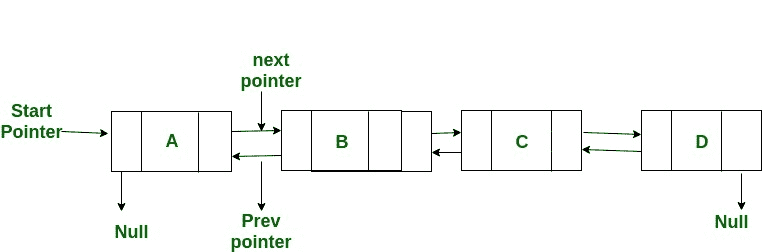

# XOR 链表–内存有效的双链表| 设置 1

普通的双向链接列表需要两个地址字段的空间来存储上一个和下一个节点的地址。 可以仅对每个节点使用一个空间作为地址字段来创建内存高效版本的双链表。 这种高效的内存双链表称为 XOR 链表或内存高效，因为该表使用按位 XOR 操作来节省一个地址的空间。 在 XOR 链接列表中，每个节点不存储实际的内存地址，而是存储上一个和下一个节点的地址的 XOR。

考虑上面的双链表。 以下是双链表的普通和 XOR（或内存有效）表示形式。

**普通表示形式：**
节点 A：
prev = NULL，next = add（B）//前一个为 NULL，下一个为 B 的地址

节点 B：
prev = add（A），next = add（C）//前一个是 A 的地址，下一个是 C 的地址

节点 C：
prev = add（B），next = add（D）//上一个是 B 的地址，下一个是 D 的地址

节点 D：
prev = add（C），next = NULL //前一个是 C 的地址，下一个是 NULL

**XOR 列表表示形式：**
让我们以 XOR 表示形式 npx（下一个和上一个的 XOR）调用地址变量

节点 A：
npx = 0 XOR add（B）//零与 B 的地址按位 XOR

节点 B：
npx = add（A）XOR add（C）// A 地址和 C 地址的按位 XOR

节点 C：
npx = add（B）XOR add（D）// B 地址和 D 地址的按位 XOR

节点 D：
npx = add（C）XOR 0 // C 和 0 的地址的按位 XOR

**遍历 XOR 链接列表：**
我们可以在正反两个方向上遍历 XOR 列表。 在遍历列表时，我们需要记住先前访问的节点的地址，以便计算下一个节点的地址。 例如，当我们在节点 C 时，我们必须具有地址 B。add（B）和 C 的 *npx* 的 XOR 给我们 add（D）。 原因很简单：npx（C）是“ add（B）XOR add（D）”。 如果我们用 add（B）对 npx（C）进行异或，则得到的结果为“ add（B）XOR add（D）XOR add（B）”，即“ add（D）XOR 0”，即“ add” （D）”。 因此，我们有了下一个节点的地址。 同样，我们可以向后遍历列表。

在下面的文章中，我们将在 XOR 链接列表中介绍更多内容。

[XOR 链表–内存有效的双链表| 设置 2](https://www.geeksforgeeks.org/xor-linked-list-a-memory-efficient-doubly-linked-list-set-2/)

**参考：**
[http://en.wikipedia.org/wiki/XOR_linked_list](http://en.wikipedia.org/wiki/XOR_linked_list)
[http://www.linuxjournal.com/article/6828？ 页面= 0,0](http://www.linuxjournal.com/article/6828?page=0,0)

